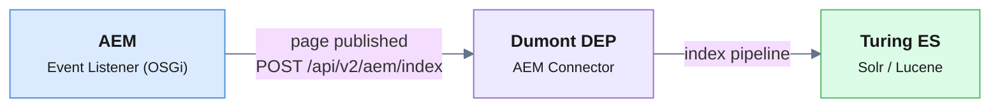

Adobe Experience Manager (AEM) ships with Oak/Lucene indexing that is excellent
for authoring and repository operations — but it was never meant to power a
public-facing **search experience**: faceted navigation, autocomplete,
relevance tuning, multi-language sites, and increasingly, conversational
(RAG) answers over your content.

Most teams reach for a SaaS layer — **Algolia, Coveo, or Lucidworks** — and pay
per document and per query, while their content leaves their infrastructure.
This guide shows the open-source alternative: indexing AEM into
[**Viglet Turing ES**](https://www.viglet.org/turing/), an Apache-2.0 enterprise
search platform you self-host, with semantic navigation and generative AI built in.

<!-- truncate -->

## What you'll build

By the end you'll have AEM pages flowing into a Turing ES search index, with:

- **Faceted search** — AEM tags become filterable facets automatically
- **Real-time sync** — pages re-index the moment they're published in AEM
- **A query API** — REST, GraphQL, or SDK, ready for any front end
- **(Optional) RAG** — grounded, citeable AI answers over the same content

## The architecture in one picture

Turing ES doesn't crawl AEM directly. A dedicated connector —
[**Viglet Dumont DEP**](https://www.viglet.org/dumont/) — sits between them: an
OSGi bundle inside AEM emits events, and the Dumont connector fetches the
content and indexes it into Turing ES.



Three components, each documented in full:

| Component | Runs where | Job |
|---|---|---|
| **AEM Event Listener** | Inside AEM (OSGi bundle) | Notifies the connector on publish/modify/delete |
| **AEM Connector Plugin** | Dumont DEP process | Fetches content from AEM, indexes into Turing ES |
| **Integration Instance** | Turing ES admin console | Proxy config + monitoring |

## Step 1 — Run Turing ES

The fastest path is Docker:

```bash
docker pull ghcr.io/openviglet/turing-ce:latest
docker run -p 2700:2700 ghcr.io/openviglet/turing-ce:latest
```

Open `http://localhost:2700/console` and set the admin password on first run
(`TURING_ADMIN_PASSWORD` env var). Create a **Semantic Navigation (SN) Site** —
this is the index your AEM content will land in.

## Step 2 — Configure the AEM source in Dumont

In the Turing ES admin console, go to **Enterprise Search → Integration** and
add an AEM instance. The key source fields:

| Field | Example | Notes |
|---|---|---|
| Endpoint | `http://localhost:4502` | Your AEM author or publish instance |
| Root Path | `/content/wknd` | Where traversal starts |
| Content Type | `cq:Page` | What to index |
| SN Site (Publish) | `wknd-search` | The Turing ES index to feed |

That's it for the happy path. AEM **tags are converted to facets
automatically** — no field mapping required.

## Step 3 — Index your first content

You have three ways to trigger indexing. For a first run, call the connector
directly (the WKND reference site is perfect for testing):

```bash
curl -X POST http://localhost:30130/api/v2/aem/index/WKND \
  -H "Content-Type: application/json" \
  -d '{
    "paths": ["/content/wknd/us/en"],
    "event": "INDEXING",
    "recursive": true
  }'
```

The connector calls AEM's `infinity.json` to read the full JCR node tree,
pulls `jcr:content.tags.json` for facets, traverses children, and sends each
page through the Dumont pipeline into Turing ES.

For **large content trees**, switch from tree traversal to AEM's QueryBuilder
discovery, which finds all pages in bulk and processes them in parallel:

```yaml
dumont:
  aem.querybuilder: true
  aem.querybuilder.parallelism: 10
```

## Step 4 — Real-time sync (production)

For production, install the `aem-server` OSGi bundle inside AEM. It subscribes
to AEM's replication and page events and notifies Dumont automatically:

| AEM event | Dumont action |
|---|---|
| Page activated (published) | `PUBLISHING` |
| Page deactivated | `UNPUBLISHING` |
| Page created / modified | `INDEXING` |
| DAM asset modified | `INDEXING` |

Configure the bundle in AEM's Web Console (**Host** = your Dumont URL,
**Config Name** = the source name). From then on, publishing a page in AEM
re-indexes it within seconds — no cron, no full re-crawl.

> **Tip — cascade re-indexing.** When a shared component or experience fragment
> changes, every page that references it can go stale. Turing/Dumont can track
> `/content/*` dependencies and automatically re-index dependents. Enable
> `dumont.dependencies.enabled=true` and run a Reindex All to populate the
> dependency graph.

## Step 5 — Query it

Your AEM content is now searchable through any of these:

```bash
# REST — faceted search
curl "http://localhost:2700/api/sn/wknd-search/search?q=adventure&rows=10&_setlocale=en_US"

# REST — autocomplete
curl "http://localhost:2700/api/sn/wknd-search/ac?q=adven&_setlocale=en_US"
```

```typescript
// JavaScript / TypeScript SDK
import { TurSNSiteSearchService } from "@viglet/turing-react-sdk";

const search = new TurSNSiteSearchService("http://localhost:2700");
const results = await search.search("wknd-search", {
  q: "adventure", rows: 10, localeRequest: "en_US",
});
```

Or via GraphQL at `http://localhost:2700/graphiql`. The facets derived from
your AEM tags come back with the results — wire them straight into a filter panel.

## Step 6 (optional) — Conversational answers (RAG)

Because Turing ES already holds your AEM content, turning on **RAG** gives you
grounded AI answers with citations — over your own content, on your own
infrastructure, with the LLM of your choice (OpenAI, Ollama, Anthropic, Gemini):

```bash
curl "http://localhost:2700/api/sn/wknd-search/chat?q=What+adventures+are+available+in+the+Alps"
```

This is the part SaaS search boxes can't match without shipping your content to
a third party.

## Why open-source for AEM search?

- **Your content stays in your infrastructure** — no per-document SaaS pricing,
  no data egress, AEM author content never leaves the building.
- **Tags → facets with zero mapping**, real-time event-driven sync, and
  cascade re-indexing for shared components.
- **Search + semantic + RAG in one platform** under Apache 2.0 — not three
  separate vendor bills.

## Next steps

- 📘 [AEM Connector — full reference](/dumont/connectors/aem) (event listeners, QueryBuilder, custom extractors)
- 📗 [Turing ES — AEM Integration](/turing/integration-aem)
- 📙 [Semantic Navigation](/turing/semantic-navigation) and [RAG](/turing/rag) guides
- ⭐ [Star Turing ES on GitHub](https://github.com/openviglet/turing-ce) — it genuinely helps others find it
- 💬 [Ask in GitHub Discussions](https://github.com/openviglet/turing-ce/discussions)

*Viglet Turing ES is open-source (Apache 2.0) enterprise search with semantic
navigation and generative AI. Self-host it, index Adobe AEM, WordPress, databases,
file systems, and web content, and own your search stack end to end.*
