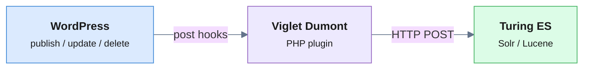

WordPress ships with a built-in search that runs a `LIKE` query against the
posts table. It works for a handful of posts — but on a real content site it
has no relevance ranking, no facets, no typo tolerance, no autocomplete, and it
slows down as your database grows. Most teams reach for a SaaS layer
(**Algolia**, **ElasticPress + hosted Elasticsearch**) and start paying per
record and per query.

This guide shows the open-source alternative: indexing WordPress into
[**Viglet Turing ES**](https://www.viglet.org/turing/), an Apache-2.0 enterprise
search platform you self-host — faceted search, semantic navigation, and
generative AI (RAG), with your content staying on your own infrastructure.

<!-- truncate -->

## The connector is a WordPress plugin, not a Java service

Unlike the [Adobe AEM connector](/dumont/connectors/aem) — a Java plugin loaded
into the Dumont DEP process — the WordPress connector is a **PHP plugin you
install directly inside WordPress**. It talks to Turing ES over HTTP, so there
is no separate connector JAR to run.



Indexing is **event-driven** — there is no cron or scheduled re-crawl:

| WordPress event | What happens |
|---|---|
| Post/page published | Extracted and sent to Turing ES |
| Published content updated | Index updated automatically |
| Content trashed / deleted | Removed from the index |
| Published → draft/private | Removed from the index |

For the first load, the admin panel bulk-indexes all posts or pages in batches
of 250.

## Step 1 — Run Turing ES

The fastest path is Docker:

```bash
docker pull ghcr.io/openviglet/turing-ce:latest
docker run -p 2700:2700 ghcr.io/openviglet/turing-ce:latest
```

Open `http://localhost:2700/console`, set the admin password on first run, and
create a **Semantic Navigation (SN) Site** — this is the index your WordPress
content will land in.

## Step 2 — Install the WordPress plugin

Copy the plugin folder into your WordPress installation and activate it:

```
wp-content/plugins/viglet-turing-for-wordpress/
```

Then activate it in **WordPress Admin → Plugins**.

## Step 3 — Connect to Turing ES

In **Settings → Viglet Dumont**, point the plugin at your Turing ES server:

| Field | Example | Notes |
|---|---|---|
| Host | `localhost` | Turing ES hostname |
| Port | `2700` | Turing ES port |
| Path | `/dumont` | Base path for the indexing endpoint |
| Site Name | `wp-search` | The SN Site you created in step 1 |

Click **Ping** to confirm the connection, then **Index all Posts** and **Index
all Pages** to populate the index.

## What gets indexed

The plugin extracts a rich document per post — not just title and body:

| Field | Source |
|---|---|
| `title`, `content` | Post/page title and full content |
| `contentnoshortcodes` | Content with WordPress shortcodes stripped |
| `permalink` | Canonical URL |
| `author`, `type`, `date`, `modified` | Metadata |
| `categories`, `tags` | **Multi-valued → become facets automatically** |
| `numcomments`, `comments` | Comment count and (optionally) comment text |
| Custom fields | Any custom fields you configure |

The key win: **WordPress categories and tags become filterable facets with zero
mapping**. You can also include custom post types and selected custom fields,
which the native WordPress search ignores entirely.

### Multisite

The plugin supports network installs. Activated network-wide, it indexes every
blog in the network and tags each document with `blogid`, `blogdomain`, and
`blogpath`, so a single search box can span the whole network.

## Step 4 — Query it

Your WordPress content is now searchable through the Turing ES API — REST,
GraphQL, or the SDK:

```bash
# Faceted search
curl "http://localhost:2700/api/sn/wp-search/search?q=tutorial&rows=10&_setlocale=en_US"

# Autocomplete
curl "http://localhost:2700/api/sn/wp-search/ac?q=tut&_setlocale=en_US"
```

The plugin also ships a search-results template (`turing4wp_search.php`) with
facet rendering and autocomplete styling, so you can surface the new search
inside your theme without building a front end from scratch.

## Step 5 (optional) — Conversational answers (RAG)

Because Turing ES already holds your WordPress content, turning on **RAG** gives
you grounded AI answers with citations over your own posts, with the LLM of your
choice (OpenAI, Ollama, Anthropic, Gemini):

```bash
curl "http://localhost:2700/api/sn/wp-search/chat?q=How+do+I+reset+my+password"
```

## Why open-source for WordPress search?

- **Your content stays in your infrastructure** — no per-record SaaS pricing,
  no data egress.
- **Categories and tags → facets with zero mapping**, real-time event-driven
  sync, custom post types and custom fields included.
- **Search + semantic + RAG in one platform** under Apache 2.0.

## Next steps

- 📘 [WordPress Connector — full reference](/dumont/connectors/wordpress)
- 📗 [Semantic Navigation](/turing/semantic-navigation) and [RAG](/turing/rag) guides
- 📙 [How to add enterprise search to Adobe AEM](/blog/enterprise-search-for-adobe-aem) — the same approach for the other major CMS
- ⭐ [Star Turing ES on GitHub](https://github.com/openviglet/turing-ce)
- 💬 [Ask in GitHub Discussions](https://github.com/openviglet/turing-ce/discussions)

*Viglet Turing ES is open-source (Apache 2.0) enterprise search with semantic
navigation and generative AI. Self-host it, index WordPress, Adobe AEM,
databases, file systems, and web content, and own your search stack end to end.*
