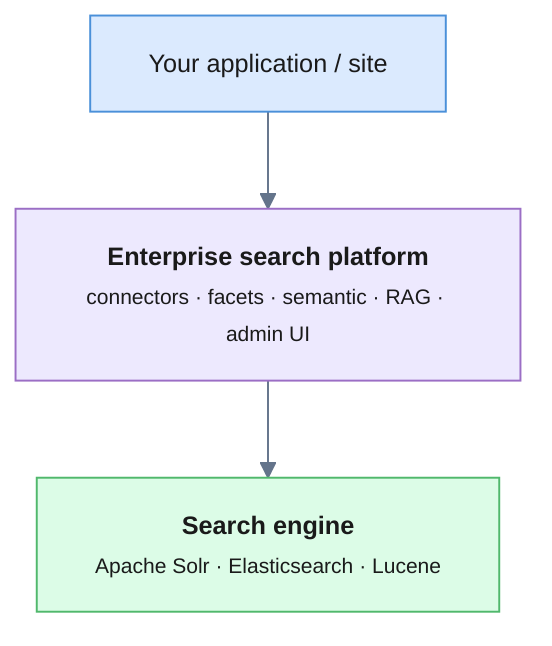

"Should we use Solr or Elasticsearch?" is one of the most common engineering
questions when a search project starts. It's also slightly the wrong question.
**Solr and Elasticsearch are search *engines*** — they index and rank documents.
What most teams actually need is an enterprise search *platform*: connectors,
facets, multi-language, semantic search, RAG, and an admin UI on top of that
engine.

That's the distinction this post draws — and where
[**Viglet Turing ES**](https://www.viglet.org/turing/) fits, because it's not a
competitor to Solr/Elasticsearch. It runs **on** them.

<!-- truncate -->

## Two different layers



Turing ES is the **platform** layer, and its engine backend is
[pluggable](/turing/search-engine): you can run it on **Apache Solr**,
**Elasticsearch**, or an embedded **Lucene** engine — and switch without
rewriting your application.

## Solr vs. Elasticsearch (the engine choice)

| | Apache Solr | Elasticsearch |
|---|---|---|
| **Origin** | Lucene-based, Apache project | Lucene-based, Elastic |
| **Sweet spot** | Text search, faceting, stable schema | Logs/observability, dynamic data, analytics |
| **Faceting** | Mature, first-class | Aggregations |
| **Licensing** | Apache 2.0 | SSPL / Elastic License (OSS fork: OpenSearch) |
| **Ops model** | ZooKeeper (SolrCloud) | Cluster built-in |

Short version: for **content/site search with heavy faceting**, Solr is a
natural fit and fully Apache-licensed. For **log analytics and dynamic schemas**,
Elasticsearch's ecosystem leads. Both are excellent engines — and both leave the
*platform* work (connectors, relevance UI, semantic, RAG) to you.

## When raw Solr/Elasticsearch is the right call

- You have a **search engineering team** and want maximum low-level control.
- Your needs are narrow and well-defined (one index, one app).
- You're prepared to build the ingestion pipeline, faceting UI, multi-language
  handling, and any AI layer yourself.

## When you want the platform layer (Turing ES)

Turing ES adds, on top of the engine you choose:

- **Connectors** — [Adobe AEM](/dumont/connectors/aem), WordPress, databases,
  file systems, web crawl — with event-driven sync and tag → facet mapping.
- **Semantic + vector search** and **RAG** with your LLM
  ([guide](/turing/rag)), instead of building an AI tier separately.
- **Multi-language, faceting, autocomplete, spotlights, targeting** out of the
  box via [Semantic Navigation](/turing/semantic-navigation).
- **AI agents** with 27 tools and [MCP](/turing/mcp-servers) support.
- An **admin console**, SDKs (Java, JS/TS), and a REST/GraphQL API.

All open source under Apache 2.0, self-hosted — and engine-agnostic, so the
Solr-vs-Elasticsearch decision stops being a lock-in.

## How to decide

1. **Do you need a platform or just an engine?** If you'll build connectors,
   facets, and an AI layer yourself, pick an engine. If you want those provided,
   pick a platform.
2. **If platform → Turing ES**, then choose the engine underneath by workload:
   Solr for content/faceted search, Elasticsearch/OpenSearch if you're
   standardizing on that ecosystem, Lucene for a zero-dependency embedded setup.
3. **Licensing matters** — Solr and Turing ES are Apache 2.0 end to end.

## Try it

```bash
docker pull ghcr.io/openviglet/turing-ce:latest
docker run -p 2700:2700 ghcr.io/openviglet/turing-ce:latest
```

- 📘 [Pluggable search engine](/turing/search-engine)
- 📗 [Open-source alternatives to Algolia/Coveo for AEM](/blog/open-source-alternative-to-algolia-for-aem)
- ⭐ [Turing ES on GitHub](https://github.com/openviglet/turing-ce) (Apache 2.0)

*Viglet Turing ES is an open-source enterprise search platform that runs on
Apache Solr, Elasticsearch, or Lucene — adding connectors, faceted and semantic
search, and RAG on top of the engine you choose.*
