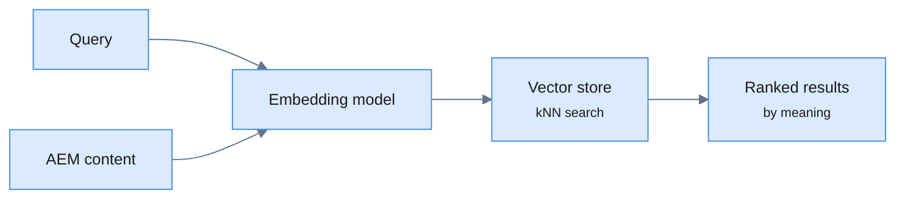

Once your Adobe Experience Manager content is indexed into an enterprise search
engine, the obvious next step is to move beyond keyword matching. A visitor who
searches "places to stay near the mountains" should find a page titled "Alpine
lodges and cabins" — even though none of those words match. That's **semantic
search**, and it's powered by embeddings.

This post builds on
[indexing AEM into Viglet Turing ES](/blog/enterprise-search-for-adobe-aem) and
shows how to add vector/semantic search and RAG on top — all open source, on
your own infrastructure.

<!-- truncate -->

## Keyword vs. semantic — what changes

Classic search matches tokens. Semantic search converts both the query and your
content into **embeddings** (high-dimensional vectors) and finds the nearest
ones, so it matches on *meaning*:



In Turing ES this runs alongside the keyword index — you get faceted keyword
search *and* semantic ranking on the same AEM content.

## Step 1 — Configure an embedding model

Turing ES talks to multiple embedding providers. In the admin console under
**Generative AI**, configure an [LLM instance](/turing/llm-instances) and an
[embedding model](/turing/embedding-models):

| Provider | Embedding support |
|---|---|
| OpenAI | ✅ |
| Azure OpenAI | ✅ |
| Ollama (local models) | ✅ |
| Anthropic, Google Gemini | ❌ (chat only — use one of the above for embeddings) |

Using **Ollama** keeps embedding generation entirely on your own hardware — no
content leaves your infrastructure, which matters for regulated AEM author
content.

## Step 2 — Pick an embedding store

The vectors need somewhere to live. Turing ES supports pluggable
[embedding stores](/turing/embedding-stores), including an **embedded Lucene
vector store** that needs no extra infrastructure — ideal for getting started.
For larger corpora you can point it at a dedicated vector database.

> The embedded Lucene **vector store** is independent from the Lucene
> **search-engine** backend — you can run Solr for keyword search and still use
> the embedded Lucene store for vectors.

## Step 3 — Embed your AEM content

When AEM content flows in through the [Dumont connector](/dumont/connectors/aem),
Turing ES generates embeddings for each document and writes them to the store.
Re-indexing an existing AEM site re-embeds it with your chosen model — no
changes to the connector configuration.

## Step 4 — Query semantically (and add RAG)

With embeddings in place, [Semantic Navigation](/turing/semantic-navigation)
ranks results by meaning, and you can layer [RAG](/turing/rag) on top for
grounded conversational answers over your AEM content:

```bash
# Semantic / RAG chat over the AEM index
curl "http://localhost:2700/api/sn/wknd-search/chat?q=Where+can+I+go+hiking+in+the+Alps"
```

Because retrieval is grounded in your indexed AEM pages, answers come back with
citations — and, with Ollama, the entire pipeline (embeddings + LLM) can run on
your own infrastructure.

## Why this matters for AEM

- **Better recall** — visitors find the right page even when their words don't
  match the author's.
- **One platform** — keyword facets, semantic ranking, and RAG over the *same*
  AEM content, not three separate systems.
- **Data residency** — with local embedding + local LLM, AEM author content
  never leaves your perimeter.

## Next steps

- 📘 [Index Adobe AEM into Turing ES](/blog/enterprise-search-for-adobe-aem) (start here)
- 📗 [Embedding models](/turing/embedding-models) · [Embedding stores](/turing/embedding-stores)
- 📙 [Semantic Navigation](/turing/semantic-navigation) · [RAG](/turing/rag)
- ⭐ [Turing ES on GitHub](https://github.com/openviglet/turing-ce) (Apache 2.0)

*Viglet Turing ES is open-source enterprise search with semantic navigation and
generative AI. Index Adobe AEM, add embedding-based vector search and RAG, and
keep your content on your own infrastructure.*
