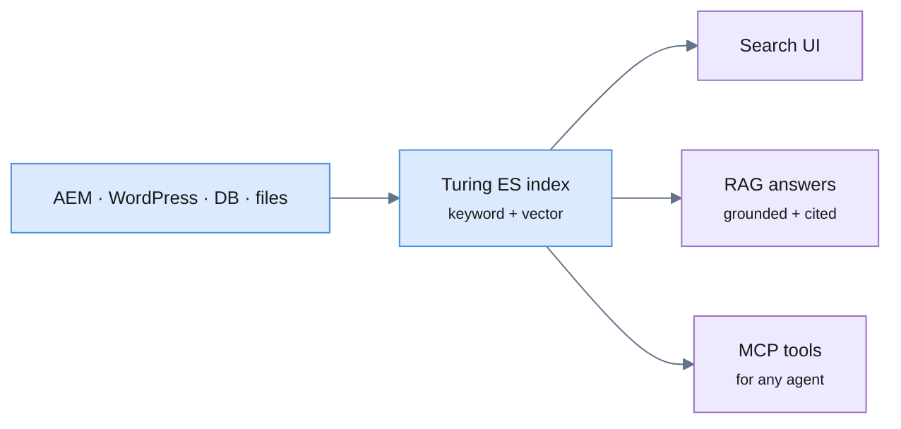

Retrieval-Augmented Generation (RAG) is only as good as what it retrieves. If
the retrieval layer is a throwaway vector index built for one chatbot, you end
up rebuilding it for every new use case. The better pattern: **make your
enterprise search index the retrieval layer**, and expose it to AI through the
**Model Context Protocol (MCP)** so any agent can use it as a tool.

That's what [**Viglet Turing ES**](https://www.viglet.org/turing/) does — your
indexed Adobe AEM, WordPress, database, and file content becomes both a search
experience *and* a grounded RAG/agent capability, on your own infrastructure.

<!-- truncate -->

## RAG and search are the same retrieval problem

A search query and a RAG prompt both need the same thing: the most relevant
passages from your content. Turing ES already maintains that index — faceted,
multi-language, [semantically ranked](/turing/semantic-navigation) — so RAG
reuses it instead of standing up a parallel store:



## Built-in RAG over your content

With content indexed (see the
[AEM guide](/blog/enterprise-search-for-adobe-aem)), turning on [RAG](/turing/rag)
gives grounded answers with citations, using the LLM of your choice — OpenAI,
Ollama, Anthropic, or Gemini:

```bash
curl "http://localhost:2700/api/sn/wknd-search/chat?q=What+is+our+refund+policy"
```

Answers are constrained to retrieved passages, so the model cites your content
rather than hallucinating — and with Ollama the whole loop stays on your
infrastructure.

## MCP: your search as a tool for any agent

The [Model Context Protocol](/turing/mcp-servers) is an open standard that lets
AI models call tools on external servers. Turing ES uses MCP in two directions:

1. **As an MCP client** — an [AI Agent](/turing/ai-agents) in Turing ES can
   connect to external MCP servers (over `HTTP` or `stdio`) and use their tools
   alongside its 27 built-in tools — a company knowledge system, a proprietary
   API, or any public MCP server — with no custom code inside Turing ES.
2. **As a retrieval capability** — your enterprise index is exposed through
   tools like `list_sites`, `get_site_fields`, and `search_site`, so an agent
   can discover and search your content autonomously.

This is what turns "a search box" into "a retrieval backend any AI can build
on": the same index powers your site search, your RAG chatbot, and external
agents.

## Why ground RAG on enterprise search

- **One index, many consumers** — search UI, RAG chat, and MCP tools all read
  the same content. No duplicate pipelines to keep in sync.
- **Governed retrieval** — facets, locale, and access scoping that already exist
  for search apply to what RAG and agents can retrieve.
- **Self-hosted and open** — Apache 2.0, your LLM, your infrastructure; no
  content shipped to a third-party RAG service.

## Next steps

- 📘 [What is RAG in Turing ES](/turing/rag)
- 📗 [MCP Servers](/turing/mcp-servers) · [AI Agents](/turing/ai-agents)
- 📙 [Index Adobe AEM](/blog/enterprise-search-for-adobe-aem) to build the retrieval layer
- ⭐ [Turing ES on GitHub](https://github.com/openviglet/turing-ce) (Apache 2.0)

*Viglet Turing ES is open-source enterprise search with semantic navigation,
generative AI, and MCP support. Index your enterprise content once and use it as
search, grounded RAG, and a tool for AI agents — on your own infrastructure.*
