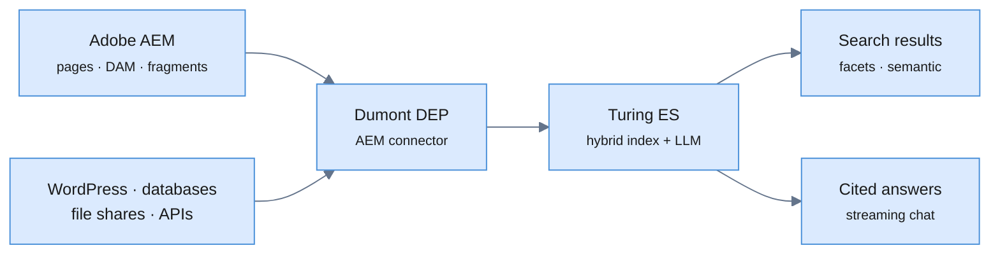

Open your analytics and look at what people type into your AEM site's search
box. Not the page views: the *queries*. It's the only place on your site where
visitors tell you, in their own words and unprompted, what they came for.

Now look at what you give them back: ten blue links, ranked by whether their
words happened to appear in your authors' words. If they used a synonym, a
typo, or a full sentence, they got nothing, and then they left, and no one
filed a ticket about it.

That gap is the subject of the page we just published:
**[turing.viglet.org/aem-search](https://turing.viglet.org/aem-search)**: *AEM
search, reimagined with AI, without the ceiling*. This post is the longer
version: not the feature list, but what actually becomes possible on an AEM site
when search stops matching strings and starts understanding questions.

<!-- truncate -->

## The ceiling is real, and everyone hits it in the same order

Every AEM project follows the same arc. QueryBuilder and the out-of-the-box
search component cover launch. Then the requests arrive, always roughly in this
sequence:

1. *"Search doesn't find X"*, because the visitor said **"pricing"** and the
   author wrote **"plans and rates"**.
2. *"Can we get facets?"*: real ones, reflecting the content model, not a
   hardcoded dropdown.
3. *"The PDFs aren't searchable"*: the datasheet in the DAM is the single most
   valuable document you have, and it's invisible.
4. *"Why doesn't it find the knowledge-base article?"*: that content lives
   outside AEM, so it might as well not exist.
5. *"Can it just answer the question?"*, because that's what people now expect
   from a text box.

None of those are AEM's failure. AEM is a content management system, and it's a
very good one. But a CMS repository query and a search engine are different
tools, and the fifth request isn't a search problem at all: it's a
*conversation* problem.

## What people actually type

Search logs from the last two years look different from search logs from five
years ago. Query length is up, keywords are down. People type what they'd say to
a person at a counter:

> *"can I cancel after the first month"*
> *"which model works with the 12 volt adapter"*
> *"do you have anything in stock near Lisbon"*
> *"what documents do I need to enrol my daughter"*

Every one of those has an answer somewhere on your site. It's in paragraph four
of a policy page, in a table on a product page, in a PDF in the DAM. Keyword
search can't get there, because the answer isn't a *page* but a *passage*,
and often it's a passage from three different pages combined.

That's the shift. Not "better ranking". A different job.

## How it fits together

The important detail: **one index, two experiences.** The search results page and
the conversational answer read from the same content, with the same governance.
You don't maintain a search index *and* a separate chatbot knowledge base that
drifts out of sync the moment someone edits a page.

## Layer one: search that understands

Before any AI answers anything, retrieval has to be good, because a confident
answer built on the wrong passage is worse than no answer.

- **Hybrid relevance.** Faceted, typo-tolerant keyword matching *and*
  [vector/semantic search](/blog/semantic-vector-search-aem), fused with RRF.
  *"places to stay near the mountains"* finds *"Alpine lodges and cabins"*.
  Backed by [Solr, Elasticsearch, or embedded Lucene](/turing/search-engine).
- **[Synonyms](/turing/synonyms) without a reindex.** Author them once and
  they're pushed into the engine at query time. Your product team's vocabulary
  and your customers' vocabulary finally meet, and the AI can mine candidate
  synonyms straight from your search logs.
- **[Thesaurus](/turing/thesaurus) enrichment.** A controlled vocabulary means a
  document that mentions *"Type 2 diabetes"* is also findable under
  *"endocrine conditions"*, and you get a concept facet to browse by.
- **[PDFs and DAM assets](/turing/assets)** get their text extracted and indexed
  next to pages, so the datasheet competes on merit with the landing page.
- **[Reranking](/turing/reranking)** for the last mile of precision.

Ship only this and the site is already measurably better. Everything below is
built on top of it.

## Layer two: the conversation

Now the part that changes what a website *is*. [RAG](/turing/rag) grounded
strictly in your indexed AEM content: the answer streams in over SSE as it's
generated, and every claim carries an inline citation back to the page it came
from. No answer without a source; the visitor can click through and verify.

Choose the model you already trust: OpenAI, Anthropic, Gemini, Azure, or
[Ollama](/turing/llm-instances) when the content genuinely cannot leave your
network.

And it doesn't have to stop at answering. [AI agents](/turing/ai-agents) can
[call tools](/turing/tool-calling) (check stock, look up an order, book a slot),
[capture form data](/turing/webhooks) conversationally and push it to your CRM,
and [hand off to a human](/turing/human-in-the-loop) when they've reached the
edge of what they should decide alone. Give them a
[persona](/turing/personas) and they speak in your brand's voice rather than
generic-assistant voice.

## Where this pays off, concretely

**Product and marketing sites.** Pre-sales questions get answered at the moment
of interest instead of becoming a contact-form round trip. *"Does it integrate
with SAP?"* gets a cited answer in two seconds. The same conversation
[captures the lead](/turing/webhooks) (name, company, need) as a natural
exchange rather than a nine-field form, and drops it into your CRM.

**Support and self-service.** Your knowledge base already contains the answer to
80% of your ticket volume; people just can't find it. A conversational layer
grounded in that content deflects the repetitive ones and escalates the rest
*with the conversation history attached*, so the agent doesn't start from zero.

**Product catalogs and specs.** When the question is *"which pump handles 40°C
and 6 bar"*, that's not a semantic-similarity problem but a lookup over
structured data. [Vectorless structured RAG](/turing/vectorless-structured-rag)
answers over a typed catalog with citations, no embeddings needed.

**Intranets and employee portals.** This is where AEM alone can't win, because
the answer lives half in AEM and half in a file share, a database, or an old
WordPress instance. [Federating those sources](/turing/integration) into one
index means one search box for "how do I request parental leave" regardless of
which system holds the policy.

**Regulated content: public sector, banking, insurance, healthcare.** The
citation requirement stops being a nice-to-have. Every answer points to the
published page that authorises it, the whole stack can run
[self-hosted with local models](/turing/llm-instances), and nothing is shipped
to a third-party service. That combination is usually the difference between
"interesting" and "approved".

**Education.** Admissions questions are seasonal, repetitive, and high-stakes for
the person asking. *"What documents do I need, and when is the deadline for my
course?"* is a paragraph in a PDF and a date in a table, exactly the kind of
answer that has to be assembled, not retrieved.

**Multi-site, multi-brand, multi-language.** AEM estates are rarely one site.
[Multi-tenancy](/turing/multi-tenancy) keeps brands and regions properly
isolated while the platform stays one deployment to operate.

## The part your team will feel first

Here's the underrated benefit: **the conversation is a research instrument.**

[Chat analytics](/turing/chat-analytics) classifies thousands of conversations
into intents, goal achievement, and sentiment trajectory. That's not a dashboard
for its own sake. It's the voice of your customer, aggregated, telling your
content team what to write next. Every question your content *couldn't* answer is
a documented content gap with a demand estimate attached. Most teams have never
had that input; they've had page views and guesswork.

From there it compounds:

- [Conversion analytics](/turing/conversion-analytics) tracks leads and
  abandonment in your own GA4, with zero-config detection of an existing
  `gtag`/`dataLayer`, which matters on Edge Delivery Services setups.
- [Experiments](/turing/experiments) A/B test conversational flows with real
  significance testing and a bandit that shifts traffic to the winner. You can
  test how you *answer*, not just how you lay out a page.
- [Voice input](/turing/transcription) for mobile and accessibility.
- [Skills](/turing/skills), portable and sandboxed capabilities, for when an
  answer needs to actually *do* something.

## What doesn't change

This matters as much as the features:

- **No re-authoring.** It indexes the AEM content you already published. There's
  no separate "AI knowledge base" to write and maintain.
- **AEM stays the CMS.** Authors keep authoring in AEM. Activation triggers
  real-time reindexing through the
  [OSGi event listener](/dumont/aem-event-listener).
- **Your front end, your call.** A zero-dependency
  [vanilla JavaScript SDK](/turing/javascript-sdk) or the
  [React SDK](/turing/react-sdk), dropped into an AEM component or an
  **Adobe Edge Delivery Services** block.
- **AEM 6.5+ and AEM as a Cloud Service**, via the
  [Dumont DEP connector](/dumont/connectors/aem).
- **Apache 2.0, self-hosted.** No per-query pricing that punishes you for the
  search traffic you worked to earn, and no discovery call before you can see it
  work.

## Where to start

You don't buy this as a program. You start with one index and one search box:

1. Index one AEM site through the [AEM connector](/turing/integration-aem) and
   replace the existing search results page. Ship it.
2. Read the queries for two weeks. Add [synonyms](/turing/synonyms) for the
   vocabulary mismatches you find, with no reindex required.
3. Turn on the conversational layer on one section (support, or one product
   family) where you already know the questions.
4. Read [chat analytics](/turing/chat-analytics) and hand the content gaps to
   your authors. That loop is the actual product.

If you want to see the ceiling-free version end to end first, the
[Atlas Store showcase](/turing/showcase) exercises the whole surface: typed
catalog, hybrid search, RAG chat, agents, voice.

## Take a look

- 🔗 **[turing.viglet.org/aem-search](https://turing.viglet.org/aem-search)**: the AEM search page (live demo + CTAs)
- 📘 [Index Adobe AEM into Turing ES](/blog/enterprise-search-for-adobe-aem): the hands-on walkthrough
- 📗 [AEM Connector docs](/turing/integration-aem) · [Dumont DEP connector](/dumont/connectors/aem)
- 📙 [Semantic & vector search on AEM](/blog/semantic-vector-search-aem) · [MCP servers](/turing/mcp-servers)
- ⭐ [Turing ES on GitHub](https://github.com/openviglet/turing-ce) (Apache 2.0)

*Viglet Turing ES is open-source enterprise search with semantic navigation and
generative AI. Index Adobe Experience Manager alongside your other content
sources, add hybrid search and cited conversational answers, and keep everything
on your own infrastructure.*
