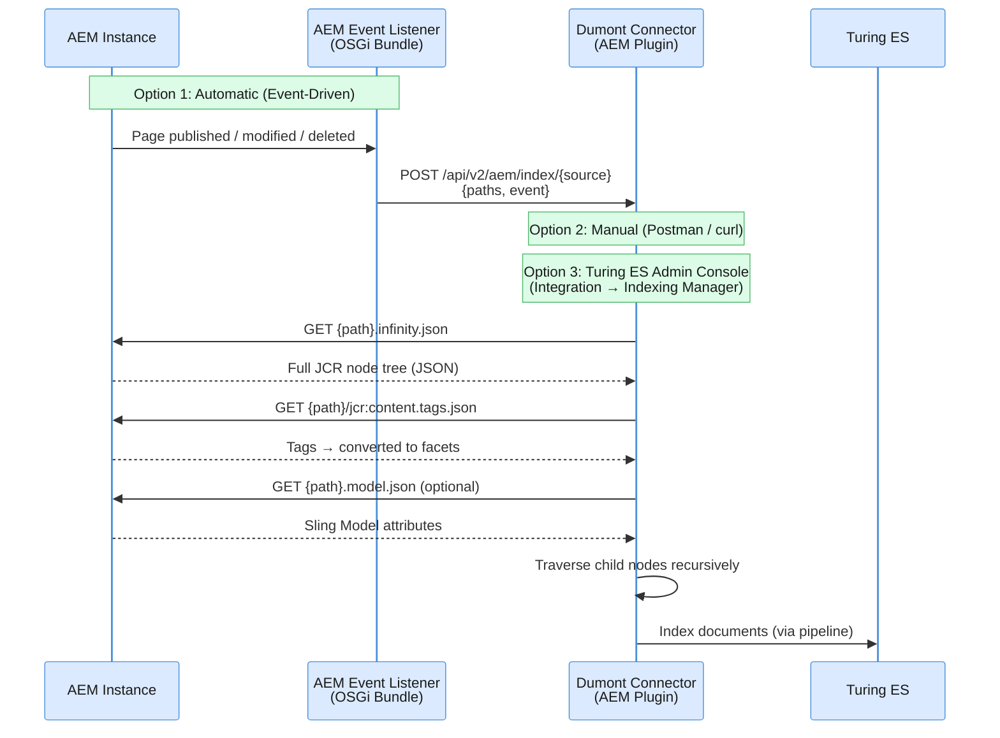
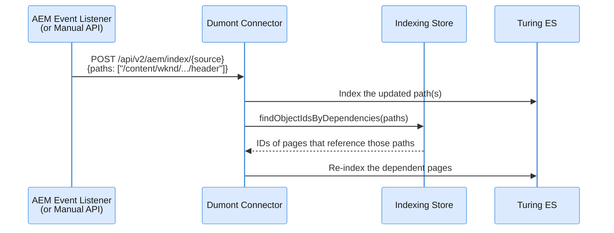

# AEM Connector

The AEM Connector indexes content from Adobe Experience Manager (AEM) author and publish instances. It consists of two components: an **AEM server-side bundle** (OSGi event listeners installed inside AEM) and a **connector plugin** (Java JAR loaded into `dumont-connector.jar`).

---

## How It Works

The AEM connector receives indexing requests, then accesses AEM to traverse the content tree, fetch page data, extract tags as facets, and optionally call `.model.json` for custom attributes.



### Three Ways to Trigger Indexing

| Method | How | When to use |
|---|---|---|
| **AEM Event Listeners** | Install the `aem-server` OSGi bundle inside AEM — it automatically sends indexing requests when content is published, modified, or deleted | Production — real-time content sync |
| **Manual API Call** | Send a POST request to `/api/v2/aem/index/{source}` with a JSON payload containing paths and event type | Development, testing, one-off re-indexing |
| **Turing ES Admin Console** | Use **Enterprise Search → Integration → Indexing Manager** to select paths and trigger indexing/deindexing/publishing operations | Operations — selective re-indexing via UI |

---

## Content Discovery Strategies

The AEM connector supports two strategies for discovering content during a full **Index All** operation:

| Strategy | Property | How it discovers content |
|---|---|---|
| **Tree Traversal** *(default)* | `dumont.aem.querybuilder=false` | Recursively walks the content tree from the root path using `infinity.json` — follows parent→child relationships |
| **QueryBuilder** | `dumont.aem.querybuilder=true` | Uses AEM's native QueryBuilder API (`/bin/querybuilder.json`) to find all content matching the configured content type in paginated batches |

### QueryBuilder Discovery

When enabled, the connector queries the QueryBuilder endpoint instead of walking the tree:

```
GET http://localhost:4502/bin/querybuilder.json?path=/content/wknd&type=cq:Page&p.hits=slim&p.limit=500&p.offset=0
```

Each page of discovered paths is immediately processed in parallel using a configurable thread pool — the full path list is never held in memory.

**Enable it** by adding the following properties to `application.yaml` or as JVM arguments:

```yaml
dumont:
  aem.querybuilder: true
  aem.querybuilder.parallelism: 10   # number of parallel threads (default)
```

Or via command-line:

```bash
java -Ddumont.aem.querybuilder=true -Ddumont.aem.querybuilder.parallelism=10 -jar dumont-connector.jar
```

:::warning Content Type required
QueryBuilder discovery requires a **Content Type** (e.g., `cq:Page`) configured in the AEM source. Without it, the command logs a warning and skips processing.
:::

:::tip When to use QueryBuilder
QueryBuilder is recommended for **large content trees** where recursive traversal is slow. It reduces the number of HTTP round-trips to AEM by discovering all paths in bulk, then fetching content in parallel. For small sites (< 1 000 pages), the default tree traversal is typically sufficient.
:::

---

## The Indexing Flow (Step by Step)

When the connector receives an indexing request (from any of the three triggers), it processes each path as follows:

### 1. Fetch the Content Node

The connector calls AEM's `infinity.json` endpoint to get the full JCR node tree:

```
GET http://localhost:4502/content/wknd/us/en/my-page.infinity.json
```

This returns the complete node hierarchy as JSON — all properties, child nodes, and metadata. The connector filters out internal nodes (prefixed with `jcr:`, `rep:`, `cq:`).

### 2. Extract Tags as Facets

For each page, the connector fetches tags:

```
GET http://localhost:4502/content/wknd/us/en/my-page/jcr:content.tags.json
```

Tags are **automatically converted to facets** in the search index — no manual configuration needed. Each tag becomes a filterable value in the Turing ES facet panel.

### 3. Fetch Model JSON (Optional — Requires Configuration)

The connector does **not** call `.model.json` by default. To enable it, you must configure a `DumAemExtContentInterface` implementation in the `models` section of the export JSON:

```json
"models": [
  {
    "type": "cq:Page",
    "className": "com.viglet.dumont.connector.aem.sample.ext.DumAemExtSampleModelJson",
    "targetAttrs": [ ... ]
  }
]
```

When this is configured, the extension class fetches the Sling Model exporter:

```
GET http://localhost:4502/content/wknd/us/en/my-page.model.json
```

This returns structured content from AEM's Sling Models — useful for extracting custom attributes like content fragment paths, component data, or experience fragment references. See [Extending the AEM Connector](../extending-aem.md) for how to implement `DumAemExtContentInterface` and the full JSON configuration reference.

### 4. Traverse the Content Tree

Starting from the configured **root path** (e.g., `/content/wknd`), the connector recursively traverses all child nodes that match the configured **content type** (e.g., `cq:Page`). Each matching node goes through steps 1–3 above.

### 5. Map Attributes and Index

For each page, the connector:
- Applies **attribute mappings** from the configuration (global attributes + model-specific source→target mappings)
- Runs **custom extension classes** (if configured via `className`)
- Creates a **Job Item** for both author and publish environments (if enabled)
- Sends the Job Item through the Dumont DEP pipeline to Turing ES

---

<div className="page-break" />

## Dependency Tracking and Cascade Re-Indexing

When a page references other content (experience fragments, content fragments, shared components, linked pages), the AEM connector can automatically **re-index every page that depends on an updated path**. This prevents stale content from surviving in the index when a shared resource changes.

### How Dependencies Are Discovered

As each node's `.infinity.json` is fetched, the connector walks the JSON recursively and collects **every string value that starts with `/content`** — those paths become the document's dependency set. The extraction is completely automatic; no configuration on the AEM side is required.

The dependency set is then attached to the `DumJobItemWithSession` and persisted alongside the indexing record (`dum_connector_dependency` table) whenever the record is saved or updated.

### When the Cascade Fires

Dependency processing runs **only on standalone (incremental) indexing** — it is **not** triggered by `Index All`:



1. A page is indexed via event listener, manual API call, or the Indexing Manager.
2. The main indexing command runs first (the `Job Item` is produced and sent).
3. `DependencyHandler` queries the indexing store for every document whose stored dependency list contains one of the updated paths.
4. A second `IndexPaths` command re-indexes those dependents, which in turn also have their own dependencies refreshed.

### Configuration

A single property controls both the persistence of dependency links **and** the cascade behavior:

| Property | Default | Description |
|---|---|---|
| `dumont.dependencies.enabled` | `false` *(shipped in `application.yaml`)* | Persist `/content/*` dependencies on each indexing record and trigger cascade re-indexing on standalone operations |

Enable it in `application.yaml`:

```yaml
dumont:
  dependencies.enabled: true
```

Or via JVM argument:

```bash
java -Ddumont.dependencies.enabled=true -jar dumont-connector.jar
```

:::note Two effects from one flag
When `false`:
- New/updated indexing records are saved **without** a dependency set (the join table stays empty for those rows)
- `DependencyHandler.processDependencies()` returns early and no cascade re-indexing happens

After turning the flag on, previously indexed content still has no stored dependencies — run a **Reindex All** to populate the dependency table for existing records.
:::

:::tip Performance impact
Every standalone index operation performs an extra lookup plus a second indexing pass for any dependents. On sources with heavily shared components (templates, headers/footers, fragments), a single page update can fan out into many re-indexations — budget accordingly, or leave the flag off and rely on scheduled full reindexing.
:::

---

<div className="page-break" />

## AEM Server-Side Bundle (Event Listeners)

The `aem-server` module is an **OSGi bundle installed inside AEM**. It provides event listeners that automatically notify the Dumont connector when content changes.

### Events Captured

| Event Listener | AEM Event | Dumont Action |
|---|---|---|
| `DumAemPageEventHandler` | Page created / modified | `INDEXING` |
| `DumAemPageReplicationEventHandler` | Page activated (published) | `PUBLISHING` |
| `DumAemPageReplicationEventHandler` | Page deactivated (unpublished) | `UNPUBLISHING` |
| `DumAemResourceEventHandler` | DAM asset created / modified | `INDEXING` |

### OSGi Configuration

The event listeners are configured in AEM via **OSGi Configuration** (AEM → Web Console → Configuration):

| Setting | Description |
|---|---|
| **Enabled** | Toggle to enable/disable automatic indexing |
| **Host** | Dumont connector URL (e.g., `http://dumont-server:30130`) |
| **Config Name** | Source name configured in the Dumont connector |

### HTTP Payload

When an event fires, the bundle sends:

```
POST http://dumont-server:30130/api/v2/aem/index/{configName}
Content-Type: application/json

{
  "paths": ["/content/wknd/us/en/my-page"],
  "event": "INDEXING"
}
```

Event types: `INDEXING`, `DEINDEXING`, `PUBLISHING`, `UNPUBLISHING`.

---

## Manual API Triggering

You can trigger indexing manually via HTTP (Postman, curl, etc.):

### Index Specific Paths

```bash
curl -X POST http://localhost:30130/api/v2/aem/index/WKND \
  -H "Content-Type: application/json" \
  -d '{
    "paths": ["/content/wknd/us/en/about"],
    "event": "INDEXING",
    "recursive": true
  }'
```

### Deindex Specific Paths

```bash
curl -X POST http://localhost:30130/api/v2/aem/index/WKND \
  -H "Content-Type: application/json" \
  -d '{
    "paths": ["/content/wknd/us/en/old-page"],
    "event": "DEINDEXING"
  }'
```

### Request Body Fields

| Field | Type | Default | Description |
|---|---|---|---|
| `paths` | string[] | *(required)* | AEM content paths to process |
| `event` | string | `INDEXING` | `INDEXING`, `DEINDEXING`, `PUBLISHING`, or `UNPUBLISHING` |
| `recursive` | boolean | `false` | Traverse child nodes recursively |
| `attribute` | string | `ID` | `ID` (path-based) or `URL` (URL-based) |

---

<div className="page-break" />

## Source Configuration

Each AEM source defines connection details, content scope, author/publish environments, locale mappings, and delta tracking. Sources are configured in the **Turing ES Admin Console** under **Enterprise Search → Integration → [your AEM instance] → Sources**.

For the JSON configuration file used by custom extensions (attributes, models, locale paths), see [Extending the AEM Connector](../extending-aem.md#aem-configuration-json).

### General

| Field | Description |
|---|---|
| Name | Source identifier |
| Endpoint | URL of the AEM instance (e.g., `http://localhost:4502`) |
| Username / Password | Credentials for authenticated access to the AEM instance |

### Root Path

Defines the root content path within the AEM repository from which content is traversed (e.g., `/content/wknd`). All child nodes matching the configured content type are indexed recursively from this path.

### Content Types

| Field | Description |
|---|---|
| Content Type | Primary content type to be indexed (e.g., `cq:Page`) |
| Sub Type | Optional sub-type filter within the content type |

### Delta Tracking

Controls incremental indexing — how the connector detects which content has changed since the last run.

| Field | Description |
|---|---|
| Once Pattern | Pattern used to identify content that should only be indexed once |
| Delta Class | Fully-qualified Java class name responsible for detecting changed content since the last run (see [Extending AEM](../extending-aem.md) for custom implementations) |

### Author / Publish

Configures which AEM environments are indexed and how they map to Turing ES Semantic Navigation Sites.

| Field | Description |
|---|---|
| Author | Enable indexing from the AEM author environment |
| Publish | Enable indexing from the AEM publish environment |
| SN Site (Author) | Semantic Navigation Site that receives author content |
| SN Site (Publish) | Semantic Navigation Site that receives publish content |
| URL Prefix (Author) | URL prefix prepended to document paths in the author index |
| URL Prefix (Publish) | URL prefix prepended to document paths in the publish index |

### Locales

Maps content language codes to repository paths.

| Field | Description |
|---|---|
| Default Locale | Locale used when no language-specific path is matched |
| Locale Class | Fully-qualified Java class name responsible for resolving document locale (see [Extending AEM](../extending-aem.md) for custom implementations) |
| Locale → Path | Dynamic list mapping each locale code (e.g., `en_US`) to its root path in the repository |

### Source Actions

Each source has two action buttons available in the Turing ES admin console:

- **Index All** — triggers a full indexing run for all content in this source
- **Reindex All** — forces a full reindexation, replacing all previously indexed content

---

<div className="page-break" />

## Indexing Rules

Indexing Rules allow you to filter content during indexing — for example, to exclude error pages or draft content before it reaches the search index. Rules are configured in the **Turing ES Admin Console** under **Enterprise Search → Integration → [your AEM instance] → Indexing Rules**.

| Field | Description |
|---|---|
| Name | Rule identifier (required) |
| Description | Purpose of this rule |
| Source | The source this rule applies to |
| Attribute | Document field to evaluate (e.g., `template`) |
| Rule Type | How the rule is applied — currently supports **IGNORE** (skip documents that match) |
| Values | Dynamic list of values that trigger the rule (add or remove entries) |

**Example:** A rule with `Attribute = template`, `Rule Type = IGNORE`, and `Values = [error-page]` will prevent any document with `template:error-page` from being indexed.

---

## Indexing Manager

The Indexing Manager provides a stepper form in the **Turing ES Admin Console** for targeting specific documents for manual operations.

| Operation | Description | Colour |
|---|---|---|
| **INDEXING** | Index specific content | Blue |
| **DEINDEXING** | Remove specific content from the index | Red |
| **PUBLISHING** | Publish content | Green |
| **UNPUBLISHING** | Unpublish content | Orange |

Each operation step allows you to:

- Select the **Source** to operate on
- Choose the **attribute** to identify documents: **ID** or **URL**
- Enter one or more specific values (IDs or URLs)
- Expand **Advanced Settings** to toggle **Recursive** mode, which traverses child content in hierarchical repositories

## Concurrency

The connector supports two execution modes:

| Mode | When | Behavior |
|---|---|---|
| **Exclusive** | Full crawl (`indexAll`) | Only one full crawl per source at a time |
| **Standalone** | Specific paths (event-driven / manual) | Multiple concurrent updates allowed |

Reactive (parallel) processing can be enabled for large sites:

```properties
dumont.reactive.indexing=true
dumont.reactive.parallelism=10
```

When using **QueryBuilder discovery**, parallelism is controlled separately via `dumont.aem.querybuilder.parallelism` (default `10`). See [Content Discovery Strategies](#content-discovery-strategies) above.

---

:::tip Customizing the AEM Connector
Need custom attribute extractors, delta date logic, or content processors? See [Extending the AEM Connector](../extending-aem.md) for the full extension system, configuration JSON reference, and step-by-step guide.
:::

---

## Related Pages

| Page | Description |
|---|---|
| [AEM Event Listener](../aem-event-listener.md) | Install the OSGi event listener bundle inside AEM for real-time indexing |
| [Extending the AEM Connector](../extending-aem.md) | Custom attribute extractors, content processors, and configuration JSON reference |
| [Turing ES — Integration](/turing/integration) | General integration management — monitoring, indexing stats, and system information |
| [Turing ES — AEM Connector](/turing/integration-aem) | AEM integration overview from the Turing ES perspective |
| [Turing ES — Semantic Navigation](/turing/semantic-navigation) | Configure the SN Sites that receive indexed content |

---
