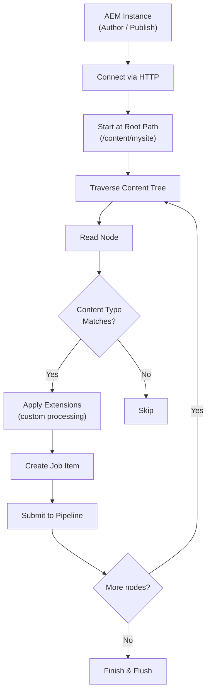

# AEM Connector

The AEM Connector indexes content from Adobe Experience Manager (AEM) author and publish instances. It supports content fragments, delta (incremental) indexing, locale mapping, and a flexible extension system for custom content processing.

---

## How It Works



---

## Key Features

| Feature | Description |
|---|---|
| **Author & Publish** | Index from both AEM environments independently, with separate SN Site targets |
| **Delta tracking** | Incremental indexing — only process content changed since the last run |
| **Content type filtering** | Process only specific JCR node types (e.g., `cq:Page`) with optional sub-type filtering |
| **Locale mapping** | Map AEM repository paths to locales (e.g., `/content/mysite/en` → `en_US`) |
| **Root path scoping** | Restrict indexing to a specific subtree of the content repository |
| **Custom extensions** | Pluggable interfaces for content processing, delta dates, and locale resolution |
| **URL prefix mapping** | Configure different URL prefixes for author and publish content |

---

## Source Configuration

Each AEM source defines:

| Field | Description |
|---|---|
| **Name** | Source identifier |
| **Endpoint** | AEM instance URL (e.g., `http://localhost:4502`) |
| **Username / Password** | AEM credentials for authentication |
| **Root Path** | Starting path in the content repository (e.g., `/content/wknd`) |
| **Content Type** | JCR node type to index (e.g., `cq:Page`) |
| **Sub Type** | Optional sub-type filter |

---

## Author / Publish Configuration

| Field | Description |
|---|---|
| **Author** | Enable indexing from the AEM author environment |
| **Publish** | Enable indexing from the AEM publish environment |
| **SN Site (Author)** | Semantic Navigation Site for author content |
| **SN Site (Publish)** | Semantic Navigation Site for publish content |
| **URL Prefix (Author)** | URL prefix for author documents |
| **URL Prefix (Publish)** | URL prefix for publish documents |

---

## Delta Tracking

Delta tracking enables **incremental indexing** — only content modified since the last run is processed.

| Field | Description |
|---|---|
| **Once Pattern** | Pattern to identify content that should only be indexed once |
| **Delta Class** | Java class responsible for detecting changed content since the last run |

The delta mechanism compares the current content against the last indexed timestamp, processing only nodes that have been created, modified, or deleted since then.

---

<div className="page-break" />

## Locale Mapping

Maps content paths to language/country codes:

| Field | Description |
|---|---|
| **Default Locale** | Locale used when no path-specific match is found |
| **Locale Class** | Java class for custom locale resolution logic |
| **Locale → Path** | Dynamic mapping of locale codes to repository paths |

**Example:**

| Locale | Path |
|---|---|
| `en_US` | `/content/wknd/us/en` |
| `pt_BR` | `/content/wknd/br/pt-br` |
| `es_ES` | `/content/wknd/es/es` |

---

## Extension System

The AEM Connector provides extension points for custom content processing:

| Interface | Purpose |
|---|---|
| `DumAemExtContentInterface` | Custom content field extraction and transformation |
| `DumAemExtDeltaDateInterface` | Custom delta date resolution for change detection |

Create a custom implementation by extending these interfaces and packaging them as a plugin. See the `aem-plugin-sample` module in the Dumont repository for a working example.

### Module Structure

| Module | Description |
|---|---|
| `aem-plugin` | Core AEM connector with extension interfaces |
| `aem-server` | AEM server-side integration |
| `aem-plugin-sample` | Example custom implementation showing how to extend the connector |
| `aem-commons` | Shared utilities for AEM connectors |

---

## Example: Indexing WKND Site

```json
{
  "name": "WKND",
  "endpoint": "http://localhost:4502",
  "username": "admin",
  "password": "admin",
  "rootPath": "/content/wknd",
  "contentType": "cq:Page",
  "authorSNSite": "wknd-author",
  "publishSNSite": "wknd-publish",
  "defaultLocale": "en_US",
  "locales": {
    "en_US": "/content/wknd/us/en",
    "pt_BR": "/content/wknd/br/pt-br"
  }
}
```

---

*Previous: [FileSystem Connector](./filesystem.md) | Next: [WordPress Connector](./wordpress.md)*
