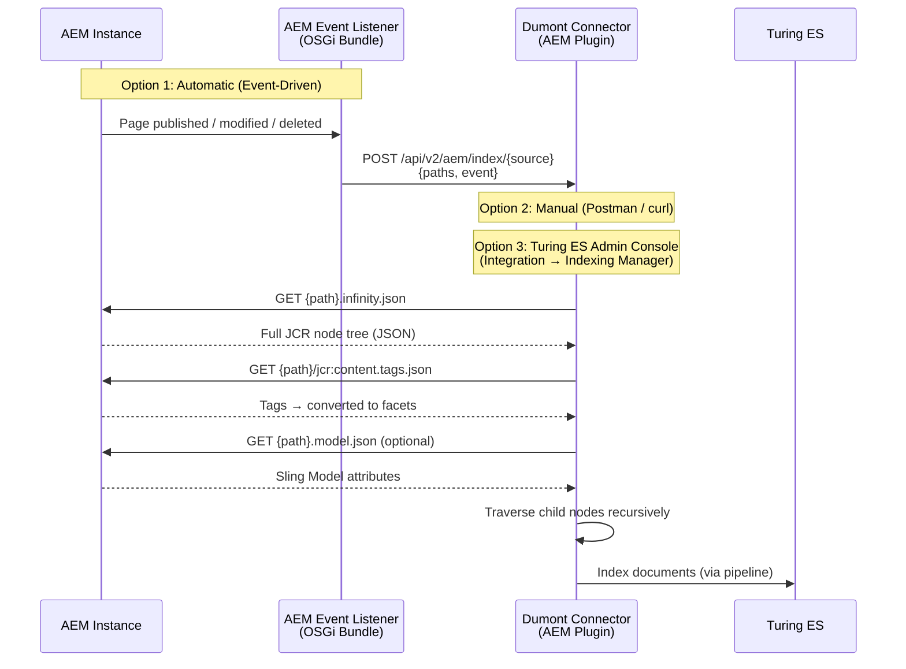

# AEM Connector

The AEM Connector indexes content from Adobe Experience Manager (AEM) author and publish instances. It consists of two components: an **AEM server-side bundle** (OSGi event listeners installed inside AEM) and a **connector plugin** (Java JAR loaded into `dumont-connector.jar`).

---

## How It Works

The AEM connector receives indexing requests, then accesses AEM to traverse the content tree, fetch page data, extract tags as facets, and optionally call `.model.json` for custom attributes.



### Three Ways to Trigger Indexing

| Method | How | When to use |
|---|---|---|
| **AEM Event Listeners** | Install the `aem-server` OSGi bundle inside AEM — it automatically sends indexing requests when content is published, modified, or deleted | Production — real-time content sync |
| **Manual API Call** | Send a POST request to `/api/v2/aem/index/{source}` with a JSON payload containing paths and event type | Development, testing, one-off re-indexing |
| **Turing ES Admin Console** | Use **Enterprise Search → Integration → Indexing Manager** to select paths and trigger indexing/deindexing/publishing operations | Operations — selective re-indexing via UI |

---

## The Indexing Flow (Step by Step)

When the connector receives an indexing request (from any of the three triggers), it processes each path as follows:

### 1. Fetch the Content Node

The connector calls AEM's `infinity.json` endpoint to get the full JCR node tree:

```
GET http://localhost:4502/content/wknd/us/en/my-page.infinity.json
```

This returns the complete node hierarchy as JSON — all properties, child nodes, and metadata. The connector filters out internal nodes (prefixed with `jcr:`, `rep:`, `cq:`).

### 2. Extract Tags as Facets

For each page, the connector fetches tags:

```
GET http://localhost:4502/content/wknd/us/en/my-page/jcr:content.tags.json
```

Tags are **automatically converted to facets** in the search index — no manual configuration needed. Each tag becomes a filterable value in the Turing ES facet panel.

### 3. Fetch Model JSON (Optional — Requires Configuration)

The connector does **not** call `.model.json` by default. To enable it, you must configure a `DumAemExtContentInterface` implementation in the `models` section of the export JSON:

```json
"models": [
  {
    "type": "cq:Page",
    "className": "com.viglet.dumont.connector.aem.sample.ext.DumAemExtSampleModelJson",
    "targetAttrs": [ ... ]
  }
]
```

When this is configured, the extension class fetches the Sling Model exporter:

```
GET http://localhost:4502/content/wknd/us/en/my-page.model.json
```

This returns structured content from AEM's Sling Models — useful for extracting custom attributes like content fragment paths, component data, or experience fragment references. See [Extending the AEM Connector](../extending-aem.md) for how to implement `DumAemExtContentInterface` and the full JSON configuration reference.

### 4. Traverse the Content Tree

Starting from the configured **root path** (e.g., `/content/wknd`), the connector recursively traverses all child nodes that match the configured **content type** (e.g., `cq:Page`). Each matching node goes through steps 1–3 above.

### 5. Map Attributes and Index

For each page, the connector:
- Applies **attribute mappings** from the configuration (global attributes + model-specific source→target mappings)
- Runs **custom extension classes** (if configured via `className`)
- Creates a **Job Item** for both author and publish environments (if enabled)
- Sends the Job Item through the Dumont DEP pipeline to Turing ES

---

<div className="page-break" />

## AEM Server-Side Bundle (Event Listeners)

The `aem-server` module is an **OSGi bundle installed inside AEM**. It provides event listeners that automatically notify the Dumont connector when content changes.

### Events Captured

| Event Listener | AEM Event | Dumont Action |
|---|---|---|
| `DumAemPageEventHandler` | Page created / modified | `INDEXING` |
| `DumAemPageReplicationEventHandler` | Page activated (published) | `PUBLISHING` |
| `DumAemPageReplicationEventHandler` | Page deactivated (unpublished) | `UNPUBLISHING` |
| `DumAemResourceEventHandler` | DAM asset created / modified | `INDEXING` |

### OSGi Configuration

The event listeners are configured in AEM via **OSGi Configuration** (AEM → Web Console → Configuration):

| Setting | Description |
|---|---|
| **Enabled** | Toggle to enable/disable automatic indexing |
| **Host** | Dumont connector URL (e.g., `http://dumont-server:30130`) |
| **Config Name** | Source name configured in the Dumont connector |

### HTTP Payload

When an event fires, the bundle sends:

```
POST http://dumont-server:30130/api/v2/aem/index/{configName}
Content-Type: application/json

{
  "paths": ["/content/wknd/us/en/my-page"],
  "event": "INDEXING"
}
```

Event types: `INDEXING`, `DEINDEXING`, `PUBLISHING`, `UNPUBLISHING`.

---

## Manual API Triggering

You can trigger indexing manually via HTTP (Postman, curl, etc.):

### Index Specific Paths

```bash
curl -X POST http://localhost:30130/api/v2/aem/index/WKND \
  -H "Content-Type: application/json" \
  -d '{
    "paths": ["/content/wknd/us/en/about"],
    "event": "INDEXING",
    "recursive": true
  }'
```

### Deindex Specific Paths

```bash
curl -X POST http://localhost:30130/api/v2/aem/index/WKND \
  -H "Content-Type: application/json" \
  -d '{
    "paths": ["/content/wknd/us/en/old-page"],
    "event": "DEINDEXING"
  }'
```

### Request Body Fields

| Field | Type | Default | Description |
|---|---|---|---|
| `paths` | string[] | *(required)* | AEM content paths to process |
| `event` | string | `INDEXING` | `INDEXING`, `DEINDEXING`, `PUBLISHING`, or `UNPUBLISHING` |
| `recursive` | boolean | `false` | Traverse child nodes recursively |
| `attribute` | string | `ID` | `ID` (path-based) or `URL` (URL-based) |

---

<div className="page-break" />

## Source Configuration

Each AEM source defines the connection and indexing behavior:

| Field | Description |
|---|---|
| **Name** | Source identifier (used in the API path) |
| **Endpoint** | AEM instance URL (e.g., `http://localhost:4502`) |
| **Username / Password** | AEM authentication credentials |
| **Root Path** | Content tree root to crawl (e.g., `/content/wknd`) |
| **Content Type** | JCR node type to index (e.g., `cq:Page`) |

## Author / Publish

| Field | Description |
|---|---|
| **Author** | Enable indexing from AEM author |
| **Publish** | Enable indexing from AEM publish |
| **SN Site (Author)** | Turing ES site for author content |
| **SN Site (Publish)** | Turing ES site for publish content |
| **URL Prefix (Author)** | Public URL prefix for author documents |
| **URL Prefix (Publish)** | Public URL prefix for publish documents |

## Delta Tracking

| Field | Description |
|---|---|
| **Once Pattern** | Regex — matching paths are indexed only once |
| **Delta Class** | Class implementing `DumAemExtDeltaDateInterface` |

## Locale Mapping

```json
"localePaths": [
  { "locale": "en_US", "path": "/content/wknd/us/en" },
  { "locale": "es",    "path": "/content/wknd/es/es" }
]
```

## Concurrency

The connector supports two execution modes:

| Mode | When | Behavior |
|---|---|---|
| **Exclusive** | Full crawl (`indexAll`) | Only one full crawl per source at a time |
| **Standalone** | Specific paths (event-driven / manual) | Multiple concurrent updates allowed |

Reactive (parallel) processing can be enabled for large sites:

```properties
dumont.reactive.indexing=true
dumont.reactive.parallelism=10
```

---

:::tip Customizing the AEM Connector
Need custom attribute extractors, delta date logic, or content processors? See [Extending the AEM Connector](../extending-aem.md) for the full extension system, configuration JSON reference, and step-by-step guide.
:::

For managing AEM indexing via the Turing ES admin console — including monitoring, indexing stats, and the Indexing Manager — see the [Turing ES Integration documentation](https://docs.viglet.com/turing/integration) and [AEM Connector documentation](https://docs.viglet.com/turing/integration-aem).
