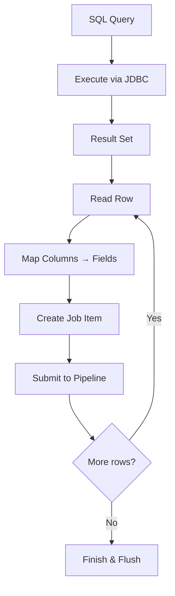

# Database Connector

The Database Connector extracts content from any JDBC-compatible database by executing SQL queries and mapping each result row to a searchable document. It supports Oracle, PostgreSQL, MariaDB, MySQL, and any database with a JDBC driver.

---

## How It Works



1. Execute the configured **SQL query** against the database
2. Iterate through the result set
3. Map each **column** to a search index **field** based on the attribute mapping
4. Create a Job Item with the mapped fields
5. Submit to the pipeline in configurable **chunks**
6. Repeat until all rows are processed

---

## Key Features

| Feature | Description |
|---|---|
| **Any JDBC database** | Oracle, PostgreSQL, MariaDB, MySQL, and any JDBC-compatible source |
| **SQL flexibility** | Use any SELECT query — joins, aggregations, subqueries, functions |
| **External SQL files** | Load queries from files using the `file://` protocol |
| **Batch processing** | Configurable chunk size for memory-efficient processing |
| **Max content size** | Limits per-document content size (default: 5 MB) to prevent oversized documents |
| **Standalone CLI** | Run imports from the command line without the full Dumont DEP application |
| **Custom extensions** | `DumDbExtCustomImpl` interface for custom row processing logic |
| **Locale support** | Configurable default locale for all extracted documents |

---

## CLI Parameters

The standalone Database Connector accepts the following command-line parameters:

| Parameter | Required | Default | Description |
|---|---|---|---|
| `--driver` | Yes | — | JDBC driver class name |
| `--connect` | Yes | — | JDBC connection string |
| `--query` / `-q` | Yes | — | SQL query or `file://path/to/query.sql` |
| `--site` | Yes | — | Target Semantic Navigation Site name |
| `--server` / `-s` | Yes | — | Dumont DEP server URL |
| `--api-key` / `-a` | Yes | — | API key for authentication |
| `--locale` | No | `en_US` | Default locale for documents |
| `--chunk` / `-z` | No | *(varies)* | Batch size for processing |
| `--max-content-size` | No | `5` | Maximum content size in MB |
| `--deindex-before-importing` | No | `false` | Remove all existing documents before import |

---

<div className="page-break" />

## Example: Indexing a Product Catalog

### SQL Query

```sql
SELECT
    p.id,
    p.name AS title,
    p.description AS text,
    p.price,
    c.name AS category,
    p.updated_at AS date,
    CONCAT('https://shop.example.com/products/', p.slug) AS url
FROM products p
JOIN categories c ON p.category_id = c.id
WHERE p.active = 1
```

### Standalone Import

```bash
java -cp dumont-db.jar com.viglet.dumont.db.DumDbImportTool \
  --server http://localhost:30130 \
  --api-key your-api-key \
  --driver org.mariadb.jdbc.Driver \
  --connect "jdbc:mariadb://localhost:3306/shop?user=reader&password=secret" \
  --query "file:///opt/queries/products.sql" \
  --site ProductCatalog \
  --locale en_US \
  --chunk 100
```

This will:
1. Connect to the MariaDB database
2. Execute the SQL query from the external file
3. Map each row to a document (columns become fields)
4. Send documents in batches of 100 to the `ProductCatalog` SN Site

---

## Supported Databases

| Database | Driver | Connection String Example |
|---|---|---|
| **MariaDB** | `org.mariadb.jdbc.Driver` | `jdbc:mariadb://host:3306/dbname` |
| **MySQL** | `com.mysql.cj.jdbc.Driver` | `jdbc:mysql://host:3306/dbname` |
| **PostgreSQL** | `org.postgresql.Driver` | `jdbc:postgresql://host:5432/dbname` |
| **Oracle** | `oracle.jdbc.OracleDriver` | `jdbc:oracle:thin:@host:1521/service` |

---

## Tips

- **Use aliases** in your SQL query to match the field names expected by Turing ES (e.g., `SELECT name AS title`).
- **External SQL files** (`file://` protocol) keep complex queries maintainable and version-controlled.
- **De-index before importing** (`--deindex-before-importing`) is useful for full refreshes — it removes stale documents that no longer exist in the database.
- **Chunk size** affects memory usage: larger chunks are faster but use more memory. Start with 100 and adjust based on document size.

---

*Previous: [Web Crawler](./web-crawler.md) | Next: [FileSystem Connector](./filesystem.md)*
