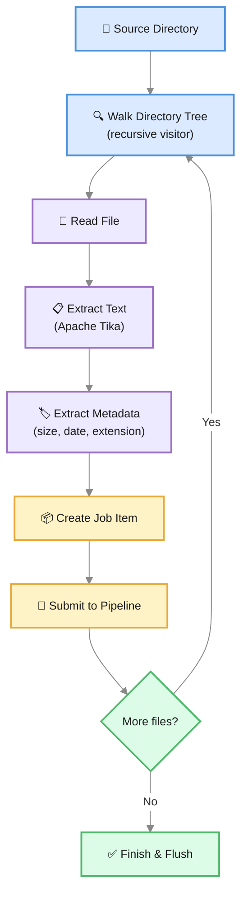

# FileSystem Connector

The FileSystem Connector walks a directory tree, extracts text and metadata from files using Apache Tika, and indexes everything as searchable documents. It supports PDFs, Word documents, spreadsheets, presentations, plain text, HTML, and images (with OCR).

---

## How It Works



1. Start at the configured **source directory**
2. Recursively traverse all subdirectories
3. For each file, extract text content using **Apache Tika**
4. Collect file metadata (size, modification date, extension, MIME type)
5. Create a Job Item with the extracted content and metadata
6. Submit to the pipeline in configurable batches
7. Repeat until all files are processed

---

## Key Features

| Feature | Description |
|---|---|
| **Recursive traversal** | Walks the full directory tree using Java's file visitor pattern |
| **Apache Tika integration** | Text extraction from 1000+ file formats |
| **OCR support** | Extract text from images and scanned PDFs (requires Tesseract) |
| **File metadata** | Captures file size, extension, modification date, and MIME type |
| **Prefix replacement** | Replace file path prefixes with custom URLs (e.g., replace local path with a web URL) |
| **Standalone CLI** | Run imports from the command line independently |
| **Configurable batch size** | Control memory usage with chunk-based processing |

---

## Supported File Formats

Apache Tika supports text extraction from a broad range of formats:

| Category | Formats |
|---|---|
| **Documents** | PDF, DOCX, DOC, ODT, RTF, EPUB |
| **Spreadsheets** | XLSX, XLS, ODS, CSV |
| **Presentations** | PPTX, PPT, ODP |
| **Web / Markup** | HTML, XHTML, XML |
| **Plain text** | TXT, LOG, Markdown |
| **Email** | EML, MSG, MBOX |
| **Images (with OCR)** | PNG, JPEG, TIFF, BMP, GIF |

Files that Tika cannot extract text from are silently skipped.

---

## CLI Parameters

| Parameter | Required | Default | Description |
|---|---|---|---|
| `--source-dir` / `-d` | Yes | — | Root directory to scan |
| `--server` / `-s` | Yes | — | Dumont DEP server URL |
| `--api-key` / `-a` | Yes | — | API key for authentication |
| `--site` | Yes | — | Target Semantic Navigation Site name |
| `--type` / `-t` | No | `Static File` | Content type label for all documents |
| `--locale` | No | `en_US` | Default locale |
| `--chunk` / `-z` | No | `100` | Batch size |
| `--file-size-field` | No | — | Field name to store file size |
| `--file-extension-field` | No | — | Field name to store file extension |
| `--prefix-from-replace` | No | — | Path prefix to replace (e.g., `/mnt/docs`) |
| `--prefix-to-replace` | No | — | Replacement prefix (e.g., `https://docs.example.com`) |

---

<div className="page-break" />

## Example: Indexing a Document Repository

```bash
java -cp dumont-fs.jar com.viglet.dumont.filesystem.DumFSImportTool \
  --source-dir /mnt/shared/documents \
  --server http://localhost:30130 \
  --api-key your-api-key \
  --site InternalDocs \
  --locale en_US \
  --chunk 50 \
  --file-size-field fileSize \
  --file-extension-field fileExtension \
  --prefix-from-replace /mnt/shared/documents \
  --prefix-to-replace https://intranet.example.com/docs
```

This will:
1. Scan all files under `/mnt/shared/documents` recursively
2. Extract text from each file using Apache Tika
3. Replace the local path with a web URL for each document
4. Index everything into the `InternalDocs` SN Site
5. Store file size and extension as searchable/facetable fields

---

## Path Prefix Replacement

The `--prefix-from-replace` and `--prefix-to-replace` parameters transform file paths into web-accessible URLs. This is essential when the files are served by a web server:

| Local Path | After Replacement |
|---|---|
| `/mnt/shared/documents/reports/q1-2026.pdf` | `https://intranet.example.com/docs/reports/q1-2026.pdf` |
| `/mnt/shared/documents/policies/security.docx` | `https://intranet.example.com/docs/policies/security.docx` |

The transformed path becomes the document's **URL** field in the search index, allowing users to click through from search results to the actual file.

---

