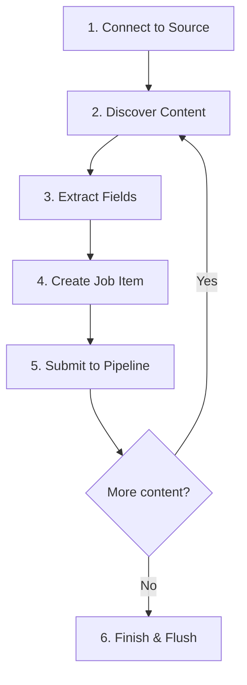

# Connectors Overview

Connectors are the components that extract content from external sources and feed it into the Dumont DEP processing pipeline. Each connector specializes in a specific type of content source and knows how to navigate, extract, and map content into Job Items that the pipeline can process.

---

## Available Connectors

| Connector | Source Type | Deployment | Artifact |
|---|---|---|---|
| [**Web Crawler**](./web-crawler.md) | Websites | **Java Plugin** — loaded via `-Dloader.path` | `web-crawler-plugin.jar` |
| [**AEM**](./aem.md) | Adobe Experience Manager | **Java Plugin** — loaded via `-Dloader.path` | `aem-plugin.jar` |
| [**Database**](./database.md) | JDBC databases | **Standalone Java CLI** — runs independently | `dumont-db-indexer.jar` |
| [**FileSystem**](./filesystem.md) | Local/network directories | **Standalone Java CLI** — runs independently | `dumont-filesystem-indexer.jar` |
| [**WordPress**](./wordpress.md) | WordPress sites | **PHP Plugin** — installed inside WordPress | `viglet-turing-for-wordpress/` |

---

## How Connectors Work

Every connector follows the same lifecycle:



1. **Connect** — Establish a connection to the content source (HTTP, JDBC, file handle, JCR session)
2. **Discover** — Find content to process (follow links, execute query, list files, traverse nodes)
3. **Extract** — Pull field values from each content item (title, text, URL, date, custom fields)
4. **Create** — Build a Job Item with the extracted fields, an action (INDEX/DELETE), and metadata
5. **Submit** — Pass the Job Item into the processing pipeline (strategies → batch → queue)
6. **Finish** — Flush any remaining items in the batch processor and signal completion

---

## Connector Interface

All connectors implement the `DumConnectorPlugin` interface:

| Method | Description |
|---|---|
| `crawl()` | Full extraction — discover and process all content from the source |
| `indexAll(source)` | Re-index all content from a specific source |
| `indexById(source, contentIds)` | Index specific documents by their IDs |
| `getProviderName()` | Returns the connector's identifier (e.g., `web-crawler`, `database`) |

---

<div className="page-break" />

## Connector Plugins vs. Standalone Tools

Dumont DEP connectors are distributed in two forms:

### Connector Plugins (AEM, Web Crawler)

The **AEM** and **Web Crawler** connectors are **plugin JARs** that run inside the `dumont-connector.jar` pipeline. They must be placed in a `libs/` directory and loaded via Spring Boot's `-Dloader.path`:

```bash
# Directory layout
dumont-connector.jar
libs/
  ├── aem-plugin.jar
  └── web-crawler-plugin.jar

# Launch with plugins on the classpath
java -Dloader.path=libs -jar dumont-connector.jar
```

:::warning dumont-connector.jar alone does not crawl
The connector JAR provides only the pipeline infrastructure (queue, strategies, indexing). Without a plugin JAR on the classpath, there is no data source to extract content from. You must add exactly **one** connector plugin via `-Dloader.path`.
:::

:::note One plugin per JVM instance
Only **one connector plugin** can be loaded per JVM instance. To run multiple connectors (e.g., AEM and Web Crawler), start separate `dumont-connector.jar` instances — each with its own plugin and port.
:::

### Standalone CLI Tools (Database, FileSystem)

The **Database** and **FileSystem** connectors are **standalone command-line tools** — separate JARs that run independently and connect to a running Dumont DEP instance via REST API:

```bash
# Database import (standalone JAR)
java -cp dumont-db-indexer.jar com.viglet.dumont.connector.db.DumDbImportTool \
  --server http://localhost:30130 \
  --api-key <API_KEY> \
  --driver org.mariadb.jdbc.Driver \
  --connect "jdbc:mariadb://localhost:3306/products" \
  --query "SELECT id, name, description, price FROM products" \
  --site ProductCatalog \
  --locale en_US

# FileSystem import (standalone JAR)
java -cp dumont-filesystem-indexer.jar com.viglet.dumont.filesystem.DumFSImportTool \
  --source-dir /mnt/shared/documents \
  --server http://localhost:30130 \
  --api-key <API_KEY> \
  --site InternalDocs
```

These tools can be scheduled via cron jobs or CI/CD pipelines.

---

## Managing Connectors via the Turing ES Console

The AEM and Web Crawler connector plugins can be managed through the **Turing ES Admin Console**. To connect a running `dumont-connector.jar` instance to the Turing ES UI:

1. Open the Turing ES Admin Console
2. Navigate to **Enterprise Search → Integration**
3. Click **New** to create a new integration instance
4. Set the **Integration Type** (AEM or Web Crawler)
5. Set the **Endpoint** to the URL of your Dumont DEP connector instance (e.g., `http://localhost:30130`)
6. Enable the integration

Once connected, the Turing ES console provides a graphical interface for:

- Configuring sources, content types, and field mappings
- Triggering full indexing and re-indexing operations
- Monitoring indexing progress in real time
- Viewing indexing statistics and status
- Running double-check consistency validation

For full details on the Integration UI — including monitoring, indexing stats, and double-check — see the [Turing ES Integration documentation](https://docs.viglet.com/turing/integration).

For AEM-specific configuration (sources, content types, author/publish, delta tracking, locales, indexing rules) see [Turing ES AEM Connector documentation](https://docs.viglet.com/turing/integration-aem).

---

## Common Configuration Pattern

Every connector needs at least these pieces of information:

| Setting | Description |
|---|---|
| **Source** | Where to read content (URL, connection string, directory path, AEM endpoint) |
| **Credentials** | Authentication (username/password, API key, or none) |
| **Target SN Site** | The Turing ES Semantic Navigation Site that will receive the content |
| **Locale** | The language/country code for the content (e.g., `en_US`) |
| **Field Mapping** | How source fields map to search index fields |

---

*Next: [Web Crawler](./web-crawler.md)*
