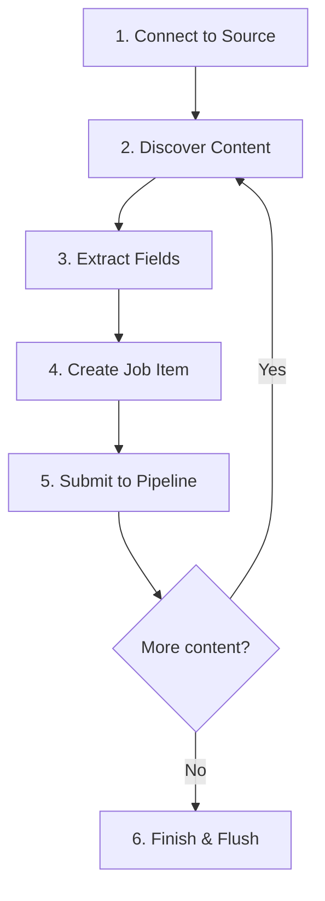

# Connectors Overview

Connectors are the components that extract content from external sources and feed it into the Dumont DEP processing pipeline. Each connector specializes in a specific type of content source and knows how to navigate, extract, and map content into Job Items that the pipeline can process.

---

## Available Connectors

| Connector | Source Type | Extraction Method | Use Case |
|---|---|---|---|
| [**Web Crawler**](./web-crawler.md) | Websites | Recursive HTTP crawling with JSoup HTML parsing | Public websites, intranets, documentation sites |
| [**Database**](./database.md) | JDBC databases | SQL query execution | Product catalogs, user directories, CMS databases |
| [**FileSystem**](./filesystem.md) | Local/network directories | Directory traversal with Apache Tika | File servers, document repositories, shared drives |
| [**AEM**](./aem.md) | Adobe Experience Manager | JCR content repository API | AEM author/publish content, content fragments |
| [**WordPress**](./wordpress.md) | WordPress sites | WordPress REST API | Blogs, news sites, corporate WordPress installations |

---

## How Connectors Work

Every connector follows the same lifecycle:



1. **Connect** — Establish a connection to the content source (HTTP, JDBC, file handle, JCR session)
2. **Discover** — Find content to process (follow links, execute query, list files, traverse nodes)
3. **Extract** — Pull field values from each content item (title, text, URL, date, custom fields)
4. **Create** — Build a Job Item with the extracted fields, an action (INDEX/DELETE), and metadata
5. **Submit** — Pass the Job Item into the processing pipeline (strategies → batch → queue)
6. **Finish** — Flush any remaining items in the batch processor and signal completion

---

## Connector Interface

All connectors implement the `DumConnectorPlugin` interface:

| Method | Description |
|---|---|
| `crawl()` | Full extraction — discover and process all content from the source |
| `indexAll(source)` | Re-index all content from a specific source |
| `indexById(source, contentIds)` | Index specific documents by their IDs |
| `getProviderName()` | Returns the connector's identifier (e.g., `web-crawler`, `database`) |

---

## Standalone vs. Integrated Mode

Some connectors can run in two modes:

### Integrated Mode (default)

The connector runs as a plugin inside the Dumont DEP application. It is triggered via the REST API or the admin console, and content flows through the full pipeline (strategies → batch → queue → indexing plugin).

### Standalone Mode

The **Database** and **FileSystem** connectors also ship as standalone command-line tools (`DumDbImportTool`, `DumFSImportTool`). These can be run independently — for example, from a cron job or a CI/CD pipeline — and connect to a running Dumont DEP instance via its REST API.

```bash
# Standalone database import
java -cp dumont-db.jar com.viglet.dumont.db.DumDbImportTool \
  --server http://localhost:30130 \
  --api-key <API_KEY> \
  --driver org.mariadb.jdbc.Driver \
  --connect "jdbc:mariadb://localhost:3306/products" \
  --query "SELECT id, name, description, price FROM products" \
  --site ProductCatalog \
  --locale en_US
```

---

## Common Configuration Pattern

Every connector needs at least these pieces of information:

| Setting | Description |
|---|---|
| **Source** | Where to read content (URL, connection string, directory path, AEM endpoint) |
| **Credentials** | Authentication (username/password, API key, or none) |
| **Target SN Site** | The Turing ES Semantic Navigation Site that will receive the content |
| **Locale** | The language/country code for the content (e.g., `en_US`) |
| **Field Mapping** | How source fields map to search index fields |

---

*Next: [Web Crawler](./web-crawler.md)*
