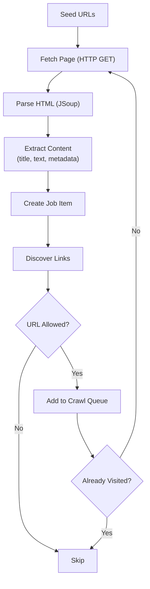

# Web Crawler Connector

The Web Crawler connector recursively discovers and extracts content from websites. Starting from one or more seed URLs, it follows links, extracts page content using JSoup HTML parsing, and delivers each page as a searchable document.

---

## How It Works

1. Start with one or more **seed URLs** (starting points for the crawl)
2. Fetch each page via HTTP GET with a randomized user agent
3. Parse the HTML response with JSoup
4. Extract content fields based on configured **attribute mappings**
5. Create a Job Item and submit it to the pipeline
6. Discover all links on the page
7. Filter links against **allow/deny patterns** and file extension rules
8. Add new, unvisited URLs to the crawl queue
9. Repeat until no more URLs remain

---

## Key Features

| Feature | Description |
|---|---|
| **Recursive crawling** | Follows links from seed URLs to discover all reachable pages |
| **URL filtering** | Allow and deny patterns (regex) control which URLs are crawled |
| **File extension filtering** | Configurable list of file extensions to include or exclude |
| **Authentication** | Basic HTTP authentication for protected sites |
| **Random user agents** | Generates random browser user-agent strings to avoid blocking |
| **Visited URL tracking** | CRC32 checksums prevent re-visiting the same URL in a single crawl |
| **Locale detection** | Extensible interface (`DumWCExtLocaleInterface`) for detecting content language |
| **URL normalization** | Normalizes URLs to avoid duplicate crawling of the same page |
| **Incremental indexing** | Checksum-based change detection — only re-indexes pages that changed |

---

## Configuration

### Source Settings

| Field | Description |
|---|---|
| **Name** | Identifier for this crawl source |
| **Starting URLs** | One or more seed URLs where the crawl begins |
| **Endpoint** | Base URL of the website |
| **Username / Password** | Optional HTTP Basic authentication credentials |

### URL Filtering

| Field | Description |
|---|---|
| **Allow URL Patterns** | Regex patterns — only URLs matching these patterns are crawled |
| **Deny URL Patterns** | Regex patterns — URLs matching these patterns are skipped |
| **Allowed File Extensions** | List of file extensions to include (e.g., `.html`, `.php`, `.aspx`) |

### Attribute Mapping

Define which parts of the HTML page map to which fields in the search index:

| Field | Description |
|---|---|
| **Title** | CSS selector or extraction rule for the page title |
| **Text** | CSS selector for the main content body |
| **URL** | The page URL (extracted automatically) |
| **Date** | CSS selector or meta tag for the publication date |
| **Custom fields** | Additional attribute mappings for any HTML element or meta tag |

---

## Example: Crawling a Documentation Site

Crawl a documentation site starting from the homepage, only following links within the `/docs/` path:

| Setting | Value |
|---|---|
| Starting URL | `https://docs.example.com/` |
| Allow Pattern | `https://docs\.example\.com/docs/.*` |
| Deny Pattern | `.*\.(css\|js\|png\|jpg\|gif\|svg)$` |
| Target SN Site | `Documentation` |
| Locale | `en_US` |

The crawler will:
1. Start at the homepage
2. Follow all links matching `/docs/` paths
3. Skip links to stylesheets, scripts, and images
4. Extract each page's title, body text, and URL
5. Send each page to the `Documentation` SN Site in Turing ES

---

## Locale Detection

The Web Crawler supports automatic locale detection via the `DumWCExtLocaleInterface` extension point. Implement this interface to determine the locale of each page based on:

- URL path patterns (e.g., `/en/`, `/pt-br/`)
- HTML `lang` attribute
- Content-Language HTTP header
- Custom logic specific to your site structure

If no locale extension is configured, the default locale from the source configuration is used for all pages.

---

## Limitations

- The crawler follows **HTML links only** — it does not execute JavaScript. Single-page applications (SPAs) that render content via JavaScript are not supported without a pre-rendering solution.
- **robots.txt** — The crawler does not currently enforce robots.txt directives. Ensure you have permission to crawl the target site.
- **Rate limiting** — There is no built-in rate limiter. For large sites, monitor server load and consider adding delays between requests.

---

## Related Pages

| Page | Description |
|---|---|
| [Connectors Overview](./overview.md) | All available connectors |
| [Core Concepts](../getting-started/core-concepts.md) | Pipeline, strategies, and change detection |
| [Turing ES — Integration](https://docs.viglet.com/turing/integration) | How Turing ES receives content from connectors |

---

*Previous: [Connectors Overview](./overview.md) | Next: [Database Connector](./database.md)*
