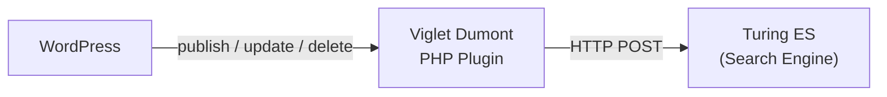

# WordPress Connector

The WordPress Connector is a **PHP plugin installed directly inside WordPress** — not a Java connector plugin. It hooks into WordPress publish, update, and delete events to keep the search index synchronized with your content in real time.

:::note This is a WordPress plugin, not a Java plugin
Unlike the AEM and Web Crawler connectors (which are Java JARs loaded via `-Dloader.path`), the WordPress Connector is a **PHP plugin** that you install in your WordPress `wp-content/plugins/` directory. It communicates directly with Turing ES via HTTP — no `dumont-connector.jar` needed.
:::

---

## How It Works



The plugin integrates with WordPress hooks to automatically push content to the search index:

1. **On publish** — When a post or page is published, the plugin extracts its content and sends it to Turing ES
2. **On update** — When published content is modified, the index is updated automatically
3. **On delete** — When content is trashed or deleted, it is removed from the index
4. **On status change** — When a published post is changed to draft or private, it is removed from the index
5. **Manual bulk indexing** — The admin panel provides buttons to index all posts or all pages in batches of 250

There is no scheduled or cron-based indexing — everything is **event-driven** or manually triggered.

---

## Installation

1. Copy the `viglet-turing-for-wordpress` plugin folder to your WordPress installation:

```
wp-content/plugins/viglet-turing-for-wordpress/
```

2. Activate the plugin in **WordPress Admin → Plugins**

3. Configure the connection in **Settings → Viglet Dumont**

---

## Configuration

### Server Settings

| Field | Default | Description |
|---|---|---|
| **Host** | `localhost` | Turing ES server hostname |
| **Port** | `2700` | Turing ES server port |
| **Path** | `/dumont` | Base path for the indexing endpoint |
| **Site Name** | *(required)* | Semantic Navigation Site name in Turing ES |

### Indexing Options

| Field | Description |
|---|---|
| **Post types** | Which content types to index (posts, pages, custom post types) |
| **Remove on delete** | Automatically remove from index when content is deleted |
| **Remove on status change** | Remove from index when status changes from published to draft/private |
| **Index comments** | Include post comments in the indexed content |
| **Custom fields** | Additional WordPress custom fields to include in the index |
| **Excluded IDs** | Post IDs to exclude from indexing |

### Search Display Options

| Field | Description |
|---|---|
| **Results per page** | Number of search results to display |
| **Show facets** | Enable faceted navigation on the search results page |
| **Facet fields** | Which fields to show as facets (categories, tags, author, type) |
| **Spellcheck** | Enable spelling suggestions for search queries |
| **Max tags** | Maximum number of tags to display in facets |

---

<div className="page-break" />

## Indexed Fields

The plugin extracts and sends these fields to Turing ES:

| Field | Source |
|---|---|
| **id** | WordPress post ID |
| **title** | Post/page title |
| **content** | Full post content |
| **contentnoshortcodes** | Content with WordPress shortcodes removed |
| **permalink** | Canonical URL |
| **author** | Author display name |
| **type** | Content type (post, page, custom) |
| **date** | Publication date |
| **modified** | Last modification date |
| **categories** | Category names (multi-valued) |
| **tags** | Tag names (multi-valued) |
| **numcomments** | Comment count |
| **comments** | Comment text (if comment indexing is enabled) |
| **Custom fields** | Any configured custom fields |

### Multisite Support

The plugin supports WordPress multisite installations. When activated network-wide, it can index content from all blogs in the network, including `blogid`, `blogdomain`, and `blogpath` fields for each document.

---

## Admin Panel Actions

The plugin adds action buttons to the WordPress admin settings page:

| Action | Description |
|---|---|
| **Ping** | Tests the connection to Turing ES |
| **Index all Posts** | Bulk indexes all published posts (batches of 250) |
| **Index all Pages** | Bulk indexes all published pages (batches of 250) |
| **Delete all** | Removes all WordPress content from the Turing ES index |
| **Optimize** | Triggers index optimization on the search engine |

---

## Architecture

The plugin includes its own PHP HTTP client library (`DumontPhpClient`) for communicating with Turing ES:

```
viglet-turing-for-wordpress/
├── viglet-turing-for-wordpress.php    # Main plugin (hooks, indexing, search)
├── viglet-turing-options-page.php     # Admin settings page
├── DumontPhpClient/
│   └── Viglet/Dumont/
│       ├── Service.php                # HTTP client for Turing ES
│       ├── Document.php               # Document model
│       ├── Response.php               # Response parser
│       └── HttpTransport/
│           ├── Curl.php               # cURL transport
│           ├── CurlNoReuse.php        # cURL without connection reuse
│           └── FileGetContents.php    # file_get_contents fallback
└── template/
    ├── turing4wp_search.php           # Search results template
    ├── search.css                     # Search results styling
    └── autocomplete.css               # Autocomplete styling
```

---

*Previous: [AEM Connector](./aem.md) | Next: [Indexing Plugins](../indexing-plugins.md)*
