# Extending the Database Connector

The Database Connector supports a custom extension point that lets you transform, enrich, or filter database rows before they are indexed. Extensions are Java classes that implement the `DumDbExtCustomImpl` interface from the `db-commons` library.

---

## Maven Dependency

```xml
<!-- Source: https://mvnrepository.com/artifact/com.viglet.dumont/db-commons -->
<dependency>
    <groupId>com.viglet.dumont</groupId>
    <artifactId>db-commons</artifactId>
    <version>2026.1.19</version>
    <scope>compile</scope>
</dependency>
```

---

## The DumDbExtCustomImpl Interface

```java
public interface DumDbExtCustomImpl {
    Map<String, Object> run(Connection connection, Map<String, Object> attributes);
}
```

| Parameter | Description |
|---|---|
| `Connection connection` | The active JDBC connection — you can execute additional queries to enrich the row |
| `Map<String, Object> attributes` | Mutable map of column values from the current row (column aliases become keys) |

**Return:** The modified attributes map. The returned map is what gets indexed.

---

## How It Works

For each row in the SQL result set, the connector:

1. Reads all columns into an attributes map (`Map<String, Object>`)
2. Applies value formatting (HTML tag removal, date formatting)
3. **Calls your custom class** via `run(connection, attributes)`
4. Processes multi-valued fields
5. Creates a Job Item and sends it to the pipeline

```mermaid
%%{init: {'theme': 'base', 'themeVariables': {'fontSize': '13px', 'primaryColor': '#fff', 'primaryBorderColor': '#c0c0c0', 'lineColor': '#888', 'textColor': '#333'}}}%%
graph LR
    SQL["🗄️ SQL Query"] --> ROW["📄 Read Row"]
    ROW --> MAP["📋 Map Columns → Attributes"]
    MAP --> CUSTOM["⚙️ Your Custom Class\n(DumDbExtCustomImpl)"]
    CUSTOM --> ITEM["📦 Create Job Item"]
    ITEM --> PIPE["📨 Pipeline"]

    classDef blue fill:#dbeafe,stroke:#4A90D9,stroke-width:2px,color:#1a1a1a
    classDef purple fill:#ede9fe,stroke:#9B6EC5,stroke-width:2px,color:#1a1a1a
    classDef amber fill:#fef3c7,stroke:#E8A838,stroke-width:2px,color:#1a1a1a

    class SQL,ROW blue
    class MAP,CUSTOM purple
    class ITEM,PIPE amber
```



---

## Example: Prefixing Titles

A minimal example that prefixes every title with a label:

```java
package com.example.ext;

import com.viglet.dumont.connector.db.ext.DumDbExtCustomImpl;
import java.sql.Connection;
import java.util.Map;

public class MyDbCustom implements DumDbExtCustomImpl {

    private static final String TITLE = "title";

    @Override
    public Map<String, Object> run(Connection connection,
                                    Map<String, Object> attributes) {
        if (attributes.containsKey(TITLE)) {
            attributes.replace(TITLE,
                String.format("Product: %s", attributes.get(TITLE)));
        }
        return attributes;
    }
}
```

---

## Example: Enriching with a Second Query

Use the JDBC connection to run additional queries and add data:

```java
public class EnrichWithCategory implements DumDbExtCustomImpl {

    @Override
    public Map<String, Object> run(Connection connection,
                                    Map<String, Object> attributes) {
        Object categoryId = attributes.get("category_id");
        if (categoryId != null) {
            try (var stmt = connection.prepareStatement(
                    "SELECT name FROM categories WHERE id = ?")) {
                stmt.setObject(1, categoryId);
                try (var rs = stmt.executeQuery()) {
                    if (rs.next()) {
                        attributes.put("category", rs.getString("name"));
                    }
                }
            } catch (Exception e) {
                // log and continue
            }
        }
        return attributes;
    }
}
```

---

<div className="page-break" />

## Using the Extension

### Via CLI

Pass the fully-qualified class name with the `--class-name` parameter:

```bash
java -cp dumont-db-indexer.jar:my-db-extensions.jar \
  com.viglet.dumont.connector.db.DumDbImportTool \
  --class-name com.example.ext.MyDbCustom \
  --server http://localhost:30130 \
  --api-key <API_KEY> \
  --driver org.mariadb.jdbc.Driver \
  --connect "jdbc:mariadb://localhost:3306/shop" \
  --query "SELECT id, name AS title, price FROM products" \
  --site ProductCatalog \
  --locale en_US
```

:::note Classpath
Your extension JAR must be on the classpath (`-cp`). Add it alongside the `dumont-db-indexer.jar` separated by `:` (Linux) or `;` (Windows).
:::

---

## Creating a Custom DB Extension

### Step 1 — Create a Maven project

```xml
<project>
    <groupId>com.example</groupId>
    <artifactId>my-db-extensions</artifactId>
    <version>1.0.0</version>

    <dependencies>
        <dependency>
            <groupId>com.viglet.dumont</groupId>
            <artifactId>db-commons</artifactId>
            <version>2026.1.19</version>
        </dependency>
    </dependencies>
</project>
```

### Step 2 — Implement the interface

```java
package com.example.ext;

import com.viglet.dumont.connector.db.ext.DumDbExtCustomImpl;
import java.sql.Connection;
import java.util.Map;

public class MyDbCustom implements DumDbExtCustomImpl {
    @Override
    public Map<String, Object> run(Connection connection,
                                    Map<String, Object> attributes) {
        // Transform, enrich, or filter attributes
        return attributes;
    }
}
```

### Step 3 — Build

```bash
mvn clean package
```

### Step 4 — Run with the extension

```bash
java -cp dumont-db-indexer.jar:target/my-db-extensions-1.0.0.jar \
  com.viglet.dumont.connector.db.DumDbImportTool \
  --class-name com.example.ext.MyDbCustom \
  --server http://localhost:30130 \
  --api-key <API_KEY> \
  ...
```

### Requirements

- **Public no-argument constructor**
- **On the classpath** (via `-cp`)
- **Thread-safe** — one instance processes all rows sequentially, but should avoid mutable shared state

---

## Related Pages

| Page | Description |
|---|---|
| [Database Connector](./connectors/database.md) | CLI parameters, SQL examples, supported databases |
| [Extending the AEM Connector](./extending-aem.md) | AEM extension interfaces and configuration JSON |
| [Developer Guide](./developer-guide.md) | Project structure, build, and contribution guide |

---

