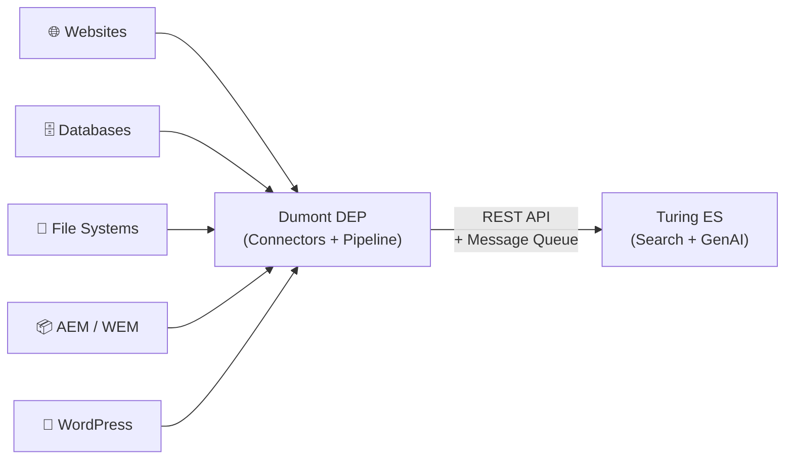

import Link from '@docusaurus/Link';

# What is Dumont DEP?

**Viglet Dumont DEP** is an open-source data extraction platform. It connects your content — wherever it lives — to [Viglet Turing ES](https://docs.viglet.com/turing) for indexing and search.

Think of Dumont DEP as the bridge between your content sources and the search engine. It crawls websites, queries databases, scans file systems, reads AEM repositories, and pulls from WordPress — then delivers every document to Turing ES through a reliable, asynchronous pipeline.

  <Link
    className="button button--primary button--lg"
    to="/dumont-dep-2026.1-documentation.pdf"
    target="_blank"
    style={{marginRight: '0.75rem'}}>
    Download PDF Documentation
  </Link>
  <Link
    className="button button--outline button--lg"
    to="https://github.com/openviglet/dumont">
    GitHub
  </Link>

---

## What can you do with Dumont DEP?

### Crawl websites

Point the **Web Crawler** at a starting URL and let it discover and extract content from your entire site — pages, articles, documentation. It handles authentication, URL filtering, locale detection, and incremental updates.

### Index databases

The **Database Connector** runs any SQL query against Oracle, PostgreSQL, MariaDB, MySQL, or any JDBC-compatible database and turns each row into a searchable document. Complex joins, custom transformations, and batch processing are all supported.

### Scan file systems

The **FileSystem Connector** walks a directory tree, extracts text from PDFs, Word documents, spreadsheets, presentations, and images (via OCR), and indexes everything with full metadata — file size, extension, modification date.

### Connect to AEM

The **AEM Connector** indexes content from Adobe Experience Manager author and publish instances — supporting content fragments, delta tracking, locale mapping, and custom extension points for your specific AEM setup.

### Integrate with WordPress

The **WordPress Connector** indexes posts, pages, and custom content types from WordPress installations directly into Turing ES.

### Send to any search engine

Beyond Turing ES, Dumont DEP can deliver content directly to **Apache Solr** or **Elasticsearch** via pluggable indexing adapters — no Turing ES required.

---

## How it works at a glance

Content flows from its original source through Dumont DEP connectors, into an internal message queue for reliable processing, and out to the search engine — where it becomes immediately searchable.

---

## Key concepts

These are the main building blocks you will work with in Dumont DEP. You do not need to understand all of them before getting started — come back to each one as you need it.

| Concept | What it is | Learn more |
|---|---|---|
| **Connector** | A component that extracts content from a specific source type (web, database, files, AEM, WordPress) | [Connectors](../connectors/overview.md) |
| **Indexing Plugin** | The output adapter that delivers documents to a search engine — Turing ES (default), Apache Solr, or Elasticsearch | [Indexing Plugins](../indexing-plugins.md) |
| **Job Item** | A single document being processed through the pipeline — with fields, metadata, and an action (index, de-index, update) | [Core Concepts](./core-concepts.md) |
| **Batch Processor** | Groups individual job items into configurable batches (default: 50) for efficient queue delivery | [Core Concepts](./core-concepts.md) |
| **Message Queue** | Apache Artemis (embedded) — decouples connector extraction from indexing delivery for reliability and throughput | [Architecture](../architecture.md) |
| **Processing Strategy** | Priority-based rules that determine how each document is handled — index, re-index, de-index, ignore, or skip unchanged | [Core Concepts](./core-concepts.md) |
| **Indexing Rules** | Regex-based filters that skip documents matching specific attribute patterns before they reach the queue | [Core Concepts](./core-concepts.md) |

---

## Where to go next

Not sure where to start? Here is a suggested path depending on what you want to do:

**I want to understand how Dumont DEP works**
→ Read [Core Concepts](./core-concepts.md) first, then [Architecture](../architecture.md).

**I want to install Dumont DEP**
→ Go to the [Installation Guide](../installation-guide.md).

**I want to crawl a website**
→ Go to [Web Crawler Connector](../connectors/web-crawler.md).

**I want to index a database**
→ Go to [Database Connector](../connectors/database.md).

**I want to index files from a directory**
→ Go to [FileSystem Connector](../connectors/filesystem.md).

**I want to connect AEM to Turing ES**
→ Go to [AEM Connector](../connectors/aem.md).

**I want to index WordPress content**
→ Go to [WordPress Connector](../connectors/wordpress.md).

**I want to send content to Solr or Elasticsearch directly**
→ Go to [Indexing Plugins](../indexing-plugins.md).

**I want to contribute or build from source**
→ Go to the [Developer Guide](../developer-guide.md).

---

*Next: [Core Concepts](./core-concepts.md)*
