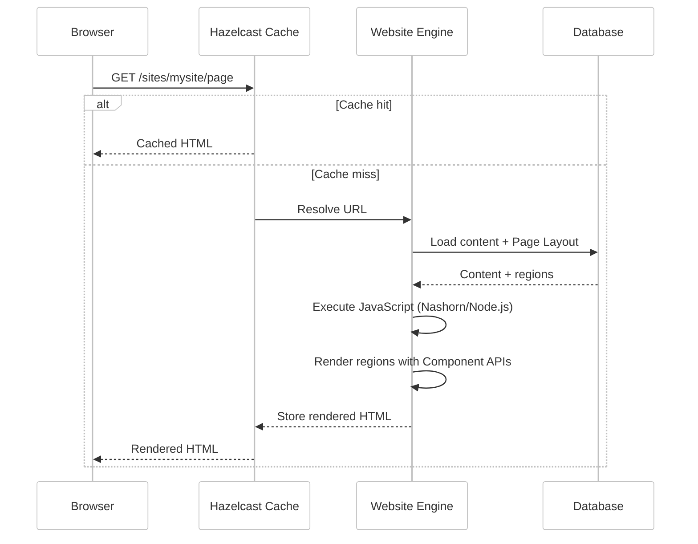
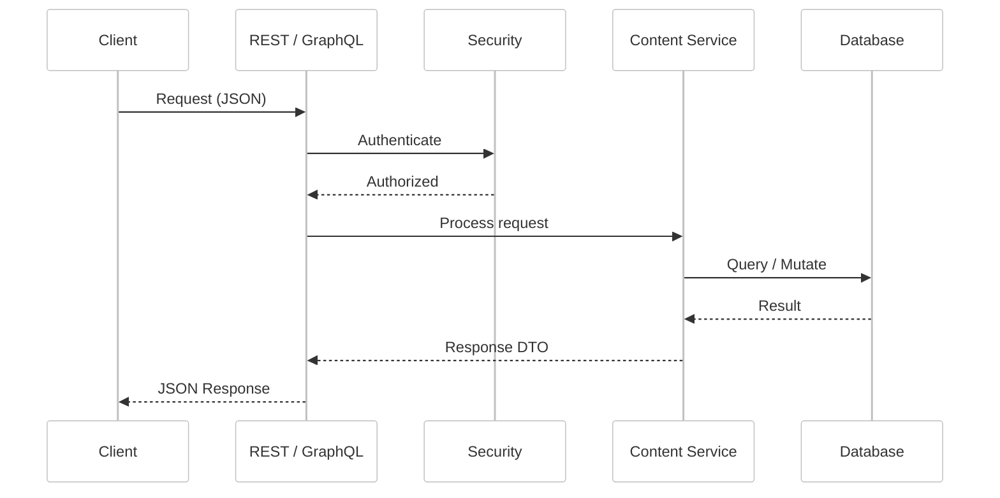

# Shio CMS — Architecture Overview

## Introduction

Viglet Shio CMS is an open-source headless Content Management System built on **Java 21** and **Spring Boot 4**. It allows organizations to model content with custom Post Types, render websites using server-side JavaScript, and expose content via REST and GraphQL APIs.

The system provides a modern **React** admin console, a **Hazelcast** distributed cache for website rendering, and integration with **Viglet Turing ES** for advanced search capabilities.

This document describes the system's components, internal modules, and the core data flows.

---

## High-Level Component Diagram

```mermaid
%%{init: {'theme': 'base', 'themeVariables': {'fontSize': '13px', 'primaryColor': '#fff', 'primaryBorderColor': '#c0c0c0', 'lineColor': '#888', 'textColor': '#333'}}}%%
graph TD
    subgraph Clients [" 💻 Clients "]
        CL1["🌐 Web Browser"]
        CL2["📱 Mobile / SPA"]
        CL3["🔌 External Apps"]
    end

    subgraph API [" 🌐 API Layer "]
        REST["📡 REST API\n/api/v2/*"]
        GQL["📊 GraphQL API\nGraphiQL Console"]
        ADMIN["🛠️ Admin Console\nReact + TypeScript"]
        SITE["🌍 Website Rendering\nNashorn / Node.js"]
    end

    subgraph Core [" ⚙️ Core Modules "]
        CM["📋 Content Management\nPosts · Folders · Sites\nPost Types · Workflows"]
        WEB["🎨 Website Engine\nPage Layouts · Regions\nComponent APIs · Cache"]
        SEARCH["🔍 Search Integration\nTuring ES · Elasticsearch"]
        EXCH["📦 Exchange\nImport · Export\nProvider Plugins"]
    end

    subgraph Storage [" 💾 Backends "]
        DB["🗄️ Database\nH2 (dev) · MariaDB\nMySQL · PostgreSQL · Oracle"]
        HZ["⚡ Hazelcast\nDistributed Cache"]
        FS["📁 File Storage\nStatic Files"]
    end

    Clients --> API
    API --> Core
    Core --> Storage

    classDef blue fill:#dbeafe,stroke:#4A90D9,stroke-width:2px,color:#1a1a1a
    classDef purple fill:#ede9fe,stroke:#9B6EC5,stroke-width:2px,color:#1a1a1a
    classDef green fill:#dcfce7,stroke:#50B86C,stroke-width:2px,color:#1a1a1a
    classDef amber fill:#fef3c7,stroke:#E8A838,stroke-width:2px,color:#1a1a1a

    class CL1,CL2,CL3 amber
    class REST,GQL,ADMIN,SITE blue
    class CM,WEB,SEARCH,EXCH purple
    class DB,HZ,FS green

    style Clients fill:#E8A83820,stroke:#E8A838,stroke-width:2px,color:#1a1a1a,font-weight:700
    style API fill:#4A90D920,stroke:#4A90D9,stroke-width:2px,color:#1a1a1a,font-weight:700
    style Core fill:#9B6EC520,stroke:#9B6EC5,stroke-width:2px,color:#1a1a1a,font-weight:700
    style Storage fill:#50B86C20,stroke:#50B86C,stroke-width:2px,color:#1a1a1a,font-weight:700
```



---

### API Layer

| Component | Description |
|---|---|
| **REST API** | Controllers for posts, folders, sites, post types, users, groups, search, widgets, workflows, and file management (`/api/v2/*`) |
| **GraphQL API** | Content query interface with built-in GraphiQL console |
| **Admin Console** | React + TypeScript + Radix UI + TailwindCSS admin interface for content management |
| **Website Rendering** | Server-side JavaScript engine (Nashorn/Node.js) renders Page Layouts and Regions into HTML |

---

### Core Modules

| Module | Package | Responsibility |
|---|---|---|
| **Content Management** | `api`, `persistence` | CRUD for Posts, Folders, Sites, Post Types; publishing workflow; change history; references |
| **Website Engine** | `website` | Page Layout rendering, Region evaluation, component API execution, Hazelcast cache integration |
| **Search Integration** | `turing` | Automatic content indexing, Turing ES REST API integration, search field mapping |
| **Exchange** | `exchange`, `provider` | Import/export of sites, folders, and posts; provider plugins for Blogger, OTCS, OTMM |
| **Security** | `spring/security` | User, role, and group management; Spring Security integration; CSRF protection |
| **Webhook** | `webhook` | Incoming webhook handling for external integrations |

---

### Backends & Storage

| Backend | Purpose | Notes |
|---|---|---|
| **Database** | Content, metadata, configuration, users | H2 for dev; MariaDB/MySQL recommended for production |
| **Hazelcast** | Distributed page and object cache | TTL-based expiration (24h default); automatic invalidation on content change |
| **File Storage** | Static files and uploads | Local filesystem with configurable paths; max upload 1 GB |

---

<div className="page-break" />

## Website Rendering Flow

When a visitor requests a page, the website engine resolves the URL to a content object, loads the associated Page Layout, evaluates each Region with its Component APIs, and assembles the final HTML. Hazelcast caches the rendered output for subsequent requests.



---

## Content API Flow

External applications access content through the REST API or GraphQL endpoint. Both require authentication (except public site endpoints).



---

<div className="page-break" />

## Technology Stack

| Layer | Technology | Notes |
|---|---|---|
| **Runtime** | Java 21 | Minimum supported version |
| **Framework** | Spring Boot 4.0.4 | Application container with auto-configuration |
| **Database** | H2 / MariaDB / MySQL / PostgreSQL / Oracle | H2 for development; MariaDB/MySQL recommended for production |
| **Cache** | Hazelcast | Distributed cache for website rendering |
| **Search** | Elasticsearch 9.3.3 via Viglet Turing SDK | Full-text search integration |
| **JavaScript Engine** | Nashorn / Node.js | Server-side rendering of Page Layouts and Regions |
| **Frontend** | React 19 + TypeScript + Radix UI + TailwindCSS + Vite | Admin console (`shio-react`) |
| **Build** | Maven (backend) + npm (frontend) | Multi-module project |
| **CI/CD** | GitHub Actions | Automated builds and code quality |
| **Containerization** | Docker / Docker Compose | Available in project root and `containers/` directory |
| **Orchestration** | Kubernetes | Manifests available in `k8s/` directory |
| **API Protocols** | REST + GraphQL | GraphiQL console available in development mode |

---

## Deployment Topologies

### Development

Minimal setup for local development and evaluation.

```
Shio CMS (H2 embedded)
```

Shio CMS starts with an embedded H2 database. No external services are needed. Not suitable for production.

---

### Simple Production

Recommended baseline for production environments.

```
Shio CMS + MariaDB / MySQL
```

MariaDB or MySQL provides durable persistence for content, users, and configuration. Hazelcast runs embedded within Shio CMS.

---

### Docker Compose

Complete environment with all dependencies.

```
Nginx (reverse proxy, ports 80/443)
    └── Shio CMS (port 2710)
    └── MariaDB (port 3306)
```

All services are defined in the project's `docker-compose.yaml`. Volume mounts provide persistent storage for the database and Shio CMS store directory.

---

### Kubernetes

For cloud deployments requiring horizontal scaling.

```
Nginx (reverse proxy)
    └── Shio CMS (1..N replicas)
MariaDB
```

Kubernetes manifests are available in the `k8s/` directory.

---

## Related Pages

| Page | Description |
|---|---|
| [Installation Guide](./installation-guide.md) | Setup with Docker, JAR, or build from source |
| [Configuration Reference](./configuration-reference.md) | All application.properties settings |
| [Developer Guide](./developer-guide.md) | Tech stack, dev environment, and contribution guide |
| [Website Development](./website-development.md) | Page Layouts, Regions, and JavaScript API |

---
