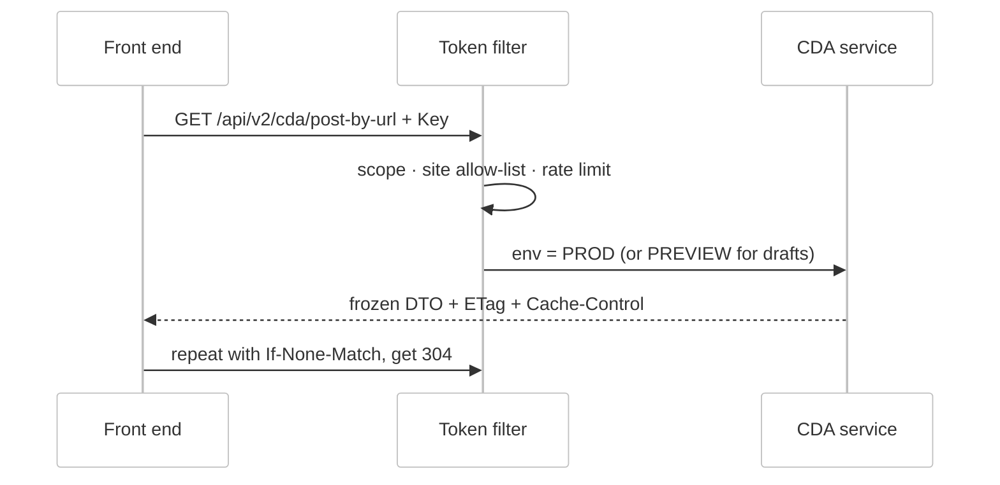

# Architecture Overview

## Introduction

Viglet Shio is a single **Spring Boot 4 / Java 21** application over a relational
database. It holds one content model and exposes it through four surfaces: an agent
protocol, a console API, a delivery API, and a page renderer, and every one of those is a
*shape* over the same services rather than its own contract.

That constraint is the architecture's main idea. There is no separate agent backend, no
second serialization, no third way to write a post. Adding a capability means adding it
once, in the service, and projecting it where callers need it.

Nothing calls out to a hosted service: Shio holds **no model and no prompts**, and the
content, the files and the keys stay on your infrastructure.

---

## Component diagram

Two edges in that picture are the ones worth reading twice:

- **MCP delegates to the agent surface, which delegates to the same write services the
  console uses.** An agent is not a privileged path into the data; it is a different
  spelling of the same operations, with its own guards on top.
- **Turing indexing is a dotted line.** It is an opt-in integration reached on publish, not
  a component the system needs to run.

---

## The surfaces

| Surface | Path | Auth | For |
|---|---|---|---|
| **MCP** | `POST /mcp` | API key (`AGENT` scope) | An agent's client: 12 tools, 6 resources, 4 prompts |
| **Agent REST** | `/api/v2/agent/**` | API key (`AGENT` scope), stateless | Discovery, addressed reads, atomic writes, verification |
| **Console API** | `/api/v2/**` | Session + CSRF | The React console |
| **Delivery (CDA)** | `/api/v2/cda/**`, `/graphql` | API key (read / preview / write scope) | Your own front end |
| **Renderer** | `/preview/**`, `/sites/**` | authenticated / anonymous | Pages Shio serves itself |

## Core modules

| Module | Owns |
|---|---|
| **Content** | The unified post model, folders, sites, post types, the trash, versions |
| **Agent** | The manifest, context pack, address resolution, the op vocabulary, plan/apply, memory, diagnostics |
| **Verify** | The content lint, route proof, structural and appearance digests |
| **Render** | Template composition, the helper set, themes and tokens, link rewriting |
| **Static files** | Uploads, the image transform pipeline, byte delivery by id and by site path |
| **Exchange** | Site export/import packages, tenant provisioning |
| **Security** | API-token scopes, session auth, tenant resolution, CSRF and CORS |

## Persistence

| Concern | How |
|---|---|
| **Schema** | **Liquibase owns it.** `ddl-auto` is `none`; an upgrade is a restart, not a hand-written `ALTER` |
| **Databases** | PostgreSQL, MariaDB/MySQL, or embedded H2 for development |
| **Content model** | One unified post row per state (`DRAFT`, `PUBLISHED`), over a JOINED inheritance hierarchy whose root carries the tenant discriminator |
| **Multi-tenancy** | A discriminator column on the shared schema, applied by a Hibernate filter: see [Multi-Tenancy](./multi-tenancy.md) |
| **File bytes** | Under `store/`, addressed by post id and, for a site's own assets, by folder path |

---

## The flows

### The agent loop: discover, plan, write, verify

The plan step writes nothing, and the write step carries its own proof (`?verify&digest`),
so a task that would be a dozen round trips is three or four calls.

### A curator's correction

Every arrow into `PUBLISHED` passes through a person. See
[Letting an agent in](./agent-safety.md).

### A delivery read

```mermaid
%%{init: {'theme': 'base', 'themeVariables': {'fontSize': '13px', 'primaryColor': '#fff', 'primaryBorderColor': '#c0c0c0', 'lineColor': '#888', 'textColor': '#333'}}}%%
sequenceDiagram
    participant F as Front end
    participant K as Token filter
    participant S as CDA service
    F->>K: GET /api/v2/cda/post-by-url + Key
    K->>K: scope · site allow-list · rate limit
    K->>S: env = PROD (or PREVIEW for drafts)
    S-->>F: frozen DTO + ETag + Cache-Control
    F->>K: repeat with If-None-Match, get 304
```

### The content-as-files round trip

### The render pipeline

### A replicated site being served

---

## Technology stack

| Layer | Technology | Notes |
|---|---|---|
| **Runtime** | Java 21 | Minimum supported version |
| **Framework** | Spring Boot 4 | Application container, security, MVC, GraphQL |
| **Database** | PostgreSQL · MariaDB/MySQL · H2 | H2 for development; the schema is DB-agnostic and Liquibase-managed |
| **Schema** | Liquibase | `ddl-auto=none`; migrations are the source of truth |
| **Template engine** | Handlebars.java | No script engine on the classpath |
| **Search** | In-database full text; **optional** Viglet Turing ES client | Turing is off by default (`shio.turing.enabled=false`) |
| **Cache** | Hazelcast (embedded), HTTP `ETag` / `Cache-Control`, per-transaction render caches | |
| **File extraction** | Apache Tika | Text extraction from uploads |
| **Console** | React 19 + TypeScript + Radix UI + Tailwind + Vite | Built into the JAR |
| **Packages** | `@viglet/shio-client`, `@viglet/shio-react-sdk`, `@viglet/shio`, `@viglet/shio-model`, `@viglet/shio-sections`, `@viglet/shio-editor-cors` | pnpm workspace |
| **Ops** | Actuator, OpenAPI, Docker / Compose | |

:::info Not dependencies
Two things earlier documentation listed as part of the stack are **not**: there is no
server-side JavaScript engine (the Nashorn artifact is explicitly excluded from the build),
and **Elasticsearch is not a dependency**: search runs in your database, and Turing ES is
an optional client you enable if you want faceted enterprise search.
:::

---

## Deployment topologies

### Development

One process, embedded H2, `store/` on local disk. `npx @viglet/shio` and an agent client
against `http://localhost:2710`. The console is served by the same JAR; run Vite
separately only if you are changing the console itself.

### Single node

Shio + PostgreSQL (or MariaDB/MySQL). This is the shape most installations want:

- **What must be co-located with the process:** `store/`: the file bytes and logs. Put it
  on a volume that survives a redeploy.
- **What must not be:** the database. The schema is migrated at startup, so a rolling
  restart is a migration.
- **What is optional:** a reverse proxy for TLS, and a CDN in front of `/sites/**` (five
  minutes of cacheability, so a purge hook is worth wiring if you publish often).

### Containers

`docker compose` with Shio, a database, and a volume for `store/`. Turing ES is a separate
compose service only if you enabled indexing.

### Multiple nodes

Shio runs multi-node, with two things to know before you scale out: the CDA's rate limiter
is **per JVM**, so a per-token budget is multiplied by your node count; and the change feed
is commit-ordered per node, so a consumer walking it across a cluster is told when it has
met a write the node it asked did not stamp.

---

## Related Pages

| Page | Description |
|---|---|
| [Core Concepts](./getting-started/core-concepts.md) | The vocabulary this diagram uses |
| [The Agent Surface](./agent-surface.md) | The protocol the agent edge speaks |
| [Pages, Layouts & Regions](./website-development.md) | The renderer, in full |
| [Multi-Tenancy](./multi-tenancy.md) | One JVM, many isolated tenants |
| [Installation Guide](./installation-guide.md) | Getting the topologies above running |
