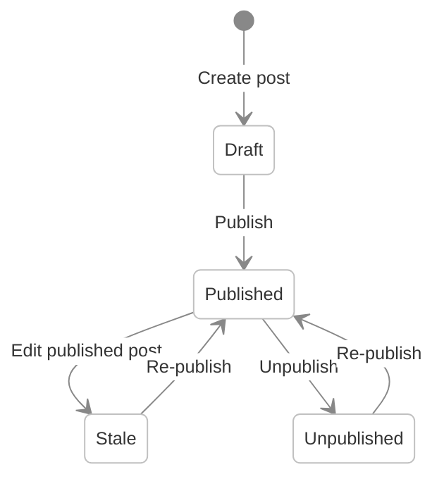

# Content Modeling

Content modeling in Shio CMS revolves around **Post Types** — reusable templates that define the structure of content items. This guide covers how to create and configure Post Types, the available field types, the publishing workflow, and content relationships.

---

## Post Types

A **Post Type** defines:

- **Name** — human-readable label
- **Description** — purpose of the content type
- **Identifier** — unique system key
- **Publishing responsibility** — who can approve and publish

### System Post Types

Shio CMS ships with built-in Post Types for common content patterns:

| Post Type | Purpose |
|---|---|
| **Text** | General-purpose text content |
| **Photo** | Image content with metadata |
| **Video** | Video content |
| **Quote** | Quoted text |
| **Link** | External URL reference |
| **File** | Downloadable file |
| **Region** | Reusable page section |
| **Theme** | Site theme definition |
| **Page Layout** | Page template |
| **Alias** | URL redirect to another object |
| **Folder Index** | Default content for a folder |

### Custom Post Types

You can create **custom Post Types** with any combination of fields. To create a new Post Type:

1. Navigate to **Administration > Post Types** in the admin console
2. Click **New Post Type**
3. Define the Name, Description, and Identifier
4. Add fields (see [Field Types](#field-types) below)
5. Configure publishing responsibility

---

## Field Types

Fields are the building blocks of Post Types. Each field has a **name**, **description**, **identifier**, and **type**. You can configure whether a field serves as the **title** and/or **description** of the Post Type.

| Field Type | Description |
|---|---|
| **Text** | Single-line text input |
| **Text Area** | Multi-line plain text |
| **HTML Editor** | Rich text editor with formatting |
| **Ace Editor (HTML)** | Code editor with HTML syntax highlighting |
| **Ace Editor (Javascript)** | Code editor with JavaScript syntax highlighting |
| **Content Select** | Reference to another content item |
| **Relator** | Relationship to one or more content items |
| **Combo Box** | Dropdown selection |
| **Multi Select** | Multi-value selection |
| **Check Box** | Boolean checkbox |
| **Date** | Date picker |
| **Hidden** | Hidden field (not shown in editor) |
| **Tab** | Visual tab separator for organizing fields |
| **Recaptcha** | CAPTCHA verification field |
| **Form Configuration** | Form submission settings |

### Field Configuration

For each field you can:

- **Order** fields within the Post Type
- **Set as Title** — marks the field as the Post Type's title
- **Set as Description** — marks the field as the Post Type's description
- **Configure search mapping** — define how the field is indexed in Viglet Turing ES

---

## Publishing Workflow

Every post follows a lifecycle from creation to publication:



| Status | Visible on site? | Description |
|---|---|---|
| **Draft** | No | Newly created, only visible in management view |
| **Published** | Yes | Live on the published site |
| **Stale** | Yes (old version) | Published but modified — re-publish to update |
| **Unpublished** | No | Removed from published site, still in repository |

### Workflow Tasks

Shio CMS supports **workflow tasks** for content approval. Administrators can configure workflows that require approval before content is published.

---

## Content Relationships

### References

Posts can reference other posts using **Content Select** and **Relator** fields. References create navigable relationships between content items.

- **Content Select** — references a single content item
- **Relator** — references one or more content items with ordering

### Folder Hierarchy

Content is organized in a hierarchical folder structure within each site. Folders can be nested to create a tree. Posts live inside folders.

```
Site
├── Home (Folder)
│   ├── About (Post)
│   └── Contact (Post)
├── Blog (Folder)
│   ├── Post 1
│   └── Post 2
└── Products (Folder)
    ├── Category A (Folder)
    │   ├── Product 1
    │   └── Product 2
    └── Category B (Folder)
```

### Content Ordering

Posts within a folder can be **reordered** via drag-and-drop in the admin console. The order is reflected immediately on the published site pages.

---

## Search Navigation Integration

Post Type fields can be mapped to **Viglet Turing ES** Semantic Navigation fields for precise search indexing:

- **Search Field Association** — map a field to a default Turing SN field (title, description, text, date, URL, image)
- **Create Additional Search Field** — map a field to a custom Turing SN field

This allows you to control exactly what content is searchable and how it appears in search results. See [Search & Caching](./search-caching.md) for details.

---

## Spreadsheet Export

You can generate a **spreadsheet** of a folder's contents. Each Post Type in the folder becomes a separate sheet, with columns for each field. This is useful for bulk content review and reporting.

---

## Related Pages

| Page | Description |
|---|---|
| [Core Concepts](./getting-started/core-concepts.md) | Sites, Folders, Posts, and Page Layouts |
| [Website Development](./website-development.md) | Page Layouts, Regions, and JavaScript API |
| [Search & Caching](./search-caching.md) | Turing ES integration and Hazelcast cache |
| [REST API](./rest-api.md) | Post, Post Type, and folder API endpoints |

---
