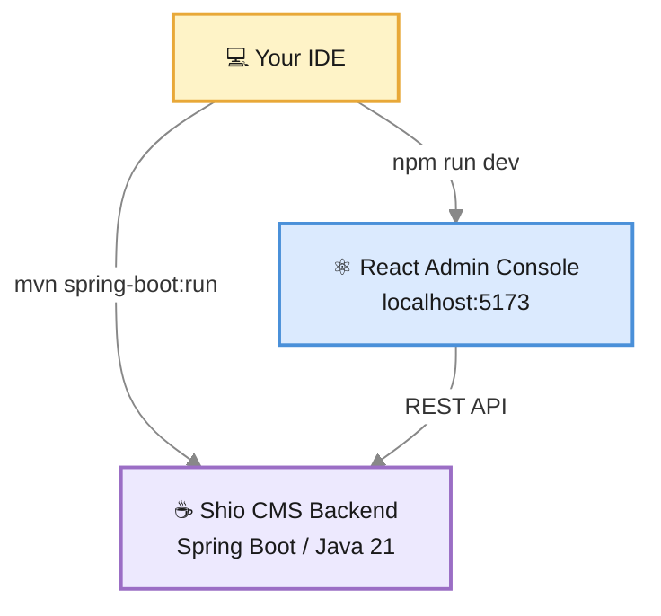

# Developer Guide

Whether you're **building a website** on top of Shio CMS or **contributing to the project itself**, this guide has everything you need to get up and running.

Shio CMS is a fully open-source headless CMS with JavaScript-based website rendering, GraphQL, and native caching. The source code lives at [github.com/openviglet/shio](https://github.com/openviglet/shio) and all contributions are welcome.

---

## Tech Stack

| Layer | Technology |
|---|---|
| **Backend** | Java 21 · Spring Boot 4.0.4 |
| **Database** | H2 (dev) · MariaDB / MySQL (prod) · PostgreSQL · Oracle |
| **Cache** | Hazelcast |
| **Search** | Elasticsearch 9.3.3 via Viglet Turing SDK |
| **JavaScript Engine** | Nashorn · Node.js |
| **Frontend** | React 19 · TypeScript · Radix UI · TailwindCSS · Vite |
| **Build** | Maven (backend) · npm (frontend) |
| **CI/CD** | GitHub Actions |



---

## Setting Up Your Dev Environment

### Prerequisites

Before you begin, make sure you have these installed:

- [Java 21](https://adoptium.net/temurin/releases/?package=jdk&version=21) (Temurin recommended)
- [Maven 3.9+](https://maven.apache.org/download.cgi)
- [Node.js 20+](https://nodejs.org/en/download/) and npm
- [Git](https://git-scm.com/downloads)

### Clone the Repository

```shell
git clone https://github.com/openviglet/shio.git
cd shio
```

---

## Running Shio CMS

### Backend (Spring Boot)

Run the full backend including the bundled React console:

```shell
cd shio
mvn spring-boot:run -pl shio-app
```

The backend starts at **`http://localhost:2710`**.

### Frontend — React Admin Console

For active frontend development, run the React dev server separately:

```shell
cd shio/shio-react
npm install
npm run dev
```

The Vite dev server starts at **`http://localhost:5173`** with hot-reload enabled.

### Production Build

```shell
cd shio
mvn clean package -pl shio-app
```

The resulting JAR in `shio-app/target/` bundles both the backend and the compiled React assets.

---

## Development URLs

| Service | URL | Notes |
|---|---|---|
| Admin Console | `http://localhost:2710` | Backend-served |
| React Dev Server | `http://localhost:5173` | Vite hot-reload |
| Sample Site | `http://localhost:2710/sites/viglet/default/en-us` | Default sample site |
| GraphiQL Console | `http://localhost:2710/graphiql` | Interactive GraphQL |

:::info Default credentials
On first startup the default login/password are: **admin/admin**.
:::

---

## Project Structure

```
shio/
├── shio-app/           # Main Spring Boot application
│   └── src/main/java/com/viglet/shio/
│       ├── api/        # REST API controllers
│       ├── persistence/ # JPA entities and repositories
│       ├── website/    # Website rendering engine
│       ├── exchange/   # Import/export
│       ├── provider/   # Auth and exchange providers
│       ├── graphql/    # GraphQL support
│       ├── turing/     # Turing ES integration
│       ├── spring/     # Spring Security config
│       └── onstartup/  # Initialization
├── shio-react/         # React admin console
├── k8s/                # Kubernetes manifests
├── containers/         # Docker configurations
├── docker-compose.yaml
├── Dockerfile
└── pom.xml
```

---

<div className="page-break" />

## Deploy Table

| Directory | Deployed File | Provided By |
|---|---|---|
| `<SHIO_DIR>/` | viglet-shio.jar | Shio CMS build |
| `<SHIO_DIR>/` | viglet-shio.properties | You (optional) |

### viglet-shio.jar

The application JAR is produced by the Maven build and contains the backend, frontend assets, and all dependencies.

### viglet-shio.properties

Optional external properties file for database configuration and other overrides. See [Configuration Reference](./configuration-reference.md) for all available properties.

:::note Spring Boot 4
Starting with Spring Boot 4, JAR files are no longer directly executable (`./viglet-shio.jar`). You must launch Shio CMS using `java -jar` explicitly. The `.conf` file pattern used in older versions is no longer supported — use `--spring.config.additional-location` to load external properties instead.
:::

---

## REST API

Shio CMS exposes a REST API for all content and administration operations. All endpoints use **JSON** and require authentication (except public site endpoints).

The API base path is `/api/v2`. For the full endpoint reference, see **[REST API Reference](./rest-api.md)**.

---

## Code Quality

| Tool | Link |
|---|---|
| SonarCloud | [sonarcloud.io/organizations/viglet](https://sonarcloud.io/organizations/viglet/projects) |
| GitHub Actions | [openviglet/shio/actions](https://github.com/openviglet/shio/actions) |

---

## Contributing

We'd love your help making Shio CMS better. Here's how to get involved:

1. **Fork** the [openviglet/shio](https://github.com/openviglet/shio) repository.
2. **Create a branch** for your feature or fix: `git checkout -b feature/my-improvement`
3. **Commit your changes** with clear, descriptive messages.
4. **Open a Pull Request** — describe what you changed and why.

For larger contributions, open an issue first to discuss the approach before writing code.

:::tip
Check the open [GitHub Issues](https://github.com/openviglet/shio/issues) for good first issues tagged with `good first issue` or `help wanted`.
:::

---
