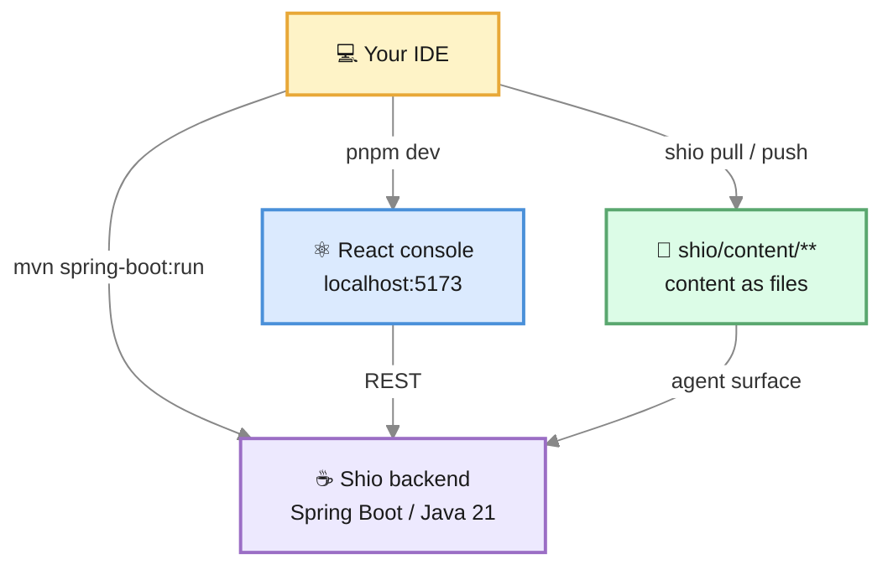

# Developer Guide

Whether you are **building against Shio** or **contributing to it**, start here.

Shio is an open-source, **agent-native** CMS. A coding agent builds and maintains the
site; a curator approves what it produced; a headless delivery layer serves it. That order
is the product, not a description of it — every capability lands on an agent-drivable
surface first, and a feature reachable only from the console is considered incomplete.

The source lives at [github.com/openviglet/shio](https://github.com/openviglet/shio) and
contributions are welcome.

---

## The six surfaces

Before the stack, the shape. Every capability is exposed on a surface an agent can
drive:

| Surface | What it is |
|---|---|
| **MCP server** (`POST /mcp`) | Model Context Protocol tools — `shio_context`, `shio_find`, `shio_read`, `shio_write`, `shio_apply`, `shio_publish`, `shio_assets`, `shio_changes`, `shio_verify`, `shio_digest`, `shio_remember`. See [MCP](./mcp.md). |
| **Agent gateway** (`/api/v2/agent/**`) | A manifest, a context pack, planned batches, teaching errors, a review queue, diagnostics. See [The agent surface](./agent-surface.md). |
| **Content as files** (`shio/content/**`) | The whole site projected to front-mattered Markdown on disk, with a three-way merge back. See [Content as files](./content-as-files.md). |
| **CLI** (`@viglet/shio`) | `pull`, `push`, `apply`, `publish`, `verify`, `clone`, `convert`, `types`, `dev`, `deploy`, and more. See [The `shio` CLI](./cli.md). |
| **Content Delivery API** (`/api/v2/cda/**`) | Stable REST + GraphQL reads, token-scoped, with TypeScript SDKs. See [Content Delivery API](./headless/content-delivery-api.md). |
| **React console** | The curator's half: content browser, form widgets, Universal Editor, review queue, preview links. See [The content console](./content-console.md). |

If you are adding a feature, the order to land it in is **MCP → files/CLI → REST →
console**.

---

## Tech Stack

| Layer | Technology |
|---|---|
| **Backend** | Java 21 · Spring Boot 4.1.0 |
| **Database** | H2 (dev) · PostgreSQL · MariaDB / MySQL · Oracle — schema owned by Liquibase |
| **Cache** | Hazelcast |
| **Search** | In the database by default. Viglet Turing indexing is **optional and off by default** — see [Search & Caching](./search-caching.md). |
| **Template Engine** | Handlebars.java (no server-side script engine) |
| **Frontend** | React 19 · TypeScript · Radix UI · TailwindCSS · Vite |
| **CLI / SDKs** | Node · TypeScript, a pnpm workspace |
| **Build** | Maven (backend) · pnpm (JS workspace) |
| **CI/CD** | GitHub Actions |

:::note
The versions in that table are **checked against this repository's own build files** by
`cli/conformance/docs-stack.conformance.mjs`. A version that drifts fails a Shio build
rather than misleading a reader here.
:::


```mermaid
%%{init: {'theme': 'base', 'themeVariables': {'fontSize': '13px', 'primaryColor': '#fff', 'primaryBorderColor': '#c0c0c0', 'lineColor': '#888', 'textColor': '#333'}}}%%
graph TD
    A["💻 Your IDE"] -->|"mvn spring-boot:run"| B["☕ Shio backend\nSpring Boot / Java 21"]
    A -->|"pnpm dev"| C["⚛️ React console\nlocalhost:5173"]
    A -->|"shio pull / push"| D["📄 shio/content/**\ncontent as files"]
    C -->|"REST"| B
    D -->|"agent surface"| B

    classDef blue fill:#dbeafe,stroke:#4A90D9,stroke-width:2px,color:#1a1a1a
    classDef purple fill:#ede9fe,stroke:#9B6EC5,stroke-width:2px,color:#1a1a1a
    classDef amber fill:#fef3c7,stroke:#E8A838,stroke-width:2px,color:#1a1a1a
    classDef green fill:#dcfce7,stroke:#5AA76F,stroke-width:2px,color:#1a1a1a

    class A amber
    class B purple
    class C blue
    class D green
```

---

## Setting up

### Prerequisites

- [Java 21](https://adoptium.net/temurin/releases/?package=jdk&version=21) (Temurin recommended)
- [Maven 3.9+](https://maven.apache.org/download.cgi) — or use the bundled `./mvnw`
- [Node 26+](https://nodejs.org/en/download/) and **pnpm 11+**
- [Git](https://git-scm.com/downloads)
- Docker, only if you want to run the cross-database integration tests

### Clone

```shell
git clone https://github.com/openviglet/shio.git
cd shio
```

### Install the JS workspace

Once, at the repo root — it is a **pnpm workspace** covering the CLI, the SDKs and the
console:

```shell
pnpm install
```

---

## Running

### Backend

```shell
./mvnw spring-boot:run -pl shio-app
```

The backend starts at **`http://localhost:2710`** and serves the bundled console.

### Console, with hot reload

```shell
pnpm --filter shio-react dev
```

Vite starts at **`http://localhost:5173`** and proxies the API to the backend.

### Production build

```shell
./mvnw clean package -pl shio-app
```

The JAR in `shio-app/target/` bundles the backend and the compiled console assets.

---

## Building and testing

The backend suite, which is the whole validation for most changes:

```shell
./mvnw -pl shio-app -am clean test -Dskip.npm=true
```

Two things about that line are not optional:

- **`clean`.** Without it, a call to a method that no longer exists can print *"Nothing to
  compile"* and **BUILD SUCCESS**, because an IDE's output in `target/classes` outlives the
  source it came from.
- **`-Dskip.npm=true`** for backend-only work, so the build does not rebuild the console.

The JS side:

```shell
pnpm test           # CLI, SDKs and console suites
pnpm conformance    # end-to-end checks against a running instance and the published docs
```

**Integration tests are opt-in**: add `-DskipITs=false` when your change touches
multi-tenancy, the Liquibase schema, or CDA/static-file delivery. The two cross-database
ITs are `@Testcontainers(disabledWithoutDocker = true)`, so **start Docker first** — without
it they skip, and a green run proves nothing about PostgreSQL or MariaDB.

---

## Development URLs

| Service | URL | Notes |
|---|---|---|
| Console | `http://localhost:2710` | Backend-served |
| Console dev server | `http://localhost:5173` | Vite hot-reload |
| Agent manifest | `http://localhost:2710/api/v2/agent/manifest` | One call describing the whole surface |
| MCP endpoint | `http://localhost:2710/mcp` | JSON-RPC 2.0 over streamable HTTP |
| GraphiQL | `http://localhost:2710/graphiql` | Interactive GraphQL |
| Delivered site | `http://localhost:2710/sites/{site}/default/en/` | Published pages |

:::info Default credentials
On first startup the login and password are **admin/admin**. Change the password
immediately.
:::

---

## Project structure

```
shio/
├── shio-app/                # Spring Boot application
│   └── src/main/java/com/viglet/shio/
│       ├── api/             # REST controllers, incl. api/agent (the agent gateway + MCP)
│       ├── persistence/     # JPA entities and repositories
│       ├── render/          # Handlebars rendering engine
│       ├── webhook/         # Outbound webhooks
│       ├── exchange/        # Import/export
│       ├── provider/        # Auth and exchange providers
│       ├── graphql/         # GraphQL support
│       ├── turing/          # Optional Turing indexing
│       ├── schedule/        # Scheduled publish/unpublish sweep
│       ├── spring/          # Security configuration
│       └── onstartup/       # Seed data
│   └── src/main/resources/db/  # Liquibase changelogs — the schema's owner
├── shio-react/              # React console
├── cli/                     # The `shio` CLI and the conformance suites
├── sdk/                     # TypeScript delivery SDKs
├── shio-site/               # The public site
├── docs/                    # Internal roadmap, changelog and specs
├── k8s/ · containers/ · Dockerfile · docker-compose.yaml
└── pom.xml · pnpm-workspace.yaml
```

---

## Deployment artefacts

| Directory | File | Provided by |
|---|---|---|
| `<SHIO_DIR>/` | `viglet-shio.jar` | The Maven build |
| `<SHIO_DIR>/` | `viglet-shio.properties` | You (optional) |

The optional properties file overrides database configuration and anything else in the
[Configuration Reference](./configuration-reference.md).

:::note Spring Boot 4
JAR files are no longer directly executable. Launch with `java -jar`, and load external
properties with `--spring.config.additional-location` — the `.conf` pattern used by older
versions is gone.
:::

---

## The rules a contribution is judged by

These are binding, and a change that breaks one is wrong even if it was asked for:

1. **Agent-first order** — MCP → files/CLI → REST → console. A console-only feature is incomplete.
2. **One call replaces a session** — discovery is a feature: the manifest and context pack, not a docs problem.
3. **Tokens are a measured budget** — response budgets are asserted; a token regression fails the build.
4. **Files beat APIs for authoring** — `Edit`, `Write` and `Grep` are an agent's cheapest tools.
5. **Determinism over cleverness** — stable ordering, path addressing, idempotent writes, byte-identical serialization.
6. **Errors are instructions** — every 4xx carries `fix` / `allowed` / `didYouMean` / `example`.
7. **Never surprise the curator** — draft-default, dry runs, explicit publish, confirm tokens, attribution, a review queue.
8. **Skipping steps needs appliable units** — blueprints, not prose recipes.
9. **Close the perception loop** — cheap textual proof (lint, routes, render digest) instead of asking someone to look.
10. **Compose, don't fork** — MCP is a *shape* over the delivery API and console services, never a third contract.

Three things Shio deliberately does **not** do: host a model or run prompts, replace the
Java backend, or add a parallel API semantic.

---

## Code quality

| Tool | Link |
|---|---|
| SonarCloud | [sonarcloud.io/organizations/viglet](https://sonarcloud.io/organizations/viglet/projects) |
| GitHub Actions | [openviglet/shio/actions](https://github.com/openviglet/shio/actions) |

---

## Contributing

1. **Fork** [openviglet/shio](https://github.com/openviglet/shio).
2. **Branch**: `git checkout -b feature/my-improvement`.
3. **Run the suites** — `./mvnw -pl shio-app -am clean test -Dskip.npm=true` and `pnpm test`. A red suite blocks the change.
4. **Commit** with clear, descriptive messages.
5. **Open a pull request** describing what changed and why.

For larger contributions, open an issue first to discuss the approach.

:::tip
The [open issues](https://github.com/openviglet/shio/issues) tagged `good first issue` or
`help wanted` are the easiest place to start.
:::

---

## Related

| Page | Description |
|---|---|
| [Architecture overview](./architecture-overview.md) | How the pieces fit together |
| [The agent surface](./agent-surface.md) · [MCP](./mcp.md) | The two primary surfaces |
| [The `shio` CLI](./cli.md) · [Content as files](./content-as-files.md) | The authoring loop |
| [REST API Reference](./rest-api.md) | Every endpoint under `/api/v2` |
| [Configuration Reference](./configuration-reference.md) | Every property |
