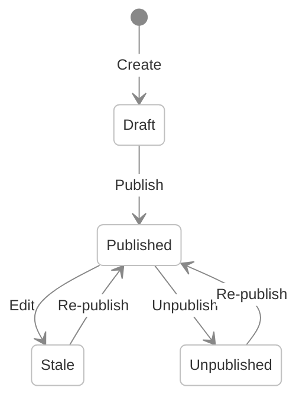

# Core Concepts

This page introduces the fundamental building blocks of Shio CMS. Understanding these concepts will help you navigate the admin console and make informed decisions about how to structure your content.

---

## Sites

A **Site** is the top-level container in Shio CMS. Each site represents a distinct website with its own URL, theme, and content hierarchy.

A site defines:
- **Name and description** — human-readable identifiers
- **URL** — the base URL for the published site
- **Post Type / Page Layout associations** — which Page Layout renders each Post Type
- **Searchable content** — which content is indexed for search
- **Form folder** — where form submissions are stored

You can host **multiple sites** in a single Shio CMS instance. Each site has its own folder tree, published URL, and configuration.

---

## Folders

**Folders** organize content hierarchically within a site. They work like directories in a file system — you can nest folders to create a tree structure.

Folders serve as:
- **Navigation structure** — regions can render folder hierarchies as menus
- **Content containers** — posts live inside folders
- **URL segments** — each folder contributes a segment to the content URL

---

## Posts

A **Post** is a content item — a single piece of content that follows the structure defined by its Post Type. Posts live inside Folders and contain field values (text, images, files, relationships, etc.).

Posts have a **publishing lifecycle**:

| Status | Description |
|---|---|
| **Draft** | Newly created, not yet visible on the published site |
| **Published** | Live on the published site |
| **Stale** | Published but has been modified — re-publish to update the live version |
| **Unpublished** | Removed from the published site but still in the repository |

---

## Post Types

A **Post Type** defines the structure of a content item — its fields, labels, and behavior. Think of it as a content template that editors populate when creating Posts.

Shio CMS includes built-in Post Types:

| Post Type | Purpose |
|---|---|
| **Text** | General-purpose text content |
| **Photo** | Image content with metadata |
| **Video** | Video content |
| **Quote** | Quoted text |
| **Link** | External URL reference |
| **File** | Downloadable file |
| **Region** | Reusable page section |
| **Theme** | Site theme definition |
| **Page Layout** | Page template |
| **Alias** | URL redirect |
| **Folder Index** | Default content for a folder |

You can create **custom Post Types** with any combination of field types. See [Content Modeling](../content-modeling.md) for details.

---

## Page Layouts

A **Page Layout** is the template that controls how a page is structured and rendered. Each page generated by Shio CMS is associated with exactly one Page Layout.

Page Layouts define:
- **Regions** — sections of the page (header, navigation, content, footer)
- **JavaScript code** — server-side rendering logic
- **HTML template** — the rendering template used by the JavaScript code

The same Page Layout can be applied to multiple folders and posts, simplifying development and management.

---

## Regions

A **Region** is a section within a Page Layout. Each region can render content from the Shio CMS repository using one or more **Component APIs**.

Common region patterns:

| Region | Typical Component |
|---|---|
| **Header** | Navigation Component |
| **Navigation** | Navigation Component |
| **Content** | Query Component |
| **Footer** | Navigation Component |

Regions support caching — rendered output is cached by Hazelcast unless the TTL is set to zero.

---

## Component APIs

**Component APIs** are reusable content sources that regions use to render content. They abstract common content retrieval patterns:

- **Navigation Component** — renders folder hierarchies as menus
- **Query Component** — filters and lists posts from a folder

Components use the `shObject` JavaScript API to access content, generate URLs, and produce rendered HTML.

---

## Views: Management vs Published

Shio CMS provides two views of your site:

| View | Content shown | Purpose |
|---|---|---|
| **Management** | All content — published, unpublished, drafts | Content editing and administration |
| **Published** | Only published content | The live website seen by visitors |

---

## Search Integration

Content in Shio CMS is **automatically indexed** for search. The built-in search engine enables basic full-text search on your site.

For advanced search capabilities — faceted navigation, autocomplete, semantic search, and generative AI — Shio integrates with **Viglet Turing ES**. Post Type fields can be mapped to Turing Semantic Navigation fields for precise control over what is indexed and how. See [Search & Caching](../search-caching.md) for details.

---

## Related Pages

| Page | Description |
|---|---|
| [Architecture Overview](../architecture-overview.md) | Component diagram and technology stack |
| [Content Modeling](../content-modeling.md) | Creating custom Post Types and fields |
| [Website Development](../website-development.md) | Page Layouts, Regions, and JavaScript API |
| [Installation Guide](../installation-guide.md) | Setup with Docker, JAR, or build from source |

---
