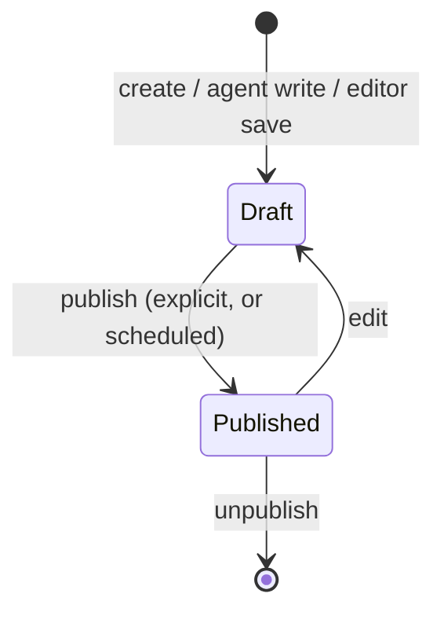

# Core Concepts

[What is Shio CMS?](./intro.md) explains who operates it. This page is the vocabulary,
one level deeper: the words the API, the CLI, the files on disk and the console all use.

---

## Sites

A **site** is one website's worth of content: its own folder tree, its own URL space, its
own configuration. One Shio instance hosts as many as you like.

A site carries a few decisions that nothing else can make:

| Setting | Means |
|---|---|
| **Name** | How everything addresses it, `site:mysite` |
| **URL** | Where your deployed front end lives. Blank until you have one, and deliberately not filled in with a fallback: "has this been deployed?" is a question worth being able to ask |
| **Post type → layout bindings** | Which Page Layout renders each post type. A page never names its own layout; the site does |
| **Searchable content** | Which post types are indexed |

---

## Folders

**Folders** organise content into a tree, the way directories do.

One correction worth making early, because it is the most common wrong assumption: **a
folder is not a URL segment.** A post's friendly URL is its own field, unique within the
site, and moving a post to another folder does not change it. Folders are for structure, 
navigation, grouping, permissions; URLs are for addressing. Keeping the two apart is why
reorganising a site does not break its links.

---

## Posts

A **post** is one piece of content, shaped by its post type: a page, an article, an image,
a template, a redirect. Posts live in folders and hold field values.

**A file is a post too.** An uploaded image is a `File` post with its own fields
(dimensions, checksum, size), which is why an asset can be listed, addressed, exported and
linted like anything else.

### Draft and published

A post has exactly two states, and it can be in both at once:

```mermaid
stateDiagram-v2
    [*] --> Draft: create / agent write / editor save
    Draft --> Published: publish (explicit, or scheduled)
    Published --> Draft: edit
    Published --> [*]: unpublish
```

| State | Means |
|---|---|
| **`DRAFT`** | Work in progress. What the preview route shows, and what a preview-scoped API key reads |
| **`PUBLISHED`** | What readers get, on the public route and through the delivery API |

Both rows can exist for one post: editing a published page creates or updates its draft
and leaves the live version exactly as it was until something publishes it. Unpublishing
withdraws the published row and keeps the draft. Deleting moves the post to the **trash**,
from which a curator can restore it.

This is the mechanism behind the product's central promise: **an agent's writes are
drafts**, and a person decides what goes live.

---

## Post types

A **post type** declares the fields a post may have: a name, a widget per field, whether
each is required. It is what a curator's form is generated from and what an agent's write
is validated against: a `data` key the post type does not declare is **refused**, not
stored.

**Post types are Shio's one name-keyed surface.** They are referenced by name, 
`Article`, `Page`, `PageLayout`, in the REST API, in MCP calls, in the CLI, and in the
files on disk. There is no id-keyed twin. That is what lets a content model live in git as
`shio/post-types/Article.json` and be diffed like code.

### Field types

Fields are declared with a **widget**, which decides how a curator edits the value and how
the value projects to a file: single-line text, rich text (HTML), a code editor
(HTML/CSS/JavaScript/JSON), a check box, a combo box, a multi-select, a date, a file
upload, a content reference, and a repeating group.

See [Content Modeling](../content-modeling.md).

### System post types

Some post types are created by Shio itself and are read-only in the console:

| Type | For |
|---|---|
| `File` | An uploaded asset |
| `PageLayout` · `Region` · `Theme` | The render model: see below |
| `Redirect` | One old path in, one address out |
| `SiteScripts` | A site's third-party script list, in load order |

They are **ordinary content**: they export in a package, project to files, and are linted
like anything else. That is not an implementation detail: it is why your templates are
versionable.

The render types are created on demand rather than at install time, so a fresh instance
provisions them once (`render.provision`, or `POST /api/v2/render/post-types`) before the
first layout is written.

---

## Addresses

Content is reached by **path**, not by id:

| Form | Names | Example |
|---|---|---|
| `post:<site>/<friendly-url>` | one post | `post:mysite/blog/hello-world` |
| `folder:<site>/<name-chain>` | one folder | `folder:mysite/blog` |
| `site:<name>` | a site | `site:mysite` |
| `id:<uuid>` | anything, by raw id | `id:9f8c…` |

Three rules:

1. **Writes take only `post:` and `folder:`** (plus `site:` for the two site operations).
2. **A site's home page is `post:<site>/`.** The trailing slash with nothing after it: the
   one form the grammar does not spell out.
3. `id:` exists for reads. Addressing writes by path is what removes "which UUID was that?"
   from every workflow that touches Shio.

---

## The render model

If Shio renders your pages, three system types do it:

| | Is | Named by |
|---|---|---|
| **Page Layout** | The page-level Handlebars template | the site's post-type binding |
| **Region** | A reusable fragment the layout slots | a `sh-region="Title"` attribute |
| **Theme** | The CSS, and design tokens | the layout's `THEME` field |

A region's template renders against the **page's** model, so `{{TITLE}}` inside a region is
the page's title: the template decides what a value belongs to, and the engine never
infers it.

Templates read content through a small **closed set of helpers**:

- `{{#query type= limit= sort=}}`: filter and list posts
- `{{#navigation folder=}}`: a folder hierarchy as a menu
- `{{#menu title=}}` · `{{#translations}}` · `{{#image FIELD}}` · `{{#search q=}}` ·
  `{{#getRelation FIELD}}` · `{{file_url FIELD}}`

A call to a helper that does not exist fails when the template is **saved**, not when a
reader hits the page. The full list is in
[Pages, Layouts & Regions](../website-development.md#the-helpers).

---

## Two views, three routes

The console shows you everything; a reader gets only what is published. Concretely:

| Route | Serves | Guards |
|---|---|---|
| `/api/v2/cda/**` · `/graphql` | JSON for your own front end | API key; a preview-scoped key reads drafts |
| `/sites/{site}/…` | Published pages rendered by Shio | anonymous, cacheable, indexable |
| `/preview/{site}/…` | **Drafts** rendered by Shio | authenticated, never cached, never indexed, and banner-marked |

---

## Search

Full-text search over your content works with no extra infrastructure: it runs in the
database, and the console's search box and the delivery API's query endpoint both use it.

Indexing into **Viglet Turing ES**: for faceted navigation, autocomplete, semantic search
and generative AI, is a separate, **opt-in** integration: you configure it, mark which
post types are searchable, and content reaches the index when it is **published**. It is
off until you turn it on. See [Search & Caching](../search-caching.md).

---

## Related Pages

| Page | Description |
|---|---|
| [What is Shio CMS?](./intro.md) | Who operates it, and why it is shaped this way |
| [Content Modeling](../content-modeling.md) | Post types and fields in practice |
| [Pages, Layouts & Regions](../website-development.md) | The render model in full |
| [Architecture Overview](../architecture-overview.md) | Components, request flow, deployment |
| [Installation Guide](../installation-guide.md) | Docker, JAR, or build from source |
