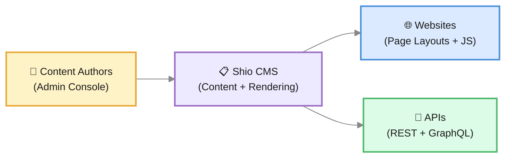

# What is Shio CMS?

**Viglet Shio CMS** is an open-source headless Content Management System. It allows you to model content with custom Post Types, query it via GraphQL or REST API, and build websites using server-side JavaScript with native caching and integrated full-text search.

Whether you need a traditional CMS with page rendering, a headless API for a single-page application, or a hybrid approach, Shio CMS adapts to your architecture.

---

## What can you do with Shio CMS?

### Model your content
Define custom **Post Types** with flexible fields — text, HTML, file uploads, relationships, date pickers, code editors, and more. Each Post Type becomes a reusable content template that editors can populate through the admin console.

### Build websites with JavaScript
Create **Page Layouts** and **Regions** using server-side JavaScript. The Nashorn/Node.js engine renders pages dynamically, and the `shObject` API gives you access to content, navigation, and URL generation directly from your templates.

### Query content via GraphQL
Use the built-in **GraphQL** endpoint with an interactive **GraphiQL** console to query posts, folders, and sites. Perfect for decoupled frontends and mobile applications.

### Integrate with any stack
Consume Shio CMS from your application via **REST API** or **GraphQL**. All content operations — CRUD, search, file upload, user management — are available as JSON endpoints.

### Search your content
Contents are indexed automatically and searchable through the embedded search engine. For advanced search, Shio integrates with **Viglet Turing ES** for faceted search, semantic navigation, and generative AI.

### Cache for performance
**Hazelcast** distributed caching ensures your rendered pages and content objects are served fast. Cache invalidation happens automatically when content is updated.

---

## How it works at a glance

Content authors create and manage content through the admin console. Shio CMS stores it, renders websites using JavaScript templates, and exposes it via REST and GraphQL APIs.

---

## Key concepts

These are the main building blocks you will work with in Shio CMS. You do not need to understand all of them before getting started — come back to each one as you need it.

| Concept | What it is | Learn more |
|---|---|---|
| **Site** | The top-level container for a website. Defines URL, theme, and Post Type associations. | [Core Concepts](./core-concepts.md) |
| **Folder** | Organizes content hierarchically within a site. Folders can be nested. | [Core Concepts](./core-concepts.md) |
| **Post** | A content item — an instance of a Post Type with field values. | [Core Concepts](./core-concepts.md) |
| **Post Type** | A content model that defines fields, labels, and publishing rules. | [Content Modeling](../content-modeling.md) |
| **Page Layout** | A template that controls how a page is structured — defines regions and rendering logic. | [Website Development](../website-development.md) |
| **Region** | A section within a Page Layout that renders content using component APIs. | [Website Development](../website-development.md) |
| **Component API** | Reusable content source within a Region — Navigation Component, Query Component, etc. | [Website Development](../website-development.md) |
| **Publishing** | Content lifecycle: Draft, Published, Stale, Unpublished. | [Content Modeling](../content-modeling.md) |
| **GraphQL** | Query interface for accessing content programmatically. | [GraphQL](../graphql.md) |
| **Hazelcast Cache** | Distributed cache for rendered pages and objects. | [Search & Caching](../search-caching.md) |

---

## Where to go next

**I want to understand how Shio CMS works**
> Read [Core Concepts](./core-concepts.md) first, then [Architecture Overview](../architecture-overview.md).

**I want to set up Shio CMS**
> Go to the [Installation Guide](../installation-guide.md).

**I want to model content**
> Start with [Core Concepts](./core-concepts.md) then go to [Content Modeling](../content-modeling.md).

**I want to build a website**
> Go to [Website Development](../website-development.md) for Page Layouts, Regions, and JavaScript API.

**I want to query content from an external app**
> See [GraphQL](../graphql.md) or [REST API](../rest-api.md).

**I want to manage users and permissions**
> Go to [Administration Guide](../administration-guide.md).

---
