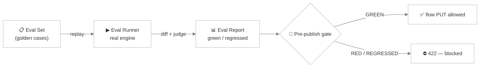

# Agent Evaluation (CI)

> *You tweak a system prompt to fix one annoying behavior — and three conversations that used to work perfectly now fall apart. Without a safety net you find out from an angry customer. **Agent Evaluation** is that safety net: a golden set of conversations that must keep passing, checked automatically before a change ships.*

Agent Evaluation brings **regression testing** to AI agents. You record a set of representative conversations — each with the slots it should collect and the outcome it should reach — and Turing replays them through the *real* chat engine whenever you ask, or as a gate before a flow can be published. If a change breaks one, you know immediately.

It's the same instinct as unit tests for code, adapted to the non-determinism of LLMs: a deterministic diff catches structural breaks, and a bilingual LLM judge catches the fuzzy ones.

---

## The pieces



| Piece | Role |
|---|---|
| **Eval Set** (`TurAgentEvalSet`) | A named collection of golden cases attached to an agent |
| **Eval Case** (`TurAgentEvalCase`) | One golden conversation: seed turns + expectations |
| **Eval Runner** (`TurAgentEvalRunnerService`) | Replays each case through the real `TurAgentChatExecutor` + flow engine and scores it |
| **Eval Report** (`TurAgentEvalReport`) | The result of a run — per-case pass/fail + overall status |
| **Eval Gate** (`TurAgentEvalGateService`) | Turns the latest report into a publish decision |

---

## Writing a golden case

Each **eval case** describes one conversation and what it should produce:

| Field | Meaning |
|---|---|
| `seedTurnsJson` | The user turns to replay, in order — the script of the conversation |
| `expectedSlotsJson` | The slots (and values) the conversation should end with |
| `expectedOutcome` | The terminal outcome — or `ANY` (the default) to not assert on outcome |
| `expectedNodeId` | The flow node the conversation should land on (optional) |
| `rubric` | A natural-language pass/fail rubric for the LLM judge — for the things a diff can't check (*"the agent stayed polite and never promised a refund"*) |

A case captures both the **structural** expectations (slots, outcome, node — checked by an exact diff) and the **qualitative** ones (the rubric — checked by the judge). Cases are ordered (`sortOrder`) and belong to an eval set; the set is exported and imported **inline with the agent**, so your goldens travel with the agent definition.

---

## Running an eval

Replays each case through the real engine, scores it, and persists a report:

```
POST /api/ai-agent/{agentId}/eval/run
```

For each case the runner:

1. Replays the `seedTurns` through the actual `TurAgentChatExecutor` + `TurChatFlowEngineService` — the same code path a live conversation takes.
2. Captures the resulting slots, cursor node, and outcome.
3. Scores them with a **deterministic diff** against the expectations, plus the **bilingual LLM judge** against the rubric.
4. Records a `TurAgentEvalReport`: a green run becomes the new **baseline**; a run that breaks the baseline is flagged **regressed**.

Fetch the latest report and check whether evals are even configured:

```
GET /api/ai-agent/{agentId}/eval/report      # last run, per-case results
GET /api/ai-agent/{agentId}/eval/available    # is an eval set configured for this agent?
```

---

## The pre-publish gate

The point of all this is to **stop a regression from shipping**. The gate turns the latest report into a status, surfaced in the flow editor's **Lint** sidebar (the eval-gate panel — run button + findings):

```
GET /api/ai-agent/{agentId}/eval/gate
```

| Status | Meaning |
|---|---|
| `GREEN` | All cases pass — safe to publish |
| `RED` | One or more cases fail |
| `REGRESSED` | A case that used to pass now fails (a baseline break) |
| `NEVER_RUN` | An eval set exists but hasn't been run yet |
| `NOT_CONFIGURED` | No eval set on this agent — the gate is inert |

When an eval set is marked **blocking**, a `RED`/`REGRESSED` status **hard-blocks the chat-flow `PUT`** — the save returns **HTTP 422** with the findings, so a broken change physically cannot be published until the goldens pass again. Non-blocking sets warn but allow the save.

---

## Running evals in CI

Because evals call real LLMs, they're kept out of the normal test run and gated behind a Maven profile and an API key:

```bash
mvn verify -Pagent-eval -pl turing-app -Dskip.npm=true
```

`-Pagent-eval` runs only the `*AgentEvalIT.java` tests — the default Failsafe config **excludes** them, exactly like the `-Pllm-it` and `-Pnl-facet-eval` profiles. They're env-gated by `OPENAI_API_KEY`, so a machine without a key skips them cleanly. You can also drive a run over the API: `POST /api/ai-agent/{agentId}/eval/run` from your pipeline and assert the report is green.

:::tip Build the golden set from production
The fastest way to a useful eval set is to mine [Chat Analytics](./chat-analytics.md): find a conversation that worked beautifully (`goalAchieved = YES`, `sentiment = POSITIVE`), capture its user turns as `seedTurns`, and freeze its slots as the expectation. Now that exact success is protected forever.
:::

---

## Eval Set REST API

CRUD lives under the agent:

| Method | Path | Purpose |
|---|---|---|
| `GET` | `/api/ai-agent/{agentId}/eval-set` | List eval sets |
| `GET` | `/api/ai-agent/{agentId}/eval-set/{id}` | Get one (with its cases) |
| `POST` | `/api/ai-agent/{agentId}/eval-set` | Create a set |
| `PUT` | `/api/ai-agent/{agentId}/eval-set/{id}` | Update a set + its cases |
| `DELETE` | `/api/ai-agent/{agentId}/eval-set/{id}` | Delete a set |

---

## Related pages

- [AI Agents](./ai-agents.md) — the agents these evals protect; eval sets export with the agent
- [Chat Flow](./chat-flow.md) — where the pre-publish gate appears (Lint sidebar)
- [Chat Analytics](./chat-analytics.md) — mine real conversations to seed golden cases
- [Personas](./personas.md) — rubric checks often assert on persona voice/guardrails
