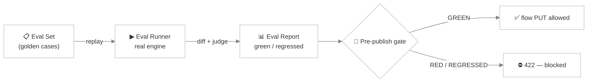

# Agent Evaluation (CI)

> *You tweak a system prompt to fix one annoying behavior — and three conversations that used to work perfectly now fall apart. Without a safety net you find out from an angry customer. **Agent Evaluation** is that safety net: a golden set of conversations that must keep passing, checked automatically before a change ships.*

Agent Evaluation brings **regression testing** to AI agents. You record a set of representative conversations — each with the slots it should collect and the outcome it should reach — and Turing replays them through the *real* chat engine whenever you ask, or as a gate before a flow can be published. If a change breaks one, you know immediately.

It's the same instinct as unit tests for code, adapted to the non-determinism of LLMs: a deterministic diff catches structural breaks, and a bilingual LLM judge catches the fuzzy ones.

Under the hood the scoring is a **pluggable platform**. The four things a case is checked on (slots, outcome, node, rubric) are just the built-in **graders**; you can add more — deterministic **code** checks, extra **LLM judges**, even a **human review** step — compose them into reusable **grader stacks**, and score a shared, versioned **dataset** with them. The sections below start with the defaults and then open up the platform. If you never touch any of it, an agent scores exactly as it always did — every extension is opt-in.

---

## The pieces



| Piece | Role |
|---|---|
| **Eval Set** (`TurAgentEvalSet`) | A named collection of golden cases attached to an agent |
| **Eval Case** (`TurAgentEvalCase`) | One golden conversation: seed turns + expectations |
| **Eval Runner** (`TurAgentEvalRunnerService`) | Replays each case through the real `TurAgentChatExecutor` + flow engine and scores it |
| **Eval Report** (`TurAgentEvalReport`) | The result of a run — per-case pass/fail + overall status |
| **Eval Gate** (`TurAgentEvalGateService`) | Turns the latest report into a publish decision |

---

## Writing a golden case

Each **eval case** describes one conversation and what it should produce:

| Field | Meaning |
|---|---|
| `seedTurnsJson` | The user turns to replay, in order — the script of the conversation |
| `expectedSlotsJson` | The slots (and values) the conversation should end with |
| `expectedOutcome` | The terminal outcome — or `ANY` (the default) to not assert on outcome |
| `expectedNodeId` | The flow node the conversation should land on (optional) |
| `rubric` | A natural-language pass/fail rubric for the LLM judge — for the things a diff can't check (*"the agent stayed polite and never promised a refund"*) |

A case captures both the **structural** expectations (slots, outcome, node — checked by an exact diff) and the **qualitative** ones (the rubric — checked by the judge). Cases are ordered (`sortOrder`) and belong to an eval set; the set is exported and imported **inline with the agent**, so your goldens travel with the agent definition.

---

## Running an eval

Replays each case through the real engine, scores it, and persists a report:

```
POST /api/ai-agent/{agentId}/eval/run
```

For each case the runner:

1. Replays the `seedTurns` through the actual `TurAgentChatExecutor` + `TurChatFlowEngineService` — the same code path a live conversation takes.
2. Captures the resulting slots, cursor node, and outcome.
3. Scores them with a **deterministic diff** against the expectations, plus the **bilingual LLM judge** against the rubric.
4. Records a `TurAgentEvalReport`: a green run becomes the new **baseline**; a run that breaks the baseline is flagged **regressed**.

Fetch the latest report and check whether evals are even configured:

```
GET /api/ai-agent/{agentId}/eval/report      # last run, per-case results
GET /api/ai-agent/{agentId}/eval/available    # is an eval set configured for this agent?
```

---

## The pre-publish gate

The point of all this is to **stop a regression from shipping**. The gate turns the latest report into a status, surfaced in the flow editor's **Lint** sidebar (the eval-gate panel — run button + findings):

```
GET /api/ai-agent/{agentId}/eval/gate
```

| Status | Meaning |
|---|---|
| `GREEN` | All cases pass — safe to publish |
| `RED` | One or more cases fail |
| `REGRESSED` | A case that used to pass now fails (a baseline break) |
| `PENDING_REVIEW` | A human-review grader deferred a case — the run is amber until a reviewer decides (see [Human review](#human-review)) |
| `NEVER_RUN` | An eval set exists but hasn't been run yet |
| `NOT_CONFIGURED` | No eval set on this agent — the gate is inert |

When an eval set is marked **blocking**, a `RED`/`REGRESSED`/`PENDING_REVIEW` status **hard-blocks the chat-flow `PUT`** — the save returns **HTTP 422** with the findings, so a broken (or not-yet-reviewed) change physically cannot be published until the goldens pass again. Non-blocking sets warn but allow the save.

---

## Graders: model, code & human

The four checks a case gets by default — **slots**, **outcome**, **node** (deterministic diffs) and **rubric** (the LLM judge) — are just the built-in **grader stack**. A grader is a pluggable check that scores one case along one dimension, and they come in the three industry-standard kinds:

| Kind | What it is | Runs an LLM? |
|---|---|---|
| **CODE** | Deterministic / programmatic — CI-cheap, runs on every PR | No |
| **MODEL** | LLM-as-judge — semantic checks a diff can't express | Yes |
| **HUMAN** | A human-in-the-loop review step (see [below](#human-review)) | No |

**With no grader config, a set uses the legacy default stack** (slot-match + outcome + node + rubric) and scores exactly as before. When you *do* configure graders, you pick from the built-in library — each keyed by a stable `graderId` and driven by a small JSON `config`:

| `graderId` | Kind | Checks |
|---|---|---|
| `slot-match` | code | Captured slots vs `expectedSlots` (the default slot diff) |
| `outcome` | code | Terminal outcome vs `expectedOutcome` |
| `node` | code | Final flow node vs `expectedNodeId` |
| `exact` | code | Final answer equals `expected` (`ignoreCase` / `trim` options) |
| `contains` | code | Final answer contains `substring` |
| `regex` | code | Final answer matches `pattern` (`ignoreCase` / `fullMatch`) |
| `json-path` | code | A JSON-path `path` over the answer, optional `expected` value |
| `slot-tolerance` | code | One `slot` equals `expected` within a numeric `tolerance` (or ignoreCase) |
| `numeric-range` | code | A slot / first-number-in-answer lies within `[min, max]` |
| `tool-called` | code | The agent called `tool` (optional `status` / `minCalls`) — exact, from the tool-call trace |
| `latency-budget` | code | Aggregated tool-call latency within `maxMs` (`max` / `sum` / `avg`) |
| `groovy` | code | A custom Groovy `script` returning `{score, pass, rationale}` — for domain rules the built-ins can't express |
| `rubric` | model | The bilingual LLM judge over the case's `rubric` (the default) |
| `model-judge` | model | A generalized judge: `strategy` = `LABEL` / `SCORE` / `CRITERIA` / `PAIRWISE`, with a per-grader `prompt` + optional `model` override |
| `embedding-similarity` | code | Cosine similarity of the answer vs a golden `reference` (uses the configured embedding provider) |
| `human-review` | human | Defers the case for a person to decide (see [Human review](#human-review)) |
| `nl-facet` | code | The SN NL→facet scorer as a grader — parses a `query` over a `schema` and scores it against an `expectation` (unifies [Search DSL](./dsl-query.md) evals onto this same platform) |

Every non-default grader is **opt-in**: it only runs when a set (or [stack](#grader-stacks)) lists it, and a broken grader fails its own check without breaking the run.

---

## Grader stacks

A **grader stack** is the ordered list of graders a set scores with, plus how their results combine. Each entry carries a **weight**, a pass **threshold**, and a **blocking** flag:

- **score** = the weighted mean of the graders' scores;
- a grader **passes** when its result passed *and* its score ≥ its threshold;
- the **case passes** when every *blocking* grader passed — a non-blocking grader counts toward the score but never fails the case (replacing the old rigid all-must-pass rule).

You can configure the stack **per eval set**, with optional **per-case overrides**. And because a good stack (say *"Lead-capture QA"*) is worth reusing, you can save it as a **named, agent-decoupled grader stack** and bind it to many agents' sets:

| Method | Path | Purpose |
|---|---|---|
| `GET` | `/api/eval/grader-stack` | List reusable stacks |
| `GET` | `/api/eval/grader-stack/{id}` | Get one (with its grader entries) |
| `POST` | `/api/eval/grader-stack` | Create a stack with its ordered entries |
| `DELETE` | `/api/eval/grader-stack/{id}` | Delete a stack |

An eval set with a bound stack scores its cases with the stack's graders instead of its own.

---

## Datasets

Golden cases used to live inline in one agent's set. A **dataset** lifts them into a reusable, versioned, **agent-decoupled** collection of rows (turns + expectations + an optional golden **reference answer** + tags/metadata) that any number of agents' sets can bind and score. This is the *"provide a dataset to be tested"* path.

**Import** a dataset from a file — CSV, JSON, JSONL, or OpenAI-Evals JSONL — with an optional column mapping, and **export** it back as JSONL:

| Method | Path | Purpose |
|---|---|---|
| `GET` | `/api/eval/dataset` | List datasets |
| `GET` | `/api/eval/dataset/{id}` | Get one (with its rows) |
| `POST` | `/api/eval/dataset/import` | Import from an uploaded file (`file` + `format` + optional `name` / `columnMapping`) |
| `GET` | `/api/eval/dataset/{id}/export` | Export as JSONL |
| `DELETE` | `/api/eval/dataset/{id}` | Delete a dataset |

### Versioning & drift

Datasets are **versioned**. Take an immutable **snapshot** to freeze the current rows and bump the live version, and **diff** two versions to see exactly which rows were added, removed, or changed. Every eval report **pins the dataset version it ran against**, so a regression comparison knows whether your agent changed or the dataset itself drifted.

| Method | Path | Purpose |
|---|---|---|
| `POST` | `/api/eval/dataset/{id}/snapshot` | Freeze a snapshot + bump the version |
| `GET` | `/api/eval/dataset/{id}/versions` | List snapshotted versions |
| `GET` | `/api/eval/dataset/{id}/diff?from=&to=` | Row-level drift between two versions |

---

## Human review

Some things only a person can judge. The **`human-review`** grader is the third grader kind: instead of deciding automatically it **defers** — the case (and the report) go **`PENDING_REVIEW`**, and a review task is parked for a human. A blocking set with a pending review is *block-until-reviewed*; a non-blocking one just warns.

Reviewers work an inbox — the **Review inbox** tab of the [Eval Studio](#eval-studio): pick an agent, read a pending task's replayed transcript and the expected-vs-actual summary, then submit a verdict, which **merges back** into the report (a fully-reviewed run can then go green):

| Method | Path | Purpose |
|---|---|---|
| `GET` | `/api/ai-agent/{agentId}/eval/review` | Open (pending) review tasks |
| `GET` | `/api/ai-agent/{agentId}/eval/review/{taskId}` | One task (transcript + expected summary) |
| `POST` | `/api/ai-agent/{agentId}/eval/review/{taskId}` | Submit `{pass, score, notes}` |
| `POST` | `/api/ai-agent/{agentId}/eval/review/{taskId}/promote?datasetId=` | Promote the reviewed case into a golden [dataset](#datasets) row |

**Promote to a golden row.** Once you've reviewed a case, one click turns it into a regression test: `promote` appends a new row to the dataset you choose — the transcript's user turns become the row's seed turns, the last assistant reply becomes the golden **reference answer**, and the expected outcome/node carry over (tagged `promoted`, with the source review task recorded in the row's metadata). This closes the loop from *"a human noticed this was wrong"* to *"it's now in the dataset"*.

### Calibration & inter-annotator agreement

Two questions decide whether you can *trust* your reviewers and your LLM judge — and both are answered from a **Calibration & agreement** panel at the top of the Review inbox.

**How much do reviewers agree?** Give a task more than one reviewer and the platform computes an agreement score. Set the required reviewer count on an open task, and it only reaches a verdict once that many people have decided — the verdict is then the **strict-majority pass** with the **mean score** (a single reviewer, the default, behaves exactly as before). Across all your multi-reviewer tasks the panel shows **Fleiss' kappa** (with the usual *slight / fair / moderate / substantial / almost-perfect* band): a low number means your rubric is ambiguous, not that people are careless.

**Can you trust the model judge?** Sample a run's **model-graded** cases into an **audit** — the panel's *Audit MODEL-graded run* control parks each sampled case as a review task carrying the model's original verdict. Reviewers re-judge them, and the panel reports **Cohen's kappa** between the LLM judge and the human consensus, a confusion breakdown (where the judge *over-passes* vs *over-fails*), and a plain-language hint for tuning the judge's rubric prompt. The hint is advice, never applied automatically.

| Method | Path | Purpose |
|---|---|---|
| `POST` | `/api/ai-agent/{agentId}/eval/review/{taskId}/reviewers?count=` | Require N reviewers on an open task |
| `GET` | `/api/ai-agent/{agentId}/eval/review/agreement` | Fleiss' kappa over multi-reviewer tasks |
| `POST` | `/api/ai-agent/{agentId}/eval/review/audit?sampleSize=&requiredReviewers=` | Sample model-graded cases into audit tasks |
| `GET` | `/api/ai-agent/{agentId}/eval/review/calibration` | Cohen's kappa (judge vs human) + tuning hint |

---

## Eval Studio

The **Eval Studio** (**Generative AI → Eval Studio**, at `/bento/eval`) is the visual home for the platform, organized into tabs:

- **Datasets** — browse your reusable datasets (row count + version).
- **Generate** — synthesize or augment dataset rows with LLM assistance, then review and save them.
- **Grader stacks** — browse your reusable, named grader stacks.
- **NL→Facet** — evaluate Semantic Navigation's natural-language→facet parser on the same platform. Paste an eval pack (a declared field schema plus prose queries with their golden filters/ranges/sort) to **import it as a reusable dataset**; the saved NL→facet datasets list alongside your chat-flow ones, and **Run** scores each prose query through the grounded parser, showing per-case pass/fail and any *ungrounded* fields (a filter on a field outside the declared schema — the hard failure the scorer flags). One Studio, one gate for both chat-flow and search evals.
- **Runs** — pick an agent to see its evaluation **run history**: a **score timeline** charts every run's aggregate score over time (with regressions visible at a glance), the run list badges each run **pass**/**fail** and marks the green **baseline** and any **regressed** run, and selecting a run drills into the **per-case breakdown** — pass/fail and score per case, the actual-vs-expected outcome, any failing slot values, and the rubric verdict. A **Run gate now** button replays the agent's enabled golden sets and refreshes the timeline.
- **Review inbox** — pick an agent, review its pending [human-review](#human-review) tasks, and promote the good ones into a golden dataset.

The flow editor's eval-gate panel links straight to it.

---

## Running evals in CI

Because evals call real LLMs, they're kept out of the normal test run and gated behind a Maven profile and an API key:

```bash
mvn verify -Pagent-eval -pl turing-app -Dskip.npm=true
```

`-Pagent-eval` runs only the `*AgentEvalIT.java` tests — the default Failsafe config **excludes** them, exactly like the `-Pllm-it` and `-Pnl-facet-eval` profiles. They're env-gated by `OPENAI_API_KEY`, so a machine without a key skips them cleanly. You can also drive a run over the API: `POST /api/ai-agent/{agentId}/eval/run` from your pipeline and assert the report is green.

:::tip Build the golden set from production
The fastest way to a useful eval set is to mine [Chat Analytics](./chat-analytics.md): find a conversation that worked beautifully (`goalAchieved = YES`, `sentiment = POSITIVE`), capture its user turns as `seedTurns`, and freeze its slots as the expectation. Now that exact success is protected forever.
:::

---

## Eval Set REST API

CRUD lives under the agent:

| Method | Path | Purpose |
|---|---|---|
| `GET` | `/api/ai-agent/{agentId}/eval-set` | List eval sets |
| `GET` | `/api/ai-agent/{agentId}/eval-set/{id}` | Get one (with its cases) |
| `POST` | `/api/ai-agent/{agentId}/eval-set` | Create a set |
| `PUT` | `/api/ai-agent/{agentId}/eval-set/{id}` | Update a set + its cases |
| `DELETE` | `/api/ai-agent/{agentId}/eval-set/{id}` | Delete a set |

---

## Related pages

- [AI Agents](./ai-agents.md) — the agents these evals protect; eval sets export with the agent
- [Chat Flow](./chat-flow.md) — where the pre-publish gate appears (Lint sidebar)
- [Chat Analytics](./chat-analytics.md) — mine real conversations to seed golden cases
- [Personas](./personas.md) — rubric checks often assert on persona voice/guardrails
- [Search DSL](./dsl-query.md) — NL→facet parsing, now scorable via the `nl-facet` grader on this same platform
