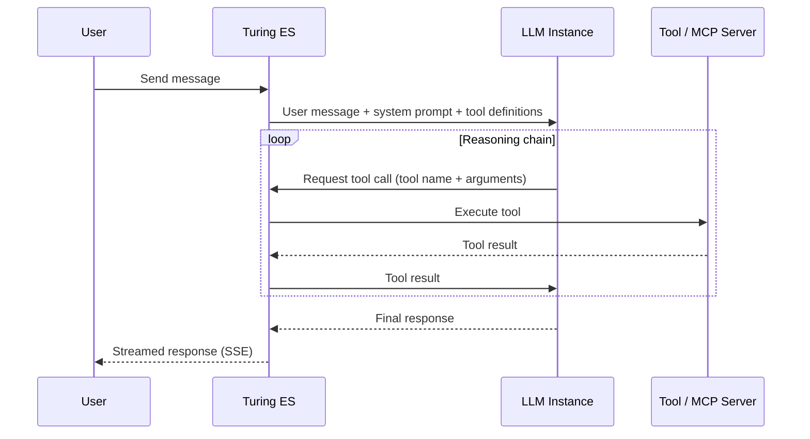

# AI Agents

An **AI Agent** is the central composition object in Turing ES's GenAI system. It combines a specific [LLM Instance](./llm-instances.md), a selected set of [Tool Callings](./tool-calling.md), and a set of [MCP Servers](./mcp-servers.md) into a single, named, deployable assistant.

Each agent has its own personality, capability set, and visual identity. In the **Chat** interface, every configured agent appears as a separate tab — users choose which agent to interact with based on its name and description. See the [Chat](./chat.md) page for the full interface documentation.

AI Agents are configured in **Administration → AI Agents**.

---

## Configuration Form

| Field | Description |
|---|---|
| **Name** | Display name shown as the tab label in the Chat interface |
| **Avatar** | Image representing the agent in the chat UI |
| **Description** | Brief explanation of the agent's purpose and specialization — shown below the name in the agent tab |
| **LLM Instance** | The LLM provider and model this agent uses for inference. See [LLM Instances](./llm-instances.md) |
| **Tool Callings** | Which of the 27 native tools are available to this agent. See [Tool Calling](./tool-calling.md) |
| **MCP Servers** | Which external MCP servers this agent can call. See [MCP Servers](./mcp-servers.md) |

---

## Composing Agents for Specific Roles

Because each agent independently selects its LLM Instance, tools, and MCP servers, it is straightforward to build purpose-specific assistants. Give each agent a focused set of tools — a lean tool list reduces prompt length and helps the LLM make more precise tool choices.

**Enterprise Search Agent**

An agent that helps users find and explore indexed content across the organization.

| Field | Value |
|---|---|
| LLM Instance | Anthropic Claude Sonnet |
| Tool Callings | `list_sites`, `search_site`, `get_document_details`, `find_similar_documents`, `search_by_date_range` |
| MCP Servers | — |

**Data Research Agent**

A multi-purpose agent that can browse the web, query financial data, and run data analysis scripts.

| Field | Value |
|---|---|
| LLM Instance | OpenAI GPT-4o |
| Tool Callings | `fetch_webpage`, `extract_links`, `get_stock_quote`, `get_weather`, `execute_python`, `search_knowledge_base` |
| MCP Servers | Internal data API (HTTP MCP) |

**IT Operations Agent**

A local agent for internal IT queries — runs fully on-premise using a local LLM.

| Field | Value |
|---|---|
| LLM Instance | Ollama (local Llama 3) |
| Tool Callings | `execute_python`, `get_current_time`, `search_knowledge_base` |
| MCP Servers | Internal ticketing system (stdio MCP) |

---

## How an Agent Executes

When a user sends a message to an AI Agent, the following loop runs:

1. Turing ES sends the user message to the LLM along with a system prompt describing the agent and the definitions of all enabled tools.
2. The LLM decides which tools (if any) to call, based on the message content and tool descriptions.
3. Turing ES executes the requested tool calls — native tools or MCP server calls — and returns the results to the LLM.
4. The LLM may invoke additional tools in a multi-step reasoning chain before producing a final response.
5. The final response is streamed to the user via Server-Sent Events (SSE).

This loop continues until the LLM determines it has enough context to respond, up to a configurable maximum number of iterations.

---

## Related Pages

| Page | Description |
|---|---|
| [LLM Instances](./llm-instances.md) | Configure the LLM providers available as agent backends |
| [Tool Calling](./tool-calling.md) | Full reference of all 27 native tools |
| [MCP Servers](./mcp-servers.md) | Connect agents to external tools via MCP |
| [Chat](./chat.md) | Front-end where agents are used — AI Agents tab |
| [GenAI & LLM Configuration](./genai-llm.md) | RAG architecture overview |

---

*Previous: [MCP Servers](./mcp-servers.md) | Next: [Chat](./chat.md)*
