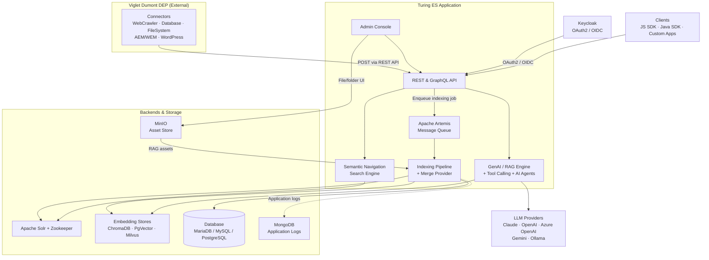
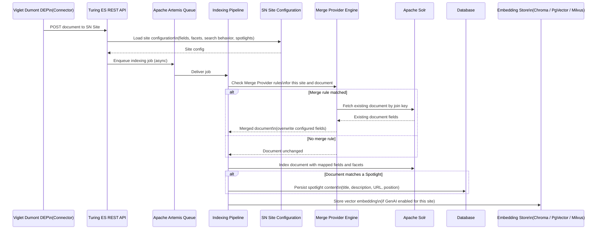
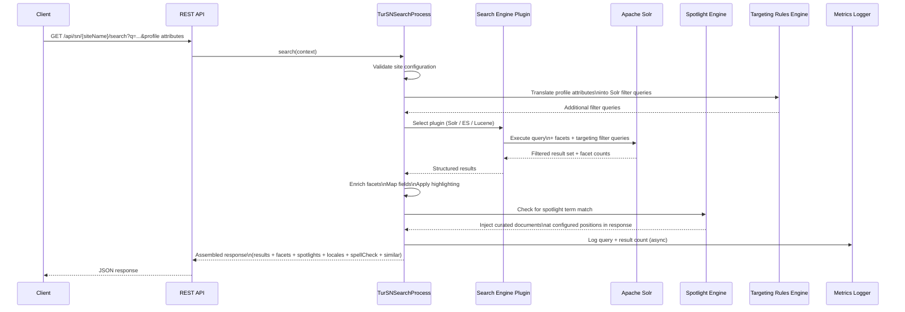

# Turing ES — Architecture Overview

## Introduction

Viglet Turing ES is an open-source enterprise search platform that combines semantic navigation, generative AI, tool calling, and AI Agents. It allows organizations to index content from multiple sources, apply Retrieval-Augmented Generation (RAG) over that content, and expose rich search experiences through REST and GraphQL APIs.

Content ingestion is handled by **Viglet Dumont DEP**, a separate project that runs connectors independently and delivers indexed documents to Turing ES via an asynchronous message queue.

This document describes the system's components, internal modules, and the two core data flows: **indexing** and **search**.

---

## High-Level Component Diagram



---

## Internal Module Structure

The Turing ES application is organized into cohesive modules, each with a well-defined responsibility.

| Module | Package | Responsibility |
|---|---|---|
| **Semantic Navigation** | `sn` | Core search orchestration: query processing, facets, spotlights, targeting rules, autocomplete |
| **Search Engine Plugins** | `se` / `plugins/se` | Abstraction layer over Solr (recommended), Elasticsearch, and Lucene backends |
| **GenAI / RAG** | `genai` | RAG over SN content and MinIO assets; SN site result summaries; LLM context building and invocation |
| **Tool Calling** | `genai/tool` | LLM-accessible tools: code interpreter (Python), semantic navigation, web crawler, RAG search, datetime, finance, weather, image search, MCP servers |
| **LLM Providers** | `genai/provider/llm` | Pluggable integrations: Anthropic Claude, OpenAI, Azure OpenAI, Google Gemini, Gemini (OpenAI-compatible API), Ollama |
| **Indexing Pipeline** | `indexer` | Receives messages from Dumont DEP via Artemis, applies Merge Providers, writes to Solr and embedding stores |
| **Message Queue** | `artemis` | Asynchronous communication between Dumont DEP connectors and the indexing pipeline |
| **AI Agent** | `agent` | Conversational AI agents: composition of LLM Instance, Tool Callings, and MCP Servers |
| **OCR** | `ocr` | Text extraction from PDFs, Word documents, and images |
| **Persistence** | `persistence` | JPA entities, repositories, and DTOs for all domain objects |
| **Security** | `spring/security` | Native session-based auth (admin console) + API Key (`Key` header) for REST API; optional Keycloak OAuth2 / OIDC for production SSO |
| **API Layer** | `api` | REST controllers and GraphQL resolvers exposed to clients |
| **Admin Console** | React (`turing-react`) | Browser-based UI: administration, SN Site configuration, [Assets](./assets.md) file manager (MinIO), [Chat](./chat.md) interface, and [Token Usage](./token-usage.md) dashboard |

---

## Indexing Flow

Content ingestion is handled externally by **Viglet Dumont DEP**. Each connector runs as an independent process and sends documents to Turing ES via its **REST API**. The API receives the request, validates it against the target Semantic Navigation Site configuration, and creates an indexing job that is queued internally via Apache Artemis for asynchronous processing.

The **Semantic Navigation Site** is the central configuration artifact that drives the entire indexing behavior: it defines which Solr instance to use, which fields the documents carry, how those fields are mapped and used (title, text, URL, date, image, facets, etc.), how search will behave, and which spotlights are configured. The indexing pipeline reads this configuration to know exactly what to do with each incoming document.



### Key indexing concepts

**REST API as entry point:** Dumont DEP connectors send documents to Turing ES via REST API, not by writing directly to Solr or the queue. The API is the single integration point — it validates the request, loads the target SN Site configuration, and enqueues an indexing job via Apache Artemis for asynchronous processing.

**SN Site as the indexing blueprint:** Every indexing job is bound to a Semantic Navigation Site. The site configuration defines the complete indexing contract: which Solr collection to write to, which document fields exist and how they are typed, which fields become facets, how highlighting and autocomplete will work, and which spotlights are active. The pipeline reads this configuration at job execution time to determine field mappings, facet assignments, and spotlight handling.

**Spotlight persistence:** When an incoming document matches a configured Spotlight — for example, its URL or ID matches a spotlight term — the pipeline indexes the document in Solr normally and also persists the spotlight content (title, description, URL, position) in the relational database. This ensures the spotlight data remains available for injection even if the document is later removed from the Solr index.

**Viglet Dumont DEP:** The connector system that feeds Turing ES. It runs as a separate application and manages its own connector lifecycle (schedules, credentials, field mappings). Connectors currently available in Dumont DEP include WebCrawler (Nutch-based), Database, FileSystem, AEM/WEM, and WordPress. Refer to the Dumont DEP documentation for connector configuration.

**Merge Providers:** When two Dumont DEP connectors independently index different representations of the same real-world document — for example, AEM indexing structured metadata from `model.json` and WebCrawler indexing the rendered HTML of the same page — the Merge Provider identifies them as the same document using a configured join key and merges their fields before writing to Solr. See [SN Concepts](./sn-concepts.md) for a detailed explanation.

**Embedding stores:** If Generative AI is enabled for a Semantic Navigation site, a vector embedding is generated for each indexed document and written to the configured embedding store. Turing ES supports three embedding backends via Spring AI: **ChromaDB**, **PgVector** (PostgreSQL extension), and **Milvus**. Only one is active per deployment. The default embedding store and embedding model are defined globally in **Administration → Settings**.

**MinIO asset indexing:** Turing ES includes an **[Assets](./assets.md)** file manager in the admin console, backed by MinIO as the object storage layer. Files are uploaded via drag-and-drop, organized into folders, and automatically indexed as vector embeddings on upload (and unindexed on deletion). A batch "Train AI with Assets" operation processes all files using Apache Tika for text extraction, chunking at 1,024 characters, and storing embeddings in the active vector store.

**Application logs in MongoDB:** When MongoDB is configured, Turing ES ships with a custom Logback appender that extends `ch.qos.logback`. Every log entry generated by the application — including indexing events, search requests, errors, and system events — is persisted to MongoDB in addition to standard output. These logs are exposed in the admin console, giving administrators full visibility into application behavior without requiring access to the server file system or a separate log management tool.

---

## Search Flow

The search flow is synchronous and request-driven. Every request goes through a structured pipeline inside `TurSNSearchProcess` before a response is returned to the client.



### Key search concepts

**Site-scoped execution:** Every search request is scoped to a named Semantic Navigation Site. The site configuration defines which search engine backend to use, how many results per page, facet definitions, field mappings, whether Spotlights and Targeting Rules are active, and whether GenAI is enabled.

**Plugin abstraction:** The orchestrator does not query the search backend directly. An intermediate plugin layer translates the abstract search context into backend-specific queries, supporting **Apache Solr**, **Elasticsearch**, and **Lucene** as backends. Solr is the recommended production backend as it provides the most complete feature set, including full support for facets, spotlights, targeting rules, highlighting, and autocomplete. Elasticsearch and Lucene are available as alternatives with a reduced feature set.

**Spotlight injection:** After retrieving organic results, the system checks whether any configured Spotlights match the current query. Matching Spotlights insert curated documents at specific positions in the result list. See [SN Concepts](./sn-concepts.md) for details.

**Targeting Rules:** Results are filtered based on the requesting user's profile attributes, passed in the request context. Targeting Rules translate those attributes into additional Solr filter queries. See [SN Concepts](./sn-concepts.md) for details.

**Field mapping and highlighting:** Before returning results, each document's fields are remapped to a canonical set of display fields configured per site (title, description, text, date, image, URL). Highlighting wraps matched terms with configurable HTML tags (default: `<mark>`).

**Metrics:** After assembling the response, query metrics (search term, result count, site, timestamp) are logged asynchronously to avoid adding latency to the response.

---

## Technology Stack

| Layer | Technology | Notes |
|---|---|---|
| **Runtime** | Java 21 | Minimum supported version |
| **Framework** | Spring Boot + Spring AI | Application container; Spring AI powers LLM and embedding integrations |
| **Search Engine** | Apache Solr (recommended), Elasticsearch, Lucene | Solr is the primary production backend with the most complete feature set; Elasticsearch and Lucene are supported as alternatives |
| **Solr Coordination** | Apache Zookeeper | Required for Solr in production (SolrCloud mode) |
| **Message Broker** | Apache Artemis | Asynchronous indexing queue (embedded in Turing ES) |
| **Database** | H2 / MariaDB / MySQL / PostgreSQL | H2 for development; MariaDB or MySQL recommended for production |
| **Embedding Stores** | ChromaDB / PgVector / Milvus | Via Spring AI; one backend active per deployment |
| **Asset Store** | MinIO | External service; configured in `application.yaml` (host, user, password); object storage for files managed via the admin console folder UI |
| **Log Store** | MongoDB | Optional; custom Logback appender (`ch.qos.logback`) persists all application logs to MongoDB, accessible via the admin console |
| **LLM Providers** | Anthropic Claude, OpenAI, Azure OpenAI, Google Gemini, Gemini (OpenAI-compatible), Ollama | Configured per site or globally; one active at a time |
| **Tool Calling** | 27 native tools across 7 categories + MCP (external servers) | Semantic Nav (15), RAG/KB (4), Web Crawler (2), Finance (2), Weather (1), Image Search (1), DateTime (1), Code Interpreter (1); MCP via HTTP or stdio |
| **Identity Management** | Keycloak | OAuth2 / OpenID Connect; optional for deployments without SSO |
| **Load Balancer** | Apache HTTP Server | Optional; required for high-availability cluster deployments |
| **Connector System** | Viglet Dumont DEP | Separate application; feeds Turing ES via Artemis |
| **Build System** | Apache Maven | Multi-module project |
| **Frontend** | React + TypeScript + shadcn/ui + Vite | Admin console (`turing-react`) — includes SN configuration, [Assets](./assets.md) manager, [Chat](./chat.md) interface, [Token Usage](./token-usage.md) dashboard |
| **Containerization** | Docker / Docker Compose | Available in `containers/` directory |
| **Orchestration** | Kubernetes | Manifests available in `k8s/` directory |
| **API Protocols** | REST + GraphQL | Swagger UI available in development mode |
| **Java SDK** | `turing-java-sdk` | Available on Maven Central; typed client for search and indexing |
| **JavaScript SDK** | `@viglet/turing-sdk` | Available on npm; TypeScript-ready client for web and Node.js |

---

## Deployment Topologies

Turing ES supports several deployment configurations. Each builds on the previous one — start with what you need and add components as requirements grow.

### Development

Minimal setup for local development and evaluation.

```
Turing ES (H2 embedded) + Apache Solr
```

Turing ES starts with an embedded H2 database. No external database is needed. Not suitable for production.

---

### Simple Production

Recommended baseline for production environments.

```
Turing ES + Apache Solr + Zookeeper + MariaDB / MySQL
```

Solr runs in SolrCloud mode coordinated by Zookeeper, enabling index replication and fault tolerance at the Solr layer. MariaDB or MySQL provides durable persistence for Turing ES configuration and metadata.

---

### Production with Security (SSO)

For environments that require integration with an identity provider or corporate SSO.

```
Turing ES + Apache Solr + Zookeeper + MariaDB / MySQL + Keycloak
```

Keycloak handles authentication via OAuth2 / OpenID Connect. Users log in through Keycloak and receive tokens that are validated by Turing ES. See [Security & Keycloak](./security-keycloak.md) for configuration details.

---

### Production with Log UI

For environments where administrators need visibility into application behavior directly from the Turing ES admin console — without access to server logs or external log tools.

```
Turing ES + Apache Solr + Zookeeper + MariaDB / MySQL + MongoDB
```

When MongoDB is configured, a custom Logback appender persists every log entry generated by the application to MongoDB. The admin console exposes these logs in a searchable interface, showing errors, warnings, indexing events, and system activity in real time.

---

### High Availability

For environments requiring horizontal scaling and zero-downtime deployments.

```
Apache HTTP Server (load balancer)
    └── Turing ES node 1
    └── Turing ES node 2
    └── Turing ES node N
Apache Solr + Zookeeper (cluster)
MariaDB / MySQL (primary + replica)
Keycloak (optional)
MongoDB (optional)
```

Multiple Turing ES instances run behind Apache HTTP Server configured as a reverse proxy and load balancer. Solr runs as a multi-node SolrCloud cluster. The database should be configured with at least one replica for redundancy.

---

*Previous: [Core Concepts](./getting-started/core-concepts.md) | Next: [Semantic Navigation Concepts](./sn-concepts.md)*
