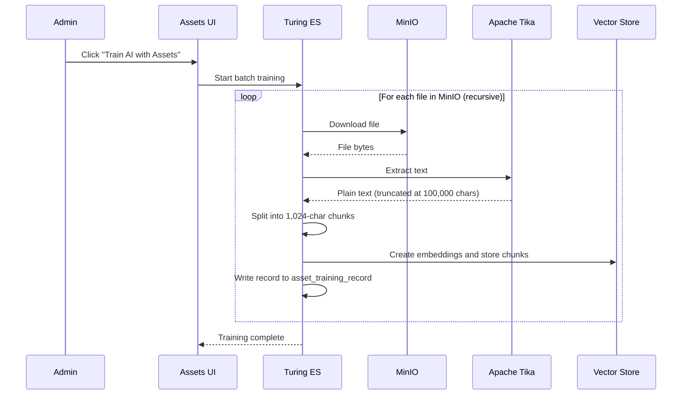

# Assets

Assets is the file manager that feeds the RAG Knowledge Base in Turing ES. Content managers and administrators use it to upload documents (PDFs, Word files, spreadsheets, and more) that are automatically indexed as vector embeddings and made available to AI Agents for semantic search. It is the bridge between your files and the Knowledge Base — everything uploaded here becomes part of what the AI can reference when answering questions.

The **Assets** section (`/console/asset`) is a file manager with built-in RAG training capabilities. It is available in the **Management** section of the sidebar and is only visible when **MinIO is enabled**.

Assets serves as the Knowledge Base for AI Agents — every file uploaded here can be indexed as vector embeddings and queried by the LLM via tool calling. For the conceptual overview of how this fits into the GenAI architecture, see [Generative AI & LLM Configuration](./genai-llm.md).

:::info MinIO required
Assets and all RAG Knowledge Base features require MinIO to be configured. See [MinIO Configuration](#minio-configuration) at the bottom of this page.
:::

---

## Layout

The interface uses a **resizable dual-panel layout**:

- **Left panel** — file and folder listing with the action toolbar
- **Right panel** — inline preview of the selected file

A **breadcrumb** at the top of the left panel shows the current folder path and allows navigation to any parent level. A **Root** button returns to the top-level folder instantly.

---

## File Table

The file listing displays the following columns:

| Column | Description |
|---|---|
| **Name** | File or folder name |
| **Size** | File size in human-readable format |
| **Type** | MIME type or folder indicator |
| **Last Modified** | Date and time of the last modification |
| **AI** | Training status — a checkmark indicates the file has been indexed as embeddings, with a tooltip showing the training timestamp |
| **Actions** | Per-row download and delete buttons |

---

## File Management

### Upload Files

Files are uploaded to the **current folder** via a file picker dialog (click **Upload Files**). Multiple files can be selected in one operation. Uploads are sent to:

```
POST /api/asset
```

After upload, an **asynchronous event automatically triggers individual AI indexing** for each uploaded file — no manual training step is needed for new uploads.

### Create Folder

A dialog prompts for a folder name. Folders can be nested to any depth and are navigated via the breadcrumb.

### Download

Each file has a dedicated download button that preserves the original filename.

### Delete

Files and folders can be deleted via an inline button. A **toast notification** confirms completion. When a file is deleted, its **embeddings are automatically removed from the vector store**.

:::note No rename
Renaming files or folders is not currently supported. To rename a file, download it, delete the original, and re-upload with the new name.
:::

---

## Supported File Formats for Training

Apache Tika is the text-extraction engine used during AI Training. It supports a broad range of document types:

| Category | Formats |
|---|---|
| **Documents** | PDF, DOCX, DOC, ODT, RTF, EPUB |
| **Spreadsheets** | XLSX, XLS, ODS, CSV |
| **Presentations** | PPTX, PPT, ODP |
| **Web / Markup** | HTML, XHTML, XML |
| **Plain text** | TXT, LOG, Markdown |
| **Email** | EML, MSG, MBOX |
| **Images (with OCR)** | PNG, JPEG, TIFF, BMP, GIF (requires Tesseract) |

Files that Tika cannot extract text from (e.g. binary executables, ZIP archives without textual content) are **silently skipped** during training with no error counted.

---

## Preview Panel

Selecting a file opens an inline preview in the right panel without leaving the page. Supported formats:

| Category | Formats |
|---|---|
| **Images** | PNG, JPEG, GIF, WebP, SVG, BMP |
| **PDFs** | Rendered via iframe |
| **Video** | MP4, WebM, OGG (with player controls) |
| **Audio** | MP3, OGG, WAV, WebM (with player controls) |
| **Text** | TXT, CSV, HTML, CSS, JS, JSON, XML |

**Panel actions:**

- **Maximise** — opens fullscreen view (press `Esc` to close)
- **Download** — downloads the file directly from the preview panel
- **Close** — collapses the preview panel

The panel footer displays the file size, content type, modification date, and file extension.

---

<div className="page-break" />

## AI Training (RAG)

The AI training features are only available when `ragEnabled=true` **and** an embedding model and embedding store are configured in **Administration → Global Settings → RAG Settings**.

### Training Status per File

The **AI column** in the file table shows the indexing state of each file:

- ✅ **Checkmark** — file has been indexed; hover to see the training timestamp
- *(empty)* — file has not yet been indexed

### Automatic Training on Upload

When a file is uploaded, Turing ES dispatches an **asynchronous event** that indexes the file individually without any user action required. Similarly, when a file is deleted, its embeddings are automatically purged from the vector store.

### Batch Training

To index all existing files at once — useful after enabling RAG on an existing installation, or after changing the embedding model — use the **"Train AI with Assets"** button.



**Batch training steps for each file:**

1. Download file bytes from MinIO
2. Extract plain text via **Apache Tika** — supports PDF, DOCX, XLSX, PPTX, HTML, TXT, and images (with OCR)
3. Truncate text to **100,000 characters**
4. Split into **chunks of 1,024 characters**
5. Generate embeddings and store in the configured vector store
6. Write a record to `asset_training_record` with timestamp

**Progress monitoring** — while the batch is running, the UI polls every **3 seconds** and displays:

```
X / Y files processed, Z errors
```

**Training states:** `IDLE` → `RUNNING` → `COMPLETED` / `FAILED`

:::warning Re-training after embedding model change
If you change the Default Embedding Model in **Administration → Global Settings → RAG Settings**, all existing embeddings become invalid. Run "Train AI with Assets" again to re-index all files with the new model.
:::

### Embedding Metadata

Each chunk stored in the vector store carries the following metadata:

| Field | Value |
|---|---|
| `source` | `"minio-asset"` |
| `objectName` | Full object path in MinIO |
| `objectPath` | Folder path within the bucket |
| `fileName` | Original filename |
| `contentType` | MIME type of the source file |
| `size` | File size in bytes |

This metadata is used by AI Agents when returning search results, so the LLM can cite the source file and provide context about where the information came from.

### Text Extraction Limits

There is **no hard file size limit** for uploads — MinIO accepts files of any size. However, during AI Training the extracted text is **truncated to 100,000 characters** before chunking. For very large documents this means only the first portion of the content is indexed. The truncation limit is defined by `TurRagUtils.MAX_TEXT_LENGTH`.

---

<div className="page-break" />

## How AI Agents Use the Knowledge Base

Once files are indexed, AI Agents can query the knowledge base via four built-in tools:

| Tool | Description |
|---|---|
| `search_knowledge_base` | Semantic similarity search across all indexed chunks |
| `knowledge_base_stats` | Returns total files, chunks, and storage size |
| `list_knowledge_base_files` | Lists all indexed files, with optional keyword filter |
| `get_file_from_knowledge_base` | Retrieves the full indexed content of a specific file |

For details on configuring AI Agents and tools, see [AI Agents](./ai-agents.md) and [Tool Calling](./tool-calling.md).

---

## MinIO Configuration

MinIO must be enabled and configured before Assets becomes available:

```properties
turing.minio.enabled=true
turing.minio.endpoint=http://minio:9000
turing.minio.accessKey=minioadmin
turing.minio.secretKey=minioadmin
turing.minio.bucket=turing-assets
```

The bucket (`turing-assets` by default) is **created automatically on startup** if it does not exist.

With Docker Compose, add the MinIO service alongside Turing ES:

```yaml
minio:
  image: minio/minio
  ports:
    - "9000:9000"
    - "9001:9001"
  environment:
    MINIO_ROOT_USER: minioadmin
    MINIO_ROOT_PASSWORD: minioadmin
  command: server /data --console-address ":9001"
  volumes:
    - minio_data:/data
```

:::tip
The MinIO web console is available at `http://localhost:9001` when running locally via Docker Compose. Use it to inspect buckets and verify that files are being stored correctly.
:::

---

## REST API Reference

All endpoints are under `/api/asset` and require authentication.

| Method | Endpoint | Description |
|---|---|---|
| `GET` | `/api/asset?prefix=` | List files and folders in a prefix (folder) |
| `POST` | `/api/asset` | Upload one or more files (multipart/form-data) |
| `GET` | `/api/asset/download?objectName=` | Download a file (Content-Disposition: attachment) |
| `GET` | `/api/asset/preview?objectName=` | Preview a file inline (Content-Disposition: inline) |
| `GET` | `/api/asset/metadata?objectName=` | Retrieve file metadata (size, type, date) |
| `POST` | `/api/asset/folder?path=` | Create a new folder |
| `DELETE` | `/api/asset?objectName=` | Delete a file or folder |
| `POST` | `/api/asset/train` | Start batch AI Training |
| `GET` | `/api/asset/train/status` | Poll current training status |
| `GET` | `/api/asset/train/records?objectNames=` | Get training timestamps for specific files |

---

## Related Pages

| Page | Description |
|---|---|
| [Embedding Stores & Models](./embedding-stores.md) | Configure vector database backends and embedding models used by AI Training |
| [Tool Calling](./tool-calling.md) | All 27 native tools, including the four Knowledge Base tools |
| [AI Agents](./ai-agents.md) | Compose agents that query the Knowledge Base via tool calling |
| [Generative AI & LLM Configuration](./genai-llm.md) | Platform-wide GenAI settings and RAG architecture overview |

---

*Previous: [Embedding Stores & Models](./embedding-stores.md) | Next: [Tool Calling](./tool-calling.md)*
