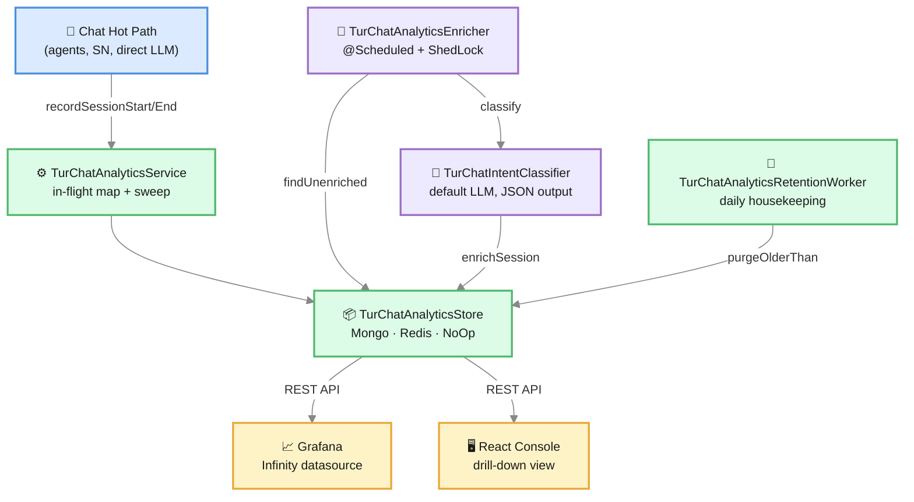

# Chat Analytics

> *Every conversation your AI just had is a customer telling you what they want, what frustrated them, and whether you delivered. Chat Analytics is how you actually listen.*

By the time a thousand customers have talked to your AI Agent, you have a thousand small data points about your product, your messaging, and your funnel. The question isn't whether the data is there — it's whether you can hear it.

**Chat Analytics** in Turing ES turns finished chat sessions into a queryable, AI-classified, dashboardable stream:

- Every session emits a row to the analytics store the moment it ends.
- A scheduled **AI-on-AI classifier** then reads each transcript and labels it with **intent**, **goal achievement**, **sentiment**, and **key terms**.
- Grafana dashboards show **trends** (goal-rate over time, sentiment drift) and **comparisons** (which agent, which persona is dragging the mean).
- A drill-down view in the React console lets you open *one* conversation and read it end to end — the metadata, the AI verdict, the full transcript.

You decide the storage backend with one config line:

```yaml
turing:
  logging:
    engine: mongodb   # or "redis" or "none"
```

`none` means no analytics. `mongodb` is recommended for production volumes; `redis` is fine for dev or low traffic. Same API, same dashboards, same drill-down view.

---

## Why It Exists

Three problems Chat Analytics solves that vanilla logging doesn't:

1. **Aggregate analytics from semi-structured conversations.** A log file tells you *"the request happened"*. It doesn't tell you *"the customer asked about pricing, the agent answered well, and the customer left positive."* Analytics needs structure on top of raw logs.
2. **Decoupled from chat hot path.** Recording analytics shouldn't slow down the chat. Turing ES emits session events asynchronously — the store doesn't block a single millisecond on the conversation.
3. **Engine-agnostic dashboards.** Mongo and Redis are very different stores. The Grafana dashboards, the REST API, and the React drill-down don't know which one you're using. Swap with a config change.

---

## Architecture



There are five moving pieces:

| Piece | Responsibility |
|---|---|
| **`TurChatAnalyticsService`** | Façade in front of the store; in-memory `inFlight` map of open sessions; periodic sweep prevents leaks |
| **`TurChatAnalyticsStore`** | Engine-agnostic interface implemented by three stores (MongoDB / Redis / NoOp) |
| **`TurChatIntentClassifier`** | The AI-on-AI labeler — calls the default LLM with the transcript, parses JSON, returns intent / goal / sentiment / key terms |
| **`TurChatAnalyticsEnricher`** | `@Scheduled` worker (every 5 min by default, ShedLock-protected) that picks unclassified terminal sessions and asks the classifier to label them |
| **`TurChatAnalyticsRetentionWorker`** | `@Scheduled` daily housekeeping — deletes sessions older than `retention-days` (off by default) |

The chat hot path only ever talks to `TurChatAnalyticsService`. Everything else is downstream and asynchronous.

---

## What Gets Recorded

Every chat session produces one row, identified by `conversationId`. The row is upserted twice:

1. **Session start** — when the user sends the first message.
2. **Session end** — when the conversation reaches a terminal state (the user closed the chat, the conversation timed out, or the executor explicitly ended).

Between start and end, **turns** are accumulated in memory only — they update the row at the end. This avoids a database write per turn.

| Column | When set | What it means |
|---|---|---|
| `conversationId` | Start | Unique key. Matches the chat-memory `conversationId` so transcripts can be joined. |
| `agentId` | Start | Which AI Agent handled the conversation (or `null` for direct LLM / SN chat) |
| `personaId` | Start | Which persona was attached to the agent |
| `llmInstanceId` | Start | Which LLM ran the conversation |
| `embeddingModelId` | Start | Embedding model used (for RAG-augmented sessions) |
| `storeInstanceId` | Start | Vector store used for retrieval |
| `userId` | Start | User identifier when authenticated; `null` otherwise |
| `locale` | Start | Conversation locale |
| `firstUserMessage` | Start (write-once) | The opening question — useful as a fallback for classifiers when memory is disabled |
| `startedAt` / `completedAt` | Start / End | Wall-clock timestamps |
| `outcome` | End | `COMPLETED` · `ABANDONED` · `ERROR` · `IN_PROGRESS` |
| `totalTurns` | End | How many user-assistant exchanges happened |
| `totalTokensIn` / `totalTokensOut` | End | Aggregate token usage |
| `durationMs` | End | End-to-end conversation duration |

The next set are populated *later* by the AI-on-AI enricher:

| Column | Populated by | Range |
|---|---|---|
| `intentLabel` | Enricher | `SUPPORT` · `ONBOARDING` · `EXPLORATION` · `COMPLAINT` · `INFORMATION_SEEKING` · `CONVERSION_INTENT` · `OTHER` · `UNCLASSIFIED` |
| `intentConfidence` | Enricher | 0.0–1.0 — the LLM's self-reported confidence |
| `goalSummary` | Enricher | One-sentence summary of what the user was trying to achieve |
| `goalAchieved` | Enricher | `YES` · `PARTIAL` · `NO` · `UNKNOWN` |
| `sentiment` | Enricher | `POSITIVE` · `NEUTRAL` · `NEGATIVE` · `FRUSTRATED` · `UNKNOWN` |
| `keyTerms` | Enricher | Up to 5 — the topic anchors |
| `processedAt` | Enricher | Watermark — sessions with this set are skipped on the next cycle |

`UNCLASSIFIED` is the *honest* value when the classifier was off, the LLM returned junk JSON, or the transcript was empty. We mark `processedAt` anyway so the session isn't reprocessed forever.

---

<div className="page-break" />

## The AI-on-AI Classifier

The classifier is a small service that does one thing: take a transcript, ask the default LLM to label it, parse the response.

The system prompt is fixed and structured:

```
You are an analyst that classifies a chat conversation between a user and an AI agent.
Read the transcript and infer:
  - the user's INTENT (one of: SUPPORT, ONBOARDING, EXPLORATION, COMPLAINT,
    INFORMATION_SEEKING, CONVERSION_INTENT, OTHER),
  - their GOAL summarised in one short sentence,
  - whether that goal was ACHIEVED by the agent (YES, PARTIAL, NO, UNKNOWN),
  - the user's SENTIMENT toward the agent (POSITIVE, NEUTRAL, NEGATIVE, FRUSTRATED,
    UNKNOWN; FRUSTRATED is reserved for repeated rephrasing or escalating tone),
  - up to 5 KEY TERMS that capture the topic.
Respond with ONLY valid JSON, no Markdown fences, no commentary.
```

Two design decisions worth understanding:

1. **Tolerant parsing.** Some models wrap JSON in ```` ```json ```` fences despite the instruction; the parser strips them. Missing fields collapse to `UNKNOWN`/empty rather than failing the entire classification. This is the difference between a working pipeline and one that silently drops data.
2. **Default-LLM resolution.** The classifier uses whatever LLM is set as the **Default LLM** in [Global Settings](./genai-llm.md#global-settings). One global decision; no per-session override. Picking a fast, cheap model here matters — this runs on every finished session.

The classifier records two telemetry signals on every call (see [Observability](./observability.md)):

| Metric | Why it matters |
|---|---|
| `turing.chat.analytics.classify` (Timer) | Latency per classification — tracks model speed |
| `turing.chat.analytics.classifications` (Counter) | Outcome distribution — `classified` / `unclassified` / `error` / `skipped` / `empty_transcript`. If `error` or `unclassified` rises, you know something's wrong without reading logs. |

The LLM call itself flows through the standard `TurLlmObservation`, so the enricher's LLM cost shows up alongside the rest of your chat traffic on the same Grafana panels — same `provider`/`model` tags, same Prometheus series.

---

## The Enricher: Cluster-Safe, Backpressure-Aware

The enricher runs as a `@Scheduled` Spring service, gated by ShedLock so a multi-node deployment doesn't process the same session four times. Defaults:

| Tunable | Default | Purpose |
|---|---|---|
| `turing.chat.analytics.enrich.cron` | every 5 minutes | How often to look for unenriched sessions |
| `turing.chat.analytics.enrich.batch-size` | 20 | How many to process per cycle. Keep small so a slow LLM doesn't starve the lock. |
| `turing.chat.analytics.enrich.transcript-messages` | 30 | How many of the most recent messages to feed the classifier |

Each cycle does:

1. Skip if the analytics store is disabled, or if the default LLM is offline.
2. Pull up to `batch-size` sessions where `outcome != IN_PROGRESS && processedAt is missing`.
3. For each, read the transcript from `TurChatMemoryStore` and call `TurChatIntentClassifier.classify(...)`.
4. Write the enrichment columns + `processedAt` back to the store.
5. Log: `processed=N classified=X unclassified=Y elapsedMs=Z`.

The cycle is wrapped in a Micrometer Timer (`turing.chat.analytics.enrich.cycle`) so you can see in Grafana whether it's keeping up or falling behind.

:::tip Backpressure: how to know if you're keeping up
If the enricher is *not* keeping up, the cycle's `elapsedMs` will keep growing, **and** the count of unenriched sessions in Mongo/Redis will rise without bound. Two levers: increase `batch-size` (faster catch-up, but each cycle takes longer) or shorten the cron interval. There's no silver bullet — both burn LLM tokens.
:::

---

<div className="page-break" />

## Storage Backends

You pick **one** backend per deployment. They expose the same interface; switching between them is a config change.

### MongoDB (recommended for production)

```yaml
turing:
  logging:
    engine: mongodb
    mongodb:
      uri: mongodb://localhost:27017
      database: turing_analytics
      collection: chat_sessions
```

**What you get:**

- Server-side aggregation (`$group`, `$dateTrunc`) — fast time-bucketed queries even with millions of sessions.
- Secondary indexes auto-created at startup: `{startedAt: -1}`, `{processedAt: 1}`, `{agentId, startedAt}`, `{personaId, startedAt}`, `{outcome}`.
- Idempotent upserts via `$set` / `$setOnInsert` — start fields are preserved across the start→end transitions.

### Redis (development, low-volume)

```yaml
turing:
  logging:
    engine: redis
    redis:
      uri: redis://localhost:6379
      key-prefix: turing:chat
```

**What you get:**

- One `HASH` per `conversationId`, plus a sorted set indexed by `startedAt` for time-range scans.
- All aggregation runs in-process — fine up to a few thousand sessions per day, slow beyond that.
- Same drill-down API and same dashboards as Mongo.

### None (disabled)

```yaml
turing:
  logging:
    engine: none
```

A no-op store is wired in. Calls compile and run, but write nothing and return empty lists. The Chat Analytics React page shows a friendly *"analytics is disabled"* card instead of an empty dashboard.

---

## The In-Flight Map and Why It Has a Sweep

`TurChatAnalyticsService` keeps a `ConcurrentHashMap` of *currently active* sessions. Each entry holds the start timestamp + cumulative turn/token counters. Entries are removed when `recordSessionEnd(...)` fires.

But: what if a worker dies mid-session? What if the front-end disconnects and never sends an end event? Without protection, the map grows monotonically.

So:

- A **periodic sweep** runs every hour (`turing.chat.analytics.inflight.sweep-ms`) and removes entries older than `turing.chat.analytics.inflight.max-age-hours` (default 4h — well past any realistic conversation).
- A **gauge** (`turing.chat.analytics.inflight.size`) exposes the current count to Prometheus, so a slow leak is visible *before* it becomes memory pressure.

The sweep runs per-process — each node trims its own state. No cluster lock needed.

---

## Retention

Customer transcripts are sensitive. They contain whatever the customer typed — questions, frustrations, sometimes PII. You probably don't want to keep them forever.

The **retention worker** runs daily (`turing.chat.analytics.retention.cron`, default `0 17 3 * * *` — 03:17 UTC, off-peak) and deletes sessions older than `turing.chat.analytics.retention-days`.

Default is **0** — disabled. Operators **opt in explicitly**, because *"delete history"* is a one-way action. When you turn it on:

```yaml
turing:
  chat:
    analytics:
      retention-days: 90
```

A daily log line tells you how many were removed:

```
[ChatRetention] removed 142 session(s) older than 2026-01-08T03:17:00Z (90 days)
```

Like the enricher, the retention worker is ShedLock-protected — only one node runs it per cycle.

---

<div className="page-break" />

## REST API

All endpoints are read-only and live under `/api/system/chat-analytics`. Designed to be consumed by Grafana via the [Infinity datasource](https://grafana.com/grafana/plugins/yesoreyeram-infinity-datasource/) — engine-agnostic JSON/HTTP.

:::warning Requires authentication
These endpoints expose session transcripts and other end-user chat content, so they require an **authenticated admin** (`ROLE_ADMIN` / `AI_AGENT_VIEW`) — they are **not** anonymous. Configure your Grafana Infinity datasource with HTTP Basic auth using a Turing admin account (the shipped provisioning uses Basic auth with placeholder credentials — replace them). See [Security Hardening § chat-analytics](./security-hardening.md#3-chat-analytics-api-requires-authentication).
:::

### Health

| Method | Endpoint | Returns |
|---|---|---|
| `GET` | `/health` | `{ "enabled": true, "engine": "mongodb" }` |

Used by Grafana provisioning and the React page to show a friendly disabled banner instead of empty panels.

### Listing

| Method | Endpoint | Description |
|---|---|---|
| `GET` | `/sessions` | Recent sessions in `[from, to]`. Filters: `agentId`, `personaId`, `outcome`, `intentLabel`, `goalAchieved`, `sentiment`, `limit` |
| `GET` | `/aggregate` | Counts grouped by a chosen dimension. `by`: `outcome` (default), `agentId`, `personaId`, `intentLabel`, `goalAchieved`, `sentiment`, `locale`. `limit` (default 20) |

### Trends

| Method | Endpoint | Description |
|---|---|---|
| `GET` | `/timeseries` | Time-bucketed metric. `interval`: `hour` or `day`. `metric` is one of the **nine** metrics below |
| `GET` | `/scorecard` | Per-dimension scorecard. `dimension`: `agentId` or `personaId`. Optional **cohort filters** (T74): `deviceType`, `locale`, `timezone`, `experimentKey`, `variantLabel`. Returns `sessions`, `goalAchievedRate`, `negativeRate`, `avgDurationMs`, `topIntent` |

The `/timeseries` endpoint supports all **nine** recorded metrics — the conversation-quality five plus four tool-health metrics:

| Metric | Meaning |
|---|---|
| `sessions` | Session count per bucket |
| `goal_achievement_rate` | `YES = 1`, `PARTIAL = 0.5`, `NO/UNKNOWN = 0`, ÷ enriched sessions in the bucket |
| `negative_sentiment_rate` | Share of enriched sessions whose sentiment is `NEGATIVE` or `FRUSTRATED` |
| `avg_duration_ms` | Average end-to-end conversation duration |
| `avg_tokens_out` | Average output tokens per session |
| `tool_calls_per_session` | Average number of tool invocations per session |
| `tool_errors_per_session` | Average number of tool errors per session |
| `avg_tool_latency_ms` | Average tool latency (see the disaggregated p95 view below) |
| `tool_error_rate_pct` | Tool errors ÷ tool calls × 100 |

**Cohort filters (T74)** let you ask *"does this variant win on mobile / in pt-BR / in America/Sao_Paulo?"* — pass `dimension=variantLabel` plus `deviceType=mobile` (or any combination of the cohort params) to slice the scorecard by visitor sub-population.

### Drill-down

| Method | Endpoint | Description |
|---|---|---|
| `GET` | `/sessions/{id}` | Single session document — 200 with full row, 404 if not found |
| `GET` | `/sessions/{id}/transcript?limit=200` | Joins the session metadata with the full chat-memory transcript: `{ session, messages[] }` |

The drill-down endpoints power the **Chat Analytics** page in the React console — list of sessions on the left, click a row, side panel opens with metadata + AI enrichment + full transcript.

### Diagnostics

| Method | Endpoint | Description |
|---|---|---|
| `GET` | `/tool-latency` | Per-tool latency percentiles (p50/p95/p99, min/max/avg, error count + rate). Filters: `from`, `to`, `agentId`, `limit` (default 50) |
| `GET` | `/router-decisions` | Recent flow-router decisions: candidate flows, score, winner, method. Filters: `conversationId`, `limit` (default 100) |
| `GET` | `/slot-sse-channels` | Live snapshot of open slot-stream SSE channels on this node, with refcounts |
| `GET` | `/experiment/{key}/significance` | A/B significance (two-proportion z-test). See [Experiments](./experiments.md) |
| `POST` | `/experiment/{key}/promote` | Promote the winning variant. See [Experiments](./experiments.md) |

---

## Grafana Dashboard: Turing Chat Insights

Provisioned at `containers/grafana/dashboards/turing-chat-insights.json`. Fifteen panels organized in five rows. Engine-agnostic — calls the REST API via the Infinity datasource, so Mongo and Redis render identically.

### Row 1 — At a glance

| Panel | What it shows |
|---|---|
| **Total chat sessions** | Big number for the period |
| **Outcome distribution** | Donut: `COMPLETED` · `ABANDONED` · `ERROR` · `IN_PROGRESS` |
| **Sessions by agent** | Bar chart |
| **Analytics store** | Engine indicator (`mongodb` / `redis` / `none`) |

### Row 2 — Demographics

| Panel | What it shows |
|---|---|
| **Sessions by persona** | Which personas are getting traffic |
| **Sessions by locale** | Which markets are talking |

### Row 3 — AI verdicts

| Panel | What it shows |
|---|---|
| **Sessions by intent** | Donut color-coded by intent (`SUPPORT` red, `CONVERSION_INTENT` yellow, etc.) |
| **Goal achievement** | Horizontal bar — `YES` green / `PARTIAL` yellow / `NO` red |
| **Sentiment distribution** | Donut — `POSITIVE` green / `NEGATIVE` red / `FRUSTRATED` purple |

### Row 4 — Recent sessions

A wide table (100 rows) with every column, including the enrichment ones. Color-coded cells for `outcome`, `intent`, `goalAchieved`, `sentiment`. `intentConfidence` rendered as a percentage.

### Row 5 — Trends and scorecards

| Panel | What it shows |
|---|---|
| **Goal-achievement rate over time** | Smoothed line — drops trigger investigation |
| **Negative + frustrated sentiment over time** | The spike-detector for "something hurts" |
| **Sessions per hour** | Traffic shape |
| **Scorecard by agent** | Sessions, goal rate, negative rate, avg duration, top intent — sortable |
| **Scorecard by persona** | Same shape, dimension-shifted — separates *agent identity* from *persona configuration* |

See [Observability](./observability.md) for the full Grafana setup, including the Infinity datasource provisioning and how the dashboards are loaded at container start.

---

<div className="page-break" />

## The Investigation View (React Console)

`Console → Chat Analytics` is where individual conversations come to life. The page is two halves:

**Left:** the Recent sessions table with the same color-coded enrichment columns from Grafana — sortable, scrollable, last 100 sessions over the last 7 days.

**Right (slide-out):** click any row, a Sheet opens with three cards:

1. **Session metadata** — start/end timestamps, duration, agent, persona, LLM, locale, user ID, turn count, token totals.
2. **AI enrichment** — intent + confidence as badges, goal-achieved badge, sentiment badge, goal summary, key terms as chips, plus the per-turn **sentiment trajectory** line chart. If the session hasn't been classified yet, a *"Awaiting enrichment — the scheduler runs every 5 minutes"* note.
3. **Replay timeline** — every message in role/timestamp/content blocks, interleaved with slot-audit writes and stepped through with playback controls (see [Conversation replay](#conversation-replay) above).

The drill-down is pulled from the `/sessions/{id}/transcript` endpoint — one API call per session opened. Joins the analytics store with the chat-memory store on `conversationId`.

:::tip From investigation to product decision
The drill-down isn't just for QA — it's a feedback channel into your product. Open the sessions where `goalAchieved == NO` and `sentiment == FRUSTRATED`. Read the first user message. The patterns you'll find — *"users are looking for X but our agent doesn't know about X"* — are your roadmap. Conversely, sessions where `goalAchieved == YES` and `sentiment == POSITIVE` are gold for your [Persona few-shot store](./personas.md#the-few-shot-store-teach-by-example).
:::

---

<div className="page-break" />

## Beyond the Basics: Funnels, Replay & Live Diagnostics

The session row and the Grafana dashboard tell you *what* happened in aggregate. These newer surfaces tell you *where* and *why* — they live in the **Chat Analytics** console page alongside the drill-down.

### Funnel visualization

For a conversation driven by a [Chat Flow](./chat-flow.md), the funnel panel shows **where people drop off**. It aggregates the in-flight cursor positions (conversations currently parked on a node) with the terminal submission counts, producing a per-node "reached → continued" bar so a step that bleeds users is obvious at a glance. When the node-visit log is enabled it becomes **path-aware** — you see the actual path through the graph, not just the final node. Use it to answer *"which question makes people quit?"*.

### Conversation replay

The drill-down transcript is more than a chat log: it's a **replay timeline** that interleaves the chat-memory messages with the [slot-audit entries](./chat-flow.md) (every slot write, with its origin — node / tool / endpoint / extract). Playback controls (play/pause, prev/next, a scrubber, and "show all") let an operator step through a conversation **moment by moment** — message, then the slot it filled, then the next message — to see exactly when and how a value was captured. This is the tool for *"the lead's email is wrong — where did that come from?"*.

### Sentiment trajectory

The single `sentiment` label tells you how a conversation *ended*. The **sentiment trajectory** tells you the *shape* of the whole conversation: a per-turn array (turn 1..N) of sentiment, rendered as a line chart in the drill-down. A conversation that starts positive and nose-dives at turn 4 points you straight at the turn where it soured — far more actionable than a single end-state label. (LLM-enriched sessions only.)

### Flow router decision logs

When an agent has multiple flows, the router decides which one (if any) handles each turn. The **router decisions** view (`/router-decisions`) records, per decision: the **candidate flows**, each one's **score**, the **winner**, and the **method** (procedural / LLM / cached-LLM). Pass a `conversationId` to see only that conversation's decisions. This answers *"why did the agent pick the wrong flow here?"* without turning on debug logging.

:::caution Per-node, ephemeral
Router decisions and SSE-channel snapshots are **in-memory and per-node** — you see only this JVM's recent ring, and it resets on restart. They're a live diagnostic surface, not a historical store.
:::

### SSE channel debug

The **slot-SSE-channels** view (`/slot-sse-channels`) is a live snapshot of the open slot-stream SSE channels on this node, with a **refcount** per channel. It's the tool for confirming channels are reclaimed when a browser tab closes — if the open-channel count only ever grows, something isn't unsubscribing. The SDK exposes a matching `_slotsSseOpenChannelCount()` for parity checks.

### Trigger conflict resolver

Not strictly analytics, but adjacent: when two flows on the same agent have **overlapping trigger descriptions**, the router can't reliably tell them apart. The trigger-conflict resolver (`GET /chat-flow/trigger-conflicts`) runs a Jaccard similarity over the analyzer-stemmed trigger descriptions and flags `HIGH`/`WARNING` pairs, surfaced in the flow editor. See [Chat Flow](./chat-flow.md).

---

## How to Read the Data

The dashboard is full of numbers. Here's how to turn them into actions.

### Conversion diagnostics

| What you see | What it likely means | What to do |
|---|---|---|
| `goal_achievement_rate` falling week over week | Your prompts or persona drifted out of sync with what users actually need | Drill into recent failed sessions; update agent system prompt or persona examples |
| `negative_sentiment_rate` spiking on Mondays | Could be a deploy that broke something Sunday night | Cross-reference with deploys; check `outcome=ERROR` rate and `turing.llm.calls{status="error"}` |
| One agent has a goal rate 30% below the others | Agent-specific issue: bad prompt, wrong tools attached, or wrong LLM | Open the agent's scorecard row; click *Sessions by agent* → filter; look for failure pattern |
| One persona scores worse than another for the same agent | The persona's tone/forbidden vocabulary is fighting the agent | Scope the persona tighter (one persona per funnel stage, not one persona for everything) |
| `intentConfidence` consistently below 0.5 | The classifier LLM is too small for the task, OR your conversations are genuinely ambiguous | Try a stronger default LLM in Global Settings; or accept the ambiguity and act on the trend, not single rows |

### Cost diagnostics

The enricher itself burns tokens on every session. Watch the same metric panel that tracks chat traffic:

- `turing.llm.tokens{provider, model, direction}` — split by direction (`in` / `out`) and by provider.
- The enricher's tokens flow through the same series. Compare daily totals; a sudden spike usually means the enricher is processing a backlog.

To make the enricher cheaper:

- **Pick a fast/cheap default LLM** (GPT-4o-mini, Gemini Flash) — the classification task doesn't need a frontier model.
- **Lower `transcript-messages`** — 30 is generous; 15 is often enough to classify intent accurately.

---

## Configuration Reference

```yaml
turing:
  logging:
    engine: mongodb           # "mongodb" | "redis" | "none"
    mongodb:
      uri: mongodb://localhost:27017
      database: turing_analytics
      collection: chat_sessions
    redis:
      uri: redis://localhost:6379
      key-prefix: turing:chat
  chat:
    analytics:
      enrich:
        cron: "0 */5 * * * *"            # every 5 minutes
        batch-size: 20                   # sessions per cycle
        transcript-messages: 30          # most-recent messages fed to the classifier
      retention-days: 0                  # 0 = disabled (default)
      retention:
        cron: "0 17 3 * * *"             # daily 03:17 UTC
      inflight:
        max-age-hours: 4                 # eviction threshold for in-flight map
        sweep-ms: 3600000                # sweep cadence (1 hour)
```

---

## Related Pages

| Page | Description |
|---|---|
| [AI Agents](./ai-agents.md) | The agents whose conversations are being analyzed |
| [Personas](./personas.md) | The voice layer — analytics is how you measure if the persona converts |
| [Chat](./chat.md) | The interface that produces the conversations |
| [Chat Flow](./chat-flow.md) | The flows whose funnel, slot-audit replay, and trigger conflicts are analyzed here |
| [Experiments](./experiments.md) | A/B significance + champion-challenger promotion (the scorecard's experiment dimensions) |
| [Cost Governance](./cost-governance.md) | The USD-spend companion to these conversation metrics |
| [Observability](./observability.md) | Prometheus + Grafana — the full metrics stack |
| [Configuration Reference](./configuration-reference.md) | All `turing.*` properties |

---
