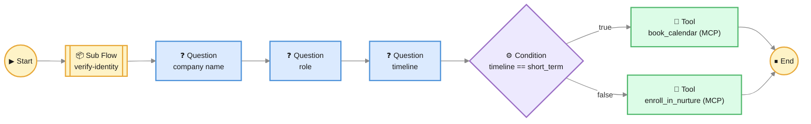

# Chat Flow

> *Sometimes a conversation needs to go somewhere specific. A demo qualification has six questions in a precise order. An onboarding wizard has a checklist that can't be skipped. A support escalation collects four pieces of information before opening a ticket. **Chat Flow** is how you draw those journeys — visually, declaratively, and in five minutes.*

A **Chat Flow** is a graph of conversational steps attached to an [AI Agent](./ai-agents.md). Each step (a *node*) is a small contract — *"ask this, validate that, store this answer in this variable, then go to the next step"*. The agent still uses the LLM to talk to the user; the flow steers the conversation while the LLM does the talking.

Three things make Chat Flow special:

1. **Visual authoring.** You drag nodes onto a canvas, draw edges between them, and the runtime walks the graph for you. No code.
2. **Multiple guardrail strategies.** You decide *how strictly* the flow is enforced — from a lightweight prompt-only nudge to a JSON-validating LLM judge.
3. **Vibe Coding.** A built-in AI authoring chat lets you describe the flow in plain English (*"a five-step demo qualification flow that collects company name, role, current solution, decision timeline, and email"*) and watch it draw itself. You revise it the same way: *"split the timeline question into two — short term and long term"*.

Configure flows in **Administration → AI Agents → \<your agent\> → Chat Flow**.

---

## When You Need a Chat Flow

A free-form agent works beautifully when the conversation is open-ended. *"Help me find a product"* or *"explain this concept"* don't need scripted scaffolding — the LLM and your tools are enough.

But there are conversations where you actually need to **collect specific information in a specific order**:

| Goal | Needs a flow because… |
|---|---|
| Qualify a sales lead | Five questions you need answered, every time, in order |
| Open a support ticket | Four pieces of info required by your ticketing system |
| Walk a new user through onboarding | Each step depends on the previous one being confirmed |
| Run a survey or NPS conversation | Questions follow a strict structure for analysis later |
| Gather KYC / compliance information | Regulators expect a complete audit trail of *what was asked* and *what was answered* |

Without a flow, you'd write a 1,500-token system prompt full of *"first ask this, then ask that, never skip..."* — and the LLM would still skip something halfway through. With a flow, the prompt is short, the order is enforced by the engine, and every collected value is stored in a typed variable.

---

## The Five Block Types

A Chat Flow graph is built from **five node types**. Each one has a specific runtime behavior.



A typical demo-qualification graph: an identity sub-flow at the start, three Question nodes, a Condition, and one of two Tool nodes depending on the timeline.

### 1. Start

The single entry point of every flow. There is exactly one Start node per flow. It has no input edges and one output edge to the first real step.

The Start node is invisible to the user — the conversation simply begins at the node it points to.

### 2. Question

The bread and butter of a flow. A Question node:

- Carries an **AI Instruction** — what the LLM should ask the user. Written in natural language: *"Ask the user what their current monthly active user count is. Frame it as a market-sizing question, not an audit."*
- Optionally has a **Validation Rule** — what counts as a valid answer. *"Must be a number; if the user says 'a lot' or 'many', ask them to estimate."*
- Stores the user's answer in an **Output Variable** — a named slot in the flow's state (e.g., `monthly_active_users`).

When a Question node is active, the runtime injects the AI Instruction into the system prompt so the LLM knows exactly what to ask. The LLM still controls the *wording*, the *register*, the *follow-up* — but the *intent* is locked.

### 3. Condition

Branches the flow based on collected variables. A Condition node has:

- A **Condition Expression** evaluated against the flow's variables (e.g., `monthly_active_users > 10000`).
- **Two outgoing edges** — one labelled *true*, one labelled *false*. The runtime follows whichever matches.

Use Condition nodes to skip questions that don't apply, route enterprise leads differently from self-serve, or fork a survey based on an earlier answer.

### 4. Tool

Calls a tool *as part of the flow*, not because the LLM asked for it. A Tool node has:

- A **tool source** — `native` (one of the 27 [native tools](./tool-calling.md)), `mcp` (a connected [MCP server](./mcp-servers.md)), or `custom` (a [Custom Tool](./custom-tools.md) you authored).
- The **tool identifier** — function name for native, server id for MCP, custom-tool id for custom.

Use Tool nodes when a step needs a deterministic action *between questions*. Examples:

- After collecting an email, call a CRM lookup MCP to enrich with the company.
- After a series of preferences, call `search_knowledge_base` to retrieve recommendations.
- After collecting an issue description, call a custom Groovy tool that opens a Jira ticket and returns the ID.

The result of the tool call lands in a flow variable and the conversation continues.

### 5. Sub Flow

The composition primitive. A Sub Flow node points at *another* Chat Flow on the same agent and runs it inline. When the sub-flow reaches its End node, control returns to the parent flow's next node.

Use Sub Flows for shared building blocks:

- A *"collect-contact-info"* sub-flow used by the demo qualification, the trial signup, and the support escalation.
- A *"verify-identity"* sub-flow used at the start of any compliance-sensitive workflow.
- A *"NPS-prompt"* sub-flow triggered at the end of a successful conversation.

Sub-flows have their own state row (`TurChatFlowState.parentStateId` records the call stack). Variables collected in the sub-flow are available in the parent when control returns.

### End

Terminator. Like Start, exactly one per flow. When the runtime reaches End, it marks the flow's state as completed, persists a `TurChatFlowSubmission` row (full collected variables + outcome), and the conversation continues normally — the agent is back to free-form mode.

---

<div className="page-break" />

## Guardrails: Three Strategies, Three Levels of Strictness

The same flow graph can be enforced **three different ways** at runtime. You pick per-flow which strategy fits the conversation. There is no "best" — there is a tradeoff between strictness, latency, and token cost.

### Strategy 1 — `HEURISTIC` (default)

**The fast lane.** No extra LLM calls. The current node's instruction is injected as a firm contract in the system prompt; after the LLM replies, a lightweight Java-side heuristic decides whether the user gave a valid answer and the engine advances.

| Property | Value |
|---|---|
| Extra LLM calls | 0 |
| Latency overhead | None |
| Token overhead | ~50–150 tokens added to system prompt |
| Strictness | Low — the LLM may sometimes accept fuzzy answers |
| Use when | The flow is conversational, customers can rephrase, and the cost of a mis-route is low |

Heuristic is the right starting point for most flows. Run it. Watch [Chat Analytics](./chat-analytics.md) for sessions where the goal wasn't achieved. Upgrade only if you see drift.

### Strategy 2 — `LLM_JUDGE`

**Two-call enforcement.** After the chat LLM replies to the user, a *second* LLM call ("the judge") is made with a tiny structured prompt: *"Was the user's answer on-topic? Did they provide a valid value? Should we advance?"* The judge returns JSON like:

```json
{
  "on_topic": true,
  "collected_value": "12500",
  "ready_to_advance": true
}
```

If `on_topic` is false, the engine substitutes a redirect message (*"Let's stay on track — could you share your monthly active users?"*) instead of advancing. If `collected_value` is present, it's stored in the node's output variable.

| Property | Value |
|---|---|
| Extra LLM calls | 1 per turn while a flow is active |
| Latency overhead | ~200–500ms (judge call) |
| Token overhead | ~200 tokens per turn |
| Strictness | High — drift is caught and corrected |
| Use when | The flow is a structured form (KYC, compliance), drift costs money or violates policy |

The judge can use a smaller, cheaper model than the chat LLM — its job is classification, not generation.

### Strategy 3 — `STRUCTURED_OUTPUT`

**Single-call enforcement.** Instead of two LLM calls, the chat LLM is instructed to reply with a **single JSON object** that bundles both the user-facing message *and* the verdict:

```json
{
  "reply": "Got it — 12,500 monthly active users. Next, what's your role on the team?",
  "on_topic": true,
  "collected_value": "12500",
  "ready_to_advance": true,
  "abandoned": false
}
```

The engine extracts `reply` and shows it to the user; applies the verdict; advances. One call, full enforcement.

| Property | Value |
|---|---|
| Extra LLM calls | 0 (the chat call carries both) |
| Latency overhead | None — the judge piggybacks on the reply |
| Token overhead | ~100 tokens (structured response is more verbose than free text) |
| Strictness | High — same as `LLM_JUDGE` |
| Use when | You want strict enforcement *and* low latency |

Modern providers (OpenAI, Gemini, Ollama) follow JSON instructions reliably. Anthropic occasionally drifts to free text — when that happens, the engine falls back gracefully to heuristic mode for that turn.

:::tip Picking a strategy
Start with `HEURISTIC`. Run it for a week. Read 20 sessions in [Chat Analytics](./chat-analytics.md) drill-down — pay attention to ones that ended with `goalAchieved=NO` or `sentiment=FRUSTRATED`. If the LLM was drifting off-topic, upgrade to `STRUCTURED_OUTPUT`. Only escalate to `LLM_JUDGE` if `STRUCTURED_OUTPUT` falls back too often (provider-specific issue) or if you need the judge to use a different model from the chat LLM.
:::

---

## Trigger Modes: Auto-Routing or Manual

A flow doesn't run unless something *picks* it. Two ways:

### Auto-trigger via the LLM router

When you set a **Trigger Description** on a flow (e.g., *"User wants to book a demo or qualify their team for a sales call"*), the engine includes it in a tiny LLM router prompt at the start of every chat turn. The router decides: does the user's message match any of this agent's flow descriptions? If yes, that flow becomes active.

| Trigger Mode | Behavior |
|---|---|
| `ONCE` (default) | Auto-trigger at most once per conversation. After the flow reaches End, the router won't pick it again in this conversation. |
| `ALWAYS` | Re-trigger whenever the router decides the message matches — even after a previous run. |

Leave Trigger Description blank to disable auto-trigger entirely. The flow can still be invoked manually.

### Manual selection

Users (or the front-end) can explicitly start a flow by name. This bypasses the router and is useful when:

- You want a button on the front-end (*"Schedule a demo"*) that always starts the qualification flow.
- A flow is sensitive enough that you don't want the router making the call (e.g., compliance KYC — only triggered by an authenticated admin).

---

<div className="page-break" />

## Per-Conversation State

Every running flow has a `TurChatFlowState` row identified by `(conversationId, flowId)`. It tracks:

| Field | What it holds |
|---|---|
| `currentNodeId` | The node the user is currently on |
| `variablesJson` | All collected output variables, JSON-serialized |
| `parentStateId` | Set when this state is running a sub-flow — points to the parent state. The runtime walks back up when the sub-flow ends. |
| `updatedAt` | Last touched — useful for stale-flow cleanup |

The state is updated **after** the assistant replies — so if the conversation crashes mid-turn, the state still reflects the last completed step.

When the End node is reached, the engine writes a **`TurChatFlowSubmission`** row: the full graph traversal, all collected variables, and the outcome. This is your audit log. You can list submissions by flow:

```
GET /api/ai-agent/{agentId}/chat-flow/{flowId}/submissions
```

A common pattern: a CRM integration listens for new submissions and creates a deal automatically, populated from the variables.

---

## Vibe Coding: Author Your Flow With AI

Building a flow visually is fast. Building it by *describing it* is faster.

Click **Vibe Coding** on the flow editor and you're talking to an authoring assistant whose entire job is *"build the chat flow this user wants"*. Two modes of interaction:

### First-turn creation

You describe the flow in plain English — short or long, structured or rambling, your call. The assistant returns a complete graph: nodes positioned, edges connected, instructions written, output variables named.

> **You:** *"I need a five-step demo qualification: company name, role, current solution, decision timeline (under 3 months / 3-6 months / over 6 months), and email. After collecting all five, call our CRM via MCP to look up the company. End the flow."*
>
> **Assistant:** *"Done. I've created six Question nodes for the data you listed, a Tool node calling your `crm-lookup` MCP server after the email, and an End node. The decision timeline question uses a Condition node so you can branch the follow-up depending on urgency. Take a look — I positioned everything left to right with the Start node on the far left."*

The flow appears on the canvas. You can drag, edit, save.

What's happening under the hood:

- The assistant is given a **rich system prompt** documenting every node type, every field, edge handle conventions, layout rules, and current guardrail/trigger policy.
- It returns a structured `ChatFlowGeneration` JSON the engine post-processes: deterministic positioning, id normalization, connectivity validation. Common mistakes (missing Start, dangling edges, Condition without two branches) are auto-corrected.

### Revision turns

Once a flow exists, you can keep talking:

> **You:** *"Split the timeline question into two — one for short-term plans (this quarter) and one for long-term (this year)."*
>
> **Assistant:** *"Done. I split the timeline node into `short_term_plans` and `long_term_plans`, kept them in sequence after the role question, and adjusted the CRM lookup to fire after both are collected."*

In revision turns the model sees the **full current state** plus a slimmer *edit-focused* prompt. It only changes what you asked for; the rest of your graph stays untouched.

:::tip When Vibe Coding is the right move vs. visual editing
**Vibe Coding wins** when you're starting from scratch, when you're rearranging structurally (*"split this", "merge those"*), or when you don't yet know what blocks you'll need. **Visual editing wins** when you're tweaking copy on a single node, dragging to reorganize visually, or fine-tuning a validation rule. Use both — they edit the same graph.
:::

The same Vibe Coding pattern is available for [Intents](./intent.md) and [Custom Tools](./custom-tools.md). The pattern is general — described in [AI Authoring (Vibe Coding)](./ai-agents.md) — but Chat Flow is the most powerful expression of it because of the structural complexity of the graph.

---

## A Real Example: Demo Qualification

Let's walk one flow end-to-end. Goal: qualify an inbound prospect, route hot leads to a calendar booking, route cold leads to a nurture sequence.

### Graph (described)

```
Start
  → Question: company name        → output: company_name
  → Question: user's role         → output: role
  → Question: current solution    → output: current_solution
  → Question: timeline            → output: timeline (enum: short_term | long_term | exploring)
  → Condition: timeline == short_term
       true  → Tool: book_calendar (MCP)  → End
       false → Tool: enroll_in_nurture (MCP) → End
```

### What the user sees

- The agent greets normally (free-form), sees the user message *"I'd like to learn more"*, and the **router** matches the demo-qualification flow's trigger description. The flow becomes active.
- The agent's next message asks the company name. (The Question node's AI Instruction guided the wording; the LLM picked the actual phrasing in the user's locale.)
- After each answer, the engine validates with the chosen guardrail strategy and advances.
- Five answers in, the engine evaluates the Condition and routes to one of two Tool nodes.
- The Tool returns a result (a booked slot or a nurture confirmation), which the LLM phrases naturally into the final message.
- End is reached; a `TurChatFlowSubmission` is written to the database; CRM gets notified.

### What you see, days later

In [Chat Analytics](./chat-analytics.md):

- The conversation is one row, with `intentLabel = CONVERSION_INTENT`, `goalAchieved = YES`, `sentiment = POSITIVE`, `keyTerms = ["demo", "Q1", "team of 8"]`.
- The submission record has the full variable map.
- A scorecard panel groups submissions by `agentId` so you can compare which agent is converting.

That's the loop. Conversation → flow → submission → analytics → product decision → flow update → better conversation. Closed.

---

<div className="page-break" />

## REST API

| Method | Endpoint | Description |
|---|---|---|
| `GET` | `/api/ai-agent/{agentId}/chat-flow` | List all flows on an agent |
| `GET` | `/api/ai-agent/{agentId}/chat-flow/{flowId}` | Get a flow with its full graph JSON |
| `POST` | `/api/ai-agent/{agentId}/chat-flow` | Create a flow |
| `PUT` | `/api/ai-agent/{agentId}/chat-flow/{flowId}` | Update a flow's graph or settings |
| `DELETE` | `/api/ai-agent/{agentId}/chat-flow/{flowId}` | Delete a flow |
| `GET` | `/api/ai-agent/{agentId}/chat-flow/{flowId}/submissions` | List collected submissions |
| `POST` | `/api/ai-agent/{agentId}/chat-flow/ai-chat` | Vibe Coding endpoint — describe a flow, get a graph back |

The Vibe Coding endpoint follows the standard [AI Authoring](./ai-agents.md) shape: a chat over `AiAuthoringRequest<ChatFlowGeneration>` / `AiAuthoringResponse<ChatFlowGeneration>`.

---

## Configuration & Tuning

The flow engine has a few knobs:

| Property | Default | Purpose |
|---|---|---|
| `turing.chat.flow.judge.model` | (default LLM) | Which LLM the `LLM_JUDGE` strategy uses for the judge call. Pick a small/cheap model — classification is its only job. |
| `turing.chat.flow.state.ttl-hours` | 24 | How long an in-flight `TurChatFlowState` is kept before being considered stale. Stale states are cleaned by a daily housekeeping job. |

State is per-conversation — abandoning a conversation leaves a state row that's pruned by the housekeeping job after the TTL.

---

## Common Patterns

### Funnel-as-flow

One flow per funnel stage, attached to one agent each. Discovery → Qualification flow on the Sales agent. Activation → Onboarding flow on the Onboarding Coach agent. Renewal → Health-check flow on the CSM agent.

### Reusable identity verification

A single `verify-identity` flow with three Question nodes (name, account email, last-four-digits). Every other compliance-sensitive flow starts with a Sub Flow node pointing at it. One source of truth; consistent behavior.

### Tool nodes as side effects

Don't make the LLM ask the user *"would you like me to look up your account?"* — just put a Tool node after the relevant Question. The flow handles it deterministically. The LLM gets the result and weaves it into the next message.

### Conditional branching for self-serve vs. enterprise

After the company-size question, branch:

- `under_50_employees` → straight to the self-serve signup flow,
- `over_50_employees` → into the enterprise qualification path with extra questions about procurement timelines.

One flow, two outcomes, no human intervention.

---

## Diagnostics

| Symptom | Likely cause | Where to look |
|---|---|---|
| Flow drifts off-topic mid-conversation | `HEURISTIC` strategy is too lenient for this flow | Switch to `STRUCTURED_OUTPUT`; if the issue persists, switch to `LLM_JUDGE` with a stronger judge model |
| User messages bypass the flow router | The trigger description is too narrow; or the router LLM is too small | Broaden the Trigger Description with more user-language variations; or upgrade the default LLM |
| Variables aren't being collected | The Question node's Output Variable name doesn't match the validation rule's expected output | Check the Output Variable on the Question node; check the Tool node downstream for matching arg names |
| Sub-flow runs but never returns | The sub-flow has no End node, or there's a dangling edge before End | Open the sub-flow in the editor — Vibe Coding's auto-fix usually catches this; visual editing can introduce it |
| State accumulates indefinitely | TTL housekeeping isn't running | Verify `turing.chat.flow.state.ttl-hours` and that the housekeeping `@Scheduled` is firing |

---

## Related Pages

| Page | Description |
|---|---|
| [AI Agents](./ai-agents.md) | The agents that flows are attached to |
| [Custom Tools](./custom-tools.md) | Build your own Tool nodes with Groovy + Vibe Coding |
| [Tool Calling](./tool-calling.md) | Native tools available as Tool nodes |
| [MCP Servers](./mcp-servers.md) | External tools available as Tool nodes |
| [Intent](./intent.md) | The lightweight cousin: prompt suggestions for the chat home screen |
| [Chat Analytics](./chat-analytics.md) | Where flow outcomes show up |

---
