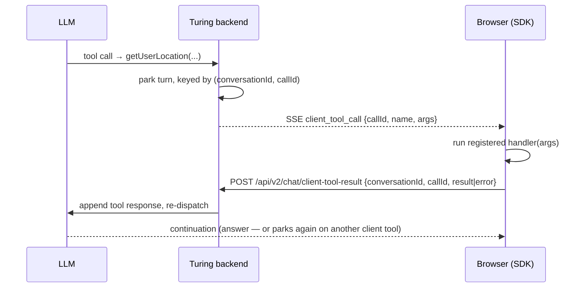

# Client Tools & Agent↔UI (AG-UI)

Most of an agent's tools run **on the server** — search, RAG, code execution. But two things only the *browser* can do: **show** the user what the agent is doing, and **run** a tool that lives in your front-end (read the user's current selection, open a date picker, call a browser-only API). The **AG-UI** surface covers both — the live tool-activity stream and the client-tool round-trip — so your UI can be a participant in the turn, not just a transcript of it.

You'd reach for this page when building a custom chat front-end (with the [SDKs](./react-sdk.md)) and you want to: render "calling `search_knowledge_base`…" while the agent works, let the agent invoke a function defined in your app, or have the agent render an interactive component (a form, a picker, a card) and wait for the user's answer. If you're migrating from CopilotKit, the client-tool API mirrors `useCopilotAction`.

Everything here is **opt-in per agent** and **fail-safe**: with the flags off, streams are byte-for-byte the classic answer-only path.

---

## Two distinct capabilities

| | Live Tool Activity | Client Tools |
|---|---|---|
| **Direction** | Server → UI (read-only) | Server ⇄ UI (round-trip) |
| **What it does** | Streams *what server-side tools the agent is running* | Lets the agent *call a tool you defined in the browser* |
| **Agent flag** | `toolCallEventsEnabled` ("Live Tool Activity") | `clientToolsEnabled` + `clientToolsJson` |
| **SSE event** | `tool_call` | `client_tool_call` |
| **You build** | Just render it | Register a handler that runs and returns a result |

---

## Live tool activity (read-only)

Enable **Live Tool Activity** on the agent. Now, on a CALL-mode turn, every server-side tool invocation streams a `tool_call` SSE event ahead of the answer token:

- a `start` event with the tool name and a **redacted** argument digest (never raw secrets — arguments are summarized/truncated server-side),
- an `end` event with status and `durationMs`.

The UI can show "calling `search_knowledge_base`…" while the tool loop runs, then mark it done. The live event reuses the same shape as the read-only tool trace, so what you see live agrees with the post-hoc trace.

**SDK:** both SDKs parse the event onto a `toolCalls: TurChatToolCall[]` array on the in-flight assistant message (merged by `callId`, with a live `onToolCall` callback). The headless **`TuringToolActivity`** atom in `@viglet/turing-react-ui` renders the running/finished list with a `data-status` attribute, skinnable via the same `classNames`/`labels`/`icons` contract as the other atoms.

```ts
const { messages, onToolCall } = useTuringChat({
  agentId,
  onToolCall: (tc) => console.log(tc.name, tc.status), // "running" → "ok"/"error"
});
```

---

## Client tools (the round-trip)

A **client tool** is a function declared on the agent but **executed in the browser**. Declare them per agent (`clientToolsEnabled` + `clientToolsJson`, a list of `{name, description, schema}`); they're advertised to the model alongside server tools.

When the model calls a client tool, the backend can't run it — so it **parks** the turn:



The turn is parked keyed by `(conversationId, callId)` and a `client_tool_call` event `{callId, name, args}` is emitted instead of an answer. The browser runs the tool and POSTs the outcome to **`POST /api/v2/chat/client-tool-result`** `{conversationId, callId, result | error}`; the backend appends the tool response and re-dispatches, streaming the continuation (which may answer, or park again on the next client tool).

Guardrails: only **declared** tool names are callable; an unknown or expired park returns **404**. The park store is in-memory (single-node MVP with a TTL sweep — a persisted/cluster-safe park is a follow-up).

### Registering a handler (SDK)

Both SDKs drive the round-trip. Vanilla `createChatController` and React `useTuringChat` accept a `clientTools` option and expose `registerClientTool` / `unregisterClientTool`:

```ts
const { messages, registerClientTool } = useTuringChat({ agentId, clientTools: [...] });

registerClientTool("getUserLocation", async (args) => {
  const pos = await new Promise((res, rej) =>
    navigator.geolocation.getCurrentPosition(res, rej));
  return { lat: pos.coords.latitude, lng: pos.coords.longitude };
});
```

On a `client_tool_call`, the SDK runs the handler with the parsed args, POSTs the result, and consumes the continuation into the **same** assistant message — looping for chained calls (hop cap **10**), accumulating text and tool activity across legs. A missing or throwing handler is reported back to the agent as a tool *error* (the agent recovers) — it's never thrown into your UI. This mirrors CopilotKit's `useCopilotAction`, so a migration is thin.

---

## Generative UI

Generative UI is the natural next step: instead of returning data, a client tool **renders a component** and waits for the user to interact with it.

The React hook **`useGenerativeUI(registry)`** turns a `name → component` registry into client-tool handlers. When the agent calls a tool named after a registered component, the handler renders it (as a pending item) and **parks the turn on a promise** resolved when the component calls `respond` — immediately for a display-only card, or on user interaction for a picker/configurator. The resolved value flows back as the tool result and the turn continues.

The headless **`TuringGenerativeContent`** atom dispatches each item to its component by name (the same dispatch model as `TuringRichContent`, keyed by name instead of segment type) — zero-dependency and skinnable. Component names map **1:1** to the declared client-tool names.

```tsx
const handlers = useGenerativeUI({
  ProductPicker: ({ args, respond }) => (
    <ProductPicker options={args.options} onPick={(id) => respond({ chosen: id })} />
  ),
});
// pass handlers to useTuringChat's clientTools, render <TuringGenerativeContent items={...} registry={...} />
```

---

## Endpoint & event reference

| Event / Endpoint | Direction | Payload |
|---|---|---|
| `tool_call` (SSE) | server → UI | `start` (name + redacted arg digest), `end` (status + `durationMs`) |
| `client_tool_call` (SSE) | server → UI | `{ callId, name, args }` — the turn is parked |
| `POST /api/v2/chat/client-tool-result` | UI → server | `{ conversationId, callId, result \| error }` — resumes the parked turn |

---

## Related Pages

| Page | Description |
|---|---|
| [React SDK](./react-sdk.md) | `useTuringChat`, `clientTools`, `registerClientTool`, the headless atoms |
| [AI Agents](./ai-agents.md) | Where Live Tool Activity and client tools are enabled per agent |
| [Tool Calling](./tool-calling.md) | Server-side native tools (the other half of the tool loop) |
| [Capabilities](./capabilities.md) | How client tools coexist with provider-native tools |
| [Developer Guide](./developer-guide.md) | Building a custom front-end against the chat SSE |
