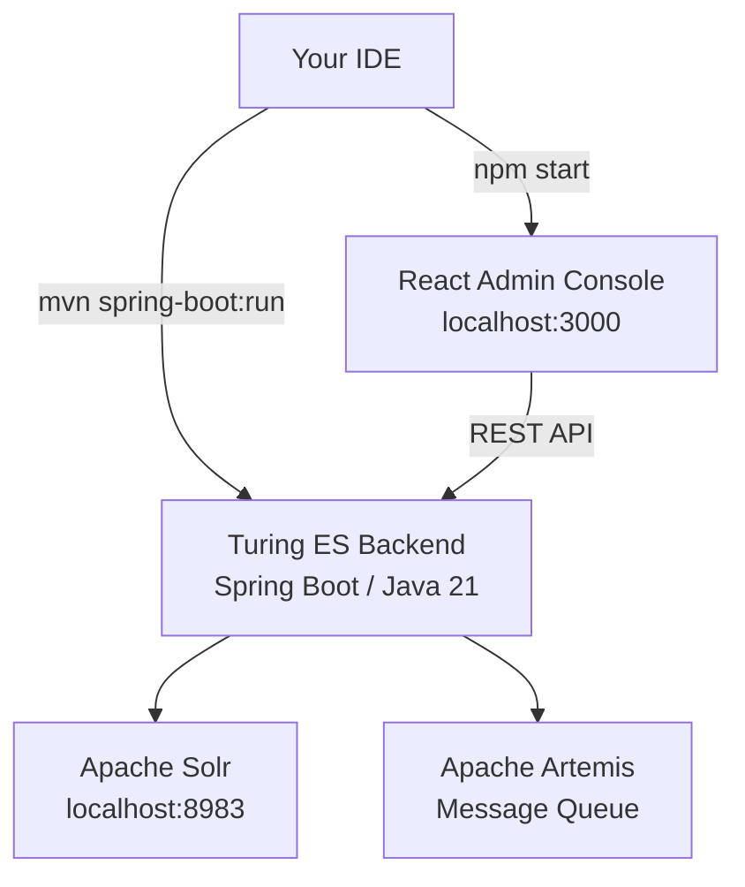

# Developer Guide

Whether you're **building a search experience** on top of Turing ES or **contributing to the project itself**, this guide has everything you need to get up and running quickly.

Turing ES is a fully open-source enterprise search platform with semantic navigation and GenAI capabilities. The source code lives at [github.com/openviglet/turing](https://github.com/openviglet/turing) and all contributions are welcome.

---

## Tech Stack

Understanding the stack helps you navigate the codebase and decide where to plug in.

| Layer | Technology |
|---|---|
| **Backend** | Java 21 · Spring Boot · Spring AI |
| **Search Engine** | Apache Solr (primary) · Elasticsearch · Lucene |
| **Message Queue** | Apache Artemis |
| **Database** | H2 (dev) · PostgreSQL / MySQL (prod) |
| **Frontend** | React · TypeScript · Primer CSS |
| **AI / GenAI** | Spring AI · ChromaDB · PgVector · Milvus |
| **Build** | Maven (backend) · npm (frontend) |
| **CI/CD** | GitHub Actions |



---

## Setting Up Your Dev Environment

### Prerequisites

Before you begin, make sure you have these installed:

- [Java 21](https://adoptium.net/temurin/releases/?package=jdk&version=21) (Temurin recommended)
- [Maven 3.9+](https://maven.apache.org/download.cgi)
- [Node.js 20+](https://nodejs.org/en/download/) and npm
- [Git](https://git-scm.com/downloads)
- [Docker Desktop](https://www.docker.com/products/docker-desktop) (for running Solr, Artemis, and other services locally)

### Clone the Repository

```shell
git clone https://github.com/openviglet/turing.git
cd turing
```

### Start Services with Docker Compose

Turing ES depends on Apache Solr and Apache Artemis. The easiest way to run them locally is with Docker Compose:

```shell
docker-compose up -d
```

This starts:
- **Apache Solr** at `http://localhost:8983`
- **Apache Artemis** (message broker)

:::tip
Wait for Solr to be fully ready before starting the backend. You can check at `http://localhost:8983/solr/#/`.
:::

---

## Running Turing ES

### Backend (Spring Boot)

Run the full backend including the bundled React console:

```shell
cd turing
mvn spring-boot:run -pl turing-app
```

Or skip the npm build step if you haven't changed the frontend:

```shell
mvn spring-boot:run -pl turing-app -Dskip.npm
```

The backend starts at **`http://localhost:2700`**.

### Frontend — React Admin Console

For active frontend development, run the React dev server separately. First start the backend in headless mode:

```shell
mvn spring-boot:run -pl turing-app -Dskip.npm -Dspring-boot.run.profiles=dev-ui
```

Then launch the React app:

```shell
cd turing/turing-ui
npm install
npm start
```

The React dev server starts at **`http://localhost:3000`** with hot-reload enabled.

### Production Build

```shell
cd turing
mvn clean install
mvn package -pl turing-app
```

The resulting JAR in `turing-app/target/` bundles both the backend and the compiled React assets.

---

## Development URLs

| Service | URL | Notes |
|---|---|---|
| Admin Console | `http://localhost:2700` | Backend-served |
| React Dev Server | `http://localhost:3000` | Hot-reload |
| SN Search Sample | `http://localhost:2700/sn/Sample` | |
| Swagger UI | `http://localhost:2700/swagger-ui.html` | Interactive API docs |
| OpenAPI Spec | `http://localhost:2700/v3/api-docs` | JSON spec |
| Solr | `http://localhost:8983` | Docker Compose |

:::info Default credentials
On first startup, set the admin password via the environment variable `TURING_ADMIN_PASSWORD`. See the [Installation Guide](./installation-guide.md) for details.
:::

---

## Java SDK

The Turing Java SDK lets you integrate semantic search into any JVM application.

### Run the Sample

```shell
cd turing-java-sdk
mvn package
java -cp build/libs/turing-java-sdk-all.jar com.viglet.turing.client.sn.sample.TurSNClientSample
```

### Add to Your Project via JitPack

Add to your `pom.xml`:

```xml
<repositories>
  <repository>
    <id>jitpack.io</id>
    <url>https://jitpack.io</url>
  </repository>
</repositories>

<dependency>
  <groupId>com.github.openviglet</groupId>
  <artifactId>turing-java-sdk</artifactId>
  <version>LATEST</version>
</dependency>
```

Full artifact info at [jitpack.io/#openviglet/turing-java-sdk](https://jitpack.io/#openviglet/turing-java-sdk).

### Build the SDK

```shell
cd turing-java-sdk
mvn package
```

---

## Code Quality

Turing ES maintains high code quality standards. You can check the project health at any time:

| Tool | Link |
|---|---|
| SonarCloud | [sonarcloud.io/organizations/viglet-turing](https://sonarcloud.io/organizations/viglet-turing/projects) |
| GitHub Actions | [openviglet/turing/actions](https://github.com/openviglet/turing/actions) |
| GitHub Security | [openviglet/turing/security](https://github.com/openviglet/turing/security/code-scanning) |
| Codecov | [app.codecov.io/gh/openviglet/turing](https://app.codecov.io/gh/openviglet/turing) |

---

## REST API

Turing ES exposes a rich REST API for integrating search and AI capabilities into any application. All endpoints use **JSON** and authenticate via **Bearer API tokens**.

### Authentication

All API requests require an `Authorization` header with a Bearer token:

```
Authorization: Bearer <YOUR_API_TOKEN>
```

**Generating an API Token:**

1. Sign in to the Administration Console at `http://localhost:2700`.
2. Navigate to **Administration → API Tokens**.
3. Click **New** and fill in a title and description.
4. Copy the generated token immediately — it will not be shown again.

### OpenAPI & Swagger

Explore and test every endpoint interactively:

- **Swagger UI:** `http://localhost:2700/swagger-ui.html`
- **OpenAPI 3.0 spec:** `http://localhost:2700/v3/api-docs`

---

## Semantic Navigation API

### Search

```
GET | POST http://localhost:2700/api/sn/{siteName}/search
```

The core search endpoint. Returns results, facets, spotlights, and pagination.

**Query Parameters:**

| Parameter | Required | Description |
|---|---|---|
| `q` | ✅ | Search query |
| `p` | | Page number (default: `1`) |
| `rows` | | Results per page |
| `_setlocale` | ✅ | Locale (e.g., `en_US`) |
| `sort` | | Sort field and direction |
| `fq[]` | | Filter queries |
| `tr[]` | | Targeting rules |
| `group` | | Group results by field |

**Example:**

```bash
curl -X GET "http://localhost:2700/api/sn/Sample/search?q=enterprise+search&p=1&_setlocale=en_US&rows=10" \
  -H "Authorization: Bearer <API_TOKEN>" \
  -H "Accept: application/json"
```

---

### Auto Complete

```
GET http://localhost:2700/api/sn/{siteName}/ac
```

Returns suggestions for the given prefix — perfect for search-as-you-type UIs.

| Parameter | Required | Description |
|---|---|---|
| `q` | ✅ | Prefix to complete |
| `rows` | | Max suggestions |
| `_setlocale` | ✅ | Locale |

**Example:**

```bash
curl "http://localhost:2700/api/sn/Sample/ac?q=enter&_setlocale=en_US"
```

**Response:**

```json
["enterprise", "enterprise search", "enterprise AI", "entries"]
```

---

### Latest Searches

```
POST http://localhost:2700/api/sn/{siteName}/search/latest
```

Returns the most recent search terms for a given user — useful for personalised search history UIs.

| Parameter | Location | Description |
|---|---|---|
| `q` | Query | Current query |
| `rows` | Query | Max results (default: `5`) |
| `_setlocale` | Query | Locale |
| `userId` | Body (JSON) | User identifier |

**Example:**

```bash
curl -X POST "http://localhost:2700/api/sn/Sample/search/latest?q=cloud&rows=5&_setlocale=en_US" \
  -H "Authorization: Bearer <API_TOKEN>" \
  -H "Content-Type: application/json" \
  -d '{ "userId": "user123" }'
```

**Response:**

```json
["cloud computing", "cloud storage", "cloud security"]
```

---

### Search Locales

```
GET http://localhost:2700/api/sn/{siteName}/search/locales
```

Lists all configured locales for a Semantic Navigation site.

**Response:**

```json
[
  { "locale": "en_US", "link": "/api/sn/Sample/search?_setlocale=en_US" },
  { "locale": "pt_BR", "link": "/api/sn/Sample/search?_setlocale=pt_BR" }
]
```

---

### Spell Check

```
GET http://localhost:2700/api/sn/{siteName}/{locale}/spell-check
```

Corrects a query against the site's indexed vocabulary.

| Parameter | Required | Description |
|---|---|---|
| `q` | ✅ | Text to check |

**Example:**

```bash
curl "http://localhost:2700/api/sn/Sample/en_US/spell-check?q=entirprise"
```

---

## Contributing

We'd love your help making Turing ES better. Here's how to get involved:

1. **Fork** the [openviglet/turing](https://github.com/openviglet/turing) repository.
2. **Create a branch** for your feature or fix: `git checkout -b feature/my-improvement`
3. **Commit your changes** with clear, descriptive messages.
4. **Open a Pull Request** — describe what you changed and why.

For larger contributions, open an issue first to discuss the approach before writing code.

:::tip
Check the open [GitHub Issues](https://github.com/openviglet/turing/issues) for good first issues tagged with `good first issue` or `help wanted`.
:::

---

*Previous: [Security & Keycloak](./security-keycloak.md) | Next: [Administration Guide](./administration-guide.md)*
