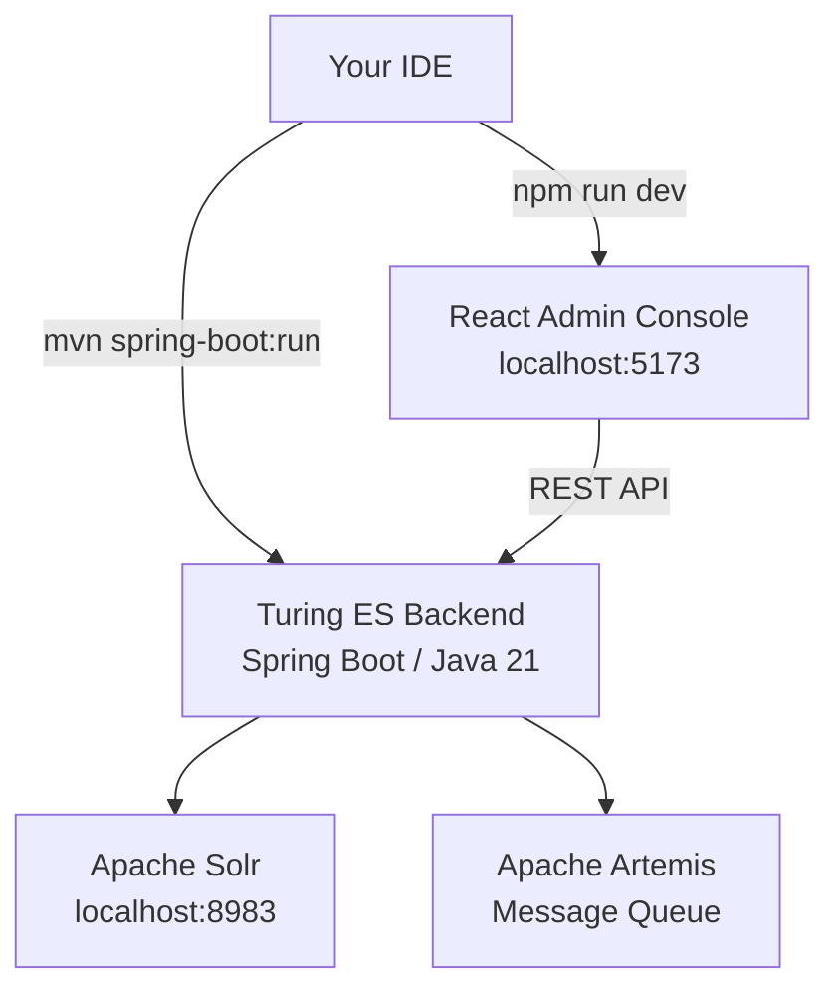
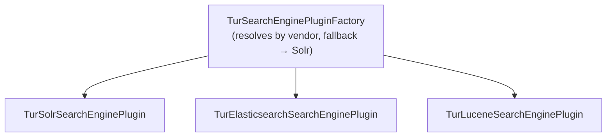

# Developer Guide

Whether you're **building a search experience** on top of Turing ES or **contributing to the project itself**, this guide has everything you need to get up and running quickly.

Turing ES is a fully open-source enterprise search platform with semantic navigation and GenAI capabilities. The source code lives at [github.com/openviglet/turing](https://github.com/openviglet/turing) and all contributions are welcome.

---

## Tech Stack

Understanding the stack helps you navigate the codebase and decide where to plug in.

| Layer | Technology |
|---|---|
| **Backend** | Java 21 · Spring Boot · Spring AI |
| **Search Engine** | Apache Solr (primary) · Elasticsearch · Lucene |
| **Message Queue** | Apache Artemis |
| **Database** | H2 (dev) · PostgreSQL / MySQL (prod) |
| **Frontend** | React · TypeScript · shadcn/ui · Vite |
| **AI / GenAI** | Spring AI · ChromaDB · PgVector · Milvus |
| **Build** | Maven (backend) · npm (frontend) |
| **CI/CD** | GitHub Actions |



---

## Setting Up Your Dev Environment

### Prerequisites

Before you begin, make sure you have these installed:

- [Java 21](https://adoptium.net/temurin/releases/?package=jdk&version=21) (Temurin recommended)
- [Maven 3.9+](https://maven.apache.org/download.cgi)
- [Node.js 20+](https://nodejs.org/en/download/) and npm
- [Git](https://git-scm.com/downloads)
- [Docker Desktop](https://www.docker.com/products/docker-desktop) (for running Solr and other external services locally)

### Clone the Repository

```shell
git clone https://github.com/openviglet/turing.git
cd turing
```

### Start Services with Docker Compose

Apache Solr is the only external service required to run Turing ES. Apache Artemis runs **embedded** inside the application and requires no separate installation. The easiest way to start Solr locally is with Docker Compose:

```shell
docker-compose up -d
```

This starts:
- **Apache Solr** at `http://localhost:8983`

:::tip
Wait for Solr to be fully ready before starting the backend. You can check at `http://localhost:8983/solr/#/`.
:::

---

## Running Turing ES

### Backend (Spring Boot)

Run the full backend including the bundled React console:

```shell
cd turing
mvn spring-boot:run -pl turing-app
```

Or skip the npm build step if you haven't changed the frontend:

```shell
mvn spring-boot:run -pl turing-app -Dskip.npm
```

The backend starts at **`http://localhost:2700`**.

### Frontend — React Admin Console

For active frontend development, run the React dev server separately. First start the backend in headless mode:

```shell
mvn spring-boot:run -pl turing-app -Dskip.npm -Dspring-boot.run.profiles=dev-ui
```

Then launch the React app:

```shell
cd turing/turing-ui
npm install
npm run dev
```

The Vite dev server starts at **`http://localhost:5173`** with hot-reload enabled.

### Production Build

```shell
cd turing
mvn clean install
mvn package -pl turing-app
```

The resulting JAR in `turing-app/target/` bundles both the backend and the compiled React assets.

---

## Development URLs

| Service | URL | Notes |
|---|---|---|
| Admin Console | `http://localhost:2700` | Backend-served |
| React Dev Server | `http://localhost:5173` | Vite hot-reload |
| SN Search Sample | `http://localhost:2700/sn/Sample` | |
| Swagger UI | `http://localhost:2700/swagger-ui.html` | Interactive API docs |
| OpenAPI Spec | `http://localhost:2700/v3/api-docs` | JSON spec |
| Solr | `http://localhost:8983` | Docker Compose |

:::info Default credentials
On first startup, set the admin password via the environment variable `TURING_ADMIN_PASSWORD`. See the [Installation Guide](./installation-guide.md) for details.
:::

---

## Java SDK

The Turing Java SDK lets you integrate semantic search into any JVM application.

### Run the Sample

```shell
cd turing-java-sdk
mvn package
java -cp build/libs/turing-java-sdk-all.jar com.viglet.turing.client.sn.sample.TurSNClientSample
```

### Add to Your Project via Maven Central

Add to your `pom.xml`:

```xml
<dependency>
  <groupId>com.viglet.turing</groupId>
  <artifactId>turing-java-sdk</artifactId>
  <version>2026.1.17</version>
</dependency>
```

The SDK and `turing-commons` are published to [Maven Central](https://central.sonatype.com/search?q=com.viglet.turing). No custom repository configuration is needed.

### Build the SDK

```shell
cd turing-java-sdk
mvn package
```

---

## Database Migrations with Liquibase

Turing ES uses **[Liquibase](https://www.liquibase.org/)** (v5.0.2) for database schema management. All schema changes — tables, columns, indexes, foreign keys — are tracked as versioned changelogs and applied automatically on startup. This ensures every environment (dev, staging, production) runs the exact same schema, regardless of the database platform.

### How it works

When Turing ES starts, Spring Boot runs Liquibase before the application context is fully initialized. Liquibase reads the master changelog, compares it against the `DATABASECHANGELOG` tracking table, and applies any pending changesets. This means:

- **First startup** — all migrations run, creating the full schema from scratch
- **Upgrades** — only new changesets (added since the last startup) are applied
- **Rollbacks** — changesets already applied are skipped (`DATABASECHANGELOG` tracks what has run)

### Configuration

Liquibase is configured in `application.yaml`:

```yaml
spring:
  liquibase:
    change-log: classpath:db/changelog/db.changelog-master.yaml
    enabled: true
    default-schema: PUBLIC
```

### Changelog structure

All changelogs are in **YAML format** under `turing-app/src/main/resources/db/changelog/`:

```
db/changelog/
├── db.changelog-master.yaml          ← master file, includes all others
├── v2025.3_baseline.yaml             ← initial schema (full baseline)
├── v2026.1_update.yaml               ← major version update
├── v2026.1_type_enum_fix.yaml        ← type/enum corrections
├── v2026.1.11.yaml                   ← incremental patch
├── v2026.1.11.1.yaml                 ← incremental patch
├── v2026.1.12.yaml                   ← incremental patch
├── v2026.1.14.0.yaml                 ← incremental patch
├── v2026.1.14.1.yaml                 ← ...
├── ...
└── v2026.1.14.8.yaml
```

The **master changelog** (`db.changelog-master.yaml`) includes all files in sequential order:

```yaml
databaseChangeLog:
  - include:
      file: db/changelog/v2025.3_baseline.yaml
  - include:
      file: db/changelog/v2026.1_update.yaml
  - include:
      file: db/changelog/v2026.1_type_enum_fix.yaml
  - include:
      file: db/changelog/v2026.1.11.yaml
  # ... incremental patches follow
```

### Naming convention

| Pattern | Example | Usage |
|---|---|---|
| `v{version}_baseline.yaml` | `v2025.3_baseline.yaml` | Full schema baseline for a major version |
| `v{version}_update.yaml` | `v2026.1_update.yaml` | Generated diff between two versions |
| `v{version}.yaml` | `v2026.1.12.yaml` | Incremental patch for a specific release |

### Writing a new migration

When adding a new table, column, or index, create a new changelog file following the naming convention and add it to the master changelog.

**Example — adding a column to an existing table:**

```yaml
databaseChangeLog:
  - changeSet:
      id: v2026.1.15-01-add-priority-to-spotlight
      author: viglet-team
      preConditions:
        - onFail: MARK_RAN
        - tableExists:
            tableName: sn_site_spotlight
        - not:
            - columnExists:
                tableName: sn_site_spotlight
                columnName: priority
      changes:
        - addColumn:
            tableName: sn_site_spotlight
            columns:
              - column:
                  name: priority
                  type: INT
                  defaultValueNumeric: 0
```

Key rules:

- **Always use preconditions** with `onFail: MARK_RAN` to make changesets idempotent — safe to re-run if the change was already applied manually
- **Changeset IDs** use the format `v{version}-{sequence}-{description}` (e.g., `v2026.1.14-01-add-default-label-to-custom-facet`)
- **Authors** use `viglet-team` for manual migrations or `{name} (generated)` for auto-generated diffs
- **Never modify** an already-released changeset — always create a new one

### Generating a diff changelog

The Liquibase Maven plugin can auto-generate a diff between two database versions:

```shell
cd turing-app
mvn liquibase:diff
```

This compares the reference database (current code) against the target database (previous version) and writes a changelog to `src/main/resources/db/changelog/v2026.1_update.yaml`. The diff tracks: tables, columns, indexes, foreign keys, and primary keys.

The plugin configuration is in `turing-app/pom.xml` and uses `liquibase.properties` for connection settings.

### Database platform support

Liquibase abstracts SQL differences across platforms. The same changelogs work on all supported databases:

| Database | Driver | Notes |
|---|---|---|
| **H2** | `org.h2.Driver` | Default for development — embedded, zero setup |
| **MariaDB / MySQL** | `org.mariadb.jdbc.Driver` | Production recommended |
| **PostgreSQL** | `org.postgresql.Driver` | Production recommended |
| **Oracle** | `oracle.jdbc.OracleDriver` | Enterprise environments |
| **SQL Server** | `com.microsoft.sqlserver.jdbc.SQLServerDriver` | Enterprise environments |

Liquibase handles type mappings (e.g., `VARCHAR(255)` on MySQL vs `VARCHAR2(255)` on Oracle) transparently.

---

## Code Quality

Turing ES maintains high code quality standards. You can check the project health at any time:

| Tool | Link |
|---|---|
| SonarCloud | [sonarcloud.io/organizations/viglet-turing](https://sonarcloud.io/organizations/viglet-turing/projects) |
| GitHub Actions | [openviglet/turing/actions](https://github.com/openviglet/turing/actions) |
| GitHub Security | [openviglet/turing/security](https://github.com/openviglet/turing/security/code-scanning) |
| Codecov | [app.codecov.io/gh/openviglet/turing](https://app.codecov.io/gh/openviglet/turing) |

---

## Search Engine Plugin Architecture

Turing ES uses a **plugin architecture** to support multiple search backends behind a unified interface. This abstraction allows the same application code to work with Apache Solr, Elasticsearch, or Lucene — the active plugin is resolved at runtime based on the vendor configured per Search Engine instance.



### The `TurSearchEnginePlugin` interface

All backend operations are defined in a single interface with four categories:

**Search**

| Method | Description |
|---|---|
| `retrieveSearchResults()` | Execute a full-text query and return results with facets |
| `retrieveFacetResults()` | Return facet counts for a query |

**Index management**

| Method | Description |
|---|---|
| `createIndex()` | Create a new core / index |
| `deleteIndex()` | Delete a core / index |
| `clearIndex()` | Remove all documents from a core without deleting it |
| `listIndexes()` | List all cores / indices on the backend |

**Schema management**

| Method | Description |
|---|---|
| `addOrUpdateField()` | Add or update a field definition in the schema |
| `deleteField()` | Remove a field from the schema |
| `fieldExists()` | Check whether a field exists in the schema |

**Documents & monitoring**

| Method | Description |
|---|---|
| `indexDocument()` | Index a single document |
| `deIndex()` | Remove a document from the index |
| `commit()` | Flush pending writes (for backends that require explicit commits) |
| `getDocumentTotal()` | Return the total number of indexed documents |
| `getSystemInfo()` | Return backend version, OS, JVM, and memory information |

### Implementing a new backend

To add support for a new search engine:

1. Create a class implementing `TurSearchEnginePlugin`
2. Implement all methods in the four categories above
3. Register the plugin in `TurSearchEnginePluginFactory` with a vendor identifier
4. The factory resolves the correct plugin based on the `vendor` field of the `TurSEInstance` entity

:::info Fallback behaviour
If a vendor is unrecognised or unavailable, `TurSearchEnginePluginFactory` falls back to the **Solr** plugin. Apache Solr is the primary supported backend with the most complete feature set.
:::

---

## REST API

Turing ES exposes a REST API for integrating search and AI capabilities into any application. All endpoints use **JSON**. Authentication uses the `Key` header with an API Token created in **Administration → API Tokens**.

For the full endpoint reference — search, autocomplete, spell check, latest searches, GenAI chat, and token usage — see **[REST API Reference](./rest-api.md)**.

For interactive exploration, use the built-in Swagger UI at `http://localhost:2700/swagger-ui.html` or the OpenAPI spec at `http://localhost:2700/v3/api-docs`.

---

## Contributing

We'd love your help making Turing ES better. Here's how to get involved:

1. **Fork** the [openviglet/turing](https://github.com/openviglet/turing) repository.
2. **Create a branch** for your feature or fix: `git checkout -b feature/my-improvement`
3. **Commit your changes** with clear, descriptive messages.
4. **Open a Pull Request** — describe what you changed and why.

For larger contributions, open an issue first to discuss the approach before writing code.

:::tip
Check the open [GitHub Issues](https://github.com/openviglet/turing/issues) for good first issues tagged with `good first issue` or `help wanted`.
:::

---

*Previous: [Security & Keycloak](./security-keycloak.md) | Next: [REST API Reference](./rest-api.md)*
