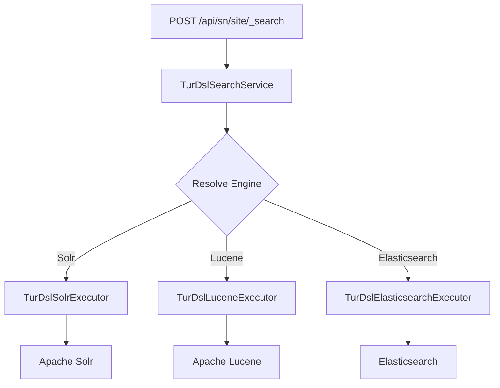

# DSL Query API

Turing ES provides an **Elasticsearch-compatible Query DSL** endpoint that translates queries to the configured search engine backend (Solr, Lucene, or Elasticsearch). This allows you to use the same query syntax regardless of the underlying engine.

## Endpoint

```
POST /api/sn/{siteName}/_search?locale=en
GET  /api/sn/{siteName}/_search?locale=en
```

| Parameter | Type | Default | Description |
|-----------|------|---------|-------------|
| `siteName` | path | required | The Semantic Navigation site name |
| `locale` | query | `en` | Search locale (e.g., `en`, `pt`, `en_US`) |

The `GET` method performs a `match_all` search. The `POST` method accepts a JSON request body following the Elasticsearch `_search` format.

---

## Quick Start

### Simple Match Query

```bash
curl -X POST "http://localhost:2700/api/sn/mySite/_search?locale=en" \
  -H "Content-Type: application/json" \
  -d '{
    "query": {
      "match": { "title": "enterprise search" }
    }
  }'
```

### Bool Query with Filters and Pagination

```bash
curl -X POST "http://localhost:2700/api/sn/mySite/_search?locale=en" \
  -H "Content-Type: application/json" \
  -d '{
    "query": {
      "bool": {
        "must": [{ "match": { "title": "machine learning" } }],
        "filter": [
          { "term": { "status": "published" } },
          { "range": { "date": { "gte": "2025-01-01" } } }
        ],
        "must_not": [{ "term": { "category": "draft" } }]
      }
    },
    "from": 0,
    "size": 10,
    "sort": [{ "date": "desc" }, "_score"],
    "_source": ["title", "url", "date"],
    "highlight": {
      "fields": { "title": {}, "body": {} },
      "pre_tags": ["<em>"],
      "post_tags": ["</em>"]
    },
    "aggs": {
      "by_category": { "terms": { "field": "category", "size": 10 } }
    }
  }'
```

### Response Format

```json
{
  "took": 15,
  "timed_out": false,
  "hits": {
    "total": { "value": 42, "relation": "eq" },
    "max_score": 1.5,
    "hits": [
      {
        "_id": "doc1",
        "_score": 1.5,
        "_source": { "title": "ML Guide", "url": "/ml-guide", "date": "2025-06-01" },
        "highlight": { "title": ["<em>Machine Learning</em> Guide"] }
      }
    ]
  },
  "aggregations": {
    "by_category": {
      "buckets": [
        { "key": "tutorial", "doc_count": 18 },
        { "key": "research", "doc_count": 12 }
      ]
    }
  }
}
```

---

## Supported Queries

### Full-text Queries

#### `match`

Full-text search on a single field with optional operator.

```json
{ "query": { "match": { "title": "enterprise search" } } }
```

With operator:

```json
{ "query": { "match": { "title": { "query": "enterprise search", "operator": "and" } } } }
```

#### `multi_match`

Search across multiple fields.

```json
{
  "query": {
    "multi_match": {
      "query": "artificial intelligence",
      "fields": ["title", "body", "abstract"]
    }
  }
}
```

#### `match_phrase`

Exact phrase search with optional slop (word distance).

```json
{ "query": { "match_phrase": { "title": { "query": "enterprise search", "slop": 2 } } } }
```

#### `match_phrase_prefix`

Autocomplete-style phrase matching.

```json
{ "query": { "match_phrase_prefix": { "title": { "query": "enter", "max_expansions": 10 } } } }
```

#### `match_bool_prefix`

Combines bool query for leading terms with prefix on the last term.

```json
{ "query": { "match_bool_prefix": { "title": "quick brown f" } } }
```

#### `combined_fields`

Search across multiple fields as if they were one combined field.

```json
{
  "query": {
    "combined_fields": {
      "query": "enterprise search",
      "fields": ["title", "body"],
      "operator": "and"
    }
  }
}
```

#### `query_string`

Lucene query string syntax.

```json
{ "query": { "query_string": { "query": "title:search AND status:published", "default_field": "title" } } }
```

#### `simple_query_string`

Simple query string syntax (no exceptions on parse errors).

```json
{
  "query": {
    "simple_query_string": {
      "query": "\"enterprise search\" +platform",
      "fields": ["title", "body"],
      "default_operator": "AND"
    }
  }
}
```

### Term-level Queries

#### `term`

Exact match on a field (not analyzed).

```json
{ "query": { "term": { "status": "published" } } }
```

#### `terms`

Match any of multiple values.

```json
{ "query": { "terms": { "status": ["published", "review"] } } }
```

#### `terms_set`

Terms with dynamic `minimum_should_match`.

```json
{
  "query": {
    "terms_set": {
      "tags": {
        "terms": ["search", "ai", "nlp"],
        "minimum_should_match_field": "required_matches"
      }
    }
  }
}
```

#### `range`

Range queries with `gte`, `gt`, `lte`, `lt`.

```json
{ "query": { "range": { "date": { "gte": "2025-01-01", "lte": "2026-12-31" } } } }
```

#### `exists`

Check if a field has a value.

```json
{ "query": { "exists": { "field": "thumbnail" } } }
```

#### `prefix`

Prefix matching.

```json
{ "query": { "prefix": { "title": "ent" } } }
```

#### `wildcard`

Wildcard pattern matching (`*` and `?`).

```json
{ "query": { "wildcard": { "title": "enter*" } } }
```

#### `regexp`

Regular expression matching.

```json
{ "query": { "regexp": { "title": { "value": "enter.*ch", "flags": "ALL" } } } }
```

#### `fuzzy`

Fuzzy (approximate) matching.

```json
{ "query": { "fuzzy": { "title": { "value": "serch", "fuzziness": 2 } } } }
```

#### `ids`

Match specific document IDs.

```json
{ "query": { "ids": { "values": ["doc1", "doc2", "doc3"] } } }
```

### Compound Queries

#### `bool`

Combine multiple clauses with `must`, `should`, `must_not`, and `filter`.

```json
{
  "query": {
    "bool": {
      "must": [{ "match": { "title": "search" } }],
      "should": [{ "match": { "category": "premium" } }],
      "must_not": [{ "term": { "status": "archived" } }],
      "filter": [{ "range": { "date": { "gte": "2025-01-01" } } }],
      "minimum_should_match": 1
    }
  }
}
```

#### `constant_score`

Wraps a filter query and assigns a constant score.

```json
{ "query": { "constant_score": { "filter": { "term": { "status": "published" } }, "boost": 1.5 } } }
```

#### `dis_max`

Returns documents matching any query, using the best-matching score.

```json
{
  "query": {
    "dis_max": {
      "queries": [
        { "match": { "title": "search" } },
        { "match": { "body": "search" } }
      ],
      "tie_breaker": 0.3
    }
  }
}
```

#### `boosting`

Boost positive matches while demoting negative matches.

```json
{
  "query": {
    "boosting": {
      "positive": { "match": { "title": "search" } },
      "negative": { "term": { "status": "deprecated" } },
      "negative_boost": 0.2
    }
  }
}
```

#### `function_score`

Custom scoring with multiple functions.

```json
{
  "query": {
    "function_score": {
      "query": { "match_all": {} },
      "functions": [
        { "filter": { "term": { "category": "premium" } }, "weight": 2.0 },
        {
          "field_value_factor": {
            "field": "popularity",
            "factor": 1.2,
            "modifier": "log1p",
            "missing": 1
          }
        }
      ],
      "score_mode": "sum",
      "boost_mode": "multiply",
      "max_boost": 10
    }
  }
}
```

#### `script_score`

Score using a script.

```json
{
  "query": {
    "script_score": {
      "query": { "match": { "title": "search" } },
      "script": {
        "source": "_score * doc['popularity'].value",
        "lang": "painless",
        "params": { "factor": 2 }
      }
    }
  }
}
```

#### `pinned`

Pin specific documents to the top of results.

```json
{
  "query": {
    "pinned": {
      "ids": ["featured-doc-1", "featured-doc-2"],
      "organic": { "match": { "title": "search" } }
    }
  }
}
```

### Nested & Join Queries

#### `nested`

Search within nested objects.

```json
{
  "query": {
    "nested": {
      "path": "comments",
      "query": { "match": { "comments.text": "great article" } },
      "score_mode": "avg"
    }
  }
}
```

#### `has_child`

Find parent documents by child document criteria.

```json
{
  "query": {
    "has_child": {
      "type": "answer",
      "query": { "match": { "body": "elasticsearch" } },
      "min_children": 1,
      "max_children": 10
    }
  }
}
```

#### `has_parent`

Find child documents by parent document criteria.

```json
{
  "query": {
    "has_parent": {
      "parent_type": "question",
      "query": { "match": { "title": "search" } },
      "score": true
    }
  }
}
```

### Geo Queries

#### `geo_distance`

Filter by distance from a point.

```json
{
  "query": {
    "geo_distance": {
      "distance": "10km",
      "location": { "lat": 40.73, "lon": -73.93 }
    }
  }
}
```

#### `geo_bounding_box`

Filter by bounding box.

```json
{
  "query": {
    "geo_bounding_box": {
      "location": {
        "top_left": { "lat": 40.73, "lon": -74.1 },
        "bottom_right": { "lat": 40.01, "lon": -71.12 }
      }
    }
  }
}
```

#### `geo_shape`

Filter by geographic shape.

```json
{
  "query": {
    "geo_shape": {
      "location": {
        "shape": { "type": "envelope", "coordinates": [[-74.1, 40.73], [-71.12, 40.01]] },
        "relation": "within"
      }
    }
  }
}
```

### Vector Search

#### `knn`

K-nearest neighbors vector search (semantic search).

```json
{
  "query": {
    "knn": {
      "field": "embedding",
      "query_vector": [0.1, 0.2, 0.3, 0.4],
      "k": 10,
      "num_candidates": 100,
      "similarity": 0.8,
      "filter": { "term": { "status": "published" } }
    }
  }
}
```

### Span Queries

#### `span_term`, `span_near`, `span_or`, `span_not`, `span_first`

Low-level positional queries for advanced use cases.

```json
{
  "query": {
    "span_near": {
      "clauses": [
        { "span_term": { "title": "enterprise" } },
        { "span_term": { "title": "search" } }
      ],
      "slop": 2,
      "in_order": true
    }
  }
}
```

### Specialized Queries

#### `more_like_this`

Find similar documents.

```json
{
  "query": {
    "more_like_this": {
      "fields": ["title", "body"],
      "like": "enterprise search platform with AI capabilities",
      "min_term_freq": 1,
      "min_doc_freq": 1
    }
  }
}
```

#### `intervals`

Fine-grained control over term proximity.

```json
{
  "query": {
    "intervals": {
      "body": {
        "match": {
          "query": "enterprise search",
          "max_gaps": 2,
          "ordered": true
        }
      }
    }
  }
}
```

#### `rank_feature`, `distance_feature`, `percolate`, `wrapper`

Additional specialized queries for ranking features, distance-based scoring, reverse search, and base64-encoded queries.

---

## Aggregations

### Bucket Aggregations

#### `terms`

Group documents by field values.

```json
{
  "aggs": {
    "categories": { "terms": { "field": "category", "size": 10 } }
  }
}
```

#### `range`

Group documents by numeric or date ranges.

```json
{
  "aggs": {
    "price_ranges": {
      "range": {
        "field": "price",
        "ranges": [
          { "key": "cheap", "to": 50 },
          { "key": "mid", "from": 50, "to": 200 },
          { "key": "expensive", "from": 200 }
        ]
      }
    }
  }
}
```

#### `date_histogram`

Group documents by date intervals.

```json
{
  "aggs": {
    "monthly": {
      "date_histogram": {
        "field": "date",
        "calendar_interval": "month",
        "format": "yyyy-MM"
      }
    }
  }
}
```

#### `histogram`

Group documents by numeric intervals.

```json
{
  "aggs": {
    "price_histogram": { "histogram": { "field": "price", "interval": 50 } }
  }
}
```

#### `filter` / `filters`

Single or multiple named filters.

```json
{
  "aggs": {
    "status_counts": {
      "filters": {
        "filters": {
          "active": { "term": { "status": "active" } },
          "archived": { "term": { "status": "archived" } }
        }
      }
    }
  }
}
```

#### `significant_terms`, `rare_terms`, `multi_terms`, `auto_date_histogram`

Additional bucket aggregations for statistical analysis.

#### `nested` / `reverse_nested`

Aggregations scoped to nested objects.

#### `composite`

Paginated aggregations for large cardinality fields.

```json
{
  "aggs": {
    "paginated": {
      "composite": {
        "size": 100,
        "sources": [
          { "category": { "terms": { "field": "category" } } }
        ]
      }
    }
  }
}
```

#### `sampler` / `diversified_sampler`, `adjacency_matrix`, `variable_width_histogram`

Advanced bucket aggregations for sampling, matrix analysis, and adaptive histograms.

### Metric Aggregations

#### `avg`, `sum`, `min`, `max`

Basic numeric operations.

```json
{
  "aggs": {
    "avg_price": { "avg": { "field": "price" } },
    "total_sales": { "sum": { "field": "amount" } },
    "cheapest": { "min": { "field": "price" } },
    "most_expensive": { "max": { "field": "price" } }
  }
}
```

#### `stats` / `extended_stats`

Multiple statistics in one aggregation.

```json
{
  "aggs": {
    "price_stats": { "stats": { "field": "price" } }
  }
}
```

Response:

```json
{
  "price_stats": {
    "values": { "count": 100, "min": 5.0, "max": 999.0, "avg": 125.5, "sum": 12550.0 }
  }
}
```

#### `cardinality`

Count distinct values.

```json
{
  "aggs": {
    "unique_users": { "cardinality": { "field": "user_id", "precision_threshold": 1000 } }
  }
}
```

#### `percentiles`

Percentile distribution.

```json
{
  "aggs": {
    "latency_percentiles": {
      "percentiles": { "field": "latency", "percents": [50, 95, 99] }
    }
  }
}
```

#### `percentile_ranks`

Rank of specific values.

```json
{
  "aggs": {
    "latency_ranks": {
      "percentile_ranks": { "field": "latency", "values": [100, 200, 500] }
    }
  }
}
```

#### `value_count`, `top_hits`, `top_metrics`

Count, top documents, and top metrics per bucket.

#### `median_absolute_deviation`, `boxplot`, `string_stats`, `matrix_stats`, `t_test`, `rate`, `scripted_metric`

Advanced statistical aggregations.

### Sub-aggregations

Nest aggregations within bucket aggregations for multi-dimensional analysis.

```json
{
  "aggs": {
    "by_category": {
      "terms": { "field": "category", "size": 10 },
      "aggs": {
        "avg_price": { "avg": { "field": "price" } },
        "top_docs": { "top_hits": { "size": 3 } }
      }
    }
  }
}
```

---

## Request Features

### Pagination

```json
{ "from": 0, "size": 10 }
```

#### Cursor-based pagination (search_after)

```json
{ "search_after": ["2026-01-01", "doc123"], "size": 10, "sort": [{ "date": "desc" }, "_id"] }
```

#### Scroll API

```json
{ "scroll": "5m", "size": 1000 }
```

### Sorting

```json
{ "sort": [{ "date": "desc" }, { "title": "asc" }, "_score"] }
```

### Source Filtering

```json
{ "_source": ["title", "url", "date"] }
{ "_source": false }
{ "_source": { "includes": ["title", "url"] } }
```

### Highlighting

```json
{
  "highlight": {
    "fields": { "title": {}, "body": {} },
    "pre_tags": ["<mark>"],
    "post_tags": ["</mark>"],
    "fragment_size": 150,
    "number_of_fragments": 3
  }
}
```

### Post Filter

Filter hits without affecting aggregations.

```json
{
  "query": { "match": { "title": "shoes" } },
  "post_filter": { "term": { "color": "red" } },
  "aggs": {
    "all_colors": { "terms": { "field": "color" } }
  }
}
```

### Rescore

Re-score top N results with a secondary query.

```json
{
  "query": { "match": { "title": "search" } },
  "rescore": [{
    "window_size": 50,
    "query": {
      "rescore_query": { "match_phrase": { "title": "enterprise search" } },
      "query_weight": 0.7,
      "rescore_query_weight": 1.2
    }
  }]
}
```

### Collapse (Field Collapsing)

Deduplicate results by a field.

```json
{
  "query": { "match": { "title": "search" } },
  "collapse": {
    "field": "user_id",
    "inner_hits": { "name": "recent", "size": 3 }
  }
}
```

### Suggest

Term, phrase, and completion suggestions.

```json
{
  "suggest": {
    "title-suggest": {
      "text": "enterprse",
      "term": { "field": "title" }
    },
    "autocomplete": {
      "text": "ent",
      "completion": { "field": "suggest_field", "size": 5, "skip_duplicates": true }
    }
  }
}
```

### Additional Features

| Feature | Example |
|---------|---------|
| `min_score` | `"min_score": 0.5` |
| `timeout` | `"timeout": "5s"` |
| `explain` | `"explain": true` |
| `profile` | `"profile": true` |
| `version` | `"version": true` |
| `script_fields` | `"script_fields": {"x": {"script": {"source": "doc['price'].value * 2"}}}` |
| `stored_fields` | `"stored_fields": ["title", "date"]` |
| `docvalue_fields` | `"docvalue_fields": ["date", "price"]` |
| `indices_boost` | `"indices_boost": [{"index1": 1.5}]` |
| `track_total_hits` | `"track_total_hits": true` or `"track_total_hits": 10000` |
| `preference` | `"preference": "_local"` |
| `routing` | `"routing": "user123"` |
| `terminate_after` | `"terminate_after": 1000` |
| `seq_no_primary_term` | `"seq_no_primary_term": true` |
| `pit` | `"pit": {"id": "abc", "keep_alive": "5m"}` |

---

## Architecture

The DSL Query API uses a **Strategy Pattern** with three executor implementations:



The engine is resolved automatically from the SN site's Search Engine instance configuration. The same JSON request body works across all three engines.

### How it Works

1. **Request** arrives at the `_search` endpoint
2. **TurDslSearchService** resolves the site and its engine type via `TurSearchEnginePluginFactory`
3. The appropriate **executor** translates the DSL query to the native engine format:
   - **Elasticsearch**: Direct 1:1 mapping using the Java API client
   - **Solr**: Translates to Solr query syntax, facets, and parameters
   - **Lucene**: Translates to Lucene `Query` objects (BooleanQuery, TermQuery, etc.)
4. **Response** is built in Elasticsearch-compatible format regardless of engine

---

## See Also

- [Search Engine Configuration](./search-engine.md)
- [Semantic Navigation](./semantic-navigation.md)
- [REST API Reference](./rest-api.md)
- [DSL Compatibility Matrix](./dsl-compatibility.md)
