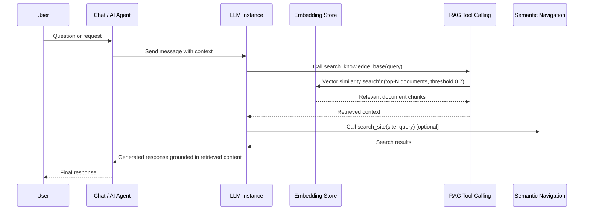

# Generative AI & LLM Configuration

Turing ES integrates Generative AI throughout the platform via **Spring AI**, providing a unified abstraction layer over multiple LLM providers and embedding backends. The GenAI capabilities are organized around four connected concepts: **LLM Instances**, **Tool Callings**, **MCP Servers**, and **AI Agents** — which together define how the system reasons, retrieves, and responds.

RAG (Retrieval-Augmented Generation) is the primary pattern used to ground LLM responses in real content: both the **Knowledge Base** (files stored in MinIO) and **Semantic Navigation Sites** can serve as RAG sources.

---

## Global Settings

Before configuring individual LLM instances, AI Agents, or RAG sources, a set of platform-wide defaults must be established in **Administration → Settings**. These defaults apply wherever no specific override is configured.

| Setting | Description |
|---|---|
| **Default LLM Instance** | The LLM provider used when no specific instance is selected in an AI Agent or SN Site |
| **Default Embedding Store** | Which vector database backend to use (ChromaDB, PgVector, or Milvus) |
| **Default Embedding Model** | The embedding model used to generate vector representations during indexing and at query time |
| **RAG Enabled by Default** | Whether RAG is pre-enabled for new Semantic Navigation Sites |
| **Python Path** | Absolute path to the Python executable used by the Code Interpreter tool calling |
| **Email Settings** | SMTP configuration for system notifications |

:::warning Changing the embedding model requires full re-indexing
The embedding store and embedding model must be consistent across indexing and query time. Changing the default embedding model after documents have been indexed will cause embedding dimension mismatches and incorrect similarity results. A full re-indexing of all content is required whenever the embedding model changes.
:::

---

## LLM Instances

An **LLM Instance** is a configured connection to an LLM provider. Multiple instances can coexist, allowing different AI Agents to use different models or providers. Each instance is created in **Administration → LLM Instances**.

Turing ES supports six provider types via Spring AI:

### Anthropic Claude

| Field | Description |
|---|---|
| **API Key** | Anthropic API key |
| **Model** | Model identifier (e.g., `claude-opus-4-5`, `claude-sonnet-4-5`, `claude-haiku-4-5`) |

### OpenAI

| Field | Description |
|---|---|
| **API Key** | OpenAI API key |
| **Model** | Model identifier (e.g., `gpt-4o`, `gpt-4o-mini`, `o1`) |

### Azure OpenAI

| Field | Description |
|---|---|
| **Endpoint** | Azure OpenAI resource endpoint URL |
| **API Key** | Azure API key |
| **Deployment Name** | Name of the deployed model in Azure |
| **API Version** | Azure OpenAI API version string |

### Google Gemini (Native)

| Field | Description |
|---|---|
| **API Key** | Google AI Studio API key |
| **Model** | Model identifier (e.g., `gemini-2.0-flash`, `gemini-2.0-pro`) |

### Google Gemini (OpenAI-Compatible API)

Google Gemini also exposes an OpenAI-compatible API endpoint. This provider type allows using Gemini models through the same protocol as OpenAI, which can simplify integration in environments already configured for OpenAI.

| Field | Description |
|---|---|
| **API Key** | Google AI Studio API key |
| **Base URL** | `https://generativelanguage.googleapis.com/v1beta/openai/` |
| **Model** | Gemini model identifier |

### Ollama (Local)

Ollama enables running open-weight models locally, with no API key or external dependency. Suitable for air-gapped environments or for reducing inference costs.

| Field | Description |
|---|---|
| **Base URL** | Ollama server URL (default: `http://localhost:11434`) |
| **Model** | Model name as registered in Ollama (e.g., `llama3.2`, `mistral`, `phi4`) |

---

## Embedding Stores

Turing ES delegates vector storage to one of three backends configured via Spring AI. Only one embedding backend is active per deployment, defined in `application.yaml` and set as the default in **Administration → Settings**.

### ChromaDB

A lightweight, open-source vector database. Suitable for development and small to medium deployments. Configured externally and connected via its HTTP API.

### PgVector

PostgreSQL with the `pgvector` extension. Suitable for deployments that already use PostgreSQL as their primary database, avoiding an additional infrastructure dependency for embeddings.

### Milvus

A purpose-built, cloud-native vector database designed for high-scale similarity search. Recommended for large corpora or high-throughput deployments.

---

## RAG Architecture

Retrieval-Augmented Generation (RAG) is the mechanism by which Turing ES provides the LLM with relevant context before generating a response. Rather than relying on the LLM's training data alone, RAG retrieves the most semantically relevant documents from an indexed corpus and injects them into the prompt.

Turing ES supports two RAG sources: the **Knowledge Base** (files stored in MinIO) and **Semantic Navigation Sites**.

### Similarity search parameters

Turing ES retrieves the **top 10** most similar document chunks by default, using a similarity **threshold of 0.7**. Documents with a similarity score below the threshold are excluded from the context, preventing low-relevance content from polluting the prompt.

### Knowledge Base (MinIO)

The Knowledge Base is a collection of files stored in MinIO and indexed as vector embeddings. Administrators manage files through a folder-based UI in the Turing ES admin console — creating folders, uploading documents, and organizing content in a way similar to a file system.

When a file is uploaded, the indexing pipeline:
1. Extracts text content (including OCR for images and PDFs)
2. Splits the content into chunks
3. Generates a vector embedding for each chunk using the configured embedding model
4. Stores the chunks and embeddings in the active embedding store

The Knowledge Base is queried by AI Agents using the **RAG / Knowledge Base** tool callings:

| Tool | Description |
|---|---|
| `search_knowledge_base` | Searches for relevant documents by semantic similarity |
| `knowledge_base_stats` | Returns statistics: total files, chunks, and storage size |
| `list_knowledge_base_files` | Lists all indexed files, with optional keyword filter |
| `get_file_from_knowledge_base` | Retrieves the full indexed content of a specific file |

### RAG for Semantic Navigation Sites

When GenAI is enabled for a Semantic Navigation Site, documents indexed through Dumont DEP connectors are also embedded and stored in the vector store alongside their Solr representation. This allows AI Agents and the SN Site chat to retrieve relevant indexed content through semantic similarity, not just keyword matching.

The SN Site GenAI summary feature uses the same RAG pipeline: when a user performs a search, the GenAI engine can retrieve the top results and generate a natural-language summary of the findings, displayed in the admin console's GenAI view for that site.

---

## Tool Callings

A **Tool Calling** is a function exposed to the LLM that it can invoke autonomously during a conversation to retrieve information or perform an action. Turing ES includes **27 native tools** organized into 7 categories, plus the ability to connect to external **MCP Servers** for additional tools.

Tools are selected per AI Agent — each agent enables only the tools it needs, giving administrators precise control over what each agent can do.

### Semantic Navigation — 15 tools

These tools allow the LLM to interact with any Semantic Navigation Site as a structured knowledge source.

| Tool | Description |
|---|---|
| `list_sites` | Lists all available SN sites with their locales |
| `get_site_fields` | Returns valid facet fields for filtering a specific site |
| `get_valid_filter_values` | Returns valid values for a specific filter or facet |
| `search_site` | Searches a site and returns compact results (ID, title, URL, snippet) |
| `get_document_details` | Retrieves full text and metadata of a document by ID |
| `get_search_suggestions` | Autocomplete and spelling corrections for a search query |
| `find_similar_documents` | Finds semantically similar documents (More Like This) |
| `get_aggregated_stats` | Calculates totals and distributions by category via facet aggregation |
| `get_document_highlights` | Extracts snippets from a document where search terms appear |
| `compare_items` | Compares specific fields of two or more documents side by side |
| `search_recent_updates` | Retrieves most recently updated content on a topic |
| `get_facet_summary` | Statistical summary of all available categories and attributes |
| `search_by_date_range` | Searches documents within a date range |
| `lookup_facet_value` | Searches a term across all facets to find exact values |
| `discover_facet_values` | Splits a phrase into words and searches across all facets |

### RAG / Knowledge Base — 4 tools

| Tool | Description |
|---|---|
| `search_knowledge_base` | Searches for relevant documents in the knowledge base by semantic similarity |
| `knowledge_base_stats` | Returns knowledge base statistics (total files, chunks, size) |
| `list_knowledge_base_files` | Lists all indexed files with optional filter |
| `get_file_from_knowledge_base` | Retrieves the full indexed content of a specific file |

### Web Crawler — 2 tools

| Tool | Description |
|---|---|
| `fetch_webpage` | Fetches a web page by URL and returns its content as plain text |
| `extract_links` | Extracts links from a web page, with optional keyword filter |

### Finance — 2 tools

| Tool | Description |
|---|---|
| `get_stock_quote` | Current price and market data for a stock ticker |
| `search_ticker` | Looks up a ticker symbol by company name or keyword |

### Weather — 1 tool

| Tool | Description |
|---|---|
| `get_weather` | Current weather and forecast for a city (1–7 days) |

### Image Search — 1 tool

| Tool | Description |
|---|---|
| `search_images` | Searches the web for images and returns URLs and descriptions |

### DateTime — 1 tool

| Tool | Description |
|---|---|
| `get_current_time` | Returns the current date and time for a given IANA timezone |

### Code Interpreter — 1 tool

| Tool | Description |
|---|---|
| `execute_python` | Executes Python code in a sandboxed environment and returns stdout/stderr |

The Code Interpreter runs Python in an isolated sandbox directory with a 30-second execution timeout. It supports standard output capture, Matplotlib chart generation (with `Agg` backend), and automatic `print()` wrapping for bare expressions. The Python executable path is configured in **Administration → Settings → Python Path**.

---

## MCP Servers

An **MCP Server** extends the tool calling capabilities of an AI Agent by connecting it to any external server that implements the Model Context Protocol (MCP). This allows Turing ES agents to use tools defined outside the platform — for example, a company-internal knowledge system, a proprietary data API, or any of the growing ecosystem of public MCP servers.

MCP Servers are configured in **Administration → MCP Servers**.

### Configuration

| Field | Description |
|---|---|
| **Name** | Display name for the MCP server |
| **Transport type** | `HTTP` or `stdio` |
| **Command** | For stdio: the executable command to launch the MCP server process |
| **Arguments** | For stdio: command-line arguments passed to the process |
| **URL** | For HTTP: the MCP server endpoint URL |
| **Execution mode** | `Synchronous` or `Asynchronous` |

### Transport types

**stdio transport** launches the MCP server as a local subprocess. The MCP client communicates with it via standard input/output. This is the standard mode for locally installed MCP servers (e.g., `npx @modelcontextprotocol/server-filesystem`).

**HTTP transport** connects to a remote MCP server over HTTP. This mode supports both public MCP services and internally hosted servers accessible over the network.

### Execution mode

**Synchronous** mode waits for the MCP tool result before continuing the agent's reasoning chain. Use this when the tool result is needed before the next reasoning step.

**Asynchronous** mode dispatches the tool call without blocking. Use this for long-running operations or when the result does not need to be incorporated immediately.

---

## AI Agents

An **AI Agent** is the central composition object in Turing ES's GenAI system. It combines a specific LLM Instance, a selected set of Tool Callings, and a set of MCP Servers into a single, named, deployable assistant. Each AI Agent has its own personality, capability set, and visual identity, and appears as a **separate tab in the Chat interface** for users to interact with.

AI Agents are configured in **Administration → AI Agents**.

### Configuration

| Field | Description |
|---|---|
| **Name** | Display name shown as the chat tab label |
| **Avatar** | Image used to represent the agent in the chat UI |
| **Description** | Brief explanation of the agent's purpose and specialization |
| **LLM Instance** | The LLM provider and model this agent uses for inference |
| **Tool Callings** | Which of the 27 native tools are available to this agent |
| **MCP Servers** | Which external MCP servers this agent can call |

### Composing agents for specific roles

Because each agent independently selects its LLM Instance, tools, and MCP servers, it is straightforward to build purpose-specific assistants:

**Example: Enterprise Search Agent**
- LLM Instance: Anthropic Claude Sonnet
- Tool Callings: `list_sites`, `search_site`, `get_document_details`, `find_similar_documents`, `search_by_date_range`
- MCP Servers: none

**Example: Data Research Agent**
- LLM Instance: OpenAI GPT-4o
- Tool Callings: `fetch_webpage`, `extract_links`, `get_stock_quote`, `get_weather`, `execute_python`, `search_knowledge_base`
- MCP Servers: Internal data API (via HTTP MCP)

**Example: IT Operations Agent**
- LLM Instance: Ollama (local Llama 3)
- Tool Callings: `execute_python`, `get_current_time`, `search_knowledge_base`
- MCP Servers: Internal ticketing system (via stdio MCP)

### How the agent executes

When a user sends a message to an AI Agent:

1. Turing ES sends the user message to the configured LLM Instance along with a system prompt describing the agent and the available tools.
2. The LLM decides which tools (if any) to invoke, based on the message content and available tool descriptions.
3. Turing ES executes the requested tool calls — native tools or MCP server calls — and returns the results to the LLM.
4. The LLM may invoke additional tools in a reasoning chain before producing a final response.
5. The final response is returned to the user in the chat interface.

This loop (think → call tools → observe results → think again) continues until the LLM determines it has enough context to respond, up to a configurable maximum number of iterations.

---

## Enabling GenAI for a Semantic Navigation Site

To activate RAG-based chat and semantic search for a Semantic Navigation Site, navigate to **Semantic Navigation → [Site Name] → Generative AI tab** in the admin console. The tab provides:

- A **RAG Activation** toggle to enable or disable GenAI chat for the site
- **LLM Instance**, **Embedding Store**, and **Embedding Model** selectors (fall back to global defaults in Administration → Settings if not set)
- A **System Prompt** editor with `{{question}}` and `{{information}}` template variables

See [Generative AI Tab](./administration-guide.md#generative-ai-tab) in the Administration Guide for the full field reference.

Once enabled, the indexing pipeline will generate embeddings for all subsequently indexed documents.

:::info Re-indexing existing content
Documents indexed before GenAI was enabled do not have embeddings. A full re-indexing of the site is required to make existing content available for RAG queries and similarity search.
:::

---

*Previous: [SN Concepts — Targeting Rules, Spotlights, Merge Providers](./sn-concepts.md) | Next: [Security & Keycloak](./security-keycloak.md)*
