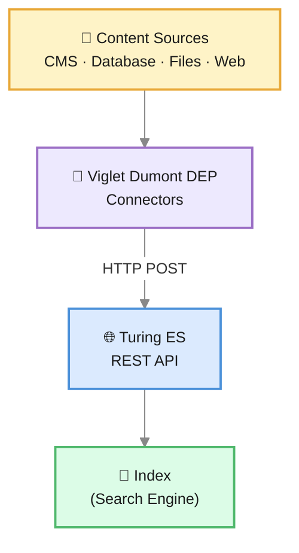
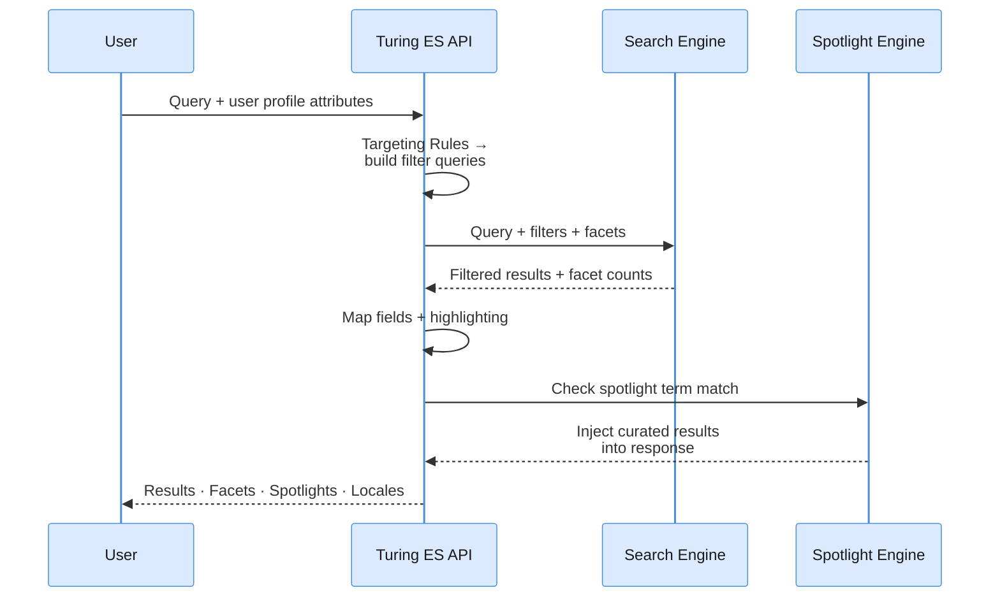

# Core Concepts

This page explains the fundamental concepts of Turing ES in plain terms. No configuration files, no code — just the mental model you need before diving into the technical documentation.

---

## Semantic Navigation Site

The **Semantic Navigation Site** (or SN Site) is the central object in Turing ES. Everything revolves around it.

Think of an SN Site as a configured search experience. It defines:

- **What content is indexed** — which fields each document has (title, text, URL, date, image, and custom fields)
- **How content is searched** — which fields are searchable, how results are ranked, how many results per page
- **How results are navigated** — which fields become filterable facets (e.g., category, author, date range)
- **How results are presented** — field mappings for display, highlighting of matched terms
- **Advanced behaviors** — Spotlights for curated results, Targeting Rules for personalization, Merge Providers for combining content from multiple sources
- **AI capabilities** — whether GenAI and RAG are enabled, and which language model to use

A single Turing ES instance can host multiple SN Sites, each independently configured. For example, you could have one site for your public website, another for your internal knowledge base, and a third for your product documentation — all on the same server.

---

## Content Ingestion

Content does not flow into Turing ES on its own. It needs connectors.

### Viglet Dumont DEP

**Viglet Dumont DEP** is a separate application that manages connectors — the components responsible for extracting content from its original source and sending it to Turing ES. Dumont DEP and Turing ES are separate projects that work together: Dumont handles *getting* content, Turing handles *indexing and searching* it.



### How a connector works

Each connector in Dumont DEP:
1. Connects to a content source (a website, a database table, a file folder, a CMS)
2. Extracts documents according to its configuration (which pages to crawl, which SQL query to run, which folder to scan)
3. Sends each document to the Turing ES REST API, targeting a specific SN Site

Turing ES receives the document, validates it against the SN Site configuration, and creates an indexing job. The job processes the document and writes it to the configured search engine (Apache Solr, Elasticsearch, or Apache Lucene) — making it immediately searchable. Apache Solr is the primary and default backend, but Turing ES also supports Elasticsearch and Lucene as alternative search engine backends.

### What happens when two connectors index the same content

Sometimes the same real-world document exists in two systems with complementary information. For example, your CMS has structured metadata (author, tags, content type) while your web crawler has the full rendered text of the same page. Neither connector alone gives you a complete document.

**Merge Providers** solve this by instructing Turing ES to detect when two connectors have indexed the same document — using a shared field as a join key — and merge them into one enriched result. See [Semantic Navigation](../semantic-navigation.md#merge-providers) to learn how to configure this.

---

<div className="page-break" />

## Search

When a user searches on an SN Site, this is what happens — in simple terms:



1. The query arrives at the Turing ES API along with the user's profile attributes (if Targeting Rules are configured)
2. **Targeting Rules** run first — they translate the user's profile attributes into additional filter queries (e.g., Solr `fq` parameters when using the default Solr backend), so only content relevant to that user is retrieved
3. Turing ES executes the search engine query with those filters, facet counts, and result ranking applied together
4. Results come back from the search engine already filtered; Turing ES maps fields and applies highlighting
5. **Spotlights** are checked last — if the query matches a spotlight term, curated documents are injected at their configured positions in the response
6. The final response — results, facets, spotlights, locales, spell check, and similar documents — goes back to the client

### Facets

Facets are filterable dimensions shown alongside search results. A user searching for "annual report" might see facets for *Year*, *Department*, and *Document Type*, and click to narrow results to "Finance" documents from "2024".

Facets are configured per SN Site, at the field level. Any indexed field can become a facet — the configuration defines how it is labeled, sorted, and counted.

### Spotlights

A Spotlight is a curated result pinned to a specific search term. When someone searches for "benefits", you can ensure your HR benefits page always appears at the top — regardless of how it ranks organically.

Spotlights are configured per SN Site and managed through the admin console. See [Spotlights](../semantic-navigation.md#spotlights) for details.

### Targeting Rules

Targeting Rules let you show different results to different users from the same index. A document tagged as `audience: internal` only appears for users whose profile includes that attribute. Users without a matching profile always see untagged content.

See [Targeting Rules](../semantic-navigation.md#targeting-rules) for a full explanation.

---

<div className="page-break" />

## Generative AI

Turing ES integrates generative AI in two places: directly on **SN Sites** (search + summarization) and through standalone **AI Agents** (open-ended chat with tools).

### RAG on an SN Site

When GenAI is enabled for an SN Site, indexed documents are also stored as **vector embeddings** — a mathematical representation of their meaning, not just their words. When a user asks a question, Turing ES:

1. Finds the most semantically relevant documents (not just keyword matches) using the vector embeddings
2. Passes those documents as context to a language model
3. Returns a natural-language answer grounded in your actual content

This is called **Retrieval-Augmented Generation (RAG)**. The LLM does not make things up — it answers based on what is in your index.

### Knowledge Base

Beyond SN Sites, Turing ES provides a **Knowledge Base** — a file and folder interface in the admin console (backed by MinIO) where you can upload documents directly. These files are also indexed as vector embeddings and become available to AI Agents as a searchable knowledge source, independent of any connector or SN Site.

The Knowledge Base is managed through the **[Assets](../assets.md)** page: drag-and-drop upload, folder navigation, inline preview, and batch AI training with real-time progress. Uploaded files are indexed automatically on upload and unindexed on deletion.

### AI Agents

An **AI Agent** is a named assistant that you compose from three ingredients:

- A **language model** (Anthropic Claude, OpenAI, Gemini, Ollama, or others)
- A set of **tools** it can call (search your SN Sites, query the Knowledge Base, browse the web, run Python code, get financial data, and more)
- Optionally, one or more **MCP Servers** — external services that provide additional tools via the Model Context Protocol

Each AI Agent appears as its own tab in the **[Chat](../chat.md)** interface. You can have a "Research Assistant" that combines SN Site search with web browsing, a "Data Analyst" that can run Python code and query your knowledge base, and a "Support Agent" that only sees your product documentation — all on the same platform.

See [AI Agents](../ai-agents.md) for configuration, [Tool Calling](../tool-calling.md) for the full tool reference, and [MCP Servers](../mcp-servers.md) for connecting external tools.

---

## The Admin Console

Everything described above — SN Sites, connectors, Spotlights, Targeting Rules, Merge Providers, AI Agents, MCP Servers, and the Knowledge Base — is configured and managed through the **Turing ES Admin Console**: a browser-based React application served by Turing ES itself.

The admin console also exposes application logs (when MongoDB is configured), search metrics, and top search terms, giving you operational visibility without needing access to the server.

---

## Consuming Turing ES from Your Application

Turing ES exposes its search, chat, and indexing capabilities through four integration options. Choose the one that best fits your technology stack.

### REST API

The primary integration method. All search, indexing, and administration operations are available as HTTP endpoints. The search response is a self-describing JSON object with pre-built navigation links — no URL construction needed on the client side.

```
GET https://<your-host>/api/sn/{siteName}/search?q=your+query
```

Suitable for any language or platform that can make HTTP requests.

### GraphQL

Turing ES also exposes a GraphQL endpoint for clients that prefer a graph-based query model. Useful when you want to request only specific fields or combine multiple queries in a single request.

```
POST https://<your-host>/graphql
```

### Java SDK

An official Java client library is available on **Maven Central**. It provides a typed API for performing searches, submitting documents for indexing, and interacting with SN Sites — without dealing with raw HTTP or JSON.

```xml
<dependency>
    <groupId>com.viglet.turing</groupId>
    <artifactId>turing-java-sdk</artifactId>
    <version>${turing.version}</version>
</dependency>
```

### JavaScript / TypeScript SDK

An official JavaScript SDK is available on **npm**. It is TypeScript-ready and covers the same search and indexing operations as the Java SDK, suited for web applications and Node.js backends.

```bash
npm install @viglet/turing-sdk
```

---

## Ready to go deeper?

| I want to... | Go to |
|---|---|
| Understand the full system architecture | [Architecture Overview](../architecture-overview.md) |
| Configure Spotlights, Targeting Rules, or Merge Providers | [Semantic Navigation](../semantic-navigation.md) |
| Set up GenAI and RAG | [GenAI & LLM Configuration](../genai-llm.md) |
| Configure AI Agents and tools | [AI Agents](../ai-agents.md), [Tool Calling](../tool-calling.md) |
| Use the AI chat interface | [Chat](../chat.md) |
| Upload documents to the Knowledge Base | [Assets](../assets.md) |
| Monitor LLM token consumption | [Token Usage](../token-usage.md) |
| Authenticate via API Key | [Authentication](../security-authentication.md) |
| Secure Turing ES with Keycloak | [Security & Keycloak](../security-keycloak.md) |
| Install Turing ES | [Installation Guide](../installation-guide.md) |

---

