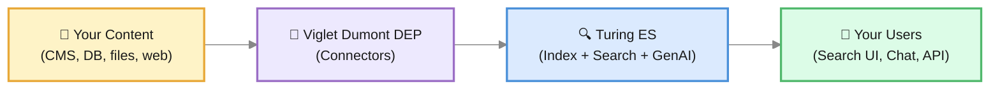

# What is Turing ES?

**Viglet Turing ES** is an open-source enterprise search platform. It helps organizations make their content findable, understandable, and interactive — through keyword search, faceted navigation, and generative AI conversations.

Whether you have thousands of documents on a file server, pages on a CMS, records in a database, or a combination of all of them, Turing ES indexes everything into a single search experience that your users can explore naturally.

---

## What can you do with Turing ES?

### Search your content
Index content from multiple sources and expose a unified, faceted search experience. Users can filter results by category, date, author, or any attribute you define — and always find what they are looking for.

### Ask questions, get answers
Enable generative AI on your search site and let users ask questions in natural language. Turing ES retrieves the most relevant documents and uses an LLM to generate a grounded, accurate response — not a hallucination.

### Build AI Agents
Compose AI Agents that combine a language model with a curated set of tools: search your content, browse the web, run code, query financial data, call external systems via MCP, and more. Each agent appears as a chat tab ready to assist users.

### Connect any content source
Turing ES receives content from **Viglet Dumont DEP**, a companion application that provides connectors for web crawlers, databases, file systems, AEM, and WordPress. Connectors run independently and push content to Turing ES through its REST API.

### Integrate with any stack
Consume Turing ES from your application via **REST API**, **GraphQL**, the **Java SDK** (available on Maven Central), or the **JavaScript / TypeScript SDK** `@viglet/turing-sdk` (available on npm).

---

## How it works at a glance

Content flows from its sources through Dumont DEP connectors into Turing ES, where it is indexed and made available to users through search interfaces, chat, and APIs.

---

## Key concepts

These are the main building blocks you will work with in Turing ES. You do not need to understand all of them before getting started — come back to each one as you need it.

| Concept | What it is | Learn more |
|---|---|---|
| **Semantic Navigation Site** | The central configuration object. Defines what content is indexed, how it is searched, and how results are presented. | [Core Concepts](./core-concepts.md) |
| **Connector** | A component in Dumont DEP that extracts content from a source and sends it to Turing ES. | [Core Concepts](./core-concepts.md) |
| **Facets** | Filterable attributes shown alongside search results (e.g., category, date, author). | [Core Concepts](./core-concepts.md) |
| **Spotlight** | Curated results pinned to specific search terms. | [Semantic Navigation](../semantic-navigation.md) |
| **Targeting Rules** | Rules that show different results to different users based on their profile. | [Semantic Navigation](../semantic-navigation.md) |
| **Merge Providers** | Rules that combine documents from two different connectors into one enriched result. | [Semantic Navigation](../semantic-navigation.md) |
| **RAG** | Retrieval-Augmented Generation — finding relevant documents and using them to ground an LLM's response. | [GenAI & LLM](../genai-llm.md) |
| **AI Agent** | A named assistant that combines an LLM with a set of tools and knowledge sources. | [GenAI & LLM](../genai-llm.md) |
| **Assets** | A file manager backed by MinIO where you upload documents to feed the Knowledge Base — files are automatically indexed as vector embeddings. | [Assets](../assets.md) |
| **Chat** | The conversational AI interface — three tabs for direct LLM chat, Semantic Navigation search, and each configured AI Agent. | [Chat](../chat.md) |
| **Token Usage** | A dashboard showing LLM token consumption by model, day, and month — useful for monitoring AI costs. | [Token Usage](../token-usage.md) |

---

## Your learning path

The fastest way to understand Turing ES is to build up one capability at a time. Each step below stands on the previous one — *index content → search it → ask it → let an agent act → automate the loop* — and links the deep page where you go further. Follow them in order the first time through; come back to any one as a reference later.

### Step 1 — Understand the model

Before configuring anything, get the mental model: the **Semantic Navigation Site** (the central object), how content is **ingested** by connectors, and how **search** and **GenAI** fit together. Fifteen minutes here saves hours later.

→ [Core Concepts](./core-concepts.md) · then, when you want the full picture, [Architecture Overview](../architecture-overview.md)

### Step 2 — Your first search

Stand up Turing ES, create an SN Site, point a connector at some content, and run a faceted search. This is the foundation everything else grounds on.

→ [Installation Guide](../installation-guide.md) → [Semantic Navigation](../semantic-navigation.md) → query it via the [REST API](../rest-api.md)

### Step 3 — Your first RAG answer

Turn on Generative AI for that site (or upload files to the **Knowledge Base**), and ask a question in natural language. Turing retrieves the most relevant documents and an LLM answers **grounded in your content** — not a hallucination. You'll wire an [LLM Instance](../llm-instances.md) and an [embedding model + store](../embedding-models.md) once, then it just works.

→ [What is RAG?](../rag.md) → [GenAI & LLM Configuration](../genai-llm.md) → [Assets (Knowledge Base)](../assets.md)

### Step 4 — Your first agent

Compose an **AI Agent**: an LLM + a curated set of tools (search your content, browse the web, run code, call external systems via [MCP](../mcp-servers.md)) + an optional brand [Persona](../personas.md). The agent appears as a chat tab, ready to *act*, not just answer.

→ [AI Agents](../ai-agents.md) → [Tool Calling](../tool-calling.md) → [Capabilities](../capabilities.md)

### Step 5 — Your first automation

Close the loop: schedule an agent to run on a cadence, or design a multi-step **Chat Flow** that collects information and triggers actions. This is where Turing stops being a search box and becomes part of your operations.

→ [Routines](../routines.md) → [Chat Flow](../chat-flow.md)

:::tip See it all wired together
The [Atlas Store reference showcase](../showcase.md) is every step above, in one runnable app — typed search → RAG chat → agent power → automation. Read it as a worked example once you've done your first search.
:::

---

## Other starting points

| I want to... | Go to |
|---|---|
| Monitor LLM usage and costs | [Token Usage](../token-usage.md) · [Cost Governance](../cost-governance.md) |
| Secure Turing ES with SSO | [Security & Keycloak](../security-keycloak.md) |
| Integrate from my own app | [REST API](../rest-api.md) · [GraphQL](../graphql.md) · [React SDK](../react-sdk.md) |
| Connect a content source | [Integration](../integration.md) |

---

