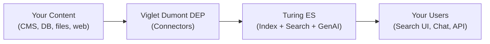

# What is Turing ES?

**Viglet Turing ES** is an open-source enterprise search platform. It helps organizations make their content findable, understandable, and interactive — through keyword search, faceted navigation, and generative AI conversations.

Whether you have thousands of documents on a file server, pages on a CMS, records in a database, or a combination of all of them, Turing ES indexes everything into a single search experience that your users can explore naturally.

---

## What can you do with Turing ES?

### Search your content
Index content from multiple sources and expose a unified, faceted search experience. Users can filter results by category, date, author, or any attribute you define — and always find what they are looking for.

### Ask questions, get answers
Enable generative AI on your search site and let users ask questions in natural language. Turing ES retrieves the most relevant documents and uses an LLM to generate a grounded, accurate response — not a hallucination.

### Build AI Agents
Compose AI Agents that combine a language model with a curated set of tools: search your content, browse the web, run code, query financial data, call external systems via MCP, and more. Each agent appears as a chat tab ready to assist users.

### Connect any content source
Turing ES receives content from **Viglet Dumont DEP**, a companion application that provides connectors for web crawlers, databases, file systems, AEM/WEM, and WordPress. Connectors run independently and push content to Turing ES through its REST API.

### Integrate with any stack
Consume Turing ES from your application via **REST API**, **GraphQL**, the **Java SDK** (available on Maven Central), or the **JavaScript / TypeScript SDK** `@viglet/turing-sdk` (available on npm).

---

## How it works at a glance

Content flows from its sources through Dumont DEP connectors into Turing ES, where it is indexed and made available to users through search interfaces, chat, and APIs.

---

## Key concepts

These are the main building blocks you will work with in Turing ES. You do not need to understand all of them before getting started — come back to each one as you need it.

| Concept | What it is | Learn more |
|---|---|---|
| **Semantic Navigation Site** | The central configuration object. Defines what content is indexed, how it is searched, and how results are presented. | [Core Concepts](./core-concepts.md) |
| **Connector** | A component in Dumont DEP that extracts content from a source and sends it to Turing ES. | [Core Concepts](./core-concepts.md) |
| **Facets** | Filterable attributes shown alongside search results (e.g., category, date, author). | [Core Concepts](./core-concepts.md) |
| **Spotlight** | Curated results pinned to specific search terms. | [Semantic Navigation](../sn-concepts.md) |
| **Targeting Rules** | Rules that show different results to different users based on their profile. | [Semantic Navigation](../sn-concepts.md) |
| **Merge Providers** | Rules that combine documents from two different connectors into one enriched result. | [Semantic Navigation](../sn-concepts.md) |
| **RAG** | Retrieval-Augmented Generation — finding relevant documents and using them to ground an LLM's response. | [GenAI & LLM](../genai-llm.md) |
| **AI Agent** | A named assistant that combines an LLM with a set of tools and knowledge sources. | [GenAI & LLM](../genai-llm.md) |

---

## Where to go next

Not sure where to start? Here is a suggested path depending on what you want to do:

**I want to understand how Turing ES works**
→ Read [Core Concepts](./core-concepts.md) first, then [Architecture Overview](../architecture-overview.md).

**I want to set up Turing ES**
→ Go to the [Installation Guide](../installation-guide.md).

**I want to configure search for my content**
→ Start with [Core Concepts](./core-concepts.md) then go to [Semantic Navigation](../sn-concepts.md).

**I want to add generative AI to my search**
→ Read [GenAI & LLM Configuration](../genai-llm.md).

**I want to secure Turing ES with SSO**
→ Go directly to [Security & Keycloak](../security-keycloak.md).

---

*Next: [Core Concepts](./core-concepts.md)*
