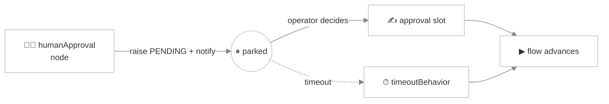

# Human-in-the-Loop

> *Most of the time you want the AI to just handle it. But some moments need a human: approving a refund, signing off on a contract clause, or quietly stepping into a conversation that's going sideways. **Human-in-the-loop (HITL)** gives you both — an asynchronous approval checkpoint baked into the flow, and a live spectator + co-pilot console for real-time intervention.*

Viglet Turing ES has two complementary HITL surfaces:

1. **`humanApproval` node** — a graph-declared checkpoint that **parks** a conversation until a person approves or rejects, notified over their channel of choice.
2. **Spectator + co-pilot mode** — an operator watches any live conversation and can **take the wheel** for a turn.

The first is for *designed* approval gates (compliance, escalation); the second is for *ad-hoc* supervision and rescue.

---

## The `humanApproval` node

Drop a `humanApproval` node into a [Chat Flow](./chat-flow.md) wherever the conversation must wait for a human decision. When the flow reaches it:



1. **First entry** — the approval slot is empty, so the service raises a `PENDING` approval record, fires the notification, and the engine **parks** the conversation on this node.
2. **Re-entry while pending** — if the visitor keeps talking before a decision lands, it's a no-op; the conversation stays parked.
3. **Decision present** — once the operator's decision is written into the **approval slot**, the engine advances on the next edge.

### What the node carries

| Field | Meaning |
|---|---|
| `approvalSlot` | The slot the decision is written into (what unblocks the flow) |
| `channel` | How the approver is notified — `email`, `slack`, or `webhook` |
| `target` | The channel destination (email address, Slack channel, webhook name) |
| `promptText` | What the approver sees — the question/context to decide on |
| `timeoutBehavior` | What happens if no one decides in time (see below) |
| `resumeToken` | An opaque, single-use token that ties a decision back to this exact parked conversation + node |

Each pending approval is persisted as a record with a status of **`PENDING` → `DECIDED` / `TIMED_OUT` / `CANCELLED`**.

### Notifications & decisions

When an approval is raised, `TurHumanApprovalNotifier` dispatches over the configured channel — an email, a Slack message, or a [webhook](./webhooks.md) — carrying the `promptText` and a link/token to decide. The approver decides through the approval API:

| Method | Endpoint | Purpose |
|---|---|---|
| `GET` | `/api/genai/approval/{token}` | Fetch a pending approval by its resume token (what the decision page loads) |
| `POST` | `/api/genai/approval/{token}` | Submit the decision `{ "decision": "..." }` — writes the approval slot and resumes the parked flow |
| `GET` | `/api/genai/approvals` | List all pending approvals (the operator queue) |

Submitting a decision writes the approval slot and resumes the conversation in one step.

### Timeouts

A human might never respond. Each approval has an `expiresAt`, and the **timeout sweep job** (`TurHumanApprovalTimeoutSweepJob`) periodically resolves anything past its deadline according to the node's `timeoutBehavior`:

- **auto-reject** (the safe default) — the approval resolves as rejected and the flow advances down the rejection path.
- **auto-approve** — the approval resolves as approved (use only where a missed deadline should *not* block the visitor).

Either way the record moves to `TIMED_OUT` and the conversation is unparked, so a conversation is never stuck forever waiting on a human.

:::tip Force-unblock
An admin can force-advance a parked conversation from the parked-conversations view; the still-pending approval is then marked `CANCELLED` rather than left dangling.
:::

---

## Spectator + co-pilot mode

Sometimes you don't want a designed gate — you want to **watch** a conversation happening right now and step in if needed. An operator opens a live conversation in the admin console at `/conversation/{id}?spectate=true` and gets a real-time view fed by three conversation-scoped SSE streams (all under `/api/chat/sessions`, admin-secured):

| Stream | Endpoint | What it carries |
|---|---|---|
| Messages | `GET /{conversationId}/spectate/stream` | A transcript snapshot, then one event per completed turn (visitor + assistant) |
| Slots | `GET /{conversationId}/spectate/slots/stream` | Live slot updates as they're written |
| Workspace | `GET /{conversationId}/spectate/workspace/stream` | Live [agent-workspace](./agent-workspace.md) file changes |

A header is driven by `GET /{conversationId}/state` — the active flow, current node, guardrail method, A/B experiment metadata, and a **suspended reason** when the cursor is parked on a `suspend` or `humanApproval` node (so a spectator can see *why* a conversation is waiting).

### Taking the wheel

Toggle `?manual=true` and the operator can **take the wheel** for a turn:

```
POST /api/chat/sessions/{conversationId}/manual-turn
```

The operator's text becomes the assistant message — **the LLM is skipped** — but it's written through the same flow-advance + telemetry path as a normal turn, so slots, analytics, and the transcript stay consistent. Spectators watching the message stream see the operator's reply arrive exactly like an AI reply. It's the rescue hatch for a conversation the model is mishandling.

:::caution Single-node SSE
The spectate streams (like the slot/workspace buses) are **per-node** — a spectator connects to the node serving the conversation. They carry a periodic heartbeat to keep the connection alive.
:::

---

## Choosing between them

| You need… | Use |
|---|---|
| A required sign-off before the flow can continue (refund, contract, compliance) | `humanApproval` node |
| Notification of the approver over email / Slack / webhook | `humanApproval` node |
| To watch conversations live and only intervene if something goes wrong | Spectator mode |
| To type a reply yourself mid-conversation | Co-pilot (`manual-turn`) |

---

## Related pages

- [Chat Flow](./chat-flow.md) — where the `humanApproval` and `suspend` nodes are authored
- [Webhooks](./webhooks.md) — a notification channel for approvals, and the handoff surface
- [Agent Workspace](./agent-workspace.md) — the files a spectator sees on the workspace stream
- [Chat Analytics](./chat-analytics.md) — review parked/escalated conversations after the fact
