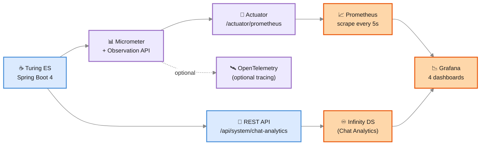

# Observability — Prometheus & Grafana

> *You can't fix what you can't see. And in production, "I'll add some logs and check tomorrow" is what tomorrow's incident is built on.*

Turing ES ships with a complete observability stack designed to be **flipped on at install time and left alone**:

- **Spring Boot Actuator** exposes a Prometheus endpoint at `/actuator/prometheus`.
- **Prometheus** scrapes it every 5 seconds and stores the time series.
- **Grafana** renders four pre-built dashboards over the metrics, plus the [Chat Analytics](./chat-analytics.md) dashboard that reads from the analytics REST API.
- **Micrometer** emits stable metric names so dashboards survive upgrades.
- **Observation API** bridges metrics ↔ tracing — every LLM call, every search, every snapshot lookup is both a timer and a span.

You don't have to write a single PromQL query to get value. The default dashboards cover 90% of operational questions out of the box. The other 10% — when something genuinely odd is happening — is where knowing the metric names pays off.

---

## The Stack at a Glance



| Component | Role | Where it runs |
|---|---|---|
| **Spring Boot Actuator** | Exposes the metrics endpoint | Inside Turing ES, port 2700 |
| **Micrometer** | Metrics library — counters, timers, gauges | Embedded in Turing ES |
| **Observation API** | Unified abstraction — one observation, two outputs (metric + span) | Embedded in Turing ES |
| **Prometheus** | Pull-based scraper, time-series database | `containers/prometheus/` (port 9090) |
| **Grafana** | Visualization, dashboards, alerts | `containers/grafana/` (port 3000) |

Both Prometheus and Grafana are provisioned as Docker images in the `containers/` directory. A `docker compose up` brings them up alongside Turing ES.

:::info You don't have to use them
Observability is **optional**. Turing ES runs perfectly without Prometheus or Grafana — Actuator just exposes the endpoint, and nothing scrapes it. But once you've seen a real incident through these dashboards, you'll wonder how you operated anything without them.
:::

---

## What Gets Measured

Stable metric names are the contract between Turing ES and your dashboards. They're documented in `TurMeterNames.java` and treated as a public API — they don't change between minor versions without a migration note.

### LLM Calls

Every call to a language model — chat, streaming, embedding — flows through `TurLlmObservation`. Both the AI Agent loop and the Chat Analytics enricher use it.

| Metric | Type | Tags | What you learn |
|---|---|---|---|
| `turing.llm.calls` | Timer | `provider`, `operation`, `status` | Latency per call, error rate per provider |
| `turing.llm.tokens` | Counter | `provider`, `model`, `direction` | Token usage by provider/model, split into `in` and `out` |

`provider` is the LLM vendor (`anthropic`, `openai`, `gemini`, `azure_openai`, `ollama`). `operation` is `chat`, `stream`, or `embed`. `status` is `success` or `error`.

The same series carries traffic from chat (`/api/v2/llm/.../chat`) **and** from the Chat Analytics enricher. To split them, filter by `model` (the enricher uses whichever model your default LLM is set to).

### Search

Every call to a search engine plugin (Solr, Elasticsearch, Lucene) is observed.

| Metric | Type | Tags | What you learn |
|---|---|---|---|
| `turing.search.calls` | Timer | `engine`, `operation`, `status` | Engine-side latency and error rate |
| `turing.search.pipeline` | Timer | `stage`, `status` | Java-side pipeline stages: `search.total`, `snapshot.build`, `search.response`, `result.process`, `widget.build` |
| `turing.search.snapshot.cache` | Counter | `outcome` (`hit` / `miss` / `evict`) | Snapshot cache hit ratio — drives latency dramatically |

The split between `turing.search.calls` and `turing.search.pipeline` is deliberate: the first is the *backend* engine call (mostly Solr time); the second is everything Turing ES does *around* the call (snapshot lookup, result mapping, facet processing, widget assembly). When latency spikes, you'll know whether to blame the engine or the orchestration.

### Chat Analytics

The AI-on-AI pipeline emits its own observability so you can see whether it's keeping up.

| Metric | Type | Tags | What you learn |
|---|---|---|---|
| `turing.chat.analytics.enrich.cycle` | Timer | `status` (`success` / `empty` / `skipped`) | How long each scheduled cycle takes; whether cycles are getting skipped (e.g., LLM offline) |
| `turing.chat.analytics.classify` | Timer | `outcome` (`classified` / `unclassified` / `error` / `skipped` / `empty_transcript`) | Per-session classification latency split by outcome |
| `turing.chat.analytics.classifications` | Counter | `outcome` | Cumulative count by outcome — *"how many sessions get classified vs. how many fail"* |
| `turing.chat.analytics.inflight.size` | Gauge | — | Current size of the in-memory in-flight map. Slow growth here is a leak. |

If the gauge starts trending up and never comes down, the periodic sweep isn't keeping pace — investigate by looking at agent flows that don't end cleanly.

---

<div className="page-break" />

## How to Bring the Stack Up

### Local Development

```bash
cd containers
docker compose up -d prometheus grafana
```

This starts both containers with the provided `prometheus.yml` and Grafana provisioning.

**`containers/prometheus/prometheus.yml`** points at the host machine:

```yaml
scrape_configs:
  - job_name: turing-es
    metrics_path: /actuator/prometheus
    scheme: http
    static_configs:
      - targets:
          - host.docker.internal:2700
        labels:
          application: turing-es
          instance: turing-dev
```

`host.docker.internal` resolves to the Docker host on Windows and macOS. On Linux, ensure `extra_hosts: ["host.docker.internal:host-gateway"]` is added to the Prometheus service in `docker-compose.yml`.

Once running:

- Prometheus UI → [http://localhost:9090](http://localhost:9090)
- Grafana → [http://localhost:3000](http://localhost:3000) (default admin/admin on first login)

### Production

For production, Prometheus runs as part of your existing observability stack (often Kubernetes-deployed), scraping Turing ES via the same `/actuator/prometheus` endpoint. The dashboards in `containers/grafana/dashboards/` are JSON files — drop them into your existing Grafana instance via *Configuration → Dashboards → Import JSON*.

The Infinity datasource (used by the Chat Analytics dashboard) reads from Turing ES's REST API directly — no Prometheus needed for that one. It needs:

- Allow-list for the URL `http://<turing-host>:2700/api/system/chat-analytics/*`
- A datasource named `turing-chat-analytics` so the dashboards find it

Grafana provisioning files in `containers/grafana/provisioning/datasources/` show the expected configuration; copy them into your environment.

---

## The Pre-Built Dashboards

Four dashboards ship in `containers/grafana/dashboards/`. Each tells a different story.

### 1. `turing-search` — Operational Search Health

The on-call dashboard. If pages are loading slowly, this is where you go.

- **Search latency p95 / p99** by site
- **Engine call latency** broken down by `engine` (Solr, Elasticsearch, Lucene) and `operation`
- **Pipeline stage breakdown** — `snapshot.build` vs. `search.response` vs. `result.process` vs. `widget.build`
- **Snapshot cache hit ratio** — the single biggest lever on search latency
- **Error rate** — `turing.search.calls{status="error"}`

A high `snapshot.build` time with low `search.response` time means *"Solr is fast, but we're rebuilding a snapshot too often"* — increase TTL or pre-warm.

### 2. `turing-search-insights` — Product Search Quality

The PM dashboard. Used to understand what users are looking for.

- **Top search terms** over time
- **Zero-result rate** — what users searched for but found nothing
- **CTR per term** (click-through rate from results)
- **Result-position click distribution** — are users clicking position 1, or scrolling to find what they want?

### 3. `turing-search-term-detail` — Drill-Down

Linked from the term-list dashboard. Pick a term, see the full picture: query volume, click-through rate, top clicked documents, time-of-day distribution.

### 4. `turing-chat-insights` — Chat Analytics

The full Chat Analytics dashboard. Reads from `/api/system/chat-analytics/**` via the Infinity datasource (engine-agnostic). See [Chat Analytics](./chat-analytics.md) for the panel-by-panel breakdown.

---

<div className="page-break" />

## Useful Queries

### "Are we healthy right now?"

```promql
# Error rate across all LLM providers, last 5 min
sum(rate(turing_llm_calls_seconds_count{status="error"}[5m]))
/ sum(rate(turing_llm_calls_seconds_count[5m]))
```

If this stays below 1%, you're healthy. Spikes usually correlate with provider rate-limiting or transient network issues.

### "What's our search p95?"

```promql
# Search engine call p95, by site
histogram_quantile(0.95,
  sum by (le, engine) (rate(turing_search_calls_seconds_bucket[5m])))
```

For pipeline stages (Java-side):

```promql
histogram_quantile(0.95,
  sum by (le, stage) (rate(turing_search_pipeline_seconds_bucket[5m])))
```

If the engine number is fast but the pipeline is slow, the bottleneck is in Turing ES's orchestration (often `snapshot.build`).

### "What's our cache hit ratio?"

```promql
rate(turing_search_snapshot_cache_total{outcome="hit"}[5m])
/ on() rate(turing_search_snapshot_cache_total{outcome=~"hit|miss"}[5m])
```

Below 80% means snapshots are evicting too often or TTL is too short.

### "Is the chat-analytics enricher keeping up?"

```promql
# Cycles where status != "success" — the enricher skipped or failed
rate(turing_chat_analytics_enrich_cycle_seconds_count{status!="success"}[15m])
```

If this rises, the enricher is being skipped (LLM offline) or erroring. Cross-reference with `turing.chat.analytics.classifications{outcome="error"}`.

### "How much are the AI Agents costing me, per provider?"

```promql
# Output tokens per second, last 1h, by provider
sum by (provider) (rate(turing_llm_tokens_total{direction="out"}[1h]))
```

Multiply by your provider's per-token cost to get a real-time burn rate. Combined with the `model` tag, you can see which model is dominating cost.

### "Is the in-flight map leaking?"

```promql
# Gauge — should oscillate, not climb
turing_chat_analytics_inflight_size
```

A monotonically rising line = leak. The hourly sweep should keep this stable.

---

## Tracing (Optional)

Micrometer's Observation API produces both metrics **and** spans. If you wire an OpenTelemetry exporter — Jaeger, Tempo, Honeycomb, Datadog — every observation becomes a trace span automatically.

Enable in `application.yaml`:

```yaml
management:
  tracing:
    sampling:
      probability: 1.0
  otlp:
    tracing:
      endpoint: http://localhost:4318/v1/traces
```

Sampling at 1.0 (every request) is fine for low-traffic deployments and during incident debugging. For high-traffic production, drop to 0.05–0.1.

When tracing is on, every LLM call, search, and snapshot lookup gets a span with the same low-cardinality tags as the metrics. You can pivot between *"how slow is this in aggregate"* (Grafana) and *"why was this specific request slow"* (Jaeger) without changing instrumentation.

---

## When to Add Custom Metrics

The shipped metrics cover the common operational questions. You might want to add custom ones when:

- A specific business KPI matters (e.g., conversion rate from a specific agent — you'd derive this from Chat Analytics, not Prometheus).
- A subsystem has its own SLO (e.g., a particular MCP server you depend on).

Pattern to follow (`io.micrometer.core.instrument`):

```java
@Service
public class MyService {
    private final MeterRegistry meterRegistry;

    public MyService(@Autowired(required = false) MeterRegistry meterRegistry) {
        this.meterRegistry = meterRegistry;
    }

    public void doWork() {
        Timer.Sample sample = meterRegistry == null ? null : Timer.start(meterRegistry);
        try {
            // ...
            recordOutcome(sample, "success");
        } catch (Exception e) {
            recordOutcome(sample, "error");
            throw e;
        }
    }

    private void recordOutcome(Timer.Sample sample, String status) {
        if (meterRegistry == null || sample == null) return;
        sample.stop(Timer.builder("my.service.work")
            .tag("status", status)
            .register(meterRegistry));
    }
}
```

The `meterRegistry == null` check is important — it makes the metric optional, so unit tests run without an observation registry.

Add the metric name to `TurMeterNames.java` so it's part of the public observability contract.

---

<div className="page-break" />

## Where Logs Fit

Metrics tell you *something is wrong*. Logs tell you *what is wrong*.

Turing ES uses standard SLF4J logging. In production, three options:

| Approach | When |
|---|---|
| **Standard output → log aggregator** (Loki, ELK, Datadog) | Recommended. Your existing log stack already handles this; nothing Turing-specific. |
| **MongoDB Logback appender** | When operators need to read logs from the admin console without server access. See [Logging](./logging.md). |
| **Both** | Common in production. Stdout for the platform team, MongoDB for product/support. |

Metrics + logs + traces is the classic three-pillar observability story. Turing ES gives you all three out of the box; the only thing you have to wire is the destination.

---

## Common Operational Patterns

### Latency spike, no error spike

Almost always a downstream provider issue. Check `turing.llm.calls{provider, status}` — if `success` count drops and latency rises, the provider is rate-limiting or the network is slow. The chat analytics enricher will also slow because it shares the LLM stack — watch `turing.chat.analytics.classify` for confirmation.

### Token cost climbing without traffic climbing

Probably a model upgrade. Confirm by comparing yesterday's `rate(turing_llm_tokens_total{direction="out"}[1d])` to last week's, split by `model`. A new model might be more verbose by default.

### Search p99 high, p50 fine

A subset of queries is slow. Check `turing.search.pipeline` p99 vs. p50 by `stage`. If `snapshot.build` is the culprit, a specific site has cold-cached snapshots — pre-warm or raise TTL.

### Chat goal-rate dropping but volume rising

This is **the** signal of a quality regression that won't show in basic metrics. You're getting more conversations, but a lower share are achieving their goal. Either:

- Marketing pulled in lower-intent traffic (look at the `intentLabel` distribution — `EXPLORATION` rising is a good sign here),
- Or your agent recently changed and started failing — drill into Chat Analytics → scorecard by agent → find the dragger.

### Mongo growing, sessions not classified

Look at `turing.chat.analytics.classifications{outcome}` over time:

- If `error` is rising → something's wrong with the classifier (default LLM offline, prompt too long, etc.).
- If `unclassified` is rising → the model's JSON parsing is failing — check `intentConfidence` averages. Consider a stronger default LLM.
- If everything's `skipped` → the default LLM in Global Settings is disabled.

---

## Configuration Reference

```yaml
# Spring Boot Actuator — Prometheus endpoint
management:
  endpoints:
    web:
      exposure:
        include: health,info,prometheus
  metrics:
    tags:
      application: turing-es
      instance: ${HOSTNAME}
  tracing:
    sampling:
      probability: 1.0          # 1.0 in dev, 0.05 in production
  otlp:
    tracing:
      endpoint: http://localhost:4318/v1/traces   # optional — Jaeger / Tempo / etc.
```

The Actuator endpoint is exposed unauthenticated by default in dev. In production, secure it (Spring Security, IP allowlist, ingress restriction) or move it to a separate management port.

---

## Related Pages

| Page | Description |
|---|---|
| [Architecture Overview](./architecture-overview.md) | Where the observability layer fits in the system |
| [Chat Analytics](./chat-analytics.md) | The companion analytics for chat conversations |
| [Logging](./logging.md) | The third pillar — application logs |
| [Configuration Reference](./configuration-reference.md) | All `management.*` and `turing.*` properties |

---
