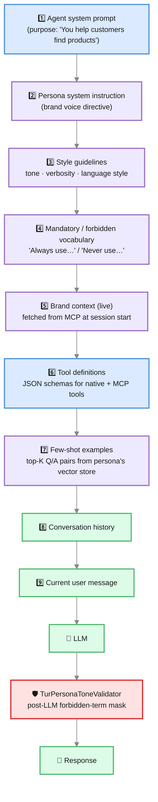

# Personas

> *Your customer doesn't want to talk to an LLM. They want to talk to **your company**.*

A **Persona** is the voice profile of your AI. It's the difference between an assistant that sounds like every other chatbot on the internet and one that sounds like the most senior, most on-brand, most consistent representative your team could possibly hire.

You wire a Persona once, and from that moment forward, every agent you attach it to:

- speaks in **your tone**, not the model's default,
- uses the words you want to be remembered by,
- never uses the words that get you in trouble,
- answers with the **vocabulary of customers who already converted**, retrieved live from a few-shot store,
- pulls **brand facts in real time** from an MCP server, so promotions and product names are never out of date.

Configure Personas in **Administration → Personas**. They are reusable across any AI Agent.

---

## Why Personas Exist

Pick any modern LLM and ask it to "answer like a sales rep". You'll get something that's helpful, polite, and completely indistinguishable from the next ten companies asking the model the same thing. The same model, asked the same way, will quote different prices, use different brand names, and forget your discount window.

That's a problem for two reasons:

1. **Conversion** — generic voice doesn't sell. Customers convert when they feel they're being talked to like adults, by a person who knows what they came for. A senior sales rep doesn't read scripts; they sound like *the company*. Personas give your AI that consistency.
2. **Risk** — the same generic voice can also say something you'd never authorize. A wrong product name. A discount that doesn't exist. A claim about a competitor. Personas put guardrails in place: vocabulary you require, vocabulary you forbid — enforced both **in the prompt** and **after the response** before it reaches the user.

A Persona is the cheapest, most repeatable way to make every AI Agent speak with one voice.

---

## Anatomy of a Persona

A Persona is a small bundle of decisions. Each one nudges the LLM in a specific direction, and together they replace the model's default voice with yours.

| Field | What it does | Why it matters for conversion |
|---|---|---|
| **Name** | Internal identifier (not shown to the user) | Lets your team say *"use the Sales Persona for that agent"* without ambiguity |
| **Description** | One-line summary of when to use it | Helps non-technical admins pick the right persona |
| **System Instruction** | Free-text directive prepended to the agent's own system prompt | The narrative core — *"Speak as a senior account executive at YourCompany. Lead with outcomes, never features. Ask one question at a time."* |
| **Tone** | `FORMAL` · `CASUAL` · `TECHNICAL` · `EXECUTIVE` | Sets register. EXECUTIVE for C-level discovery; CASUAL for self-serve onboarding; TECHNICAL for developer relations; FORMAL for regulated industries. |
| **Verbosity** | 1–5 scale | Lower is shorter. Use **2** for chat (mobile-friendly answers), **4** for advisory contexts where the user expects depth. |
| **Language Style** | `NEUTRAL` · `DIRECT` · `NARRATIVE` · `PERSUASIVE` · `INSTRUCTIONAL` | The shape of the answer. **PERSUASIVE** for sales. **INSTRUCTIONAL** for onboarding. **NARRATIVE** for long-form content. |
| **Mandatory Terms** | Pipe-separated list of words/phrases the LLM must use | Anchors brand language. *"Customer Success \| ROI \| outcome"* keeps the conversation in your vocabulary. |
| **Forbidden Terms** | Pipe-separated list of words/phrases that must never appear | Compliance and brand safety. Words like competitor names, deprecated product names, or sensitive claims. |
| **Few-shot Store** | Vector store with example Q/A pairs | Live retrieval of similar past conversations — the LLM learns *your* style by example, not by description |
| **Brand Context MCP** | An MCP server providing live brand facts | Real-time pricing, product catalogs, current promotions — pulled per conversation, never stale |
| **Enabled** | Toggle | Disable a persona to retire it without deleting; agents fall back to no-persona behavior |

:::tip Pipe-separated, not comma-separated
Both `mandatoryTerms` and `forbiddenTerms` use the pipe (`|`) separator, not commas. This lets a single term contain a comma — important for phrases like *"Tier 1, Tier 2 customers"*.
:::

---

## How a Persona Reaches the LLM

A Persona doesn't replace your AI Agent's system prompt — it **layers on top of it**. Here's exactly what happens at chat time:

1. **Agent's own system prompt** — the agent's purpose-specific instructions ("You help customers find products on our store"). Defined once on the agent.
2. **Persona system instruction** — the brand voice directive. Prepended to the agent's prompt.
3. **Style guidelines block** — a small structured paragraph derived from `tone` + `verbosity` + `languageStyle` (e.g., *"Use an EXECUTIVE tone, verbosity 2 (concise), PERSUASIVE language."*).
4. **Mandatory / forbidden vocabulary** — explicit *"Always use:"* and *"Never use:"* lists.
5. **Brand context** — if a `brandContextMcpServer` is wired, Turing ES calls it once at session start and injects the returned facts ("current product catalog", "active promotions") into the prompt.
6. **Few-shot examples** — if a `fewShotStore` is wired, the **user's first message** is embedded and the top-K most similar past Q/A pairs are retrieved and included before the user message. The LLM sees *real examples of how your company answers questions like this*.
7. **Conversation history** — the running message list.
8. **Current user message** — what they just typed.

The model never sees layers 1–6 again after the first turn — they're cached. Layers 7 and 8 evolve naturally with the conversation.

---

## Post-LLM Tone Validation

The prompt-side guardrails (forbidden vocabulary in the system message) are necessary but not sufficient. LLMs occasionally drift, especially under tool-calling pressure or in long sessions. So Turing ES enforces forbidden terms **a second time, after the LLM responds**, before the response reaches the chat executor.

`TurPersonaToneValidator` scans every assistant response for matches against the persona's forbidden list. Matches are **masked** — replaced with a neutral placeholder — rather than the entire response being blocked. Logs record the match so you know when your prompt isn't holding.

Two-layer enforcement is deliberate:

| Layer | Stops what | Latency |
|---|---|---|
| **Prompt-side** | The model never *intends* to say it | Free (already in the system prompt) |
| **Post-LLM** | The model said it anyway | Microseconds — pure regex match |

You don't need to choose. Both are on by default whenever a Persona is attached.

---

## The Few-Shot Store: Teach by Example

The hardest part of a brand voice isn't the rules — it's the *feel*. You can describe FORMAL, but you can't fully describe *"the way Maria from sales answers a discount request"*. So Turing ES lets you point a Persona at a **vector store of past Q/A pairs**, and at every conversation it retrieves the most relevant ones to use as few-shot examples.

**How to populate the store:**

1. Create a dedicated [Embedding Store](./embedding-stores.md) for the persona (e.g., a ChromaDB collection named `sales-persona-fewshot`).
2. Index real or curated Q/A pairs in it. Each document is a structured pair: a question your customers might ask, and an answer in the persona's voice. Quality > quantity. **20 well-written pairs beats 200 mediocre ones.**
3. Wire the store on the persona's **Few-shot Store** field.

**At chat time:**

- The user's first message is embedded.
- Turing ES retrieves the top similar Q/A pairs (default top 3, similarity ≥ 0.7).
- Pairs are injected before the user's message as `Example Q:` / `Example A:` blocks.
- The LLM sees concrete examples of how your company answers similar questions.

The result: a *PERSUASIVE* persona that doesn't just claim to be persuasive, but mirrors the cadence of conversations that already converted in your CRM.

:::tip Curating Q/A pairs from real conversations
The [Chat Analytics](./chat-analytics.md) drill-down view exports finished sessions with full transcripts. Pick the ones the AI nailed — high goal-achievement rate, positive sentiment, business outcome confirmed — and use them as your seed Q/A set. Your few-shot store stays fresh because *real conversions feed it*.
:::

---

## Brand Context: Live Facts, Not Stale Prompts

Customers ask about pricing. About active promotions. About whether a feature is in beta. About a model that was just released yesterday.

If you bake those facts into the system prompt, two things happen:

1. The prompt grows past the model's optimal range.
2. Every time a price changes, marketing has to ask engineering to redeploy a prompt.

The **Brand Context MCP** field solves this. It points the persona at an MCP server you control. At every conversation, Turing ES calls a single MCP tool (e.g., `get_brand_context`) and injects the JSON response into the system prompt as a *"Current brand facts:"* block.

You get:

- A **single source of truth** for prices, product names, promotions.
- **Marketing can update facts** without anyone touching the persona.
- Prompts stay short and readable — a key driver of LLM performance.
- The same MCP can be reused across multiple personas (sales, support, partner).

A common architecture: marketing maintains a CMS, and an MCP server reads from that CMS. The persona pulls from the MCP. The CMS is the system of record; everything else is downstream.

---

## Three Personas in Action

Here are three concrete personas, each tuned for a different point in the funnel.

### 1. The Top-of-Funnel Salesperson

**When the visitor hasn't decided what they want yet.**

| Field | Value |
|---|---|
| Name | `top-of-funnel-sales` |
| Tone | `EXECUTIVE` |
| Verbosity | `2` |
| Language Style | `PERSUASIVE` |
| Mandatory Terms | `outcome \| measurable \| within 90 days \| Customer Success` |
| Forbidden Terms | `cheap \| budget option \| competitor` |
| System Instruction | *"You are a senior account executive. Open with a one-sentence outcome the prospect can imagine. Ask exactly one qualifying question per turn. Never quote prices in the first 5 turns — instead, anchor on value."* |
| Few-shot Store | `sales-fewshot-tof` (curated from conversations that converted to demo bookings) |
| Brand Context MCP | `marketing-facts-mcp` |

The persona converts **discovery** into **booked demos**.

### 2. The Solutions Engineer

**When the visitor is technical and evaluating.**

| Field | Value |
|---|---|
| Name | `solutions-engineer` |
| Tone | `TECHNICAL` |
| Verbosity | `4` |
| Language Style | `INSTRUCTIONAL` |
| Mandatory Terms | `architecture \| reference \| API contract \| SLA` |
| Forbidden Terms | `magic \| black box` |
| System Instruction | *"You are a solutions engineer. Lead with the architectural answer. If the question is fuzzy, ask for the integration context (their stack, scale, latency budget) before answering."* |
| Few-shot Store | `engineering-fewshot` (sourced from successful technical pre-sales calls) |
| Brand Context MCP | `product-docs-mcp` |

The persona converts **technical evaluation** into **technical buy-in**.

### 3. The Onboarding Coach

**When the customer has just signed up and needs to get to value fast.**

| Field | Value |
|---|---|
| Name | `onboarding-coach` |
| Tone | `CASUAL` |
| Verbosity | `3` |
| Language Style | `INSTRUCTIONAL` |
| Mandatory Terms | `you'll \| in 5 minutes \| first \| then` |
| Forbidden Terms | `simply \| just \| obvious` |
| System Instruction | *"You are an onboarding coach. Always show one next step at a time. Confirm the user finished the previous step before moving on. Celebrate small wins."* |
| Few-shot Store | `onboarding-fewshot` (from sessions where a new customer reached the activation milestone) |
| Brand Context MCP | `product-docs-mcp` |

The persona converts **activation** into **retention**.

---

## Where Personas Fit in the Bigger Picture

A Persona is one of three layers that make an AI Agent come alive:

| Layer | What it provides |
|---|---|
| **LLM Instance** | The brain — the raw reasoning engine ([LLM Instances](./llm-instances.md)) |
| **Tools + MCP Servers** | The hands — what the agent can *do* ([Tool Calling](./tool-calling.md), [MCP Servers](./mcp-servers.md)) |
| **Persona** | The voice — *how* it speaks |

Without a Persona, an Agent still works — but its voice is the LLM's default voice. With a Persona, every agent that uses it sounds like the same coherent representative of your brand. Swap the LLM, swap the tools — the voice stays.

---

## REST API

| Method | Endpoint | Description |
|---|---|---|
| `GET` | `/api/persona` | List all personas |
| `GET` | `/api/persona/{id}` | Get a single persona |
| `POST` | `/api/persona` | Create a persona |
| `PUT` | `/api/persona/{id}` | Update a persona |
| `DELETE` | `/api/persona/{id}` | Delete a persona |

When updating, the `mandatoryTerms` and `forbiddenTerms` arrive as pipe-joined strings from the form; the controller persists them verbatim. Validation happens at the LLM injection point (so an empty list is fine — it simply contributes no constraint).

---

## How to Choose a Persona for an Agent

When you create or edit an [AI Agent](./ai-agents.md), the **Persona** field is a dropdown. The decision tree is short:

1. **Is this agent customer-facing?** If no, a Persona is optional (internal agents often just need precision, not voice). If yes, **always pick a persona** — even a minimal one. Customer-facing without a persona means *the LLM's default voice is your company's voice*.
2. **What part of the funnel?** Pick a persona scoped to that stage (top of funnel, evaluation, onboarding, retention, escalation). Don't try to make one persona do all five.
3. **Is the persona's few-shot store fresh?** If the store was seeded six months ago and your product has shipped two major releases since, the few-shot answers will reference outdated features. Review and re-seed quarterly.

---

## Common Pitfalls

| Pitfall | Symptom | Fix |
|---|---|---|
| **Persona contradicts the agent's system prompt** | Inconsistent answers; the LLM "fights itself" | The agent prompt says *what* the agent does; the persona says *how* it speaks. Keep them orthogonal. |
| **Forbidden terms overlap with the agent's domain** | Responses get masked frequently; user sees `[redacted]` placeholders | Forbidden lists are for marketing/compliance terms, not technical jargon. Move technical filters to the agent prompt. |
| **Few-shot store mixed with general knowledge** | Persona drifts toward whatever's in the store | The few-shot store should hold *only* curated Q/A pairs in the persona's voice. Use a separate Knowledge Base store for retrieval. |
| **Brand context MCP returns 200KB of JSON** | Token usage spikes; latency rises | The MCP should return the smallest possible relevant context — ideally under 1,000 tokens. Filter server-side, not client-side. |
| **Single persona for the entire funnel** | Onboarding coach also tries to upsell; sales rep also tries to teach Python | Personas are cheap. Make several, scoped tightly. The dropdown will keep them organized. |

---

## Related Pages

| Page | Description |
|---|---|
| [AI Agents](./ai-agents.md) | Where personas are attached |
| [Chat](./chat.md) | The interface where personas show their voice |
| [Embedding Stores](./embedding-stores.md) | Backend for the few-shot store |
| [MCP Servers](./mcp-servers.md) | Backend for live brand context |
| [Chat Analytics](./chat-analytics.md) | Where you discover whether the persona is actually converting |

---
