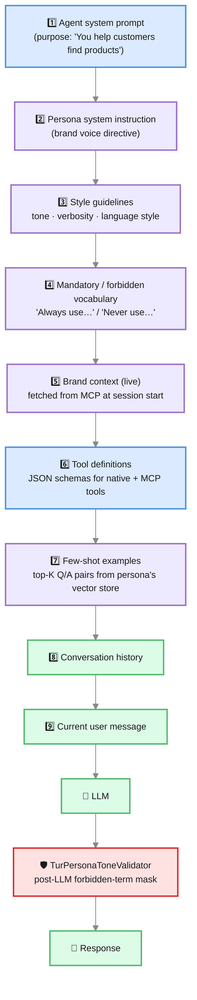

# Personas

> *Your customer doesn't want to talk to an LLM. They want to talk to **your company**.*

A **Persona** is the voice profile of your AI. It's the difference between an assistant that sounds like every other chatbot on the internet and one that sounds like the most senior, most on-brand, most consistent representative your team could possibly hire.

You wire a Persona once, and from that moment forward, every agent you attach it to:

- speaks in **your tone**, not the model's default,
- uses the words you want to be remembered by,
- never uses the words that get you in trouble,
- answers with the **vocabulary of customers who already converted**, retrieved live from a few-shot store,
- pulls **brand facts in real time** from an MCP server, so promotions and product names are never out of date.

Configure Personas in **Administration → Personas**. They are reusable across any AI Agent.

---

## Why Personas Exist

Pick any modern LLM and ask it to "answer like a sales rep". You'll get something that's helpful, polite, and completely indistinguishable from the next ten companies asking the model the same thing. The same model, asked the same way, will quote different prices, use different brand names, and forget your discount window.

That's a problem for two reasons:

1. **Conversion** — generic voice doesn't sell. Customers convert when they feel they're being talked to like adults, by a person who knows what they came for. A senior sales rep doesn't read scripts; they sound like *the company*. Personas give your AI that consistency.
2. **Risk** — the same generic voice can also say something you'd never authorize. A wrong product name. A discount that doesn't exist. A claim about a competitor. Personas put guardrails in place: vocabulary you require, vocabulary you forbid — enforced both **in the prompt** and **after the response** before it reaches the user.

A Persona is the cheapest, most repeatable way to make every AI Agent speak with one voice.

---

## Anatomy of a Persona

A Persona is a small bundle of decisions. Each one nudges the LLM in a specific direction, and together they replace the model's default voice with yours.

| Field | What it does | Why it matters for conversion |
|---|---|---|
| **Persona Kind** | `SPEAKER` · `AUDIENCE` · `BOTH` (default `SPEAKER`) | Decides whether the persona is a *voice* the agent speaks in, a *reader* you evaluate content against, or both — see [Audience personas & content-fit](#audience-personas--content-fit) |
| **Name** | Internal identifier (not shown to the user) | Lets your team say *"use the Sales Persona for that agent"* without ambiguity |
| **Description** | One-line summary of when to use it | Helps non-technical admins pick the right persona |
| **System Instruction** | Free-text directive prepended to the agent's own system prompt | The narrative core — *"Speak as a senior account executive at YourCompany. Lead with outcomes, never features. Ask one question at a time."* |
| **Tone** | `FORMAL` · `CASUAL` · `TECHNICAL` · `EXECUTIVE` | Sets register. EXECUTIVE for C-level discovery; CASUAL for self-serve onboarding; TECHNICAL for developer relations; FORMAL for regulated industries. |
| **Verbosity** | 1–5 scale | Lower is shorter. Use **2** for chat (mobile-friendly answers), **4** for advisory contexts where the user expects depth. |
| **Language Style** | `NEUTRAL` · `DIRECT` · `NARRATIVE` · `PERSUASIVE` · `INSTRUCTIONAL` | The shape of the answer. **PERSUASIVE** for sales. **INSTRUCTIONAL** for onboarding. **NARRATIVE** for long-form content. |
| **Mandatory Terms** | Pipe-separated list of words/phrases the LLM must use | Anchors brand language. *"Customer Success \| ROI \| outcome"* keeps the conversation in your vocabulary. |
| **Forbidden Terms** | Pipe-separated list of words/phrases that must never appear | Compliance and brand safety. Words like competitor names, deprecated product names, or sensitive claims. |
| **Few-shot Store** | Vector store with example Q/A pairs | Live retrieval of similar past conversations — the LLM learns *your* style by example, not by description |
| **Brand Context MCP** | An MCP server providing live brand facts | Real-time pricing, product catalogs, current promotions — pulled per conversation, never stale |
| **Calibrate model from style** | Toggle (default off) | When on, the style also tunes the model's **sampling**, not just the prompt — see below |
| **Enabled** | Toggle | Disable a persona to retire it without deleting; agents fall back to no-persona behavior |

:::tip Pipe-separated, not comma-separated
Both `mandatoryTerms` and `forbiddenTerms` use the pipe (`|`) separator, not commas. This lets a single term contain a comma — important for phrases like *"Tier 1, Tier 2 customers"*.
:::

---

## How a Persona Reaches the LLM

A Persona doesn't replace your AI Agent's system prompt — it **layers on top of it**. Here's exactly what happens at chat time:

1. **Agent's own system prompt** — the agent's purpose-specific instructions ("You help customers find products on our store"). Defined once on the agent.
2. **Persona system instruction** — the brand voice directive. Prepended to the agent's prompt.
3. **Style guidelines block** — a small structured paragraph derived from `tone` + `verbosity` + `languageStyle` (e.g., *"Use an EXECUTIVE tone, verbosity 2 (concise), PERSUASIVE language."*).
4. **Mandatory / forbidden vocabulary** — explicit *"Always use:"* and *"Never use:"* lists.
5. **Brand context** — if a `brandContextMcpServer` is wired, Turing ES calls it once at session start and injects the returned facts ("current product catalog", "active promotions") into the prompt.
6. **Few-shot examples** — if a `fewShotStore` is wired, the **user's first message** is embedded and the top-K most similar past Q/A pairs are retrieved and included before the user message. The LLM sees *real examples of how your company answers questions like this*.
7. **Conversation history** — the running message list.
8. **Current user message** — what they just typed.

The model never sees layers 1–6 again after the first turn — they're cached. Layers 7 and 8 evolve naturally with the conversation.

---

## Calibrating the Model from Style (opt-in)

By default, the Style Guidelines reach the model **only as text** in the system prompt — the actual sampling parameters (`temperature`, `max tokens`) come from the [LLM Instance](./llm-instances.md). Turn on **Calibrate model from style** on the persona's Style section to also let the style tune those parameters per turn:

| Style field | Tunes | Mapping |
|---|---|---|
| **Verbosity** | `max tokens` (answer length ceiling) | 1 → 256 · 2 → 512 · 3 → 1024 · 4 → 2048 · 5 → 4096 |
| **Tone** | `temperature` (determinism vs. creativity) | TECHNICAL 0.2 · FORMAL 0.3 · EXECUTIVE 0.4 · CASUAL 0.8 |

So a `TECHNICAL`, verbosity-2 persona runs cooler and shorter (temperature 0.2, ~512 tokens); a `CASUAL`, verbosity-5 persona runs warmer and longer. If no tone is set, temperature is left untouched. When the toggle is **off** (the default), nothing changes — the LLM Instance's own `temperature`/`max tokens` are used, exactly as before. The calibration applies to agent chat, direct [persona chat](#act-on-a-persona-chat-validate-dialogue), and the persona dialogue.

---

## Post-LLM Tone Validation

The prompt-side guardrails (forbidden vocabulary in the system message) are necessary but not sufficient. LLMs occasionally drift, especially under tool-calling pressure or in long sessions. So Turing ES enforces forbidden terms **a second time, after the LLM responds**, before the response reaches the chat executor.

`TurPersonaToneValidator` scans every assistant response for matches against the persona's forbidden list. Matches are **masked** — replaced with a neutral placeholder — rather than the entire response being blocked. Logs record the match so you know when your prompt isn't holding.

Two-layer enforcement is deliberate:

| Layer | Stops what | Latency |
|---|---|---|
| **Prompt-side** | The model never *intends* to say it | Free (already in the system prompt) |
| **Post-LLM** | The model said it anyway | Microseconds — pure regex match |

You don't need to choose. Both are on by default whenever a Persona is attached.

---

## The Few-Shot Store: Teach by Example

The hardest part of a brand voice isn't the rules — it's the *feel*. You can describe FORMAL, but you can't fully describe *"the way Maria from sales answers a discount request"*. So Turing ES lets you point a Persona at a **vector store of past Q/A pairs**, and at every conversation it retrieves the most relevant ones to use as few-shot examples.

**How to populate the store:**

1. Create a dedicated [Embedding Store](./embedding-stores.md) for the persona (e.g., a ChromaDB collection named `sales-persona-fewshot`).
2. Index real or curated Q/A pairs in it. Each document is a structured pair: a question your customers might ask, and an answer in the persona's voice. Quality > quantity. **20 well-written pairs beats 200 mediocre ones.**
3. Wire the store on the persona's **Few-shot Store** field.

**At chat time:**

- The user's first message is embedded.
- Turing ES retrieves the top similar Q/A pairs (default top 3, similarity ≥ 0.7).
- Pairs are injected before the user's message as `Example Q:` / `Example A:` blocks.
- The LLM sees concrete examples of how your company answers similar questions.

The result: a *PERSUASIVE* persona that doesn't just claim to be persuasive, but mirrors the cadence of conversations that already converted in your CRM.

:::tip Curating Q/A pairs from real conversations
The [Chat Analytics](./chat-analytics.md) drill-down view exports finished sessions with full transcripts. Pick the ones the AI nailed — high goal-achievement rate, positive sentiment, business outcome confirmed — and use them as your seed Q/A set. Your few-shot store stays fresh because *real conversions feed it*.
:::

---

## Brand Context: Live Facts, Not Stale Prompts

Customers ask about pricing. About active promotions. About whether a feature is in beta. About a model that was just released yesterday.

If you bake those facts into the system prompt, two things happen:

1. The prompt grows past the model's optimal range.
2. Every time a price changes, marketing has to ask engineering to redeploy a prompt.

The **Brand Context MCP** field solves this. It points the persona at an MCP server you control. At every conversation, Turing ES calls a single MCP tool (e.g., `get_brand_context`) and injects the JSON response into the system prompt as a *"Current brand facts:"* block.

You get:

- A **single source of truth** for prices, product names, promotions.
- **Marketing can update facts** without anyone touching the persona.
- Prompts stay short and readable — a key driver of LLM performance.
- The same MCP can be reused across multiple personas (sales, support, partner).

A common architecture: marketing maintains a CMS, and an MCP server reads from that CMS. The persona pulls from the MCP. The CMS is the system of record; everything else is downstream.

---

## Three Personas in Action

Here are three concrete personas, each tuned for a different point in the funnel.

### 1. The Top-of-Funnel Salesperson

**When the visitor hasn't decided what they want yet.**

| Field | Value |
|---|---|
| Name | `top-of-funnel-sales` |
| Tone | `EXECUTIVE` |
| Verbosity | `2` |
| Language Style | `PERSUASIVE` |
| Mandatory Terms | `outcome \| measurable \| within 90 days \| Customer Success` |
| Forbidden Terms | `cheap \| budget option \| competitor` |
| System Instruction | *"You are a senior account executive. Open with a one-sentence outcome the prospect can imagine. Ask exactly one qualifying question per turn. Never quote prices in the first 5 turns — instead, anchor on value."* |
| Few-shot Store | `sales-fewshot-tof` (curated from conversations that converted to demo bookings) |
| Brand Context MCP | `marketing-facts-mcp` |

The persona converts **discovery** into **booked demos**.

### 2. The Solutions Engineer

**When the visitor is technical and evaluating.**

| Field | Value |
|---|---|
| Name | `solutions-engineer` |
| Tone | `TECHNICAL` |
| Verbosity | `4` |
| Language Style | `INSTRUCTIONAL` |
| Mandatory Terms | `architecture \| reference \| API contract \| SLA` |
| Forbidden Terms | `magic \| black box` |
| System Instruction | *"You are a solutions engineer. Lead with the architectural answer. If the question is fuzzy, ask for the integration context (their stack, scale, latency budget) before answering."* |
| Few-shot Store | `engineering-fewshot` (sourced from successful technical pre-sales calls) |
| Brand Context MCP | `product-docs-mcp` |

The persona converts **technical evaluation** into **technical buy-in**.

### 3. The Onboarding Coach

**When the customer has just signed up and needs to get to value fast.**

| Field | Value |
|---|---|
| Name | `onboarding-coach` |
| Tone | `CASUAL` |
| Verbosity | `3` |
| Language Style | `INSTRUCTIONAL` |
| Mandatory Terms | `you'll \| in 5 minutes \| first \| then` |
| Forbidden Terms | `simply \| just \| obvious` |
| System Instruction | *"You are an onboarding coach. Always show one next step at a time. Confirm the user finished the previous step before moving on. Celebrate small wins."* |
| Few-shot Store | `onboarding-fewshot` (from sessions where a new customer reached the activation milestone) |
| Brand Context MCP | `product-docs-mcp` |

The persona converts **activation** into **retention**.

---

## Audience Personas & Content-Fit

So far a persona has been a **speaker** — the voice your agent talks *in*. Block AA adds the mirror image: a persona can also describe a **reader** — the audience your content is *for* — so you can evaluate whether a document actually fits the people meant to read it. *"Will a non-technical buyer understand this spec sheet?"* becomes a measurable question, not a guess.

### Speaker vs audience: the `personaKind`

| Kind | Role | Used by |
|---|---|---|
| **`SPEAKER`** *(default)* | A voice the agent speaks in | Agent attachment + prompt composition (everything above) |
| **`AUDIENCE`** | A reader you evaluate content against | The content-fit evaluator (below) |
| **`BOTH`** | Serves either role | Both |

The default `SPEAKER` keeps every existing persona, agent attachment, and prompt path byte-for-byte unchanged. An **`AUDIENCE`-only persona never resolves as an agent's voice** — the resolver guards against it. When you pick `AUDIENCE` or `BOTH`, the persona form reveals an **Audience** section.

### The audience profile

An audience persona carries a reader profile: a **reading level** band (mapped to an FK-grade ceiling), **domain expertise**, a **vocabulary ceiling** (an allow-list of terms the reader *does* know), comprehension and accessibility notes, and a **primary language**. These drive the scoring below.

### The evaluation notebook

To evaluate content fit you need content. An audience/both persona gets an **evaluation notebook** — a set of sources to score:

| Source type | Where the text comes from |
|---|---|
| `SN_DOC` | A Semantic Navigation document (per-locale lookup, fields flattened) |
| `ASSET` | An uploaded file, text-extracted (Tika) |
| `URL` | A remote page, fetched behind the SSRF guard and extracted |

Extraction is **fail-soft** (`PENDING` / `EXTRACTED` / `FAILED`, retryable) and the extracted text is cached. Manage it on the persona form's "Evaluation notebook" section (add URL / SN doc / file upload, red/amber/green status, text preview, re-extract). Nested CRUD lives under `/api/persona/{id}/source`.

### How content-fit is scored

Fit combines a deterministic readability signal with a grounded LLM judgment, so it degrades gracefully when no LLM is configured:

1. **Readability (deterministic, no-LLM, multilingual).** A pure scorer computes language-adapted Flesch Reading Ease / Flesch–Kincaid grade (EN, PT, ES), average sentence length, syllables/word, a complex-word ratio (minus the persona's vocabulary-ceiling allow-list), and a passive-voice heuristic — fused into a 0–100 fit score against the reader's grade ceiling. Two hard texts still rank by reader level.
2. **Content-fit (LLM, grounded).** The LLM **role-plays the persona as a reader** and, grounded strictly in the source text, returns a structured verdict: a fit %, what *fits*, and *misfits* (`{span, reason, suggestion}`). Any flagged span not present verbatim in the source is dropped (the same grounding hard-fail as elsewhere).
3. **Final score** fuses the two 50/50, and falls back to readability-only when the LLM is unavailable or unparseable.

### The fit report

`POST /api/persona/{id}/content-fit` evaluates one source (`?sourceId`) or the whole notebook and returns an aggregated report: a notebook-wide average plus per-source verdicts. The persona form's **Audience-fit report** section renders an overall + per-source red/amber/green bar (**green ≥ 70 / amber ≥ 40 / red < 40**), the "fits" bullets, and the "misfits" as flagged spans with reason chips and rewrite suggestions — degrading to a readability-only note when no default LLM is set.

### Persona-from-audio authoring

You can **draft** a persona from a voice recording. `POST /api/persona/derive-from-audio` transcribes the clip, then an LLM behavioral analysis extracts **both** voice traits (tone / verbosity / language style / vocabulary) *and* audience descriptors (reading level / expertise / language) into a draft `personaKind = BOTH` persona. The draft is **never auto-saved** — a "Derive from audio" action hands it to the new-persona form for human review and save (the same "derive, never auto-apply" discipline as the manifest wizard).

Transcription rides a **config-selectable, chunk-capable** backend — cloud OpenAI, a self-hosted OpenAI-compatible server, or (once bundled) an in-process engine — so persona-from-audio works past any single-request upload limit and can run fully on-prem. Choose the backend in **Administration → Settings → Global Settings → Transcription**; see [Transcription](./transcription.md) for the full setup.

---

## Act on a Persona: chat, validate, dialogue

A persona used to be **passive** — it only shaped a conversation once attached to an AI Agent. Now a persona is something you **act on directly**. Open any persona in **Administration → Personas** and its detail is a **dashboard**: the persona's identity, a card for each part of its configuration, and a **Launchpad** of actions.

### Talk directly to a persona

The **Open chat** launch action starts a live conversation *with the persona itself* — no agent required. It's the fastest way to hear a voice before you wire it to an agent: type a message, get an answer in the persona's tone, refine the system instruction, try again. The chat runs on any enabled [LLM Instance](./llm-instances.md) you pick, is stateless (nothing is persisted), and lives at a shareable URL (`/bento/chat/persona/{id}`) so you can send a teammate the exact persona under test. An `AUDIENCE`-only persona can't speak, so the action is offered only for `SPEAKER`/`BOTH` personas.

### Validate content against a persona

For an **audience** persona (`AUDIENCE` or `BOTH`), the **Validate content** launch action opens (or re-opens) a **single-persona [Persona Match](#persona-match-nn-content-fit-projects) project** for that persona and takes you straight to its studio — add documents, links or indexed content and run the same content-fit evaluator, now as a project with one persona instead of a per-persona notebook. The launch action is preserved; the canonical home for content-fit is the Persona Match project. (For a `SPEAKER`-only persona the action is disabled with an "audience personas only" hint.)

### Personas in conversation

**Persona dialogue** runs an automatic, turn-by-turn conversation between **two or more** personas on a topic you choose. Because a dialogue is about peer speakers — none of which "owns" it — it's a **global** surface reached from the persona list (**Persona dialogue**), never scoped to a single persona. Like [Persona Match](#persona-match-nn-content-fit-projects), it is organized as **saved projects**: `/bento/persona/dialogue` is a mosaic of dialogue projects, each re-openable and re-runnable.

Open (or create) a project, then configure it: a **topic**, a roster of **speaker personas** (two minimum — pick them in the shared persona grid; the number badge is the **speaking order**), an [LLM Instance](./llm-instances.md), and a **turn budget** (default **10**, capped at 40). Only `SPEAKER`/`BOTH` personas are selectable (an audience-only persona can't talk). Turing ES seeds the first persona with the topic, then goes **round-robin** — feeding each persona the previous speaker's reply — until the budget is spent. The transcript is **streamed live** (each turn appears the moment it's generated, colour-coded per speaker) **and persisted**, so re-opening a project shows its last conversation; re-running replaces it. To keep the conversation from stalling, **every persona is required to end each reply with a question** to the others. It's the quickest way to hear several brand voices play off each other — a live "voice diff". If a turn fails mid-way, the partial transcript is kept with a notice.

### Suggest the best-fit persona for content

Content-fit answers "does this text fit *this* persona"; **Suggest persona** answers the inverse — "**which** audience persona is this content even *for*". Reached from the persona list, it opens a page where you paste a piece of content (optionally restricting the pool to a few personas), and Turing ES batches the [content-fit evaluator](#how-content-fit-is-scored) across **every enabled audience persona** and returns them **ranked best-fit first**. Each row shows the red/amber/green fit bar plus the same *fits*/*misfits* detail, with the top persona flagged as the best fit — degrading to the readability-only score when no default LLM is configured. It feeds editorial routing (who is this article for?) and A/B persona selection. `POST /api/persona/suggest`.

---

## Persona Match: N×N content-fit projects

The [content-fit evaluator](#audience-personas--content-fit) scores **one** persona against your content. **Persona Match** lifts that into a reusable **project** that scores **many contents × many personas** at once, and keeps them tuned to each other over time. It's a **global** surface at **Administration → Personas → Persona Match** (`/bento/persona/match`), sibling to Persona Dialogue — not scoped to a single persona.

A **project** groups three things:

- **Contents** — added **once per project** (not per persona) as a **URL** (fetched behind the SSRF guard — see [Content ingestion](#content-ingestion-fetching-js-rendered-pages) if a URL is added but no text is extracted), an **indexed document** (picked from a Semantic Navigation site), or an **uploaded file** (PDF/DOC/… parsed to text). Each content's text is extracted and cached on add; a content hash lets re-runs skip work that hasn't changed.
- **Personas** — any set of your existing personas, selected from the catalog.
- A **schedule** (`Manual` / `Daily` / `Weekly`) and an optional **LLM Instance** (defaults to the Global default LLM).

Running the analysis evaluates every **(content × persona)** pair and stores the result as a **matrix cell** — the same fused *readability ⊕ grounded-LLM* fit score, *fits*, and flagged *misfits* with rewrite suggestions you get from the single-persona report. The studio shows it three ways:

- **Matrix** — a heatmap grid (contents as rows, personas as columns) coloured green / amber / red by fit. It **fills live** as the analysis runs, cell by cell, over a server-sent-events stream. Click any cell to open a drawer with that pair's score, *fits*, and *misfits*.
- **By content** — for each content, the personas ranked best-fit first (which audience each piece serves best).
- **By persona** — for each persona, the contents ranked best-fit first (which content serves each audience best).

Both report lenses export to **PDF** (print-to-PDF, one document per lens).

**Scheduled re-analysis.** A project set to `Daily` or `Weekly` is re-run automatically (cluster-wide-once): its sources are re-extracted — so a drifted URL is picked up — and only cells whose content changed are recomputed. `Manual` projects run only when you click **Rodar análise**. This is the "keep personas and content tuned to each other as content changes" loop.

Because a project can hold a **single** persona, it also **replaces the old per-persona validate notebook**: the persona **Validate content** action now spins up (or re-opens) a one-persona project and drops you in the studio.

### Content ingestion: fetching JS-rendered pages

By default a **URL** content is fetched with a plain HTTP request and parsed to text. That works for static pages, PDFs and server-rendered sites, but a **JavaScript-rendered page** (a React/Vue/Angular single-page app — many modern marketing sites) returns an almost-empty HTML shell, so no text is extracted and the content is marked **Failed** with *"No text could be extracted"*. The same applies to URL sources on a persona's [content-fit notebook](#audience-personas--content-fit).

To handle those, Turing can render the page in a real headless browser first. Configure it under **Administration → Settings → Platform → Content Ingestion**:

- **Fetch mode**
  - **Simple** (default) — fast HTTP fetch only; no browser. JS-rendered pages come back empty.
  - **Auto** *(recommended)* — try the fast fetch first, and only render the page in the browser when too little text is extracted. Static pages stay fast; SPAs are rendered transparently.
  - **Headless** — always render every page in the browser.
- **Browserless URL** — the base URL of a [`browserless/chromium`](https://www.browserless.io/) sidecar that renders the pages (for example `http://browserless:3000`). A ready-to-use `turing-browserless` service is included in `docker-compose.yaml`. Keep the sidecar on an internal network — a headless browser reachable from anywhere is a security risk.
- **Browserless token** — optional auth token for the sidecar (leave blank if it has none).

Use **Check browserless** to confirm the sidecar is reachable before saving. The mode can also be pinned per container with the `turing.url-fetch.mode` / `turing.url-fetch.browserless-url` properties (which take precedence over this screen). Rendered content is cached like any other source, so a page is only rendered once until it changes.

---

## Synthetic User Research

**Synthetic User Research** interviews a **cohort** of personas over a research protocol and synthesizes what they said into a thematic **insights report**. It's a **global** surface at **Administration → Personas → Synthetic research** (`/bento/persona/research`), sibling to Persona Match and Dialogue.

:::caution A discovery co-pilot — not a replacement for real users
Synthetic research **front-loads** the problem space: it sharpens your questions, maps likely themes, and stress-tests a concept before you spend real-participant time. It is **not** ground truth and makes no claim of statistical validity. Two features exist to keep the output honest — **saturation scoring** (below) and persona **knowledge grounding** — and the report is framed as a co-pilot throughout. Validate with real users before acting.
:::

### Persona depth: Big Five (OCEAN) + knowledge grounding

Two opt-in persona properties (on the persona's **Style** / **Audience** sections) give a cohort the range that makes synthetic research useful — both are off by default, so existing personas are unchanged:

- **Big Five / OCEAN personality** — five 0–100 sliders (Openness, Conscientiousness, Extraversion, Agreeableness, Neuroticism). When set, they render as behavioural guidance in the persona's prompt and — with *style→model calibration* on — nudge the sampling temperature. Spreading these facets across a cohort is what stops every synthetic participant sounding the same.
- **Knowledge grounding** — a persona's answers can be grounded on a **Semantic Navigation site** or its own **notebook** source set instead of the model's priors, so a participant reacts from real indexed content.

### A study

A **study** is the reusable unit. It carries:

- A **goal** and optional **hypothesis** — what you want to learn.
- A **protocol** — how each participant is interviewed:
  - **Dynamic interview** — a goal-driven interviewer asks adaptive follow-ups until it has enough (bounded by *max questions*).
  - **Scripted questions** — a fixed question list asked verbatim, in order.
  - **Concept test** — the interviewer seeds a proposed concept/message the synthetic user reacts to.
- An **audience** — an ordered roster of your personas, each interviewed independently.
- An **interview target** — either the **Default LLM** (a bare model plays the assistant) or a **live deployed agent**. Pointing a study at one of your agents inverts the roles: the persona becomes the synthetic *user* and your real agent — with its actual prompt, tools and RAG — answers, so the cohort UX-tests / red-teams the shipped assistant.
- **Per-stage model lanes** ("Big Shuffle") — an optional distinct LLM instance for the *interview* stage vs the *synthesis* stage, so no single model's bias colours the whole study.
- A **schedule** (`Manual` / `Daily` / `Weekly`) for continuous re-runs.

### Running & the live feed

**Run interviews** streams the cohort over server-sent events: each transcript lands in the **interview feed** as it completes, with a status badge, and expands to its question/answer turns. Re-running an unchanged study is cheap (a content hash skips work).

### The insights report

Once a study has run, the studio synthesizes (and caches) an **insights report**:

- An **executive summary**.
- **Ranked themes**, each with **verbatim participant quotes** traced back to the persona who said them (fabricated attributions are flagged, not trusted).
- **Recommendations**.
- Two lenses — **by theme** and **by persona** — a **Regenerate** button, and **PDF export**.

**Saturation** is the honest sufficiency signal: as personas are interviewed in roster order, it measures whether marginal participants still raise **new** themes. When the tail goes dry it reports *"sample adequate at N"* — the deterministic, LLM-free antidote to fabricated confidence. A **theme-affinity** view shows which participants cluster on which theme, and — for scheduled studies — an **insight-drift** chart shows how theme coverage moves across re-runs (one-shot research becoming continuous validation).

A **concept-test** study also gets a **concept-fit** report: the concept scored against each participant through the same content-fit evaluator used by [Persona Match](#persona-match-nn-content-fit-projects).

### Reuse a study as an eval dataset

A completed study can be **promoted to an evaluation dataset** (one click → deep-links into the [Eval Studio](./agent-eval.md)): the interviewer's questions become replay turns and the participants' answers become reference material, turning a one-shot study into a **repeatable agent-QA harness** that regression-tests an agent against a synthetic audience.

### Audience cohort synthesis

Don't have a cohort yet? **Synthesize cohort** (`/bento/persona/cohort`) turns a **one-paragraph audience brief** into a **diverse** set of persona **drafts** with spread OCEAN facets. Nothing is saved automatically — you review each draft in a grid and **keep** (opens the normal persona form to edit + save) or **discard** it. The saved personas then populate a study's audience.

### Research Assistant (guided authoring)

New studies open with a skippable **Research Assistant**: describe what you want to learn in free text and it drafts a full study proposal (name, goal, hypothesis, protocol + questions/concept, a suggested cohort brief) that pre-fills the create form for you to edit. You can also ignore it and fill the fields directly.

### Program rollup (multi-study)

**Program rollup** (`/bento/persona/research/program`) plans several studies across different audiences and rolls their insights up into one **program view**: totals, each study's sufficiency, and — the point — the themes that **recur across audiences** (a theme raised in ≥2 studies is highlighted). It's a deterministic aggregation of the already-synthesized reports, so it adds no new inference.

### Developer surface

The [`turing research` CLI verb](./cli.md#turing-research--define-run--fetch-a-study) defines/runs a study and fetches its insights from code or CI (mirroring `turing eval`). The customer-facing embed SDKs are unchanged — synthetic research is an admin/research tool, so its programmatic surface is a CLI concern.

---

## Where Personas Fit in the Bigger Picture

A Persona is one of three layers that make an AI Agent come alive:

| Layer | What it provides |
|---|---|
| **LLM Instance** | The brain — the raw reasoning engine ([LLM Instances](./llm-instances.md)) |
| **Tools + MCP Servers** | The hands — what the agent can *do* ([Tool Calling](./tool-calling.md), [MCP Servers](./mcp-servers.md)) |
| **Persona** | The voice — *how* it speaks |

Without a Persona, an Agent still works — but its voice is the LLM's default voice. With a Persona, every agent that uses it sounds like the same coherent representative of your brand. Swap the LLM, swap the tools — the voice stays.

---

## REST API

| Method | Endpoint | Description |
|---|---|---|
| `GET` | `/api/persona` | List all personas |
| `GET` | `/api/persona/{id}` | Get a single persona |
| `POST` | `/api/persona` | Create a persona |
| `PUT` | `/api/persona/{id}` | Update a persona |
| `DELETE` | `/api/persona/{id}` | Delete a persona |
| `GET`/`POST`/`DELETE` | `/api/persona/{id}/source` | Manage the evaluation notebook (`/upload` multipart, `/{id}/extract` to re-extract) |
| `POST` | `/api/persona/{id}/content-fit` | Run the audience-fit report (`?sourceId` for one source, else the whole notebook) |
| `POST` | `/api/persona/derive-from-audio` | Draft a `BOTH` persona from an audio recording (multipart; never auto-saved) |
| `POST` | `/api/v2/persona/{id}/chat` | Talk directly to a persona (SSE; JSON or multipart) |
| `GET`/`POST`/`PUT`/`DELETE` | `/api/persona-dialogue` | Persona Dialogue **projects** — CRUD, ordered `PUT .../{id}/speakers`, `GET .../{id}/transcript`, and `POST .../{id}/run/stream` (SSE, persists the transcript) |
| `POST` | `/api/v2/persona-dialogue` | Run a bounded turn-by-turn dialogue between personas on a topic (ephemeral stream; kept for compatibility) |

When updating, the `mandatoryTerms` and `forbiddenTerms` arrive as pipe-joined strings from the form; the controller persists them verbatim. Validation happens at the LLM injection point (so an empty list is fine — it simply contributes no constraint).

---

## How to Choose a Persona for an Agent

When you create or edit an [AI Agent](./ai-agents.md), the **Persona** field is a dropdown. The decision tree is short:

1. **Is this agent customer-facing?** If no, a Persona is optional (internal agents often just need precision, not voice). If yes, **always pick a persona** — even a minimal one. Customer-facing without a persona means *the LLM's default voice is your company's voice*.
2. **What part of the funnel?** Pick a persona scoped to that stage (top of funnel, evaluation, onboarding, retention, escalation). Don't try to make one persona do all five.
3. **Is the persona's few-shot store fresh?** If the store was seeded six months ago and your product has shipped two major releases since, the few-shot answers will reference outdated features. Review and re-seed quarterly.

---

## Common Pitfalls

| Pitfall | Symptom | Fix |
|---|---|---|
| **Persona contradicts the agent's system prompt** | Inconsistent answers; the LLM "fights itself" | The agent prompt says *what* the agent does; the persona says *how* it speaks. Keep them orthogonal. |
| **Forbidden terms overlap with the agent's domain** | Responses get masked frequently; user sees `[redacted]` placeholders | Forbidden lists are for marketing/compliance terms, not technical jargon. Move technical filters to the agent prompt. |
| **Few-shot store mixed with general knowledge** | Persona drifts toward whatever's in the store | The few-shot store should hold *only* curated Q/A pairs in the persona's voice. Use a separate Knowledge Base store for retrieval. |
| **Brand context MCP returns 200KB of JSON** | Token usage spikes; latency rises | The MCP should return the smallest possible relevant context — ideally under 1,000 tokens. Filter server-side, not client-side. |
| **Single persona for the entire funnel** | Onboarding coach also tries to upsell; sales rep also tries to teach Python | Personas are cheap. Make several, scoped tightly. The dropdown will keep them organized. |

---

## Related Pages

| Page | Description |
|---|---|
| [The Persona Book](./persona-book.md) | The long-form, didactic companion to this reference — every feature with a worked example, plus six customer scenarios |
| [AI Agents](./ai-agents.md) | Where personas are attached |
| [Chat](./chat.md) | The interface where personas show their voice |
| [Embedding Stores](./embedding-stores.md) | Backend for the few-shot store |
| [MCP Servers](./mcp-servers.md) | Backend for live brand context |
| [Chat Analytics](./chat-analytics.md) | Where you discover whether the persona is actually converting |

---
