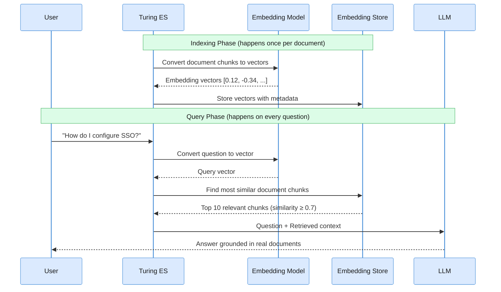
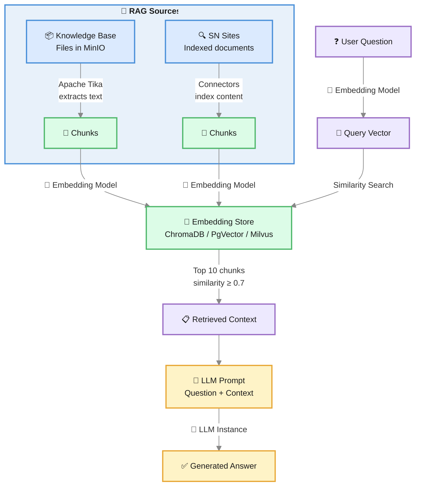

# What is RAG?

**RAG (Retrieval-Augmented Generation)** is the technique that makes AI responses accurate and grounded in your actual content instead of relying solely on the model's training data.

The core idea is simple: **before the LLM generates a response, the system retrieves the most relevant documents from your content and includes them in the prompt**. The LLM then answers based on real, up-to-date information rather than what it memorized during training.

---

## The Problem RAG Solves

Large Language Models are trained on vast amounts of text, but they have critical limitations:

- **Knowledge cutoff** — They don't know about content created after their training date
- **No access to private data** — They've never seen your internal documents, product specs, or company policies
- **Hallucination** — When they don't know an answer, they may generate plausible-sounding but incorrect information
- **Generic responses** — Without specific context, answers are broad and imprecise

RAG eliminates these problems by giving the LLM access to your actual content at query time.

---

## How RAG Works — Step by Step



### Phase 1 — Indexing (one-time per document)

1. **Document ingestion** — Content enters Turing ES via connectors (AEM, web crawler) or file uploads (Assets/Knowledge Base)
2. **Text extraction** — Apache Tika extracts text from PDFs, DOCX, XLSX, HTML, and other formats
3. **Chunking** — The extracted text is split into chunks (default: 1,024 characters) to fit within embedding model limits
4. **Embedding** — Each chunk is passed through the **Embedding Model**, which converts text into a high-dimensional numerical vector (e.g., a 1,536-dimension array of floats)
5. **Storage** — The vectors are stored in the **Embedding Store** alongside metadata (source file, chunk position, original text)

### Phase 2 — Retrieval (on every user question)

1. **Query embedding** — The user's question is converted into a vector using the **same Embedding Model**
2. **Similarity search** — The **Embedding Store** finds the vectors most similar to the query vector (cosine similarity)
3. **Threshold filtering** — Only chunks with similarity ≥ 0.7 are included (configurable)
4. **Top-K selection** — The top 10 most relevant chunks are selected

### Phase 3 — Generation

1. **Prompt construction** — Turing ES builds a prompt containing the user's question plus the retrieved document chunks as context
2. **LLM generation** — The LLM reads the context and generates an answer based on the real content
3. **Streaming response** — The answer is streamed back to the user via SSE

---

<div className="page-break" />

## The Three Components

### LLM (Large Language Model)

The LLM is the "brain" that reads the retrieved context and generates a natural language response. It does the reasoning, summarization, and articulation — but it does **not** search or retrieve content on its own.

In Turing ES, LLMs are configured as **[LLM Instances](./llm-instances.md)** supporting six providers:

| Provider | Example Models |
|---|---|
| **OpenAI** | GPT-4o, GPT-4o-mini |
| **Anthropic** | Claude Sonnet 4 |
| **Ollama** | Mistral, Llama, Qwen |
| **Google Gemini** | Gemini 2.0 Flash |
| **Azure OpenAI** | GPT-4o (Azure-hosted) |

**The LLM does not store knowledge.** It only processes what's given to it in the prompt. RAG ensures the prompt contains the right content.

### Embedding Model

The Embedding Model is a specialized neural network that converts text into numerical vectors (arrays of floating-point numbers). These vectors capture the **semantic meaning** of the text — similar concepts end up with similar vectors, even if the words are different.

**Example:**

| Text | Vector (simplified) |
|---|---|
| "How to configure single sign-on" | `[0.82, -0.15, 0.44, ...]` |
| "SSO setup and authentication" | `[0.80, -0.13, 0.46, ...]` ← very similar! |
| "Weather forecast for tomorrow" | `[-0.31, 0.67, -0.22, ...]` ← very different |

The embedding model is used **twice**: once during indexing (to embed document chunks) and once at query time (to embed the user's question). Both must use the **same model** — otherwise the vectors are incompatible and similarity search fails.

In Turing ES, providers that support embedding include **OpenAI**, **Ollama**, and **Azure OpenAI**. See [Embedding Models](./embedding-models.md) for provider details and model selection.

:::warning Same model for indexing and querying
Changing the embedding model after documents have been indexed causes dimension mismatches and incorrect results. A full re-indexing is required after any model change.
:::

### Embedding Store (Vector Database)

The Embedding Store is a specialized database optimized for storing and querying high-dimensional vectors. Unlike a traditional database that matches exact values, an embedding store finds the **most similar** vectors using distance metrics (cosine similarity, dot product, or Euclidean distance).

Turing ES supports three backends:

| Backend | Best for | How it works |
|---|---|---|
| **[ChromaDB](./embedding-stores.md#chromadb)** | Development, small/medium deployments | Lightweight, open-source, connects via HTTP API |
| **[PgVector](./embedding-stores.md#pgvector)** | Teams already using PostgreSQL | PostgreSQL extension — embeddings in the same DB as app data |
| **[Milvus](./embedding-stores.md#milvus)** | Large-scale production, high throughput | Purpose-built vector DB with advanced indexing (IVF, HNSW) |

**What happens inside the embedding store:**

```
Query vector: [0.82, -0.15, 0.44, ...]

Stored vectors:
  doc_chunk_42:  [0.80, -0.13, 0.46, ...]  → similarity: 0.97 ✅ (returned)
  doc_chunk_17:  [0.75, -0.20, 0.39, ...]  → similarity: 0.89 ✅ (returned)
  doc_chunk_91:  [-0.31, 0.67, -0.22, ...]  → similarity: 0.12 ❌ (below threshold)
```

---

<div className="page-break" />

## RAG in Turing ES

Turing ES supports two RAG sources that can be used independently or together:



### Knowledge Base (Assets)

Files uploaded to **[Assets](./assets.md)** are stored in MinIO, extracted with Apache Tika (supporting PDF, DOCX, XLSX, PPTX, HTML, TXT, and more), truncated to 100,000 characters, split into 1,024-character chunks, embedded, and stored in the active embedding store.

The Knowledge Base is queried by the `search_knowledge_base` tool — available in the Chat interface and configurable per AI Agent.

### Semantic Navigation Sites

When **GenAI** is enabled for an SN Site, indexed documents are also embedded alongside their Solr representation. This allows the SN Site chat and AI Agents to retrieve relevant content via semantic similarity.

Configure this in **Semantic Navigation → [Site] → Generative AI**. See [Semantic Navigation](./semantic-navigation.md#generative-ai).

:::info Re-indexing required
Documents indexed before GenAI was enabled do not have embeddings. A full re-indexing of the site is required to make existing content available for RAG.
:::

---

## Practical Example

Imagine a company with an internal knowledge base containing HR policies, product documentation, and engineering guides.

**Without RAG:**

> **User:** "What is our vacation policy for remote employees?"
>
> **LLM:** "Typically, companies offer 15-20 days of PTO..." *(generic, possibly wrong for this company)*

**With RAG:**

> **User:** "What is our vacation policy for remote employees?"
>
> **Turing ES retrieves:** Chunk from `hr-policies-2025.pdf` (page 12): *"Remote employees are entitled to 25 days of paid leave per year, plus 5 floating holidays. Requests must be submitted via the HR portal at least 14 days in advance..."*
>
> **LLM (with context):** "According to our HR policies, remote employees receive 25 days of paid leave per year plus 5 floating holidays. Leave requests must be submitted via the HR portal at least 14 days in advance." *(accurate, sourced from actual company data)*

---

## Key Configuration

| Setting | Where | Default | Impact |
|---|---|---|---|
| **Embedding Store** | Administration → Settings | — | Which vector database to use |
| **Embedding Model** | Administration → Settings | Provider default | Quality and dimensions of vectors |
| **Default LLM Instance** | Administration → Settings | — | Which model generates responses |
| **RAG Enabled** | Administration → Settings | Off | Whether new SN Sites have RAG by default |
| **Top-K results** | Internal | 10 | How many chunks are retrieved |
| **Similarity threshold** | Internal | 0.7 | Minimum similarity to include a chunk |

---

## Related Pages

| Page | Description |
|---|---|
| [Generative AI & LLM Configuration](./genai-llm.md) | Global GenAI settings and architecture overview |
| [LLM Instances](./llm-instances.md) | Configure LLM providers |
| [Embedding Stores](./embedding-stores.md) | Vector database backends (ChromaDB, PgVector, Milvus) |
| [Embedding Models](./embedding-models.md) | Provider support and model selection guidance |
| [Assets](./assets.md) | Knowledge Base file management |
| [AI Agents](./ai-agents.md) | Compose agents with RAG tools |
| [Tool Calling](./tool-calling.md) | RAG / Knowledge Base tools reference |

---

