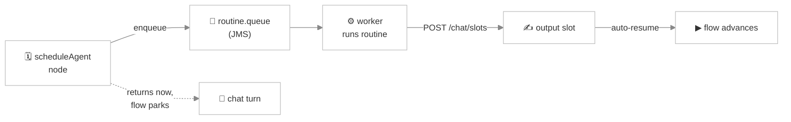

# Routines

> *Some steps take a while. Generating a proposal PDF, calling a slow third-party API, signing a document — none of those finish inside the few hundred milliseconds a chat turn should take. A **routine** lets the conversation kick off that work, tell the visitor "working on it…", and pick the conversation back up the moment the result is ready.*

A **routine** in Viglet Turing ES is a named, reusable **async job**. A [Chat Flow](./chat-flow.md) fires a routine from a `scheduleAgent` node: the node enqueues the work and returns control to the chat turn immediately, a background worker runs the routine, and when it finishes it writes the result into a **slot** — which automatically resumes the parked flow.

Routines are **deployment-wide**, not agent-scoped: one `generate_proposal_pdf` routine serves every flow on every agent. Manage them in the console under **Routines**.

## Routine vs. a synchronous tool call

A flow can call a tool two ways, and the difference is all about **latency**:

| | `functionCall` node | `scheduleAgent` node (routine) |
|---|---|---|
| Execution | Synchronous, inside the chat turn | Asynchronous, on a background queue |
| Chat turn | Blocks until the tool returns | Returns immediately; flow parks |
| Good for | Fast lookups (sub-second) | Slow work (PDF generation, signing, multi-second APIs) |
| Result | Returned inline | Written to a slot, which resumes the flow |

If the work is quick, use a `functionCall`. If it could hold the HTTP connection open for seconds, use a routine.

---

## Creating a routine

In the console, open **Routines → New**:

1. **Name** — stable, unique, used as the identifier in flow definitions. Must start with a letter or underscore and contain only letters, digits, `_`, `-`, or `.`.
2. **Description** — what it does (admin-facing).
3. **Kind** — `NATIVE` (the shipped kind) wraps a Spring AI `@Tool` method — the same machinery a synchronous `functionCall` uses, but run asynchronously. `GROOVY` is reserved for a follow-up that will let you author the body as an inline Groovy script.
4. **Native tool name** — for a `NATIVE` routine, the `@Tool` method to invoke. It's resolved through the same path as `functionCall`, so any registered native tool can back a routine.
5. **Default timeout (ms)** — how long the flow waits before treating the routine as expired (default **60000**). A `scheduleAgent` node can override this per node.
6. **Enabled** — toggle without deleting.

---

## The `scheduleAgent` flow node

A routine is invoked from a `scheduleAgent` node in a Chat Flow. The node carries:

| Node field | Meaning |
|---|---|
| **routine** (`routineId`) | which routine to fire |
| **input** (`aiInstruction`) | a JSON input template; `{{slot}}` placeholders are interpolated from the conversation's variables before enqueuing (blank → `{}`) |
| **output variable** (`outputVariable`) | the slot the routine's result is written to — filling it is what resumes the flow |
| **timeout (ms)** (`routineTimeoutMs`) | optional per-node override of the routine's default timeout |

Wire a **`timeout` edge** out of the node (an outgoing edge whose `sourceHandle` is `timeout`) to handle the case where the routine doesn't finish in time. If you don't, the flow falls back to the first outgoing edge on timeout.

---

## The async lifecycle

1. **First entry.** The node resolves the routine, interpolates the input JSON, enqueues a message onto the `routine.queue`, and writes bookkeeping markers into the conversation variables: `__scheduleAgent_pending_<nodeId>` and `__scheduleAgent_startedAt_<nodeId>`. It returns immediately — the chat UI shows a "working…" indicator driven by those pending markers (published over the [slot SSE stream](./chat-flow.md)).
2. **Worker runs.** A background JMS worker pulls the message, runs the routine body, and writes the result into the node's **output slot** via `POST /chat/slots`.
3. **Auto-resume.** Writing the slot lands on the slot event bus; the auto-resume listener nudges the parked flow. On re-entry the node sees its output slot filled, clears the markers, and the engine advances along the normal edge.
4. **Timeout.** If the deadline elapses before the slot is filled, the node clears its markers and the engine routes along the `timeout` edge.

The node never advances the cursor itself — exactly like the `functionCall` contract; the engine owns advancement.

:::tip Failure routing
A `scheduleAgent` node honours the same `continueOnFailure` / `failure`-edge pattern as other integration nodes — see [Chat Flow → error handling](./chat-flow.md). Resolution or enqueue failures are logged and the flow advances rather than stalling.
:::

---

## Scaling & operations

- **Queue concurrency** — the worker listens on `routine.queue` with `turing.jms.routine.concurrency` (default `1-2`). Raise it if routines pile up under load.
- **Multi-tenancy** — the enqueue carries the tenant context, and the worker restores it on the consumer thread (`TurJmsTenantPropagation`), so a routine runs with the same tenant isolation as the conversation that fired it. See [Multi-tenancy](./multi-tenancy.md).
- **Timeouts** — pick a default timeout that comfortably exceeds the routine's worst-case runtime; the per-node override is for the occasional outlier.

---

## REST API

All endpoints require admin (`ROLE_ADMIN`) or the matching `AI_AGENT_*` authority and live under `/api/genai/routine`.

| Method | Path | Purpose |
|---|---|---|
| `GET` | `/api/genai/routine` | List all routines |
| `GET` | `/api/genai/routine/{id}` | Get one routine |
| `POST` | `/api/genai/routine` | Create a routine |
| `PUT` | `/api/genai/routine/{id}` | Update a routine |
| `DELETE` | `/api/genai/routine/{id}` | Delete a routine |

The DTO carries `kind`, `nativeToolName`, `groovyScript` (reserved), `defaultTimeoutMs`, and `enabled`.

---

## Related pages

- [Chat Flow](./chat-flow.md) — the `scheduleAgent` node and the slots that drive resume
- [Webhooks](./webhooks.md) — the other async integration primitive (outbound HTTP)
- [Tool Calling](./tool-calling.md) — the native `@Tool` methods a `NATIVE` routine wraps
- [Custom Tools](./custom-tools.md) — author your own tools to back a routine
