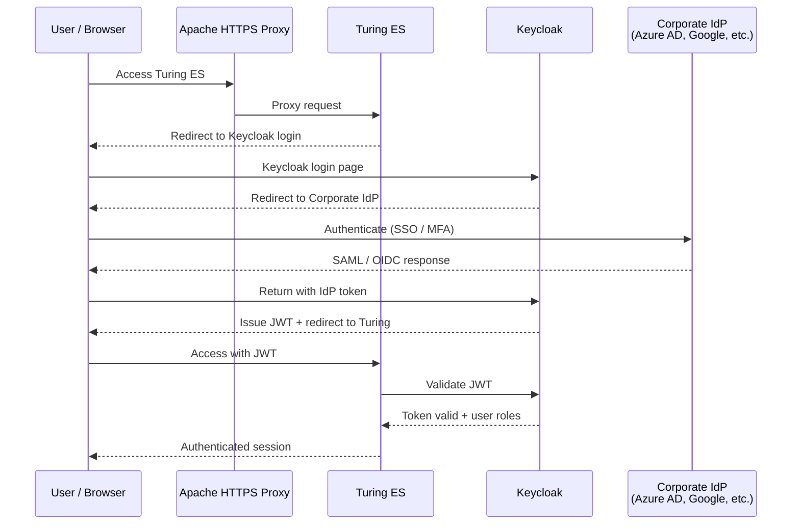

# Security & Keycloak

This page covers the full **Keycloak OAuth2 / OpenID Connect** production setup for Turing ES, enabling SSO integration with corporate identity providers and centralized user management.

For day-to-day authentication — native session-based login and REST API Key usage — see **[Authentication](./security-authentication.md)**.

---

## Why Use Keycloak with Turing ES?

The primary reason to integrate Keycloak is to connect Turing ES to your organization's **existing Single Sign-On (SSO) infrastructure**. Instead of managing a separate set of credentials just for Turing ES, users sign in with the same corporate identity they already use for email, cloud tools, and internal applications — no additional password, no extra login step.

Keycloak acts as an **identity broker** between Turing ES and your identity provider. Turing ES never sees or stores user passwords — it receives a signed JWT token from Keycloak confirming who the user is and what roles they have.

### Supported Identity Providers

Because Keycloak supports the **SAML 2.0**, **OAuth 2.0**, and **OpenID Connect** standards, it can federate identity from virtually any enterprise identity provider:

| Identity Provider | Protocol | Use Case |
|---|---|---|
| **Microsoft Entra ID** (Azure AD) | SAML 2.0 / OIDC | Microsoft 365, Azure, corporate Windows environments |
| **Google Workspace** | OIDC | Organizations on Google Workspace / Gmail |
| **Okta** | SAML 2.0 / OIDC | Multi-cloud enterprises, workforce identity |
| **Auth0** | OIDC | Developer-focused platforms, B2C applications |
| **Ping Identity** | SAML 2.0 / OIDC | Large enterprises, government, regulated industries |
| **OneLogin** | SAML 2.0 / OIDC | HR-integrated identity management |
| **ADFS** (Active Directory Federation Services) | SAML 2.0 | On-premise Windows Server / Active Directory |
| **LDAP / Active Directory** | LDAP | Direct directory sync without SAML — Keycloak federates LDAP users natively |
| **GitHub / GitLab** | OAuth 2.0 | Developer-focused organizations |
| **Any SAML 2.0 IdP** | SAML 2.0 | Shibboleth, SimpleSAMLphp, custom SAML providers |
| **Any OIDC provider** | OIDC | Any standards-compliant OpenID Connect provider |

### What This Enables

**Single Sign-On (SSO):** Users click "Sign in" on Turing ES, are redirected to their corporate login (e.g., Microsoft 365 login page), authenticate once, and are immediately signed in to Turing ES. If they're already signed in to another corporate application, they skip the login form entirely — the SSO session is shared.

**Single Sign-Out:** Logging out of Turing ES triggers a Keycloak OIDC logout that propagates to the corporate IdP. The user is signed out of Turing ES and optionally out of all applications sharing the same SSO session.

**Centralized User Management:** User accounts, groups, and roles are managed in Keycloak (or synchronized from the corporate directory). No need to create or maintain users in Turing ES manually — Keycloak provides the identity, roles, and group memberships via JWT claims.

**Multi-Factor Authentication (MFA):** Keycloak supports TOTP (Google Authenticator, Microsoft Authenticator), WebAuthn/FIDO2 (hardware security keys, biometrics), SMS OTP, and email verification. MFA policies are configured in Keycloak and enforced transparently — Turing ES requires no changes.

**Role-Based Access Control (RBAC):** Keycloak roles and realm roles are mapped to Turing ES permissions. Define roles like `turing-admin`, `turing-editor`, `turing-viewer` in Keycloak, assign them to users or groups, and Turing ES enforces access accordingly.

**Social Login:** For public-facing or partner-facing deployments, Keycloak can enable login via Google, GitHub, Facebook, Apple, Twitter, and other social providers alongside or instead of corporate identity.

**User Federation:** Keycloak can synchronize users from **LDAP** or **Active Directory** without requiring SAML. Users are imported (or federated on-demand) from the directory, with password validation delegated to the directory server. This is the simplest path for organizations running on-premise AD without ADFS.

**Token-Based API Access:** When Keycloak is enabled, REST API clients can authenticate using **OAuth2 access tokens** in addition to API Keys. Obtain a token via Keycloak's token endpoint and pass it as a Bearer token — useful for service-to-service integrations where API Keys are not appropriate.

**Audit and Compliance:** Keycloak logs all authentication events — successful logins, failed attempts, token refreshes, logouts. These events can be exported to SIEM systems for compliance and security monitoring.

### Architecture

When `turing.keycloak=true` is set in the JVM properties, Turing ES delegates all authentication to Keycloak using the Authorization Code flow (OAuth2) and validates access tokens as JWTs (OpenID Connect). Keycloak can be dedicated to Turing ES or shared with other applications — in both cases, Turing ES registers as a **client** within a Keycloak **realm**.



---

## Full Production Setup: Turing + Keycloak + Apache HTTP

The recommended production topology runs Keycloak and Turing ES on the same host, with Apache HTTP Server as the HTTPS reverse proxy in front. All three services are reachable through a single public hostname and port (443), with Apache routing by path prefix.

```
Browser / Client
      │  HTTPS :443
      ▼
Apache HTTP Server (reverse proxy)
  ├── /kc/   → Keycloak   (https://localhost:8443)
  ├── /solr/ → Solr       (http://localhost:8983)
  └── /      → Turing ES  (https://localhost:2700)
```

---

## Step 1 — Database Setup

Both Turing ES and Keycloak require their own databases. Create them before starting either service.

```sql
-- Turing ES database and user
CREATE USER 'turing'@'%' IDENTIFIED BY '<turing-db-password>';
CREATE DATABASE IF NOT EXISTS turing;
GRANT ALL PRIVILEGES ON turing.* TO 'turing'@'%' WITH GRANT OPTION;

-- Keycloak database and user
CREATE USER 'keycloak'@'%' IDENTIFIED BY '<keycloak-db-password>';
CREATE DATABASE IF NOT EXISTS keycloak;
GRANT ALL PRIVILEGES ON keycloak.* TO 'keycloak'@'%' WITH GRANT OPTION;
```

Tested with MariaDB and MySQL. When using MariaDB, the JDBC connection URL should include `allowPublicKeyRetrieval=true&useSSL=false` if SSL is not configured between the application and the database server.

:::tip Use strong, unique passwords
Replace all placeholder passwords (`<turing-db-password>`, `<keycloak-db-password>`) with strong, randomly generated values. Never reuse passwords between services.
:::

---

## Step 2 — Keycloak Installation and Build

Download and extract the Keycloak distribution. Before starting Keycloak for the first time, run the build step to configure the HTTP relative path. This is required when Keycloak runs behind a reverse proxy at a path prefix (e.g., `/kc/`).

```bash
./kc.sh build --http-relative-path=/kc
```

Generate a keystore for Keycloak's HTTPS listener:

```bash
keytool -genkeypair \
  -alias localhost \
  -keyalg RSA \
  -keysize 2048 \
  -validity 365 \
  -keystore server.keystore \
  -dname "CN=<your-hostname>, O=<your-org>, C=<country-code>" \
  -keypass <keystore-password> \
  -storepass <keystore-password>
```

Start Keycloak in production mode:

```bash
./kc.sh start \
  --optimized \
  --hostname-strict=false \
  --https-key-store-password=<keystore-password>
```

Keycloak will be available at `https://localhost:8443/kc/`.

### Running Keycloak as a Linux service

Create a systemd unit file at `/etc/systemd/system/keycloak.service`:

```ini
[Unit]
Description=Keycloak
After=syslog.target network.target

[Service]
User=viglet
EnvironmentFile=/appl/viglet/keycloak/env
ExecStart=/appl/viglet/keycloak/bin/kc.sh start --optimized --hostname-strict=false --https-key-store-password=<keystore-password>

[Install]
WantedBy=multi-user.target
```

Enable and start the service:

```bash
systemctl daemon-reload
systemctl enable keycloak
systemctl start keycloak
```

---

## Step 3 — Keycloak Realm and Client Configuration

After starting Keycloak, open the admin console and perform the following setup:

**Create a Realm**

A realm is an isolated namespace for users, clients, and roles. Create a dedicated realm for Turing ES (e.g., `turing` or a name matching your organization). All subsequent configuration is done within this realm.

**Create a Client**

Within the realm, create a new client for Turing ES:

| Field | Value |
|---|---|
| **Client ID** | `turing-app` (or your preferred identifier) |
| **Client Protocol** | `openid-connect` |
| **Access Type** | `confidential` |
| **Standard Flow** | Enabled |
| **Direct Access Grants** | Disabled (not needed) |
| **Root URL** | `https://<your-hostname>` |
| **Valid Redirect URIs** | `https://<your-hostname>/login/oauth2/code/turing-app` |
| **Web Origins** | `https://<your-hostname>` |

After saving, go to the **Credentials** tab and copy the generated **Client Secret**.

**Configure Scopes**

Ensure the client requests the following scopes: `openid`, `profile`, `roles`. These are needed for Turing ES to receive the user's identity and role information from the JWT.

---

## Step 4 — SSL Certificate for Turing ES

Turing ES can terminate HTTPS directly via its embedded Tomcat server. Generate a self-signed certificate (replace with a CA-signed certificate for production):

```bash
# Generate self-signed certificate and key
openssl req -x509 -nodes -newkey rsa:2048 \
  -keyout <hostname>.key \
  -out <hostname>.crt \
  -days 365

# Package as PKCS12 for Java
openssl pkcs12 -export \
  -out turing.p12 \
  -inkey <hostname>.key \
  -in <hostname>.crt \
  -name turing

# Alternatively, generate directly with keytool
keytool -genkey \
  -alias turing \
  -storetype PKCS12 \
  -keyalg RSA \
  -keysize 2048 \
  -keystore turing.p12 \
  -validity 3650
```

Place `turing.p12` in a secure path on the server (e.g., `/appl/viglet/turing/server/cert/`).

**Import the Apache certificate into the Java truststore**

Turing ES calls Keycloak over HTTPS to validate tokens. If Keycloak's certificate is self-signed, Turing ES will fail the SSL handshake unless you import the Apache (or Keycloak) certificate into the Java truststore:

```bash
keytool -import \
  -trustcacerts \
  -alias turing-apache \
  -file /path/to/<hostname>.crt \
  -keystore $JAVA_HOME/lib/security/cacerts
```

The default truststore password is `changeit`.

---

## Step 5 — Turing ES JVM Configuration

All Turing ES configuration is passed via JVM system properties at startup. Set `JAVA_OPTS` before launching the JAR:

```bash
JAVA_OPTS="\
  -Xmx1g -Xms1g \
  \
  -Dspring.datasource.url=jdbc:mariadb://localhost:3306/turing?allowPublicKeyRetrieval=true&useSSL=false \
  -Dspring.datasource.username=turing \
  -Dspring.datasource.password=<turing-db-password> \
  -Dspring.datasource.driver-class-name=org.mariadb.jdbc.Driver \
  -Dspring.jpa.properties.hibernate.dialect=org.hibernate.dialect.MariaDB103Dialect \
  \
  -Dturing.keycloak=true \
  -Dspring.security.oauth2.client.registration.keycloak.client-id=turing-app \
  -Dspring.security.oauth2.client.registration.keycloak.client-secret=<client-secret> \
  -Dspring.security.oauth2.client.registration.keycloak.scope=openid \
  -Dspring.security.oauth2.client.registration.keycloak.authorization-grant-type=authorization_code \
  -Dspring.security.oauth2.client.registration.keycloak.redirect-uri=https://<your-hostname>/login/oauth2/code/turing-app \
  -Dspring.security.oauth2.client.provider.keycloak.issuer-uri=https://<your-hostname>/kc/realms/<your-realm> \
  -Dspring.security.oauth2.resourceserver.jwt.issuer-uri=https://<your-hostname>/kc/realms/<your-realm> \
  \
  -Dserver.ssl.enabled=true \
  -Dserver.ssl.key-store=/appl/viglet/turing/server/cert/turing.p12 \
  -Dserver.ssl.key-store-password=<keystore-password> \
  -Dserver.ssl.keyStoreType=PKCS12 \
  -Dserver.ssl.keyAlias=turing \
  \
  -Dturing.url=https://<your-hostname>"

java $JAVA_OPTS -jar viglet-turing.jar
```

### JVM property reference

| Property | Description |
|---|---|
| `turing.keycloak` | Set to `true` to enable Keycloak authentication. Default: `false` (native session + API Key) |
| `spring.security.oauth2.client.registration.keycloak.client-id` | Client ID registered in the Keycloak realm |
| `spring.security.oauth2.client.registration.keycloak.client-secret` | Client secret from the Keycloak Credentials tab |
| `spring.security.oauth2.client.registration.keycloak.scope` | OAuth2 scopes to request. Minimum: `openid` |
| `spring.security.oauth2.client.registration.keycloak.authorization-grant-type` | Must be `authorization_code` |
| `spring.security.oauth2.client.registration.keycloak.redirect-uri` | Must match the redirect URI registered in Keycloak. Pattern: `https://<your-hostname>/login/oauth2/code/<client-id>` |
| `spring.security.oauth2.client.provider.keycloak.issuer-uri` | Keycloak realm issuer URI: `https://<hostname>/kc/realms/<realm-name>` |
| `spring.security.oauth2.resourceserver.jwt.issuer-uri` | Same as issuer-uri; used for JWT validation |
| `server.ssl.enabled` | Enables HTTPS on the embedded Tomcat server |
| `server.ssl.key-store` | Path to the PKCS12 keystore file |
| `server.ssl.key-store-password` | Password for the keystore |
| `server.ssl.keyStoreType` | Must be `PKCS12` |
| `server.ssl.keyAlias` | Alias of the certificate entry inside the keystore |
| `turing.url` | Public base URL of Turing ES (used for OAuth2 redirect URI construction and post-logout redirect) |

---

## Step 6 — Apache HTTP Server as Reverse Proxy

Build Apache HTTP Server with the required modules, or install a distribution package that includes `mod_ssl`, `mod_proxy`, and `mod_proxy_http`.

**Compile from source (if needed):**

```bash
apt install autoconf libtool-bin make libpcre* libssl-dev libnghttp2-dev libexpat1-dev

./buildconf && ./configure \
  --prefix=/appl/apache/httpd \
  --enable-mods-shared=all \
  --enable-so \
  --enable-ssl=shared \
  --enable-http2=shared \
  --enable-proxy=shared \
  --enable-proxy-http=shared \
  --enable-proxy-ajp=shared \
  --enable-proxy-balancer=shared \
  --with-mpm=worker && \
make && make install
```

**VirtualHost configuration for HTTPS reverse proxy:**

```apache
<VirtualHost _default_:443>
    DocumentRoot "/appl/apache/httpd/htdocs"
    ServerName <your-hostname>:443

    # SSL
    SSLEngine on
    SSLCertificateFile    "/path/to/<hostname>.crt"
    SSLCertificateKeyFile "/path/to/<hostname>.key"

    # Proxy settings
    HostnameLookups Off
    UseCanonicalName Off
    ProxyPreserveHost On

    # Required headers for applications behind a proxy
    RequestHeader set X-Forwarded-Proto "https"
    RequestHeader set X-Forwarded-Port "443"

    # Allow SSL proxying to backend services with self-signed certs
    SSLProxyEngine on
    SSLProxyCheckPeerName off

    # Route /solr/ to Solr (plain HTTP, internal only)
    ProxyPass        "/solr/" "http://localhost:8983/solr/"
    ProxyPassReverse "/solr/" "http://localhost:8983/solr/"

    # Route /kc/ to Keycloak (HTTPS, internal)
    ProxyPass        "/kc/" "https://localhost:8443/kc/"
    ProxyPassReverse "/kc/" "https://localhost:8443/kc/"

    # Route everything else to Turing ES (HTTPS, internal)
    ProxyPass        "/" "https://localhost:2700/"
    ProxyPassReverse "/" "https://localhost:2700/"
</VirtualHost>
```

**Key configuration notes:**

`ProxyPreserveHost On` — passes the original `Host` header to the backend. Required for Keycloak and Turing ES to generate correct redirect URIs.

`RequestHeader set X-Forwarded-Proto "https"` — tells backend services that the original request was HTTPS, even though the internal connection may be unencrypted (in configurations where backends do not use SSL).

`SSLProxyCheckPeerName off` — disables hostname verification for the backend SSL connections. Required when using self-signed certificates on Keycloak and Turing ES. In production with CA-signed certificates, this should be set to `on`.

`/kc/` routes to Keycloak HTTPS because Keycloak was started with HTTPS. The path prefix matches the `--http-relative-path=/kc` configured in Step 2.

---

## Logout flow

When Keycloak is enabled, logging out of Turing ES triggers a full OIDC logout. After the local session is cleared, the user is redirected to Keycloak's logout endpoint:

```
https://<your-hostname>/kc/realms/<your-realm>/protocol/openid-connect/logout
  ?client_id=turing-app
  &post_logout_redirect_uri=https://<your-hostname>
```

Keycloak invalidates the SSO session and redirects the user back to the Turing ES root URL.

---

## Using an Existing Keycloak Instance

If your organization already runs a Keycloak instance, you do not need to install a dedicated one. Simply:

1. Create a new realm (or use an existing realm, if your organization's policies allow it)
2. Register Turing ES as a new client within that realm following the configuration in Step 3
3. Configure the JVM properties in Step 5 to point to the existing Keycloak's issuer URI

The `issuer-uri` format is always `https://<keycloak-hostname>/kc/realms/<realm-name>` — adjust the path prefix if your existing Keycloak uses a different one (or no prefix).

---

## Security Checklist

Before going to production, verify the following:

- [ ] Keycloak is only accessible via the Apache reverse proxy (port 8443 is not exposed externally)
- [ ] Solr is only accessible via the reverse proxy or not exposed externally at all
- [ ] Turing ES port (2700) is not exposed externally — all traffic goes through Apache
- [ ] All self-signed certificates are replaced with CA-signed certificates (or certificates from an internal PKI)
- [ ] `SSLProxyCheckPeerName` is set to `on` if using CA-signed backend certificates
- [ ] Keycloak admin credentials have been changed from defaults
- [ ] Database users have minimum required permissions (no superuser)
- [ ] JVM properties containing secrets (`client-secret`, `key-store-password`, `datasource.password`) are not logged or exposed in process listings — consider using an environment file or a secrets manager
- [ ] HTTP (port 80) redirects to HTTPS (port 443)
- [ ] Keycloak's `hostname-strict` mode is evaluated for your network topology

---

## Related Pages

| Page | Description |
|---|---|
| [Authentication](./security-authentication.md) | Native session + API Key authentication (default mode) |
| [REST API Reference](./rest-api.md) | API endpoints and authentication examples |
| [Configuration Reference](./configuration-reference.md) | JVM properties and `application.yaml` settings |
| [Installation Guide](./installation-guide.md) | Initial Turing ES installation and database setup |

---

*Previous: [Authentication](./security-authentication.md)*
