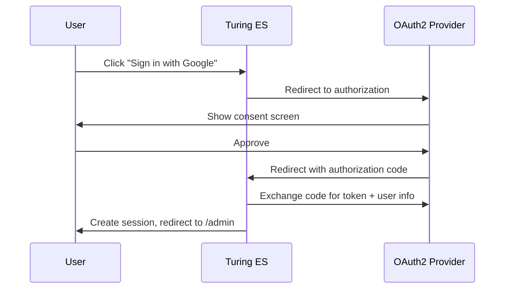

# Social Login (OAuth2)

Turing ES supports **social login** via OAuth2 with Google, GitHub, and Microsoft. When configured, users can sign in with their existing accounts from these providers — no separate password required.

This is ideal for development environments, small teams, and scenarios where a full Keycloak deployment is not needed. For enterprise SSO with LDAP/AD federation, MFA, and centralized user management, see [Security & Keycloak](./security-keycloak.md).

---

## How It Works



When a user signs in via a social provider for the first time, Turing ES **automatically creates a local user** with the profile information from the provider (name, email, avatar). Subsequent logins update the profile data.

---

## Prerequisites

| Requirement | Details |
|---|---|
| `turing.authentication.thirdparty` | Must be `true` (default) |
| Provider OAuth App | Create an OAuth App/Client in the provider's console |
| Redirect URI | `http://<host>:<port>/login/oauth2/code/<provider>` |

---

## Configuration

Add the provider registration under `spring.security.oauth2.client` in your `application.yaml`:

### Google

1. Go to [Google Cloud Console](https://console.cloud.google.com/apis/credentials)
2. Create an **OAuth 2.0 Client ID** (Web application)
3. Add the authorized redirect URI: `http://localhost:2700/login/oauth2/code/google`

```yaml
spring:
  security:
    oauth2:
      client:
        registration:
          google:
            client-id: YOUR_GOOGLE_CLIENT_ID
            client-secret: YOUR_GOOGLE_CLIENT_SECRET
```

:::tip Scopes
Spring Security auto-configures the Google provider with `openid`, `profile`, and `email` scopes — no need to set them manually.
:::

### GitHub

1. Go to [GitHub Developer Settings > OAuth Apps](https://github.com/settings/developers)
2. Click **New OAuth App**
3. Set **Homepage URL** to `http://localhost:2700`
4. Set **Authorization callback URL** to `http://localhost:2700/login/oauth2/code/github`

```yaml
spring:
  security:
    oauth2:
      client:
        registration:
          github:
            client-id: YOUR_GITHUB_CLIENT_ID
            client-secret: YOUR_GITHUB_CLIENT_SECRET
```

:::note GitHub specifics
- GitHub does not provide a separate first/last name — Turing splits the `name` attribute automatically.
- Email may be `null` if the user's GitHub email is private. The email field is hidden in the profile page when empty.
- The username is the GitHub `login` handle.
:::

### Microsoft (Entra ID / Azure AD)

1. Go to [Azure Portal > App registrations](https://portal.azure.com/#view/Microsoft_AAD_RegisteredApps)
2. Register a new application
3. Under **Authentication**, add a **Web** redirect URI: `http://localhost:2700/login/oauth2/code/microsoft`
4. Under **Certificates & secrets**, create a new client secret

```yaml
spring:
  security:
    oauth2:
      client:
        registration:
          microsoft:
            client-id: YOUR_MICROSOFT_CLIENT_ID
            client-secret: YOUR_MICROSOFT_CLIENT_SECRET
            scope: openid,profile,email
            authorization-grant-type: authorization_code
            redirect-uri: "{baseUrl}/login/oauth2/code/{registrationId}"
        provider:
          microsoft:
            issuer-uri: https://login.microsoftonline.com/common/v2.0
```

---

## Multiple Providers

You can configure any combination of providers simultaneously. The login page **automatically shows only the buttons for configured providers**:

```yaml
spring:
  security:
    oauth2:
      client:
        registration:
          google:
            client-id: ...
            client-secret: ...
          github:
            client-id: ...
            client-secret: ...
          microsoft:
            client-id: ...
            client-secret: ...
        provider:
          microsoft:
            issuer-uri: https://login.microsoftonline.com/common/v2.0
```

If only GitHub is configured, only the GitHub button appears. If none are configured, the social login section is hidden entirely.

---

## Redirect URIs Reference

| Provider | Redirect URI |
|---|---|
| Google | `http://<host>:<port>/login/oauth2/code/google` |
| GitHub | `http://<host>:<port>/login/oauth2/code/github` |
| Microsoft | `http://<host>:<port>/login/oauth2/code/microsoft` |

The pattern is always: `{baseUrl}/login/oauth2/code/{registrationId}`

For production with HTTPS: `https://turing.example.com/login/oauth2/code/google`

---

## User Profile Behavior

When logged in via a social provider:

- **Profile fields are read-only** — name, email, and username are managed by the provider
- **Avatar can still be customized** in Turing
- **Password section is hidden** — authentication is handled by the provider
- **The provider name is displayed** on the profile page (e.g., "github", "google")

---

## Configuration Properties

| Property | Default | Description |
|---|---|---|
| `turing.authentication.thirdparty` | `true` | Enable third-party OAuth2 login buttons |
| `spring.security.oauth2.client.registration.<provider>.client-id` | — | OAuth2 Client ID from the provider |
| `spring.security.oauth2.client.registration.<provider>.client-secret` | — | OAuth2 Client Secret from the provider |

---

## Troubleshooting

### 404 on provider authorization page

The Client ID is likely incorrect. Double-check the value in `application.yaml` matches the one in the provider's console.

### User profile shows empty name

The provider attributes may use different field names. Turing handles Google (`given_name`, `family_name`), GitHub (`login`, `name`), and Microsoft (`given_name`, `family_name`) automatically. For other providers, the `name` attribute is split into first/last name.

### Email is empty (GitHub)

GitHub may not expose the user's email if it is set to private. This is by design — the email field is hidden in the profile page when empty.

### Login redirects to wrong page

The default success URL is `/admin`. If using a different frontend path, ensure the Spring Security configuration matches.

---

## Related Pages

| Page | Description |
|---|---|
| [Authentication](./security-authentication.md) | Native authentication and API Keys |
| [Security & Keycloak](./security-keycloak.md) | Full Keycloak production setup with SSO |
| [Configuration Reference](./configuration-reference.md) | All configuration properties |
