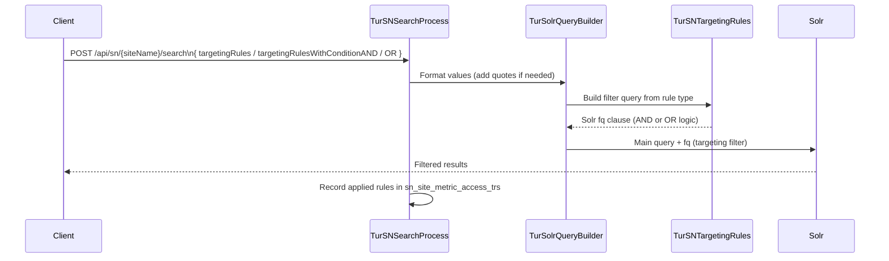

# Semantic Navigation Concepts

This document is the technical reference for the Semantic Navigation (SN) module in Turing ES. It covers the mechanics behind the three advanced features — **Targeting Rules**, **Spotlights**, and **Merge Providers** — the behavior and facet configuration model, and the self-describing search response structure.

For the admin console UI reference — all SN Site tabs and their fields — see **[Semantic Navigation](./semantic-navigation.md)**.

---

## SN Site — Behavior Configuration

The Behavior tab defines how search works for this site. All settings are stored on the `TurSNSite` entity and managed via `GET / PUT /api/sn/{id}`.

### General

| Setting | Description |
|---|---|
| **Rows per Page** | Number of results returned per search request |
| **Exact Match** | When enabled, terms wrapped in quotes trigger an exact phrase match instead of a tokenized search |

### Wildcard

| Setting | Description |
|---|---|
| **Wildcard No Results** | Automatically appends a wildcard (`*`) to the query when the original search returns no results, broadening the match |
| **Wildcard Always** | Always appends a wildcard to every search term, regardless of result count |

Use **Wildcard No Results** to recover gracefully from zero-result queries.

:::caution Wildcard Always reduces precision
**Wildcard Always** appends `*` to every query term regardless of result count. This increases recall — more documents match — but significantly reduces relevance precision. Avoid using it in sites where ranking quality matters. Prefer **Wildcard No Results** as a safer fallback.
:::

### Facets

| Setting | Description |
|---|---|
| **Facet** | Enables or disables faceted navigation for this site |
| **Items per Facet** | Maximum number of values displayed per facet in the result panel |
| **Facet Sort** | How facet values are ordered: by document count (descending) or alphabetically |
| **Facet Type** | Boolean operator applied **between facets**: `AND` (results must match all selected facets) or `OR` (results match any selected facet) |
| **Facet Item Type** | Boolean operator applied **between values within the same facet**: `AND` or `OR` |

**Example:** With `Facet Type = AND` and `Facet Item Type = OR`, selecting *Category: News OR Blog* AND *Year: 2024* returns documents that are (News or Blog) **and** from 2024.

**Secondary Facets:** Any field configured as a facet can additionally be promoted to a **Secondary Facet** in the field's settings. Secondary facets are returned in a separate `secondaryFacet` section of the search response, completely independent from the regular `facet` section. This gives the front-end full control over how to render them — for example, a `content_type` field configured as a secondary facet can be rendered as navigation tabs ("All · Articles · Videos · Downloads") while the remaining facets appear as sidebar filters. The field must be a facet first; secondary facet is a promotion, not a replacement.

**Field-level behavior override:** The `Facet Type` and `Facet Item Type` settings above are global defaults for the site. Each individual field can override these values independently. For example, the site default can be `Facet Type = AND`, while a specific field like `tags` overrides it to `OR`. This allows fine-grained control over filter logic without changing the site-wide behavior.

---

## SN Site — Fields and Custom Facets

### Field configuration

Each field in an SN Site defines how a document attribute is indexed, searched, and presented. Beyond the standard settings (type, label, whether it is a facet, whether it is a secondary facet), each field can override the site-level facet behavior:

| Field setting | Description |
|---|---|
| **Facet Type** | Overrides the site-level operator between this facet and others (`AND` / `OR`) |
| **Facet Item Type** | Overrides the site-level operator between values within this facet (`AND` / `OR`) |
| **Facet Range** | Enables date range faceting for this field. Instead of listing discrete values, the facet groups documents by predefined date periods: **day**, **month**, or **year** |

A date field configured with **Facet Range** groups results into date period buckets rather than listing individual values. The available granularities are **day**, **month**, and **year** — selected in the field configuration. The response returns one facet item per period that has at least one matching document, each with its pre-built filter link.

### Custom Facets

**Custom Facets** let you define the exact items that appear in a facet, each with its own filter rule, label, and position — rather than relying on the values that happen to exist in the index. They are created from an existing field and appear automatically in the search response alongside regular facets, following the site's behavior settings.

This is useful when the raw field values are not user-friendly, when you want to group multiple values into a named bucket, or when you need range-based navigation (e.g., price ranges, date periods, score thresholds).

#### Custom Facet item rules

Each item in a Custom Facet is defined by a rule that generates its Solr filter query:

| Rule | Behavior | Example |
|---|---|---|
| **Equal** | Matches documents where the field equals the specified value exactly | `content_type = "video"` |
| **Between** | Matches documents where the field value falls within a range (inclusive) | `price between 100 and 500` |
| **Greater than** | Matches documents where the field value is above the threshold | `score > 80` |
| **Less than** | Matches documents where the field value is below the threshold | `date < 2020-01-01` |

#### Custom Facet item configuration

| Setting | Description |
|---|---|
| **Label** | The display name shown in the facet panel (e.g., "Last 30 days", "Under $100", "High relevance") |
| **Rule** | The filter operator: Equal, Between, Greater than, or Less than |
| **Value(s)** | The value or range boundaries used in the filter rule |
| **Position** | The order in which this item appears within the facet |

#### How it works

Once a Custom Facet is saved, Turing ES generates the facet items automatically on every search request. Each item appears in the `facet` (or `secondaryFacet`) section of the response with its pre-built filter link, exactly like a regular facet value. The front-end renders it without any special handling — Custom Facets are indistinguishable from regular facets in the response structure.

**Example: Date period facet**

A field `publish_date` (date type) configured as a Custom Facet with three items:

| Label | Rule | Value |
|---|---|---|
| Last 7 days | Greater than | `NOW-7DAYS` |
| Last 30 days | Greater than | `NOW-30DAYS` |
| Last year | Greater than | `NOW-1YEAR` |

The search response returns these three items as a facet named "Publication Period", each with a pre-built link to filter results by that time window.

### Highlighting

| Setting | Description |
|---|---|
| **HL** | Enables term highlighting in search result snippets |
| **HL Pre** | Opening HTML tag wrapping matched terms (e.g., `<mark>` or `<b>`) |
| **HL Post** | Closing HTML tag (e.g., `</mark>` or `</b>`) |

The HL Pre and HL Post values are injected directly around matched terms in the `text` and `description` fields of each result. Your front-end application receives the pre-highlighted HTML and renders it as-is.

### Spell Check

| Setting | Description |
|---|---|
| **Spell Check** | Enables spelling suggestion when the query term is not found or returns few results |
| **Spell Check Fixes** | When enabled, automatically re-runs the search using the corrected term and returns those results instead of showing a "Did you mean?" prompt |

### More Like This (MLT)

| Setting | Description |
|---|---|
| **MLT** | Enables the More Like This feature, which finds documents semantically similar to a given result |

When MLT is enabled, each search result can be expanded to show related documents — useful for discovery experiences and content recommendation.

### Spotlight

| Setting | Description |
|---|---|
| **Spotlight with Results** | When enabled, curated Spotlight documents are displayed alongside organic results. When disabled, Spotlights are shown only when the query matches a spotlight term and no organic results are returned |

### Default Field Mappings

These settings map the SN Site's canonical display fields to the actual field names in the Solr index. They allow the front-end application to always reference a consistent set of fields regardless of how connectors named the fields at indexing time.

| Setting | Description |
|---|---|
| **Title** | Field used as the result title |
| **Text** | Field used as the main body / snippet text |
| **Description** | Field used as the result description |
| **Date** | Field used as the result date |
| **Image** | Field used as the result thumbnail image URL |
| **URL** | Field used as the result link |
| **Default Field** | The field Solr uses for full-text search when no specific field is targeted in the query |
| **Exact Match Field** | The field used when the user searches with quoted terms (exact match mode) |

---

## Search Response Structure

A search request to `GET /api/sn/{siteName}/search` returns a JSON object that goes beyond a simple data payload. It is a **self-describing navigational response**: every link a user might follow — apply a filter, remove a filter, clear all filters, navigate through pagination, filter by a document's metadata — is pre-built and ready to use inside the JSON. The front-end application does not need to construct query strings or implement URL-building logic. It reads what the API returns and renders it.

```json
{
  "results": { ... },
  "facet": { ... },
  "secondaryFacet": { ... },
  "similar": { ... },
  "spellCheck": { ... },
  "spotlights": { ... },
  "locales": { ... }
}
```

### Top-level sections

| Section | Enabled by | Description |
|---|---|---|
| **results** | Always present | Paginated list of matched documents. Each result contains all indexed fields, highlighted snippets, and facet metadata with pre-built navigation links |
| **facet** | `Facet = true` | Primary facet groups with counts and pre-built filter/clear links for each value |
| **secondaryFacet** | Field configured as Secondary Facet | Separate facet group for fields that require different UI treatment (e.g., navigation tabs). Independent from the main `facet` section |
| **similar** | `MLT = true` | Documents semantically similar to the top result (More Like This) |
| **spellCheck** | `Spell Check = true` | Spelling suggestions. When `Spell Check Fixes = true`, also contains the corrected query that was actually executed |
| **spotlights** | Spotlights configured on site | Curated documents at configured positions, populated when the query matches a spotlight term |
| **locales** | Multi-language sites | All locales configured for this site, used to build language switchers and as valid values for `_setlocale` |

### Self-describing navigation

The most important design principle of the Turing ES search response is that **all navigation is pre-built inside the JSON**. This applies at three levels:

**1. Facet navigation**

Each facet value in the `facet` (and `secondaryFacet`) section carries pre-built links for:
- Applying that facet value as a filter
- Removing that specific filter if already active
- Clearing all active filters at once

The front-end iterates the facet values and renders links or buttons directly from the response. No URL construction, no filter state management in the client.

**2. Document metadata navigation**

Each result in `results` includes not only its display fields but also its facet metadata — the values of every faceted field for that document. Each metadata value comes with a pre-built link that, when followed, filters the full result set to documents sharing that value.

For example, a document of type `article` in its metadata carries a link that, when clicked, immediately executes a filtered search showing all `article` documents. The front-end renders this link as a tag, a badge, or a hyperlink — the API has already determined what the URL must be.

**3. Pagination**

Pagination links (next page, previous page, specific page) are included in the response. The front-end does not calculate offsets or page parameters — it follows the links provided.

### Practical impact for front-end development

Because all navigation logic lives in the API response, a Turing ES search interface can be built as a **pure rendering layer**. The front-end's responsibilities reduce to:

- Render result cards using the fields in each result
- Render facet lists using the values and links in `facet` / `secondaryFacet`
- Render document tags using the facet metadata links inside each result
- Render pagination using the pagination links in the response
- Render the language switcher using the `locales` section
- Follow pre-built links on user interaction — no URL construction needed

This architecture makes the search UI independent of the SN Site's field and facet configuration. Adding a new facet to the site configuration automatically propagates to the front-end via the response, with no client code changes.

### Relationship between Behavior settings and response content

- Disabling **Facet** removes `facet` and `secondaryFacet` entirely — no computation overhead
- A field appears in `secondaryFacet` when configured as a facet **and** promoted to Secondary Facet in field settings. It is excluded from `facet`, giving the front-end a distinct section to render differently
- Disabling **MLT** removes `similar`
- Disabling **Spell Check** removes `spellCheck`
- Disabling **Spotlight with Results** removes `spotlights` when organic results exist
- **HL Pre / HL Post** values are injected directly into `text` and `description` fields in each result — the front-end renders the HTML as-is

**Using `locales` to build a language switcher:** Pass the desired locale in requests using the `_setlocale` parameter. The `locales` section is the authoritative source of valid values.

```
GET /api/sn/{siteName}/search?q=annual+report&_setlocale=pt_BR
```

---

## Targeting Rules

### What they are

Targeting Rules are a search-time personalization mechanism that filters results based on user profile attributes — group, role, segment, country, department, or any indexed field. They allow different users to see different content from the same Solr index without maintaining separate cores or running multiple queries.

**There is no admin UI for Targeting Rules.** Rules are passed by the client in the body of the search request and applied dynamically at query time. The Solr schema only needs to have the targeting attributes indexed on the documents.

Common use cases:

- Corporate portal: show HR documents only to employees in the HR department
- E-commerce: show promotions for the user's country and loyalty segment
- Intranet: restrict confidential documents to users with the correct access group
- SaaS platform: filter documentation by the user's subscription tier

### How the pipeline works



### Three rule types

Targeting Rules are sent in the POST request body. The three types differ in how values are combined across attributes:

#### 1. `targetingRules` — simple list

A flat array of `attribute:value` strings. Values for the **same attribute** are combined with **OR**; different attributes are combined with **AND**.

```json
{
  "q": "benefits",
  "targetingRules": ["department:HR", "department:Finance", "clearance:confidential"]
}
```

Result: documents where `(department=HR OR department=Finance)` AND `(clearance=confidential OR no clearance)`.

#### 2. `targetingRulesWithConditionAND` — explicit AND

A map of `attribute → list of values`. Every attribute group must be satisfied simultaneously — AND between groups, OR within each group.

```json
{
  "q": "promotions",
  "targetingRulesWithConditionAND": {
    "country": ["BR"],
    "language": ["pt"]
  }
}
```

Result: documents matching `country=BR` **AND** `language=pt` (or documents with no restrictions on either attribute).

#### 3. `targetingRulesWithConditionOR` — explicit OR

A map of `attribute → list of values`. Any condition is sufficient — OR across all groups.

```json
{
  "q": "discount",
  "targetingRulesWithConditionOR": {
    "segment": ["premium", "gold"],
    "loyalty": ["active"]
  }
}
```

Result: documents matching any of the conditions — `segment=premium`, `segment=gold`, or `loyalty=active`. More permissive than AND.

### Solr filter query generation

`TurSolrQueryBuilder` converts the rule type into Solr `fq` clauses via `TurSNTargetingRules`.

**AND logic** (each attribute group becomes a clause, all clauses joined with AND):

```
(group:admin OR group:user OR (*:* NOT group:*))
AND
(role:editor OR (*:* NOT role:*))
```

Each clause includes `(*:* NOT attribute:*)` — documents that are not tagged with the attribute are always included (the fallback clause). This ensures untagged, unrestricted content is always visible regardless of the active rules.

**OR logic** (all attribute-value pairs flattened, joined with OR):

```
(attr1:val1 OR attr2:val2)
OR
(*:* NOT attr1:* AND NOT attr2:*)
```

Documents that have none of the targeting attributes are also included.

### The fallback clause

Both AND and OR methods include `(*:* NOT attribute:*)` to ensure documents that were never tagged with a targeting attribute are always returned. This means:

- Adding targeting rules to a search request does **not** hide untagged content
- Only documents explicitly tagged with a **conflicting** attribute value are filtered out
- Documents with no targeting attributes are always visible

### Practical examples

#### Example 1 — Corporate portal with department-scoped content

```json
POST /api/sn/portal/search
{
  "q": "benefits",
  "targetingRules": ["department:HR", "department:Finance"]
}
```

Returns documents tagged for HR or Finance departments, plus all untagged public documents. A Marketing employee does not see HR-restricted content.

#### Example 2 — E-commerce: country and language (AND)

```json
{
  "q": "promotions",
  "targetingRulesWithConditionAND": {
    "country": ["BR"],
    "language": ["pt"]
  }
}
```

Solr `fq`: `(country:BR OR (*:* NOT country:*)) AND (language:pt OR (*:* NOT language:*))`

Returns only documents for Brazil **and** in Portuguese, plus documents with no country or language restriction. A document tagged `country:US` is filtered out.

#### Example 3 — Internal system with role and group (AND)

```json
{
  "q": "reports",
  "targetingRulesWithConditionAND": {
    "role": ["admin", "manager"],
    "group": ["sales"]
  }
}
```

Solr `fq`: `(role:admin OR role:manager OR (*:* NOT role:*)) AND (group:sales OR (*:* NOT group:*))`

Documents visible to admins or managers (or no role restriction), and within the sales group (or no group restriction).

#### Example 4 — Promotional content by segment (OR)

```json
{
  "q": "discount",
  "targetingRulesWithConditionOR": {
    "segment": ["premium", "gold"],
    "loyalty": ["active"]
  }
}
```

Returns documents matching any condition — premium, gold, or active loyalty. More permissive than AND; used when any segment match is sufficient.

#### Example 5 — Intranet with access group control

```json
{
  "q": "security policy",
  "targetingRules": ["access_group:it", "access_group:security", "clearance:confidential"]
}
```

Returns documents accessible to IT or Security groups, AND with clearance=confidential (or no clearance). Documents tagged `access_group:directors` remain hidden.

### Indexing requirements

The targeting attributes must be **indexed fields** in the Solr schema and **populated at indexing time** by the Dumont DEP connector. Add the desired targeting fields to the SN Site's Fields configuration so they are included in the schema.

If a document is indexed without a targeting attribute (the field is absent or empty), it is treated as unrestricted and always visible — the fallback clause ensures this.

### Metrics

Every search request with targeting rules is recorded in `sn_site_metric_access_trs`, allowing analytics on which rule combinations were applied, how often, and how they affect result volume.

---

## Spotlights

### What they are

Spotlights are curated search results that are pinned to specific search terms. When a user's query matches a spotlight term, configured documents are injected into the result list at defined positions, before the organic (ranked) results at those positions.

Spotlights are used for:

- Promoting official pages for important queries (e.g., "benefits" always surfaces the HR benefits page first)
- Pinning announcements or featured content to relevant search terms
- Ensuring a specific URL appears for a known high-traffic query

### How matching works

Each Spotlight is associated with one or more **terms**. When a search request arrives, the system checks whether the query string contains any of the spotlight terms as a substring. The match is case-insensitive.

For example, a spotlight with the term `annual report` will match the queries `annual report 2024`, `download annual report`, and `annual report Q3` — any query that contains the phrase.

The term cache (`TurSpotlightCache`) keeps all spotlight terms in memory to avoid repeated database lookups on every search request, making the matching step fast regardless of the number of spotlights configured.

### How injection works

Each document within a Spotlight has a configured **position** — the ordinal slot in the result list where it should appear. When a spotlight match is detected, the system iterates through the result list and inserts each spotlight document at its configured position, shifting organic results down.

If a spotlight references a document by its Solr ID and that document exists in the index, the full indexed document is retrieved and injected with its live metadata. If the document is not found in the index (e.g., it was deleted or not yet indexed), the system falls back to the raw content configured directly in the spotlight — a manually defined title, description, URL, and type.

```
Search request: "annual report"
                    │
                    ▼
         Spotlight term match found
                    │
                    ▼
     Position 1 ── Spotlight Doc A (pinned)
     Position 2 ── Organic result #1 (shifted)
     Position 3 ── Organic result #2 (shifted)
     Position 4 ── Spotlight Doc B (pinned)
     Position 5 ── Organic result #3 (shifted)
```

### Configuring Spotlights

Spotlights are configured per SN Site under **Semantic Navigation → [Site] → Spotlights**. Each spotlight definition contains:

| Field | Description |
|---|---|
| **Name** | Descriptive label for the spotlight (admin only) |
| **Description** | Optional notes about the spotlight's purpose |
| **Terms** | One or more search terms that trigger this spotlight |
| **Documents** | List of documents to inject, each with a position and a reference to a Solr document ID or raw content |

A document entry within a spotlight defines:

| Field | Description |
|---|---|
| **Position** | The slot in the result list where this document is injected (1-based) |
| **Document ID** | The `id` field value of the target document in the Solr index (optional) |
| **Title** | Fallback title if the document is not found in the index |
| **Description** | Fallback description |
| **URL** | Fallback URL |
| **Type** | Content type label shown in the UI |

### Spotlight modes

Spotlights operate in two modes:

**Managed mode:** The spotlight references documents that exist in the Solr index. The system retrieves live metadata from the index at query time, so the result always reflects the current state of the document (updated title, description, etc.).

**Unmanaged mode:** The spotlight stores its own raw content (title, description, URL, type) independently of the index. This is useful for pinning external URLs or content that is not indexed in Turing ES.

---

## Merge Providers

### What they are

Merge Providers solve the problem of having two independent connectors that index different representations of the same real-world document. Without merging, the same content ends up as two separate entries in the search index — one from each connector — with incomplete information in each.

A classic example: an **AEM connector** indexes structured data from the CMS (`model.json`), capturing content metadata such as content type, author, tags, and structured fields. A **WebCrawler** indexes the same page as rendered HTML, capturing the full readable text. Both connectors run independently and neither has access to the data the other collects.

Merge Providers instruct Turing ES to detect when both connectors have indexed the same document and merge their content into a single, enriched Solr document.

### How they work

A Merge Provider is configured with:

1. **A join key** — a pair of fields, one from each connector, whose values identify the same document. For example, the `url` field in the AEM document equals the `id` field in the WebCrawler document.

2. **A set of field overwrite rules** — which fields from the source connector (the one arriving second) should overwrite fields in the destination document (the one already in the index).

When the indexing pipeline receives a document from connector B and finds that a document from connector A already exists in the index with a matching join key value, it fetches the existing document, applies the field overwrite rules, and writes the merged result back to Solr.

```
AEM Connector indexes:
  id:        "aem-12345"
  url:       "https://example.com/products/widget"
  title:     "Widget Pro"
  author:    "Marketing"
  tags:      ["product", "hardware"]
  text:      ""   ← empty, AEM doesn't have full text

WebCrawler indexes:
  id:        "https://example.com/products/widget"
  text:      "The Widget Pro is a high-performance..."   ← full page text
  title:     "Widget Pro - Example"

Merge Provider configuration:
  Join key:        AEM.url  =  WebCrawler.id
  Overwrite field: text  ← WebCrawler.text → AEM document

Result in Solr:
  id:        "aem-12345"
  url:       "https://example.com/products/widget"
  title:     "Widget Pro"
  author:    "Marketing"
  tags:      ["product", "hardware"]
  text:      "The Widget Pro is a high-performance..."   ← from WebCrawler
```

The final document in the index has the structured metadata from AEM and the full text from the WebCrawler, enabling both faceted navigation (using AEM's tags and metadata) and full-text search (using the crawled content).

### Configuration

Merge Providers are configured per SN Site under **Semantic Navigation → [Site] → Merge Providers**.

Each Merge Provider entry defines:

| Field | Description |
|---|---|
| **Provider (Source)** | The connector whose incoming document will be used as the source of field values |
| **Provider (Destination)** | The connector whose existing document in the index will be updated |
| **Source field** | The field in the source document used as the join key |
| **Destination field** | The field in the destination document used as the join key |

Each **Merge Provider Field** entry defines which fields are overwritten:

| Field | Description |
|---|---|
| **Field name** | The name of the field in the Solr document |
| **Overwrite** | Whether the source value replaces the destination value (true) or is ignored if the destination already has a value (false) |

### Important considerations

:::warning Connector indexing order matters
The merge is triggered when the **source** connector's document arrives and a matching **destination** document already exists in the index. If the destination connector runs after the source, no merge will occur until the source re-indexes. Always schedule the **destination connector first** so the document is already in Solr when the source arrives.
:::

**Join key uniqueness:** The field used as the join key must uniquely identify a document within its connector's output. If multiple documents share the same join key value, the merge behavior is undefined.

**Field type compatibility:** The fields being merged must have compatible types in the Solr schema. Merging a multi-value field into a single-value field, or a date into a string, will cause indexing errors.

**Merge scope:** Merge Providers are site-scoped. The same connector can participate in different merge configurations across different SN Sites.

---

*Previous: [Security & Keycloak](./security-keycloak.md)*
