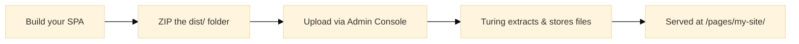

# SPA Pages

SPA Pages allows you to deploy and host compiled Single Page Applications (React, Vue, Angular, etc.) directly inside Turing ES. Upload a ZIP file containing your built app and it is served at a dedicated URL with proper client-side routing support.

The **Pages** section (`/console/page`) is available in the **Enterprise Search** section of the sidebar and is only visible when a [storage backend](./configuration-reference.md#storage) is configured (`turing.storage.type` is `minio` or `filesystem`).

:::info Storage required
SPA Pages requires a storage backend to be configured. See [Storage Configuration](./configuration-reference.md#storage).
:::

---

## How It Works



1. **Build** your frontend app (e.g., `npm run build`)
2. **ZIP** the output folder (`dist/`, `build/`, etc.)
3. **Upload** the ZIP in the Admin Console under **Pages**
4. **Access** the deployed app at `http://your-turing-url/pages/{siteName}/`

Turing handles SPA routing automatically — if a requested file doesn't exist, it falls back to `index.html`, allowing client-side routers (React Router, Vue Router, etc.) to work correctly.

---

## Deploying a Site

### Upload via Admin Console

1. Navigate to **Enterprise Search > Pages** in the sidebar
2. Click **Upload SPA Site**
3. Select the ZIP file containing your built app
4. Confirm or edit the **site name** (auto-derived from the filename)
5. Click **Deploy**

The site name is normalized to lowercase alphanumeric characters, dots, and hyphens. For example, `My App v2.zip` becomes `my-app-v2`.

:::note Re-deployment
Uploading a ZIP with the same site name replaces the existing deployment entirely. The previous version is deleted before the new one is extracted.
:::

### Upload via REST API

```bash
curl -X POST "http://localhost:2700/api/page?siteName=my-site" \
  -H "Cookie: JSESSIONID=your-session" \
  -F "file=@dist.zip"
```

---

## Turing Manifest

You can include an optional `turing-manifest.json` file at the root of your ZIP to provide metadata about the deployment:

```json
{
  "name": "My Search App",
  "version": "1.2.0",
  "author": "Your Team",
  "description": "Custom search experience for our enterprise portal",
  "framework": "React",
  "buildTool": "Vite",
  "snSite": "enterprise-site",
  "locale": "en_US",
  "repository": "https://github.com/your-org/your-app",
  "buildDate": "2026-04-08T10:00:00Z"
}
```

All fields are optional. When present, the manifest metadata is displayed on the site card in the Admin Console.

| Field | Description |
|-------|-------------|
| `name` | Display name of the application |
| `version` | App version |
| `author` | Author or team name |
| `description` | Short description |
| `framework` | Frontend framework (React, Vue, Angular, etc.) |
| `buildTool` | Build tool used (Vite, Webpack, etc.) |
| `snSite` | Associated Turing Semantic Navigation site |
| `locale` | Default locale |
| `repository` | Source code repository URL |
| `buildDate` | ISO 8601 build timestamp |

---

## Site Management

### Listing Sites

The Pages admin page displays a card grid of all deployed sites. Each card shows:

- **Site name** and manifest metadata (if available)
- **Preview link** — opens the deployed site in a new tab
- **Delete button** — removes the site and all its files

### Deleting a Site

Click the delete button on a site card and confirm the dialog. This removes all files under the site's storage prefix.

### REST API

| Method | Endpoint | Description |
|--------|----------|-------------|
| `GET` | `/api/page` | List all deployed sites with manifests |
| `POST` | `/api/page?siteName={name}` | Upload and deploy a ZIP file |
| `DELETE` | `/api/page/{siteName}` | Delete a deployed site |

---

## Caching Behavior

Turing applies different caching strategies depending on the file:

| File | Cache-Control | Reason |
|------|---------------|--------|
| `index.html` | `no-cache, no-store, must-revalidate` | Always serves the latest version after re-deployment |
| All other files | `public, max-age=31536000, immutable` | Static assets (JS, CSS, images) are cached for 1 year |

This follows the standard SPA caching pattern: hashed asset filenames ensure cache-busting on new deployments, while `index.html` is never cached so users always get the latest entry point.

---

## Use with Turing React SDK

SPA Pages is designed to work with the [Turing React SDK](./react-sdk.md). A typical workflow:

1. Create a React app using the Turing React SDK (`@openviglet/turing-react-sdk`)
2. Build the app (`npm run build`)
3. Add a `turing-manifest.json` to the build output with the `snSite` field pointing to your Semantic Navigation site
4. ZIP the build output and deploy via Pages

The deployed app communicates with the Turing REST API on the same origin, so no CORS configuration is needed.

---

## Related Pages

| Page | Description |
|------|-------------|
| [Storage Configuration](./configuration-reference.md#storage) | Configure the storage backend required by Pages |
| [React SDK](./react-sdk.md) | Build custom search experiences to deploy via Pages |
| [Semantic Navigation](./semantic-navigation.md) | Configure the search sites that your SPA consumes |
| [REST API](./rest-api.md) | Full API reference for programmatic deployments |
